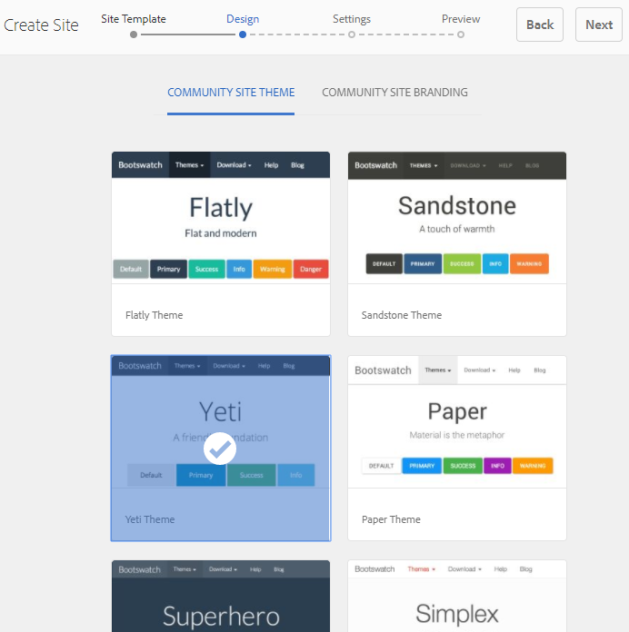
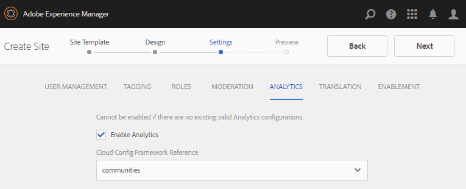

# Crear un nuevo sitio de comunidad {#author-a-new-community-site}

## Crear un nuevo sitio de comunidad {#create-a-new-community-site}

Utilice la instancia de creación para crear un nuevo sitio de comunidad

* Iniciar sesión con privilegios de administrador
* Desde la navegación global: **[!UICONTROL Navegación > Comunidades > Sitios]**

La consola Sitios de comunidades proporciona un asistente para guiar uno a través de los pasos para crear un sitio de comunidad. Es posible avanzar al `Next`paso o `Back`al paso anterior antes de comprometer el sitio en el paso final.

Para empezar a crear un nuevo sitio de comunidad:

* Seleccione el botón `Create`

### Paso 1: Plantilla de sitio {#step-site-template}

En el paso [Plantilla de sitio](sites-console.md#step2013asitetemplate), escriba un título, una descripción, el nombre de la dirección URL y seleccione una plantilla de sitio de comunidad, por ejemplo:

* **[!UICONTROL Título del sitio de la comunidad]**: `Getting Started Tutorial`

* **[!UICONTROL Descripción del sitio de la comunidad]**: `A site for engaging with the community.`

* **[!UICONTROL Raíz]** del sitio de la comunidad: (dejar en blanco para la raíz predeterminada  `/content/sites`)

* **[!UICONTROL Configuraciones]** de nube: (deje en blanco si no se especifica ninguna configuración de nube) proporcione la ruta a las configuraciones de nube especificadas.
* **[!UICONTROL Idioma]** base del sitio de la comunidad: (dejar intacto para un solo idioma: Inglés) utilice el menú desplegable para elegir uno  *o* varios idiomas disponibles: alemán, italiano, francés, japonés, español, portugués (Brasil), chino (tradicional) y chino (simplificado). Se creará un sitio de comunidad para cada idioma agregado y existirá dentro de la misma carpeta de sitio siguiendo las optimizaciones descritas en [Traducir contenido para sitios multilingües](../../help/sites-administering/translation.md). La página raíz de cada sitio contendrá una página secundaria con el nombre del código de idioma de uno de los idiomas seleccionados, como &quot;en&quot; para inglés o &quot;fr&quot; para francés.

* **[!UICONTROL Nombre]** del sitio de la comunidad: participar

   * Compruebe el doble del nombre, ya que no es fácil cambiarlo después de crear el sitio
   * La dirección URL inicial se mostrará debajo del nombre del sitio de la comunidad
   * Para una dirección URL válida, anexe un código de idioma base + &quot;.html&quot;
   * *Por ejemplo*, http://localhost:4502/content/sites/  `engage/en.html`

* **[!UICONTROL Plantilla]**: desplegable para elegir  `Reference Site`

Seleccione **[!UICONTROL Siguiente]**

### Paso 2: Diseño {#step-design}

El paso Diseño se presenta en dos secciones para seleccionar el tema y la pancarta de marca:

#### TEMA DEL SITIO COMUNITARIO {#community-site-theme}

Seleccione el estilo que desee aplicar a la plantilla. Cuando se selecciona, el tema se superpone con una marca de verificación.

#### MARCA DEL SITIO COMUNITARIO {#community-site-branding}

(Opcional) Cargue una imagen de pancarta para mostrarla en las páginas del sitio. La pancarta se fija en el borde izquierdo del explorador, entre el encabezado del sitio de la comunidad y el menú (vínculos de navegación). La altura de la pancarta se recorta a 120 píxeles. No se puede cambiar el tamaño del letrero para que se ajuste al ancho del navegador y a la altura de 120 píxeles.

 

Seleccione **[!UICONTROL Siguiente]**.

### Paso 3: Configuración {#step-settings}

En el paso Configuración, antes de seleccionar `Next`, observe que hay siete secciones que proporcionan acceso a configuraciones que incluyen administración de usuarios, etiquetado, moderación, administración de grupos, análisis, traducción y habilitación.

Visite el tutorial [Introducción a AEM Communities para habilitar](getting-started-enablement.md) para experimentar con el trabajo con las funciones de habilitación.

#### ADMINISTRACIÓN DE USUARIOS {#user-management}

Marque todas las casillas de verificación para [Administración de usuarios](sites-console.md#user-management)

* Para permitir que los visitantes del sitio se automatriculen
* Permitir que los visitantes del sitio vean el sitio sin iniciar sesión
* Permitir a los miembros enviar y recibir mensajes de otros miembros de la comunidad
* Permitir el inicio de sesión con Facebook en lugar de registrar y crear un perfil
* Permitir el inicio de sesión con Twitter en lugar de registrar y crear un perfil

>[!NOTE]
>
>Para un entorno de producción, es necesario crear aplicaciones personalizadas de Facebook y Twitter. Consulte [Inicio de sesión social con Facebook y Twitter](social-login.md).

#### ETIQUETADO {#tagging}

Las etiquetas que se pueden aplicar al contenido de la comunidad se controlan seleccionando AEM Áreas de nombres previamente definidas mediante la [Consola de etiquetado](../../help/sites-administering/tags.md#tagging-console) (como la [Área de nombres del tutorial](setup.md#create-tutorial-tags)).

La búsqueda de Áreas de nombres es sencilla mediante la búsqueda por tipo. Por ejemplo,

* Escriba &#39;tut&#39;
* Seleccione `Tutorial`

#### ROLES {#roles}

[Las ](users.md) funciones de miembros de la comunidad se asignan mediante la configuración de la sección Roles.

Para permitir que un miembro de la comunidad (o grupo de miembros) experimente el sitio como administrador de la comunidad, utilice la búsqueda de tipo por adelantado y seleccione el nombre del miembro o grupo en las opciones de la lista desplegable.

Por ejemplo,

* Escriba &quot;q&quot;
* Seleccione [Quinn Harper](enablement-setup.md#publishcreateenablementmembers)

>[!NOTE]
>
>[El servicio ](https://helpx.adobe.com/experience-manager/6-3/communities/using/deploy-communities.html#tunnel-service-on-author) de túnel permite seleccionar miembros y grupos que solo existen en el entorno de publicación.

#### MODERACIÓN {#moderation}

Acepte la configuración global predeterminada para [moderar](sites-console.md#moderation) contenido generado por el usuario (UGC).

#### ANALYTICS {#analytics}

Si Adobe Analytics tiene licencia y se ha configurado un servicio en la nube y un marco de trabajo de Analytics, es posible activar Analytics y seleccionar el marco.

Consulte [Configuración de Analytics para funciones de comunidades](analytics.md).

#### TRADUCCIÓN {#translation}

La [configuración de traducción](sites-console.md#translation) especifica el idioma base del sitio, así como si se puede traducir o no UGC y en qué idioma, si es así.

* Marque **[!UICONTROL Permitir traducción automática]**
* Deje los idiomas predeterminados seleccionados para la traducción por el servicio predeterminado de traducción automática
* Deje el proveedor de traducción predeterminado y la configuración
* No hay necesidad de una tienda global porque no hay copias de idioma
* Seleccione **[!UICONTROL Traducir toda la página]**
* Opción para dejar persistencia predeterminada

#### HABILITACIÓN {#enablement}

Deje vacío al crear una comunidad de participación.

Para ver un tutorial similar con el fin de crear rápidamente una [comunidad de habilitación](overview.md#enablement-community), consulte [Introducción a AEM Communities para la habilitación](getting-started-enablement.md).

Seleccione **[!UICONTROL Siguiente]**.

### Paso 4: Crear sitio de comunidades {#step-create-communities-site}

Seleccione **[!UICONTROL Crear]**.

Cuando se completa el proceso, la carpeta del nuevo sitio se muestra en la consola Comunidades - Sitios.

## Publicar el nuevo sitio de comunidad {#publish-the-new-community-site}

El sitio creado debe administrarse desde la consola Comunidades - Sitios, la misma consola desde la que se pueden crear nuevos sitios.

Después de seleccionar la carpeta del sitio de la comunidad para abrirlo, coloque el puntero sobre el icono del sitio para que aparezcan cuatro iconos de acción:

Al seleccionar el cuarto icono de elipses (Más acciones), aparecen las opciones Exportar sitio y Eliminar sitio.

De izquierda a derecha están:

* **Abrir**
sitioSeleccione el icono de lápiz para abrir el sitio de la comunidad en modo de edición de autor, para agregar o configurar componentes de página

* **Editar**
sitioSeleccione el icono de propiedades para abrir el sitio de la comunidad y modificar las propiedades, como el título o cambiar el tema

* **Publicar**
sitioSeleccione el icono mundial para publicar el sitio de la comunidad (por ejemplo, si el servidor de publicación se está ejecutando en el equipo local y, a continuación, en localhost:4503 de forma predeterminada)

* **Exportar**
sitioSeleccione el icono de exportación para crear un paquete del sitio de la comunidad que esté almacenado en el  [administrador de ](../../help/sites-administering/package-manager.md) paquetes y descargado.

   Tenga en cuenta que UGC no se incluye en el paquete del sitio.

* **Eliminar sitio**

   seleccione el icono Eliminar para eliminar el sitio de comunidad desde la consola **[!UICONTROL Comunidades > Sitios]**. Esta acción elimina todos los elementos asociados con el sitio, como UGC, grupos de usuarios, recursos y registros de bases de datos.

>[!NOTE]
>
>Si no utiliza el puerto predeterminado 4503 para la instancia de publicación, edite el agente de replicación predeterminado para establecer el número de puerto en el valor correcto.
>
>En la instancia de creación, en el menú principal
>
>1. Vaya al menú **[!UICONTROL Herramientas > Operaciones > Replicación]**
>1. Seleccione **[!UICONTROL Agentes en el autor]**
>1. Seleccione **[!UICONTROL Agente predeterminado (publicar)]**
>1. Junto a **[!UICONTROL Configuración]** seleccione **[!UICONTROL Editar]**
>1. En el cuadro de diálogo emergente Configuración del agente, seleccione la ficha Transporte
>1. En URI, cambie el número de puerto, 4503, al número de puerto deseado

>
>
Por ejemplo, para utilizar el puerto 6103: `http://localhost:6103/bin/receive?sling:authRequestLogin=1`
>
>1. Seleccione **[!UICONTROL Aceptar]**
>1. (Opcional) Seleccione `Clear` o `Force Retry` para restablecer la cola de replicación

### Seleccione Publicar {#select-publish}

Después de asegurarse de que el servidor de publicación se está ejecutando, seleccione el icono del mundo para publicar el sitio de comunidad.

Cuando el sitio de la comunidad se ha publicado correctamente, aparece brevemente un mensaje:

### Aviso de nuevos grupos de usuarios de la comunidad {#notice-new-community-user-groups}

Junto con el nuevo sitio de comunidad, se crean nuevos grupos de usuarios que tienen los permisos adecuados establecidos para diversas funciones administrativas. Para obtener más información, visite [Grupos de usuarios para sitios de la comunidad](users.md#usergroupsforcommunitysites).

Para este nuevo sitio de comunidad, dado el nombre del sitio &quot;comprometerse&quot; en el Paso 1, los cuatro nuevos grupos de usuarios pueden verse desde la [consola de grupos](members.md) (navegación global: Comunidades, Grupos):

* Administradores de comunidad de participación
* Administradores de grupos de participación de la comunidad
* Miembros de participación de la comunidad
* Moderadores de participación de la comunidad
* Miembros privilegiados de participación de la comunidad
* Community Engage Sitecontentmanager

Observe que [Aaron McDonald](tutorials.md#demo-users) es miembro de

* Administradores de comunidad de participación
* Moderadores de participación de la comunidad
* Miembros de participación de la comunidad (indirectamente como miembro del grupo Moderadores)

#### http://localhost:4503/content/sites/engage/en.html {#http-localhost-content-sites-engage-en-html}

## Error de configuración para autenticación {#configure-for-authentication-error}

Una vez configurado y insertado un sitio para publicar, [configure la asignación de inicio de sesión](sites-console.md#configure-for-authentication-error) ( `Adobe Granite Login Selector Authentication Handler`) en la instancia de publicación. La ventaja es que cuando las credenciales de inicio de sesión no se especifican correctamente, el error de autenticación vuelve a mostrar la página de inicio de sesión del sitio de la comunidad con un mensaje de error.

Añadir un `Login Page Mapping` como

* /content/sites/engagement/es/sign:/content/sites/engagement/es

## Pasos opcionales {#optional-steps}

### Cambiar la Página de inicio predeterminada {#change-the-default-home-page}

Al trabajar con el sitio de publicación con fines de demostración, puede resultar útil cambiar la página de inicio predeterminada al nuevo sitio.

Para ello, es necesario utilizar [CRXDE](http://localhost:4503/crx/de) Lite para editar la tabla [asignación de recursos](../../help/sites-deploying/resource-mapping.md) al publicar.

Para empezar:

1. Al realizar la publicación, inicie sesión con privilegios de administrador
1. Vaya a [http://localhost:4503/crx/de](http://localhost:4503/crx/de)
1. En el explorador del proyecto, expanda `/etc/map`
1. Seleccione el nodo `http`

   * Seleccione **[!UICONTROL Crear nodo]**

      * **** Namelocalhost.4503

         (do *no* use `:`)

      * **** [Escritos:Asignación](https://sling.apache.org/documentation/the-sling-engine/mappings-for-resource-resolution.html)

1. Con el nodo `localhost.4503` recién creado seleccionado

   * Añadir propiedad

      * **** Namesling:match
      * **** TypeString
      * **** Valuelocalhost.4503/\$

         (debe terminar con &#39;$&#39; char)
   * Añadir propiedad

      * **** Namesling:internalRedirect
      * **** TypeString
      * **Valor** /content/sites/engage/en.html

1. Seleccione **[!UICONTROL Guardar todo]**
1. (opcional) Eliminar el historial de exploración
1. Vaya a http://localhost:4503/

   * Llegar a http://localhost:4503/content/sites/engage/en.html

>[!NOTE]
>
>Para deshabilitar, simplemente anteponga el valor de la propiedad `sling:match` con una &#39;x&#39; - `xlocalhost.4503/$` - y **[!UICONTROL Guardar todo]**.

#### Resolución de problemas: Error al guardar el mapa {#troubleshooting-error-saving-map}

Si no puede guardar los cambios, asegúrese de que el nombre del nodo sea `localhost.4503`, con un separador de &#39;punto&#39; y no `localhost:4503` con un separador de &#39;dos puntos&#39;, ya que `localhost`no es un prefijo de Área de nombres válido.

#### Resolución de problemas: Error al redirigir {#troubleshooting-fail-to-redirect}

La cadena &#39;**$**&#39; al final de la cadena `sling:match`de expresión regular es crucial, de modo que sólo se asigna exactamente `http://localhost:4503/`, de lo contrario el valor de redirección se antepone a cualquier ruta que pueda existir después de server:port en la dirección URL. Por lo tanto, cuando AEM intenta redireccionar a la página de inicio de sesión, se produce un error.

### Modificar el sitio {#modify-the-site}

Una vez creado el sitio por primera vez, los autores pueden utilizar el [icono Abrir sitio](sites-console.md#authoring-site-content) para realizar actividades de creación de AEM estándar.

Además, los administradores pueden utilizar el [icono Editar sitio](sites-console.md#modifying-site-properties) para modificar las propiedades del sitio, como el título.

Después de cualquier modificación, recuerde **guardar** y **volver a publicar** el sitio.

>[!NOTE]
>
>Si no está familiarizado con AEM, vista la documentación sobre [administración básica](../../help/sites-authoring/basic-handling.md) y una [guía rápida para crear páginas](../../help/sites-authoring/qg-page-authoring.md).