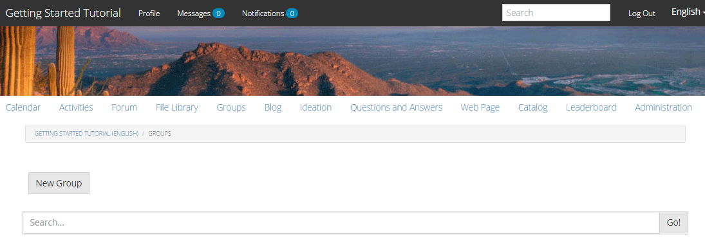
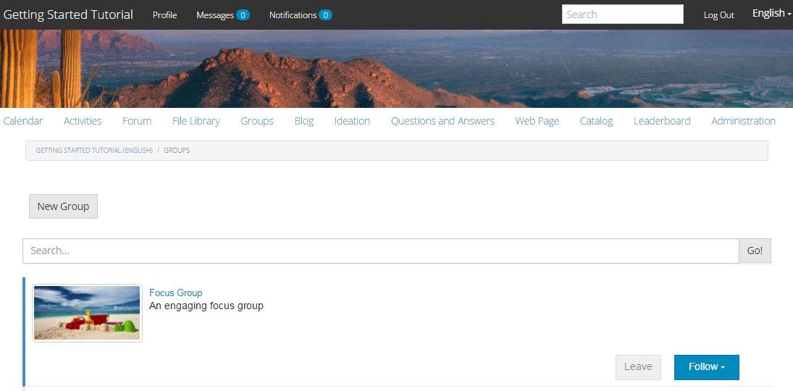

# Grupos de la comunidad {#community-groups}

La función de grupos de comunidad es la capacidad para que una subcomunidad sea creada dinámicamente dentro de un sitio de comunidad por usuarios autorizados (miembros de la comunidad y autores) desde los entornos de publicación y creación.

Esta capacidad está presente cuando la función [de](functions.md#groups-function) grupos está presente en la estructura del sitio [de la](sites-console.md) comunidad.

Una plantilla [de grupo de](tools-groups.md) comunidad proporciona el diseño de la página de grupo de comunidad cuando se crea dinámicamente un grupo de comunidad.

Se seleccionan una o varias plantillas de grupo para la función de grupo cuando la función se agrega a la estructura de un sitio de comunidad o a una plantilla de sitio de comunidad. Esta lista de plantillas de grupo se presenta al miembro o autor que crea dinámicamente un nuevo grupo desde el sitio de la comunidad.

## Creating a New Group {#creating-a-new-group}

La capacidad de crear un nuevo grupo de comunidad depende de la existencia de un sitio de comunidad que incluya la función de grupos, como uno creado a partir de la ` [Reference Site Template](sites.md)`.

Los ejemplos que siguen utilizan el sitio de comunidad creado a partir de la página `Reference Site Template` tal como se describe en el tutorial [Introducción a AEM Communities](getting-started.md) .

Esta es la página que se carga al publicar cuando se selecciona el elemento de menú **[!UICONTROL Grupos]** :

Al seleccionar el icono **[!UICONTROL Nuevo grupo]** , se abre un cuadro de diálogo de edición.

En la ficha **[!UICONTROL Configuración]** , se proporcionan las funciones básicas del grupo:

* **[!UICONTROL Nombre]** del grupo El título del grupo que se mostrará en el sitio de la comunidad.

* **[!UICONTROL Descripción]** Una descripción del grupo que se mostrará en el sitio de la comunidad.

* **[!UICONTROL Invitar]** a una lista de miembros a invitar a unirse al grupo. La búsqueda de tipo por adelantado proporcionará sugerencias de los miembros de la comunidad que invitar.

* **[!UICONTROL Nombre]** de la dirección URL del grupo El nombre de la página del grupo que forma parte de la dirección URL.

* **[!UICONTROL Abrir selección de grupo]** 
`Open Group` indica que cualquier visitante anónimo del sitio puede vista del contenido y se deseleccionará `Member Only Group`.

* **[!UICONTROL Selección de grupo]** de miembros solamente 
`Member Only Group` indica que solo los miembros del grupo pueden realizar vistas en el contenido y se desseleccionará `Open Group`.

En la ficha **[!UICONTROL Plantilla]** se encuentra la posibilidad de seleccionar entre la lista de las plantillas de grupo de comunidad que se especificaron cuando la función de grupo se incluyó en la estructura del sitio de comunidad o en una plantilla de sitio de comunidad.

En la ficha **[!UICONTROL Imagen]** se encuentra la posibilidad de cargar una imagen para que se muestre en el grupo en la página Grupos del sitio de la comunidad. La hoja de estilo predeterminada ajustará el tamaño de la imagen a 170 x 90 píxeles.

Al seleccionar el botón **[!UICONTROL Crear grupo]** , las páginas del grupo se crean en función de la plantilla elegida, se crea un grupo de usuarios para la pertenencia y se actualiza la página Grupos para mostrar la nueva subcomunidad.

Por ejemplo, la página Grupos con una nueva subcomunidad titulada &quot;Grupo de enfoque&quot;, para la que se cargó una miniatura de imagen, aparecerá de la siguiente manera (aún con la sesión iniciada como administrador de grupos de la comunidad):

Al seleccionar el `Focus Group` vínculo, se abrirá la página Grupo de enfoque en el explorador, que tiene un aspecto inicial basado en la plantilla seleccionada e incluye un submenú debajo del menú del sitio de la comunidad principal:

## Community Group Member List Component {#community-group-member-list-component}

El `Community Group Member List` componente está diseñado para que lo utilicen los desarrolladores de plantillas de grupo.

## Información adicional {#additional-information}

Puede encontrar más información en la página [Community Group Essentials](essentials-groups.md) para desarrolladores.

Para obtener más información relacionada con los grupos de comunidad, visite [Administración de usuarios y grupos](users.md)de usuarios.
