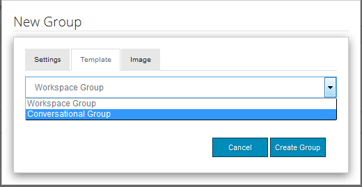

# Grupos de la comunidad {#community-groups}

La función de grupos de comunidad es la capacidad para que una subcomunidad sea creada dinámicamente dentro de un sitio de comunidad por usuarios autorizados (miembros de la comunidad y autores) desde los entornos de publicación y creación.

Esta capacidad está presente cuando la [función de grupos](functions.md#groups-function) está presente en la estructura [sitio de comunidad](sites-console.md).

Una [plantilla de grupo de comunidad](tools-groups.md) proporciona el diseño de la página de grupo de comunidad cuando se crea dinámicamente un grupo de comunidad.

Se seleccionan una o varias plantillas de grupo para la función de grupo cuando la función se agrega a la estructura de un sitio de comunidad o a una plantilla de sitio de comunidad. Esta lista de plantillas de grupo se presenta al miembro o autor que crea dinámicamente un nuevo grupo desde el sitio de la comunidad.

## Creación de un nuevo grupo {#creating-a-new-group}

La capacidad de crear un nuevo grupo de comunidad depende de la existencia de un sitio de comunidad que incluya la función de grupos, como uno creado a partir de ` [Reference Site Template](sites.md)`.

Los ejemplos que siguen utilizan el sitio de comunidad creado a partir de `Reference Site Template` como se describe en el tutorial [Introducción a AEM Communities](getting-started.md).

Esta es la página que se carga al publicar cuando se selecciona el elemento de menú **[!UICONTROL Grupos]**:

Al seleccionar el icono **[!UICONTROL Nuevo grupo]**, se abre un cuadro de diálogo de edición.

En la ficha **[!UICONTROL Configuración]**, se proporcionan las características básicas del grupo:

* **[!UICONTROL Nombre]**
del grupoTítulo del grupo que se mostrará en el sitio de la comunidad.

* ****
DescripciónDescripción del grupo que se va a mostrar en el sitio de la comunidad.

* ****
InvitarUna lista de miembros a invitar a unirse al grupo. La búsqueda de tipo por adelantado proporcionará sugerencias de los miembros de la comunidad que invitar.

* **[!UICONTROL Nombre de]**
la dirección URL del grupoNombre de la página del grupo que forma parte de la dirección URL.

* **[!UICONTROL Abrir]**
grupoSelección 
`Open Group` indica que cualquier visitante anónimo del sitio puede vista del contenido y se deseleccionará  `Member Only Group`.

* **[!UICONTROL Selección de]**
grupo solo de miembros 
`Member Only Group` indica que solo los miembros del grupo pueden realizar vistas en el contenido y se desseleccionará  `Open Group`.

En la ficha **[!UICONTROL Plantilla]** se encuentra la capacidad de seleccionar entre la lista de las plantillas de grupo de la comunidad que se especificaron cuando la función de grupo se incluyó en la estructura del sitio de la comunidad o en una plantilla de sitio de la comunidad.

En la ficha **[!UICONTROL Imagen]** se encuentra la capacidad de cargar una imagen para que se muestre para el grupo en la página Grupos del sitio de la comunidad. La hoja de estilo predeterminada ajustará el tamaño de la imagen a 170 x 90 píxeles.

Al seleccionar el botón **[!UICONTROL Crear grupo]**, las páginas para el grupo se crean en función de la plantilla elegida y se crea un grupo de usuarios para la pertenencia y la página Grupos se actualiza para mostrar la nueva subcomunidad.

Por ejemplo, la página Grupos con una nueva subcomunidad titulada &quot;Grupo de enfoque&quot;, para la que se cargó una miniatura de imagen, aparecerá de la siguiente manera (aún con la sesión iniciada como administrador de grupos de la comunidad):

Al seleccionar el vínculo `Focus Group` se abrirá la página Grupo de enfoque en el explorador, que tiene una apariencia inicial basada en la plantilla seleccionada e incluye un submenú debajo del menú del sitio de la comunidad principal:

## Componente de Lista de miembros del grupo de la comunidad {#community-group-member-list-component}

El componente `Community Group Member List` está diseñado para ser utilizado por desarrolladores de plantillas de grupo.

## Información adicional {#additional-information}

Puede encontrar más información en la página [Community Group Essentials](essentials-groups.md) para desarrolladores.

Para obtener más información relacionada con los grupos de comunidad, visite [Administración de usuarios y grupos de usuarios](users.md).
