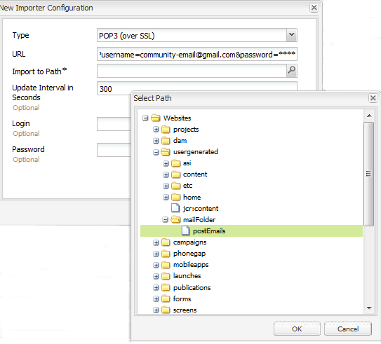

# Configuración del correo electrónico {#configuring-email}

>[!CAUTION]
>
>AEM 6.4 ha llegado al final de la compatibilidad ampliada y esta documentación ya no se actualiza. Para obtener más información, consulte nuestra [períodos de asistencia técnica](https://helpx.adobe.com/es/support/programs/eol-matrix.html). Buscar las versiones compatibles [here](https://experienceleague.adobe.com/docs/).

AEM Communities utiliza el correo electrónico para

* [Notificaciones de comunidades](notifications.md)
* [Suscripciones de Communities](subscriptions.md)

De forma predeterminada, la función de correo electrónico no funciona, ya que requiere la especificación de un servidor SMTP y un usuario SMTP.

>[!CAUTION]
>
>El correo electrónico para notificaciones y suscripciones solo debe configurarse en la variable [publicador principal](deploy-communities.md#primary-publisher).

## Configuración predeterminada del servicio de correo {#default-mail-service-configuration}

El servicio de correo predeterminado es necesario tanto para notificaciones como para suscripciones.

* En el editor principal
* Inicio de sesión con privilegios de administrador
* Acceda a la [Consola web](../../help/sites-deploying/configuring-osgi.md)

   * Por ejemplo, [http://localhost:4503/system/console/configMgr](http://localhost:4503/system/console/configMgr)

* Busque la variable `Day CQ Mail Service`
* Seleccione el icono de edición

Esto se basa en la documentación de [Configuración de notificaciones por correo electrónico](../../help/sites-administering/notification.md), pero con una diferencia en que el campo `"From" address` es *not* obligatorio y debe dejarse vacío.

Por ejemplo (rellenado con valores solo con fines ilustrativos):

* **[!UICONTROL Nombre de host del servidor SMTP]**: *(obligatorio)* El servidor SMTP que se va a utilizar.

* **[!UICONTROL Puerto del servidor SMTP]** *(obligatorio)* El puerto del servidor SMTP debe ser de 25 o superior.

* **[!UICONTROL Usuario SMTP]**: *(obligatorio)* El usuario SMTP.

* **[!UICONTROL Contraseña SMTP]**: *(obligatorio)* La contraseña del usuario SMTP.

* **[!UICONTROL Dirección &quot;De&quot;]**: Dejar vacío
* **[!UICONTROL SMTP utiliza SSL]**: Si está marcada esta opción, envía un correo electrónico seguro. Asegúrese de que el puerto está configurado en 465 o como se requiere para el servidor SMTP.
* **[!UICONTROL Depurar correo electrónico]**: Si se selecciona, habilita el registro de interacciones del servidor SMTP.

## Configuración de correo electrónico de AEM Communities {#aem-communities-email-configuration}

Una vez que la variable [servicio de correo predeterminado](#default-mail-service-configuration) está configurado, las dos instancias existentes de la variable `AEM Communities Email Reply Configuration` La configuración OSGi, incluida en la versión, se vuelve funcional.

Solo es necesario configurar la instancia de las suscripciones al permitir la respuesta por correo electrónico.

1. ` [email](#configuration-for-notifications)` instancia

   para las notificaciones, que no admiten el correo electrónico de respuesta y no deben modificarse

1. ` [subscriptions-email](#configuration-for-subscriptions)` instancia

   requiere configuración para habilitar completamente la creación de publicaciones a partir del correo electrónico de respuesta

Para llegar a las instancias de configuración de correo electrónico de Communities:

* En el editor principal
* Inicio de sesión con privilegios de administrador
* Acceda a la [Consola web](../../help/sites-deploying/configuring-osgi.md)

   * Por ejemplo, [http://localhost:4503/system/console/configMgr](http://localhost:4503/system/console/configMgr)

* Localizar `AEM Communities Email Reply Configuration`

### Configuración de notificaciones {#configuration-for-notifications}

La instancia de `AEM Communities Email Reply Configuration` La configuración OSGi con el correo electrónico Nombre es para la función de notificaciones. Esta función no incluye la respuesta por correo electrónico.

Esta configuración no debe modificarse.

* Busque la variable `AEM Communities Email Reply Configuration`
* Seleccione el icono de edición
* Compruebe el **Nombre** es `email`

* Verificar **Crear publicación a partir del correo electrónico de respuesta** es `unchecked`

### Configuración de suscripciones {#configuration-for-subscriptions}

Para suscripciones de Communities, es posible activar o desactivar la capacidad de un miembro de publicar contenido respondiendo a un correo electrónico.

* Busque la variable `AEM Communities Email Reply Configuration`
* Seleccione el icono de edición
* Compruebe el **Nombre** es `subscriptions-email`

* **[!UICONTROL Nombre]** : *(obligatorio)* `subscriptions-email`. No Edite.

* **[!UICONTROL Crear publicación a partir del correo electrónico de respuesta]**: Si se selecciona, el destinatario del correo electrónico de suscripción puede anunciar contenido enviando una respuesta. El valor predeterminado está marcado.
* **[!UICONTROL Agregar id rastreado al encabezado]**: El valor predeterminado es `Reply-To`.

* **[!UICONTROL Longitud máxima del sujeto]**: Si se agrega el id de rastreador a la línea de asunto, esta es la longitud máxima del asunto, excluyendo el id rastreado, tras lo cual se recortará. Tenga en cuenta que esto debe ser lo más pequeño posible para evitar que se pierda la información de identificación rastreada. El valor predeterminado es 200.
* **[!UICONTROL Dirección de correo electrónico &quot;De&quot;]**: *(obligatorio)* Dirección desde la que se enviaría el correo electrónico de notificación. Probablemente lo mismo **Usuario SMTP** especificado para la variable [servicio de correo predeterminado](#configuredefaultmailservice). El valor predeterminado es `no-reply@example.com`.

* **[!UICONTROL Responder al delimitador]**: Si se agrega el id de rastreador al encabezado Responder, se utilizará este delimitador. El valor predeterminado es `+` (signo más).

* **[!UICONTROL Prefijo de ID del rastreador en el asunto]**: Si se agrega el id de rastreador a la línea de asunto, se utilizará este prefijo. El valor predeterminado es `post#`.

* **[!UICONTROL Prefijo de id del rastreador en el cuerpo del mensaje]**: Si se agrega el id del rastreador al cuerpo del mensaje, se utilizará este prefijo. El valor predeterminado es `Please do not remove this:`.

* **[!UICONTROL Enviar correo electrónico como HTML]**: Si se selecciona, el tipo de contenido del correo electrónico se establecerá como `"text/html;charset=utf-8"`. El valor predeterminado está marcado.

* **[!UICONTROL Nombre de usuario predeterminado]**: Este nombre no se utilizará para usuarios sin nombre. El valor predeterminado es `no-reply@example.com`.

* **[!UICONTROL Ruta raíz de plantillas]**: El correo electrónico se crea utilizando una plantilla almacenada en esta ruta raíz. El valor predeterminado es `/etc/community/templates/subscriptions-email`.

## Configurar el importador de encuestas {#configure-polling-importer}

Para que el correo electrónico se introduzca en el repositorio, es necesario configurar un importador de encuestas y configurar sus propiedades en el repositorio manualmente.

### Agregar nuevo importador de encuestas {#add-new-polling-importer}

* En el editor principal
* Inicio de sesión con privilegios de administrador
* Vaya a la consola del importador de encuestas Por ejemplo, [http://localhost:4503/etc/importers/polling.html](http://localhost:4503/etc/importers/polling.html)
* Select **[!UICONTROL Agregar]**

* **[!UICONTROL Tipo]**: *(obligatorio)* Desplegable para seleccionar `POP3 (over SSL).`

* **[!UICONTROL URL]**: *(obligatorio)* El servidor de correo saliente. Por ejemplo, `pop.gmail.com:995/INBOX?username=community-emailgmail.com&password=****`. 

* **[!UICONTROL Importar a ruta]**&amp;ast;: *(obligatorio)* Establecer como `/content/usergenerated/mailFolder/postEmails`
navegando hasta el 
`postEmails`carpeta y seleccione **OK**

* **[!UICONTROL Actualizar intervalo en segundos]**: *(opcional)* El servidor de correo configurado para el servicio de correo predeterminado puede tener requisitos con respecto al valor del intervalo de actualización. Por ejemplo, Gmail puede requerir un intervalo de `300`.

* **[!UICONTROL Inicio de sesión]**: *(opcional)*

* **[!UICONTROL Contraseña]**: *(opcional)*

* Select **[!UICONTROL OK]**

### Ajustar protocolo para nuevo importador de encuestas {#adjust-protocol-for-new-polling-importer}

Una vez guardada la nueva configuración de sondeo, es necesario modificar las propiedades del importador de correo electrónico de suscripción para cambiar el protocolo de `POP3` a `emailreply`

Uso [CRXDE Lite](../../help/sites-developing/developing-with-crxde-lite.md):

* En el editor principal
* Inicio de sesión con privilegios de administrador
* Vaya a [https://&lt;server>:&lt;port>/crx/de/index.jsp#/etc/importadores/sondeo](http://localhost:4503/crx/de/index.jsp#/etc/importers/polling)
* Seleccione la configuración recién creada
* Modifique las siguientes propiedades

   * **feedType**: replace `pop3s` con **`emailreply`**
   * **source**: reemplazar el protocolo del origen `pop3s://` con **`emailreply://`**

Los triángulos rojos indican las propiedades modificadas. Asegúrese de guardar los cambios:

* Select **[!UICONTROL Guardar todo]**
