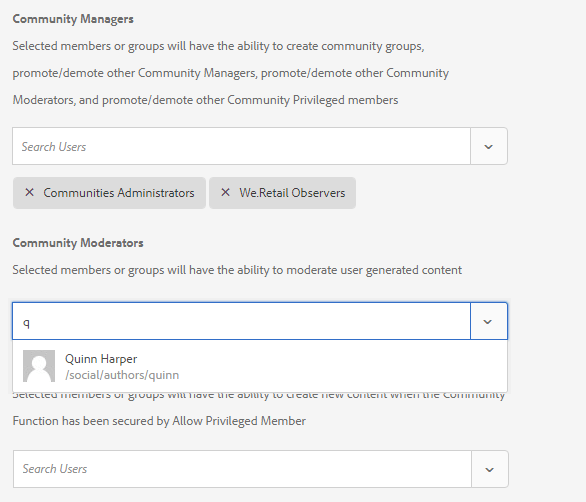

# Crear un nuevo sitio de comunidad para habilitarlo {#author-a-new-community-site-for-enablement}

## Crear sitio de comunidad {#create-community-site}

[La ](sites-console.md) creación del sitio de comunidad emplea un asistente que lo guía a través de los pasos para crear un sitio de comunidad. Es posible avanzar al `Next`paso o `Back`al paso anterior antes de comprometer el sitio en el paso final.

Para empezar a crear un nuevo sitio de comunidad:

Uso de la instancia de autor 

* Iniciar sesión con privilegios de administrador
* Vaya a **[!UICONTROL Comunidades > Sitios]**

* Seleccione **[!UICONTROL Crear]**

### Paso 1: Plantilla de sitio {#step-site-template}

En el paso **Plantilla de sitio**, escriba un título, una descripción, el nombre de la dirección URL y seleccione una plantilla de sitio de comunidad, por ejemplo:

* **Título del sitio de la comunidad**: `Enablement Tutorial`

* **Descripción del sitio de la comunidad**: `A site for enabling the community to learn.`

* **Raíz** del sitio de la comunidad: (dejar en blanco para la raíz predeterminada  `/content/sites`)

* **Configuraciones** de nube: (deje en blanco si no se especifica ninguna configuración de nube) proporcione la ruta a las configuraciones de nube especificadas.
* **Idioma** base del sitio de la comunidad: (dejar intacto para un solo idioma: Inglés) utilice el menú desplegable para elegir uno  *o* varios idiomas disponibles: alemán, italiano, francés, japonés, español, portugués (Brasil), chino (tradicional) y chino (simplificado). Se creará un sitio de comunidad para cada idioma agregado y existirá dentro de la misma carpeta de sitio siguiendo las optimizaciones descritas en [Traducir contenido para sitios multilingües](../../help/sites-administering/translation.md). La página raíz de cada sitio contendrá una página secundaria con el nombre del código de idioma de uno de los idiomas seleccionados, como &quot;en&quot; para inglés o &quot;fr&quot; para francés.

* **[!UICONTROL Nombre del sitio de la comunidad]**: `enable`

   * la dirección URL inicial se mostrará debajo del nombre del sitio de la comunidad
   * para una dirección URL válida, anexe un código de idioma base + &quot;.html&quot;

      *por ejemplo*, http://localhost:4502/content/sites/  `enable/en.html`

* **[!UICONTROL Plantilla]** de sitio de referencia: desplegable para elegir  `Reference Structured Learning Site Template`

Seleccione **[!UICONTROL Siguiente]**

### Paso 2: Diseño {#step-design}

El paso Diseño se presenta en dos secciones para seleccionar el tema y la pancarta de marca:

#### TEMA DEL SITIO COMUNITARIO {#community-site-theme}

Seleccione el estilo que desee aplicar a la plantilla. Cuando se selecciona, el tema se superpone con una marca de verificación.

#### MARCA DEL SITIO COMUNITARIO {#community-site-branding}

(opcional) Cargue una imagen de pancarta para mostrarla en las páginas del sitio. La pancarta se fija en el borde izquierdo del explorador, entre el encabezado del sitio de la comunidad y el menú (vínculos de navegación). La altura de la pancarta se recorta a 120 píxeles. No se puede cambiar el tamaño del letrero para que se ajuste al ancho del navegador y a la altura de 120 píxeles.

 

Seleccione **[!UICONTROL Siguiente]**.

### Paso 3: Configuración {#step-settings}

En el paso Configuración, antes de seleccionar `Next`, observe que hay siete secciones que proporcionan acceso a configuraciones que incluyen administración de usuarios, etiquetado, funciones, moderación, análisis, traducción y habilitación.

#### ADMINISTRACIÓN DE USUARIOS {#user-management}

Se recomienda que [comunidades habilitadoras](overview.md#enablement-community) sean privadas.

Un sitio de la comunidad es privado cuando se deniega el acceso a los visitantes anónimos del sitio, es posible que no se registre por sí mismo y que no utilice el inicio de sesión en redes sociales.

Asegúrese de que la mayoría de las casillas de verificación no estén marcadas para [Administración de usuarios](sites-console.md#user-management):

* NO permitir que los visitantes del sitio se automatriculen
* NO permitir que visitantes anónimos del sitio realicen vistas en el sitio
* Opcional si se permite o no la mensajería entre los miembros de la comunidad
* NO permitir el inicio de sesión con Facebook
* NO permitir el inicio de sesión con Twitter

#### ETIQUETADO {#tagging}

Las etiquetas que se pueden aplicar al contenido de la comunidad se controlan seleccionando AEM Áreas de nombres previamente definidas mediante la [Consola de etiquetado](../../help/sites-administering/tags.md#tagging-console) (como la [Área de nombres del tutorial](enablement-setup.md#create-tutorial-tags)).

Además, la selección de Áreas de nombres de etiquetas para el sitio de la comunidad limita la selección presentada al definir los catálogos y los recursos de habilitación. Consulte [Etiquetado de recursos de habilitación](tag-resources.md) para obtener información importante.

La búsqueda de Áreas de nombres es sencilla mediante la búsqueda por tipo. Por ejemplo,

* Escriba &#39;tut&#39;
* Seleccione `Tutorial`

### ROLES {#roles}

[Las ](users.md) funciones de miembros de la comunidad se asignan mediante la configuración de la sección Roles.

Para permitir que un miembro de la comunidad (o grupo de miembros) experimente el sitio como administrador de la comunidad, utilice la búsqueda de tipo por adelantado y seleccione el nombre del miembro o grupo en las opciones de la lista desplegable.

Por ejemplo,

* Escriba &quot;q&quot;
* Seleccione [Quinn Harper](enablement-setup.md#publishcreateenablementmembers)

>[!NOTE]
>
>[El servicio ](deploy-communities.md#tunnel-service-on-author) de túnel permite seleccionar miembros y grupos que solo existen en el entorno de publicación.

#### MODERACIÓN {#moderation}

Acepte la configuración global predeterminada para [moderar](sites-console.md#moderation) contenido generado por el usuario (UGC).

#### ANALYTICS {#analytics}

En el menú desplegable, seleccione el marco de servicios en la nube de Analytics configurado para este sitio de comunidad.

La selección que se ve en la captura de pantalla, `Communities`, es el ejemplo del marco de trabajo de la documentación de configuración [.](analytics.md#aem-analytics-framework-configuration)

#### TRADUCCIÓN {#translation}

La [configuración de traducción](sites-console.md#translation) especifica si se puede traducir o no UGC y en qué idioma, si es así.

* Marque **[!UICONTROL Permitir traducción automática]**
* Usar la configuración predeterminada

#### HABILITACIÓN {#enablement}

Para una comunidad de habilitación, es necesario identificar uno o varios administradores de habilitación de la comunidad.

* **[!UICONTROL Administradores]**
 de habilitación (requeridos) Miembros de la 
`Community Enablement Managers` están disponibles para ser seleccionados para administrar este sitio de comunidad.

   * Tipo &quot;s&quot;
   * Seleccione `Sirius Nilson`

* **[!UICONTROL ID]**
 de organización de Marketing Cloud (opcional) El ID de una cuenta de Adobe Analytics que es necesario para incluir  [Video Heartbeat ](analytics.md#video-heartbeat-analytics) Analytics en el sistema de informes de habilitación.

Seleccione **[!UICONTROL Siguiente]**.

### Paso 4: Crear sitio de comunidad {#step-create-community-site}

Seleccione **[!UICONTROL Crear]**.

Cuando se completa el proceso, la carpeta del nuevo sitio se muestra en la consola Comunidades - Sitios.

### Publicar el nuevo sitio de comunidad {#publish-the-new-community-site}

El sitio creado debe administrarse desde la consola Comunidades - Sitios, la misma consola desde la que se pueden crear nuevos sitios.

Después de seleccionar la carpeta del sitio de comunidad, coloque el puntero sobre el icono del sitio para que aparezcan cuatro iconos de acción:

Al seleccionar el icono de elipses (icono Más acciones), aparecen las opciones Exportar sitio y Eliminar sitio.

De izquierda a derecha están:

* **Abrir**
sitioSeleccione el icono de lápiz para abrir el sitio de la comunidad en modo de edición de autor, para agregar o configurar componentes de página

* **Editar**
sitioSeleccione el icono de propiedades para abrir el sitio de la comunidad y modificar las propiedades, como el título o cambiar el tema

* **Publicar**
sitioSeleccione el icono mundial para publicar el sitio de la comunidad (en localhost:4503 de forma predeterminada)

* **Exportar**
sitioSeleccione el icono de exportación para crear un paquete del sitio de la comunidad que esté almacenado en el  [administrador de ](../../help/sites-administering/package-manager.md) paquetes y descargado.

   Tenga en cuenta que UGC no se incluye en el paquete del sitio.

* **Eliminar**
sitioPara eliminar el sitio de la comunidad, seleccione el icono Eliminar sitio que aparece al pasar el ratón sobre el sitio en la consola Sitio de comunidades. Esta acción elimina todos los elementos asociados con el sitio, como UGC, grupos de usuarios, recursos y registros de bases de datos.

#### Seleccione Publicar {#select-publish}

Seleccione el icono del mundo para publicar el sitio de la comunidad.

Habrá una indicación de que el sitio fue publicado.

## Usuarios y grupos de usuarios de la comunidad {#community-users-user-groups}

### Aviso de nuevos grupos de usuarios de la comunidad {#notice-new-community-user-groups}

Junto con el nuevo sitio de comunidad, se crean nuevos grupos de usuarios que tienen los permisos adecuados establecidos para diversas funciones administrativas. Para obtener más información, visite [Grupos de usuarios para sitios de la comunidad](users.md#usergroupsforcommunitysites).

Para este nuevo sitio de comunidad, dado el nombre del sitio &quot;habilitar&quot; en el Paso 1, los nuevos grupos de usuarios que existen en el entorno de publicación pueden verse desde la [consola Miembros y grupos de comunidades](members.md#groups-console):

### Asignar miembros al grupo de miembros de habilitación de comunidad {#assign-members-to-community-enable-members-group}

Al crear, con el servicio de túnel habilitado, es posible asignar los [usuarios creados durante la configuración inicial](enablement-setup.md#publishcreateenablementmembers) al grupo Miembros de la comunidad para el sitio de la comunidad recién creado.

Mediante la consola Grupos de la comunidad, los miembros se pueden agregar de forma individual o mediante la pertenencia a un grupo.

En este ejemplo, el grupo `Community Ski Class` se agrega como miembro del grupo `Community Enable Members` así como como miembro `Quinn Harper`.

* Vaya a la consola **[!UICONTROL Comunidades > Grupos]**
* Seleccionar grupo **[!UICONTROL Miembros de habilitación de comunidad]**
* Escriba `ski` en el cuadro de búsqueda **[!UICONTROL Añadir miembros al grupo]**
* Seleccione **[!UICONTROL Clase de esquí de la comunidad]** (grupo de alumnos)
* Escriba `quinn` en el cuadro de búsqueda
* Seleccione **[!UICONTROL Quinn Harper]** (contacto de recursos de habilitación)

* Seleccione **[!UICONTROL Guardar]**

## Configuraciones en la publicación {#configurations-on-publish}

### http://localhost:4503/content/sites/enable/en.html {#http-localhost-content-sites-enable-en-html}

### Error de configuración para autenticación {#configure-for-authentication-error}

Una vez configurado y insertado un sitio para publicar, [configure la asignación de inicio de sesión](sites-console.md#configure-for-authentication-error) ( `Adobe Granite Login Selector Authentication Handler`) en la instancia de publicación. La ventaja es que cuando las credenciales de inicio de sesión no se especifican correctamente, el error de autenticación vuelve a mostrar la página de inicio de sesión del sitio de la comunidad con un mensaje de error.

Añadir un `Login Page Mapping` como

* /content/sites/enable/es/sign:/content/sites/enable/es

### (Opcional) Cambie la Página de inicio predeterminada {#optional-change-the-default-home-page}

Al trabajar con el sitio de publicación con fines de demostración, puede resultar útil cambiar la página de inicio predeterminada al nuevo sitio.

Para ello, es necesario utilizar [CRX|DE](http://localhost:4503/crx/de) Lite para editar la tabla [asignación de recursos](../../help/sites-deploying/resource-mapping.md) al publicar.

Para empezar

1. Al realizar la publicación, acceda a CRXDE e inicie sesión con privilegios de administrador

   * Por ejemplo: vaya a [http://localhost:4503/crx/de](http://localhost:4503/crx/de) e inicie sesión con `admin/admin`

1. En el explorador del proyecto, expanda `/etc/map`
1. Seleccione el nodo `http`

   * Seleccione **[!UICONTROL Crear nodo]**

      * **** Namelocalhost.4503

         (No use *no* `:`)

      * **** [Escritos:Asignación](https://sling.apache.org/documentation/the-sling-engine/mappings-for-resource-resolution.html)

1. Con el nodo `localhost.4503` recién creado seleccionado

   * Añadir propiedad

      * **** Namesling:match
      * **** TypeString
      * **** Valuelocalhost.4503/\$

         (Debe terminar con &#39;$&#39; char)
   * Añadir propiedad

      * **** Namesling:internalRedirect
      * **** TypeString
      * **Valor** /content/sites/enable/en.html

1. Seleccione **[!UICONTROL Guardar todo]**
1. (opcional) Eliminar el historial de exploración
1. Vaya a http://localhost:4503/

   * Llegar a http://localhost:4503/content/sites/enable/en.html

>[!NOTE]
>
>Para deshabilitar, simplemente anteponga el valor de la propiedad `sling:match` con una &#39;x&#39; - `xlocalhost.4503/$` - y **[!UICONTROL Guardar todo]**.

#### Resolución de problemas: Error al guardar el mapa {#troubleshooting-error-saving-map}

Si no puede guardar los cambios, asegúrese de que el nombre del nodo sea `localhost.4503`, con un separador de &#39;punto&#39; y no `localhost:4503` con un separador de &#39;dos puntos&#39;, ya que `localhost`no es un prefijo de Área de nombres válido.

#### Resolución de problemas: Error al redirigir {#troubleshooting-fail-to-redirect}

La cadena &#39;**$**&#39; al final de la cadena `sling:match`de expresión regular es crucial, de modo que sólo se asigna exactamente `http://localhost:4503/`, de lo contrario el valor de redirección se antepone a cualquier ruta que pueda existir después de server:port en la dirección URL. Por lo tanto, cuando AEM intenta redireccionar a la página de inicio de sesión, se produce un error.

## Modificación del sitio de comunidad {#modifying-the-community-site}

Una vez creado el sitio por primera vez, los autores pueden utilizar el [icono Abrir sitio](sites-console.md#authoring-site-content) para realizar actividades de creación de AEM estándar.

Además, los administradores pueden utilizar el [icono Editar sitio](sites-console.md#modifying-site-properties) para modificar las propiedades del sitio, como el título.

Después de cualquier modificación, recuerde **Guardar** y volver a-**Publicar** el sitio.

>[!NOTE]
>
>Si no está familiarizado con AEM, vista la documentación sobre [administración básica](../../help/sites-authoring/basic-handling.md) y una [guía rápida para crear páginas](../../help/sites-authoring/qg-page-authoring.md).

### Añadir un catálogo {#add-a-catalog}

La plantilla de sitio de comunidad elegida para este sitio de comunidad debe contener la función de catálogo.

Si no es así, la función de catálogo se puede añadir fácilmente. Esto permitiría a otros miembros de la comunidad, no asignados a recursos de habilitación o a una ruta de aprendizaje, seleccionar recursos de habilitación de un catálogo.

Si la estructura del sitio ya contiene la función de catálogo, se puede cambiar su Título.

Para modificar la estructura del sitio, navegue a la consola **[!UICONTROL Comunidades, Sitios]**, abra la carpeta `enable` y seleccione el icono **Editar sitio** para acceder a las propiedades de `Enablement Tutorial`.

Seleccione el panel ESTRUCTURA para agregar un catálogo o modificar uno existente:

* **Título**: `Ski Catalog`

* **URL**: `catalog`

* **Seleccionar todas las Áreas de nombres**: dejar como predeterminado.
* Seleccione **[!UICONTROL Guardar]**

Utilice el icono Posición para mover la función Catálogo a la segunda posición, después de Asignaciones.

Seleccione **[!UICONTROL Guardar]** en la esquina superior derecha para guardar los cambios en el sitio de comunidad.

A continuación, vuelva a-**Publicar** el sitio.