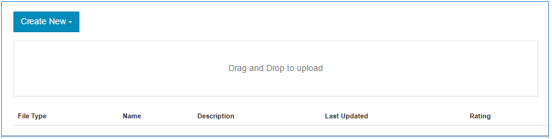

# Función de la biblioteca de archivos {#file-library-feature}

>[!CAUTION]
>
>AEM 6.4 ha llegado al final de la compatibilidad ampliada y esta documentación ya no se actualiza. Para obtener más información, consulte nuestra [períodos de asistencia técnica](https://helpx.adobe.com/es/support/programs/eol-matrix.html). Buscar las versiones compatibles [here](https://experienceleague.adobe.com/docs/).

## Introducción {#introduction}

La función de biblioteca de archivos proporciona un lugar donde los visitantes del sitio que han iniciado sesión (miembros de la comunidad) pueden cargar, administrar y descargar archivos dentro del sitio de la comunidad.

Esta sección de la documentación describe

* Adición de la función de biblioteca de archivos a un sitio AEM
* Ajustes de configuración para `File Library` componente

## Adición de una biblioteca de archivos a una página {#adding-a-file-library-to-a-page}

Para agregar un `File Library` a una página en modo de autor, busque el componente

* `Communities / File Library`

y arrástrela a su lugar en una página.

Para obtener la información necesaria, visite [Conceptos básicos de los componentes de Communities](basics.md).

Cuando la variable [bibliotecas requeridas del lado del cliente](essentials-file-library.md#essentials-for-client-side) se incluyen, así es como se muestra la variable `File Library` aparecerá el componente:

## Configuración de la biblioteca de archivos {#configuring-file-library}

Seleccione la colocación `File Library` para acceder y seleccionar el componente `Configure` que abre el cuadro de diálogo de edición.

 

### Ficha Comentarios {#comments-tab}

En el **[!UICONTROL Comentarios]** especifique si aparecen los comentarios de los archivos cargados y cómo aparecerán:

* **[!UICONTROL Permitir comentarios en archivos]**
Si está activada, permita que se comenten los archivos cargados. El valor predeterminado no está seleccionado.

* **[!UICONTROL Comentarios por página]**
Limita el número de comentarios mostrados por página, así como el número de respuestas mostradas. El valor predeterminado es 
**10**.

* **[!UICONTROL Tamaño máximo del archivo]**
Este valor limitará el tamaño del archivo cargado. El límite predeterminado es 104857600 (10 Mb).

* **[!UICONTROL Longitud máxima del mensaje]**
Número máximo de caracteres que se pueden introducir en el cuadro de texto. El valor predeterminado es de 4096 caracteres.

* **[!UICONTROL Tipos de archivo permitidos]**
Lista de extensiones de archivo separados por coma con el separador &quot;punto&quot;. Por ejemplo: .jpg, .jpeg, .png, .doc, .docx, .pdf. Si se especifica algún tipo de archivo, no se permitirán los no especificados. El valor predeterminado no se especifica de forma que se permitan todos los tipos de archivo.

* **[!UICONTROL Editor de texto enriquecido]**
Si se selecciona, los comentarios pueden introducirse con marcado. El valor predeterminado no está seleccionado.

* **[!UICONTROL Eliminar comentarios]**
Si se selecciona, los usuarios pueden eliminar sus propios comentarios. El valor predeterminado está marcado.

* **[!UICONTROL Permitir etiquetado]**
Si se selecciona, se habilita la capacidad de agregar una etiqueta al archivo. El valor predeterminado no está seleccionado.

* **[!UICONTROL Espacios de nombres permitidos]**
Si se selecciona Permitir etiquetado , las etiquetas disponibles se limitarán a los espacios de nombres marcados. Si no se selecciona ninguno, se permiten todos. El valor predeterminado son todas las áreas de nombres.

* **[!UICONTROL Límite de sugerencias]**
Si la opción Permitir etiquetado está activada, esta opción limita el número de etiquetas sugeridas para mostrar. Si se establece en -1, no hay límite. El valor predeterminado es -1.

* **[!UICONTROL Permitir votación]**
Si se selecciona, se habilitará la capacidad de votar para un archivo. El valor predeterminado no está seleccionado.

* **[!UICONTROL Permitir lo siguiente]**
Si está marcada esta opción, incluya la siguiente característica para artículos de blog, que permite que los miembros sean [notificadas](notifications.md) de nuevos puestos. El valor predeterminado no está seleccionado.

* **[!UICONTROL Permitir respuestas con subprocesos]**
Si está activado, permita que las respuestas a los comentarios publicados. El valor predeterminado no está seleccionado.

### Pestaña Moderación del usuario {#user-moderation-tab}

En el **[!UICONTROL Moderación del usuario]** , configure la moderación de los comentarios si se permiten los comentarios:

* **[!UICONTROL Premoderación]**
Si se selecciona, los comentarios deben aprobarse antes de que aparezcan en un sitio de publicación. El valor predeterminado no está seleccionado.

* **[!UICONTROL Eliminar comentarios]**
Si se selecciona, el visitante que publicó el comentario tiene la capacidad de eliminarlo. El valor predeterminado está marcado.

* **[!UICONTROL Denegar comentarios]**
Si está activada, permita que los moderadores miembros de confianza rechacen los comentarios. El valor predeterminado no está seleccionado.

* **[!UICONTROL Cerrar/volver a abrir comentarios]**
Si está marcada esta opción, permita que los moderadores miembros de confianza cierren y vuelvan a abrir los comentarios. El valor predeterminado no está seleccionado.

* **[!UICONTROL Marcar comentarios]**
Si está marcada esta opción, permita a los visitantes marcar comentarios como inapropiados. El valor predeterminado no está seleccionado.

* **[!UICONTROL Lista de motivos del indicador]**
Si está marcada esta opción, permita a los visitantes elegir, desde una lista desplegable, el motivo por el que marcan un comentario como inapropiado. El valor predeterminado no está seleccionado.

* **[!UICONTROL Razón de marca personalizada]**
Si está marcada esta opción, permita que los visitantes especifiquen su propio motivo para marcar un comentario como inapropiado. El valor predeterminado no está seleccionado.

* **[!UICONTROL Umbral de moderación]**
Especifique el número de veces que los visitantes deben marcar un comentario antes de que se notifique a los moderadores. El valor predeterminado es una vez (
**1**).

* **[!UICONTROL Límite de marcado]**
Introduzca el número de veces que se debe marcar un comentario antes de ocultarlo de la vista pública. Este número debe ser bueno o igual que la variable 
**Umbral de moderación**. El valor predeterminado es 5.

## Información adicional {#additional-information}

Puede encontrar más información en la [Elementos esenciales de la biblioteca de archivos](essentials-file-library.md) para desarrolladores.

Para moderar los temas y comentarios publicados, consulte [Moderación del contenido generado por el usuario](moderate-ugc.md).

Para etiquetar temas y comentarios publicados, consulte [Etiquetado del contenido generado por el usuario](tag-ugc.md).
