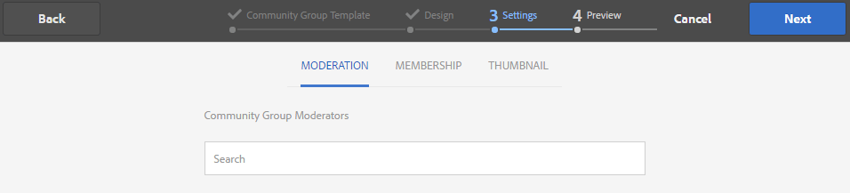
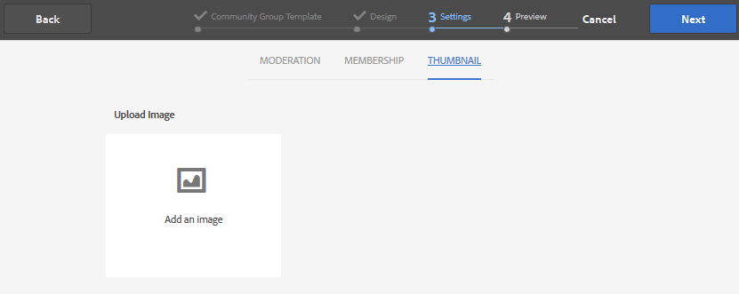
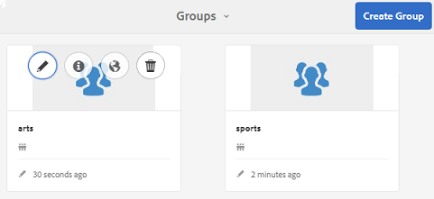

# Consola de grupos de la comunidad {#community-groups-console}

La consola Grupos proporciona acceso a la creación de grupos de comunidad cuando la estructura [de](sites-console.md#step1) plantilla de un sitio de comunidad incluye la función Grupos.

* Los grupos pueden anidarse dentro de otros grupos. Esto sucede cuando la [estructura del nuevo grupo](tools-groups.md) contiene la función de grupos.
* Solo para el entorno de creación, existe un asistente para la creación de grupos similar al asistente para la creación de sitios.
* Se puede configurar si los miembros pueden crear grupos a partir del entorno de publicación al agregar una función Grupos a una estructura de sitio de comunidad o de grupo de comunidad.

De las tres plantillas de grupo incluidas, solo la `Reference Group` plantilla incluye una función de grupo en su estructura.

Varios aspectos de los grupos comunitarios son:

* Creación: se puede crear un nuevo grupo en el autor y, opcionalmente, en la publicación
* Control: el grupo puede ser abierto o secreto
* Anidado: un grupo puede contener cero o más grupos

>[!NOTE]
>
>Los grupos de la comunidad, creados en el entorno de publicación antes de [que exista la consola](https://helpx.adobe.com/in/experience-manager/6-3/communities/using/version-history.html#FeaturePack1FP1)Grupos de la comunidad, no se enumerarán en la consola Grupos de la comunidad y, por lo tanto, no se pueden modificar mediante la consola.

>[!NOTE]
>
>Esta consola Grupos, a la que solo se puede acceder desde la consola Sitios de comunidades, no debe confundirse con la consola  Grupos de miembros para administrar grupos de miembros.
>
>Los grupos de miembros son grupos de usuarios registrados en el entorno de publicación a los que se accede desde el entorno de creación mediante el servicio [de](deploy-communities.md#tunnel-service-on-author)túnel.

## Creación de grupos {#group-creation}

Para acceder a la consola Grupos:

* Al crear, inicie sesión con privilegios de administrador
* Desde la navegación global: **[!UICONTROL Comunidades > Sitios]**
* Seleccione una carpeta de sitio de comunidad existente para abrirla
* Seleccione una instancia de un sitio de comunidad dentro de la carpeta

   * La estructura del sitio de la comunidad debe incluir una función de grupos
   * Estas capturas de pantalla proceden del tutorial Introducción después de [crear grupos al publicar](published-site.md)

Seleccione la carpeta **** Grupos para abrirla.

Al abrirse, se muestran todos los grupos existentes, tanto si se han creado al crear como al publicar.

Desde esta consola Grupos, es posible crear nuevos grupos.

* Seleccione el botón **[!UICONTROL Crear grupo]**

### Paso 1: Plantilla de grupo de comunidad {#step-community-group-template}

* **[!UICONTROL Título]** del grupo de la comunidad: Título que se muestra para el grupo.

   El título aparece en el sitio publicado para el grupo.

* **[!UICONTROL Descripción]** del grupo de la comunidad: Una descripción del grupo.
* **[!UICONTROL Raíz]** del grupo de la comunidad: La ruta raíz del grupo.

   La raíz predeterminada es el sitio principal, pero la raíz puede moverse a cualquier ubicación dentro del sitio web. No se recomienda cambiarlo.

* **[!UICONTROL Menú Idiomas de grupo de comunidad disponibles adicionales]** : Utilice el menú desplegable para seleccionar los idiomas de grupo de comunidad disponibles. El menú muestra todos los idiomas en los que se crea el sitio de comunidad principal. Los usuarios pueden seleccionar entre estos idiomas para crear grupos en varias configuraciones regionales en este solo paso. El mismo grupo se crea en varios idiomas especificados en la consola Grupos de los respectivos sitios de la comunidad.

* **[!UICONTROL Nombre]** del grupo de la comunidad: El nombre de la página raíz del grupo que aparece en la dirección URL

   * Compruebe el nombre en Doble, ya que no es fácil cambiarlo después de crear el grupo
   * La dirección URL base se mostrará debajo de la variable `Community Group Name`
   * Para una dirección URL válida, anexe &quot;.html&quot;

      *Por ejemplo*, `http://localhost:4502/content/sites/mysight/en/mygroup.html`

* **[!UICONTROL Menú Plantilla]** de grupo de comunidad: utilice el menú desplegable para elegir una plantilla [de grupo de](tools.md)comunidad disponible.

### Paso 2: Diseño {#step-design}

#### COMMUNITY GROUP THEME {#community-group-theme}

La estructura utiliza [Twitter Bootstrap](https://twitterbootstrap.org/) para llevar un diseño flexible y adaptable al sitio. Se puede seleccionar una de las muchas temáticas de Bootstrap precargadas para aplicar estilo a la plantilla de grupo de comunidad seleccionada o se puede cargar un tema de Bootstrap.

Cuando se selecciona, el tema se superpone con una marca de verificación azul opaca.

Es posible seleccionar un tema que difiera del tema del sitio principal.

Después de publicar el sitio de la comunidad, es posible [editar las propiedades](#modifying-group-properties) y seleccionar un tema diferente.

#### COMMUNITY GROUP BRANDING {#community-group-branding}

La marca del sitio de la comunidad es una imagen que se muestra como encabezado en la parte superior de cada página. Es posible mostrar una pancarta para el grupo que difiera de otras páginas del sitio.

El tamaño de la imagen debe ser tan grande como la visualización esperada de la página en el navegador y 120 píxeles de altura.

Al crear o seleccionar una imagen, tenga en cuenta:

* La altura de la imagen se recortará a 120 píxeles medidos desde el borde superior de la imagen
* La imagen se fija en el borde izquierdo de la ventana del navegador
* No hay cambio de tamaño de la imagen, de modo que cuando la anchura de la imagen es...

   * Menor que el ancho del navegador, la imagen se repetirá horizontalmente
   * Buena al ancho del explorador, la imagen parece que se recorta

### Paso 3: Configuración {#step-settings}

#### MODERATION {#moderation}

De forma predeterminada, se hereda la lista de moderadores del sitio de la comunidad principal.

Es posible agregar moderadores específicos al grupo:

* Buscar miembros (desde el entorno de publicación) para agregarlos como moderadores

#### MEMBERSHIP {#membership}

La configuración de pertenencia permite seleccionar una de las tres formas de asegurar un grupo de comunidad.

* Suscripción opcional

   Si se selecciona, el grupo de comunidad es un grupo público. Los miembros del sitio pueden participar en el grupo y publicar sin unirse explícitamente al grupo. Predeterminado está seleccionado.
* Suscripción requerida

   si se selecciona, el grupo de comunidad es un grupo abierto. Los miembros del sitio de la comunidad pueden realizar vistas en el contenido del grupo, pero deben unirse al grupo antes de poder publicar contenido. Los miembros se unen seleccionando el `Join` botón en el entorno de publicación. El valor predeterminado no está seleccionado.

* Suscripción restringida

   si se selecciona, el grupo de comunidad es un grupo secreto. Los miembros de la comunidad deben ser invitados explícitamente. Los miembros invitados se introducen en el cuadro de búsqueda. Los miembros podrán agregarse posteriormente utilizando las consolas [Miembros y Grupos](members.md) del entorno de creación. El valor predeterminado no está seleccionado.

#### MINIATURA {#thumbnail}

La miniatura es una imagen que se muestra para el grupo al crear y publicar.

El tamaño óptimo de una imagen de grupo es de 170 x 90 píxeles en un formato de imagen admitido (como JPG o PNG).

Si no se agrega ninguna imagen, se muestra una imagen predeterminada.

### Paso 4: Crear grupo {#step-create-group}

Si es necesario realizar algún ajuste, utilice el botón **Atrás** para realizarlo.

Una vez seleccionada la opción **Crear** e iniciada, el proceso de creación del grupo no se puede interrumpir.

Cuando se completa el proceso, la tarjeta del nuevo sitio de subcomunidad (grupo) se muestra en la consola Grupos de sitios de comunidades, desde donde los autores pueden agregar contenido de página o los administradores pueden modificar las propiedades del sitio.

>[!NOTE]
>
>El grupo se crea en todos los idiomas, tal como se especifica en el [paso 1: Plantilla](groups.md#step1communitygrouptemplate) de grupo de la comunidad en idiomas de grupo de la comunidad disponibles adicionales, en la consola Grupos de la comunidad de los sitios de la comunidad respectivos.

## Creación de contenido de grupo {#authoring-group-content}

El contenido de la página de un grupo se puede crear con las mismas herramientas que cualquier otra página AEM. Para abrir el grupo para la creación, seleccione el icono Abrir sitio que aparece al pasar el ratón por encima de la tarjeta del grupo.

## Modificación de las propiedades del grupo {#modifying-group-properties}

Las propiedades de un sitio de subcomunidad existente, especificadas durante el proceso de creación de grupos de la comunidad, se pueden modificar seleccionando el icono Editar sitio que aparece al pasar el ratón por encima de la tarjeta de grupo:

Los detalles de las siguientes propiedades coinciden con las descripciones proporcionadas en la sección Creación [de](#group-creation) grupos. Se puede modificar cualquier grupo anidado, tanto si se crea en el entorno de publicación como en el entorno de autor.

### Modificar básico {#modify-basic}

El panel BASIC permite modificar

* Título del grupo de la comunidad
* Descripción del grupo de la comunidad

No se puede modificar el nombre del grupo de la comunidad.

La elección de una plantilla de grupo de comunidad diferente no afectaría a un sitio de grupo de comunidad existente, ya que no queda ninguna conexión entre plantillas y sitios.

En cambio, la [ESTRUCTURA](#modify-structure) de la subcomunidad puede modificarse.

### Modificar estructura {#modify-structure}

El panel ESTRUCTURA permite modificar la estructura creada inicialmente a partir de la plantilla de grupo de comunidad seleccionada al crear el sitio de subcomunidad desde el entorno de creación o publicación. Desde el panel, es posible

* Arrastrar y soltar funciones [de](functions.md) comunidad adicionales en la estructura del sitio
* En una instancia de una función de comunidad en la estructura del sitio:

   * **`gear icon`**

      Editar la configuración, incluidos el título para mostrar y el nombre de la dirección URL, así como los grupos de miembros [privilegiados](users.md#privilegedmembersgroups)

   * **`trashcan icon`**

      Quitar (eliminar) funciones de la estructura del sitio

   * **`grid icon`**

      Modifique el orden de las funciones como se muestra en la barra de navegación de nivel superior del sitio

>[!CAUTION]
>
>Aunque el título de visualización se puede cambiar sin efectos secundarios, no se recomienda editar el nombre de la dirección URL de una función de comunidad que pertenece a un sitio de comunidad.
>
>Por ejemplo, si se cambia el nombre de la URL, no se moverá el UGC existente, lo que tendrá el efecto de &#39;perder&#39; UGC.

>[!CAUTION]
>
>La función de grupos *no debe* ser la *primera ni la única* función de la estructura del sitio.
>
>Cualquier otra función, como la función [de](functions.md#page-function)página, debe incluirse y enumerarse en primer lugar.

#### Ejemplo: Añadir una función de calendario en una estructura de subcomunidad (grupo) {#example-adding-a-calendar-function-to-a-sub-community-group-structure}

### Modificar diseño {#modify-design}

El panel DISEÑO permite modificar el tema:

* [Tema del grupo de la comunidad](#community-group-theme)
* [Marca del grupo de la comunidad](#community-group-branding)

   * Desplácese hasta la parte inferior del panel para cambiar la imagen de marca

### Modificar configuración {#modify-settings}

El panel CONFIGURACIÓN permite agregar [moderadores](#moderation)de comunidad.

### Modificar pertenencia {#modify-membership}

El panel [MIEMBROS](#membership) es meramente informativo. No es posible modificar el tipo de pertenencia a un grupo establecido, ya sea opcional, obligatoria o restringida.

### Modificar miniatura {#modify-thumbnail}

El panel [MINIATURAS](#thumbnail) permite cargar una imagen para representar el grupo de la comunidad en los visitantes del sitio en el entorno de publicación, así como en la consola Grupos del sitio de comunidades en el entorno de creación.

## Publicación del grupo {#publishing-the-group}

Una vez creado o modificado un grupo de comunidad, es posible publicar (activar) el grupo seleccionando el icono `Publish Site` .

Una vez que el grupo se haya publicado correctamente, aparecerá un mensaje:

>[!CAUTION]
>
>El sitio de la comunidad principal y los grupos principales ya deberían haberse publicado.
>
>El sitio de la comunidad y los grupos anidados deberían publicarse de manera vertical.

## Eliminación del grupo {#deleting-the-group}

Para eliminar un grupo desde la consola Grupos de la comunidad, seleccione el icono Eliminar grupo, que aparece al pasar el ratón sobre el grupo.

Esto elimina todos los elementos asociados al grupo, por ejemplo, se elimina de forma permanente todo el contenido del grupo y se eliminan las pertenencias de los usuarios del sistema.
