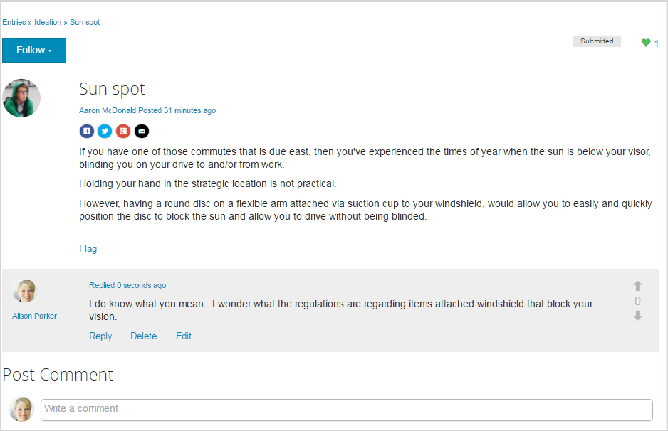

# Función de la idea {#ideation-feature}

## Introducción {#introduction}

La función de ideación proporciona un área para los visitantes del sitio con sesión iniciada (miembros de la comunidad) en el entorno de publicación para:

* Crear ideas para compartir con la comunidad
* Vista y comentarios sobre ideas
* Seguir una idea
* Votación de una idea

Esta sección de la documentación describe

* Añadir la función de ideación en un sitio AEM
* Configuración del componente Ideación

## Adding a Ideation to a Page {#adding-a-ideation-to-a-page}

Para agregar un `Ideation` componente a una página en modo de autor, utilice el navegador de componentes para buscarlo `Communities / Ideation` y arrastrarlo a su lugar en una página en la que debería aparecer la idea.

Para obtener la información necesaria, visite [Communities Components Basics](basics.md)(Conceptos básicos de componentes de comunidades).

Cuando se incluyen las bibliotecas [del lado del cliente](ideation.md#essentials-for-client-side) necesarias, así es como aparecerá el `Ideation`componente:

## Configuración de una idea {#configuring-an-ideation}

Seleccione el componente colocado al que desea acceder y seleccione el `Ideation` `Configure` icono que abre el cuadro de diálogo de edición.

 

### Ficha Configuración {#settings-tab}

En la ficha **[!UICONTROL Configuración]** , especifique la configuración de las ideas y los comentarios:

* **[!UICONTROL Título]** de la ideaTítulo que se muestra para la idea. El valor predeterminado es 
`Ideation`.

* **[!UICONTROL Descripción de la idea]** Una descripción que se mostrará como un subtítulo para la idea. El valor predeterminado no es una descripción.

* **[!UICONTROL Temas por página]** Define el número de ideas/publicaciones que se muestran por página. El valor predeterminado es 10.

* **[!UICONTROL Moderado]** Si se selecciona, la publicación de ideas y comentarios debe aprobarse antes de que aparezcan en un sitio de publicación. El valor predeterminado no está marcado.

* **[!UICONTROL Cerrado]** Si se selecciona, el foro de ideas está cerrado a nuevas ideas y comentarios. El valor predeterminado no está marcado.

* **[!UICONTROL Editor]** de texto enriquecido Si se selecciona, las ideas y los comentarios se pueden introducir con marcado. El valor predeterminado no está marcado.

* **[!UICONTROL Permitir etiquetado]** Si está activado, permita que los miembros agreguen etiquetas a su anuncio (consulte la ficha Campo **** de etiqueta). El valor predeterminado no está marcado.

* **[!UICONTROL Permitir cargas]** de archivos Si está activada, permita que los archivos adjuntos se agreguen a la idea o comentario. El valor predeterminado no está marcado.

* **[!UICONTROL Tamaño]** máximo de archivo relevante solo si 
`Allow File Uploads` está marcado. Este campo limitará el tamaño (en bytes) de un archivo cargado. El valor predeterminado es 104857600 (10 Mb).

* **[!UICONTROL Tipos]** de archivo permitidos relevantes solo si 
`Allow File Uploads` está marcado. lista separada por comas de extensiones de archivo con el separador &quot;punto&quot;. Por ejemplo: .jpg, .jpeg, .png, .doc, .docx, .pdf. Si se especifica algún tipo de archivo, no se permitirá cargar los no especificados. El valor predeterminado no se especifica de forma que se permitan todos los tipos de archivo.

* **[!UICONTROL El tamaño]** máximo del archivo de imagen adjunto solo es relevante si se ha marcado Permitir cargas de archivos. Número máximo de bytes que puede tener un archivo de imagen cargado. El valor predeterminado es 2097152 (2 Mb).

* **[!UICONTROL Permitir respuestas]** Si está activada, permita respuestas a los comentarios publicados en la idea. El valor predeterminado no está marcado.

* **[!UICONTROL Permitir que los usuarios eliminen comentarios y temas]** Si se selecciona esta opción, permita que los miembros eliminen los comentarios e ideas que han publicado. El valor predeterminado no está marcado.

* **[!UICONTROL Permitir lo siguiente]** Si está marcado, incluya la siguiente función para anuncios de ideas, que permite que se [notifique](notifications.md) a los miembros de los anuncios nuevos. El valor predeterminado no está marcado.

* **[!UICONTROL Permitir Suscripciones]** por correo electrónico Si está activada, permita que se notifique a los miembros de los anuncios nuevos por correo electrónico ([suscripción](subscriptions.md)). Requiere `Allow Following` que se marque y se configure [el](email.md)correo electrónico. El valor predeterminado no está marcado.

* **[!UICONTROL Permitir votación]** Si está activada, permita votar los comentarios de una idea. El valor predeterminado no está marcado.

* **[!UICONTROL Mostrar distintivos]** Si está activada, muestre [distintivos](implementing-scoring.md) obtenidos y asignados con la idea de un miembro. El valor predeterminado no está marcado.

* **[!UICONTROL Si se selecciona Permitir contenido]** destacado, la idea se puede identificar como contenido destacado. El valor predeterminado no está marcado.

### Ficha Moderación del usuario {#user-moderation-tab}

En la ficha Moderación **** del usuario, especifique cómo se administran las ideas y los comentarios publicados (contenido generado por el usuario). Para obtener más información, consulte [Moderación del contenido](moderate-ugc.md)generado por el usuario.

* **[!UICONTROL Denegar publicaciones]** Si se selecciona, los moderadores miembros de confianza podrán denegar las publicaciones e impedir que aparezcan en el foro público. El valor predeterminado no está marcado.

* **[!UICONTROL Cerrar o volver a abrir temas]** Si se selecciona, los moderadores de miembros de confianza pueden cerrar un tema para realizar más ediciones y comentarios, y también pueden volver a abrir un tema. El valor predeterminado no está marcado.

* **[!UICONTROL Marcar anuncios]** Si está activada, permite a los miembros marcar los temas o comentarios de otros como inapropiados. El valor predeterminado no está marcado.

* **[!UICONTROL Marcar Lista]** de motivo Si está activada, permita que los miembros elijan, desde una lista desplegable, el motivo por el que marcan un tema o comentario como inapropiado. El valor predeterminado no está marcado.

* **[!UICONTROL Razón]** de marca personalizada Si está activada, permita que los miembros introduzcan su propio motivo para marcar un tema o comentario como inapropiado. El valor predeterminado no está marcado.

* **[!UICONTROL Umbral]** de moderaciónIntroduzca el número de veces que los miembros deben marcar un tema o comentario antes de que se notifique a los moderadores. El valor predeterminado es 1 ( una vez).

* **[!UICONTROL Límite]** de marcado Escriba el número de veces que se debe marcar un tema o comentario antes de que se oculte en la vista pública. Si se establece en -1, el tema o comentario marcado nunca se oculta en la vista pública. De lo contrario, este número debe ser bueno o igual al umbral de moderación. El valor predeterminado es 5.

### Ficha Campo de etiqueta {#tag-field-tab}

En la ficha Campo **** de etiqueta, las etiquetas que se pueden aplicar, si se permiten en la ficha **[!UICONTROL Configuración]** , están limitadas según las Áreas de nombres elegidas.

* **[!UICONTROL Áreas de nombres]** Pertinentes Permitidas si 
`Allow Tagging` se marca en la ficha **Configuración** . Las etiquetas que se pueden aplicar están limitadas a las que se encuentran dentro de las categorías de Área de nombres seleccionadas. La lista de Áreas de nombres incluye &quot;Etiquetas estándar&quot; (la Área de nombres predeterminada) y &quot;Incluir todas las etiquetas&quot;. El valor predeterminado no está marcado, lo que significa que se permiten todas las Áreas de nombres.

* **[!UICONTROL Límite]** de sugerencias Introduzca el número de etiquetas que se mostrarán como una sugerencia para el miembro que se publica en el foro. Un valor de 
**-** 1 significa que no hay límite. El valor predeterminado es 0.

### Ficha Ordenar configuración {#sort-settings-tab}

En la ficha **[!UICONTROL Ordenar configuración]** , especifique cómo se ordenan los comentarios publicados cuando se muestran.

* **[!UICONTROL Ordenar por]** Marcar todas las selecciones de clasificación permitidas: 
`Newest, Oldest, Last Updated, Most Viewed, Most Active, Most Followed and Most Liked`. El valor predeterminado es `Newest, Oldest, Last Updated`.

* **[!UICONTROL Configure la opción Desplegable predeterminada]** para seleccionar una de las opciones de ordenación seleccionadas para que aparezca como opción predeterminada. El valor predeterminado es 
`Newest`.

* **[!UICONTROL Seleccione Opciones de tiempo para la]** extracción de ordenación de Analytics para seleccionar una de las opciones de 
`All, Last 24 Hours, Last 7 Days, Last 30 Days`. El valor predeterminado es `All`.

## Experiencia de Visitante del sitio {#site-visitor-experience}

### Creación de ideas {#creating-idea}

Al igual que con todas las características de las Comunidades, si no se ha iniciado sesión, un visitante del sitio solo puede leer ideas y vista otras opiniones (a través de comentarios y votaciones/preferencias).

Una vez que haya iniciado sesión, un miembro puede crear una nueva idea.

Antes de enviar la idea, es posible que el miembro guarde un borrador.

Al seleccionar el `Save as Draft` botón, se guarda un borrador.

Cuando visualice borradores guardados en la `My Drafts` ficha, seleccione `Read More` para volver a entrar en el modo de edición:

#### Proporcionar comentarios {#providing-feedback}

Una vez publicada la idea, otros miembros pueden iniciar sesión, abrir la idea ( `Read More`) y darle gusto, añadiendo así al recuento de votos, y hacer comentarios.

### Información adicional {#additional-information}

Puede encontrar más información en la página [Ideation Essentials](ideation.md) para desarrolladores.

Para obtener información sobre la moderación de los temas y comentarios publicados, consulte [Moderación del contenido](moderate-ugc.md)generado por el usuario.

Para etiquetar temas y comentarios publicados, consulte [Etiquetado de contenido](tag-ugc.md)generado por el usuario.
