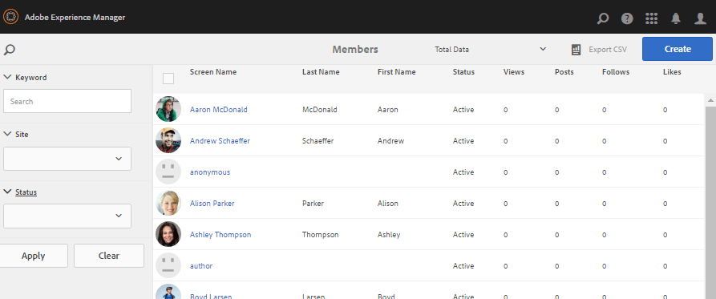

# Consolas de administración de miembros y grupos {#members-groups-management-consoles}

## Información general {#overview}

Las funciones de AEM Communities suelen requerir que los visitantes del sitio se registren e inicien sesión antes de participar en una comunidad del entorno de publicación. Su registro de usuario solo debe existir en el entorno de publicación y comúnmente se los denomina *miembros* para distinguirlos de *usuarios* registrados en el entorno de creación.

### Miembros (usuarios) en Publicación {#members-users-on-publish}

Mediante las consolas Miembros de Communities y Grupos , los miembros y grupos de miembros registrados en el entorno *publish* se pueden crear y administrar desde el entorno *author* . Esto solo es posible cuando el [servicio de túnel](deploy-communities.md#tunnel-service-on-author) está habilitado.

### Usuarios en Author {#users-on-author}

Para administrar usuarios y grupos registrados en el entorno *author* , es necesario utilizar la consola de seguridad de la plataforma:

* En la navegación global, seleccione `Tools, Security, Users`
* En la navegación global, seleccione `Tools, Security, Groups`

>[!NOTE]
>
>Con el contenido de muestra implementado y habilitado, muchos usuarios de muestra existen tanto en los entornos de autor como de publicación. Estos usuarios no estarán presentes cuando se ejecuten con [nosamplecontent runmode](../../help/sites-administering/production-ready.md).

## Consola Miembros {#members-console}

En el entorno de creación, para llegar a la consola Miembros para administrar miembros registrados en el entorno de publicación:

* Desde la navegación global: **[!UICONTROL Navegación > Comunidades > Miembros]**

>[!CAUTION]
>
>No será posible utilizar la consola Miembros si el [servicio de túnel](deploy-communities.md#tunnel-service-on-author) no está habilitado.

### Búsqueda   {#search-features}

Seleccione el icono del panel lateral en el lado izquierdo del encabezado `Members` para abrir el panel lateral de búsqueda.

 

Seleccione el icono de búsqueda en la parte izquierda del encabezado `Members` para alternar el panel lateral de búsqueda cerrado.

### Estadísticas de miembro {#member-statistics}

Las columnas que muestran `Views`, `Posts`, `Follows`y `Likes` se actualizan cuando el usuario es miembro de uno o más sitios de la comunidad con Adobe Analytics [habilitado](sites-console.md#analytics).

### Exportar CSV {#export-csv}

Si selecciona el enlace `Export CSV`, se descargarán todos los miembros como una lista de valores separados por coma, adecuados para su importación en una hoja de cálculo.

Los encabezados de columna son

`| Screen Name |Last Name |First Name |Status |Views |Posts |Follows |Likes |`

## Crear nuevo miembro {#create-new-member}

Seleccione `Create Member` para crear un usuario en el entorno de publicación.

### GENERAL - Detalles de los miembros {#general-member-details}

La mayoría de los campos son campos opcionales que el miembro puede rellenar posteriormente en su perfil.

* **[!UICONTROL ID]**
(
*obligatorio*) El ID autorizado es el ID de inicio de sesión del miembro.
De forma predeterminada, el ID se establece en el valor de la dirección de correo electrónico requerida.
   *Una vez creado, el ID no se puede modificar.*

* **[!UICONTROL Dirección de correo electrónico]**
(
*obligatorio*) La dirección de correo electrónico del miembro.
El miembro puede cambiar su dirección de correo electrónico al actualizar su perfil.
Si el ID toma como valor predeterminado la dirección de correo electrónico, el ID *no* cambiará cuando se cambie la dirección de correo electrónico.

* **[!UICONTROL Contraseña]**
(
**) La contraseña de inicio de sesión.

* **[!UICONTROL Repetir contraseña]**
(
*(obligatorio*) Vuelva a introducir la contraseña para la verificación.

* **[!UICONTROL Añadir miembro a los sitios]**
(
*opcional*) Seleccione uno de los sitios de la comunidad existentes para agregar el miembro al grupo de miembros del sitio de la comunidad.

* **[!UICONTROL Añadir miembro a los grupos]**
(
*(opcional*) Seleccione uno de los grupos de miembros existentes para agregar el miembro a ese grupo.

* Seleccione **[!UICONTROL Guardar]**

### GENERAL: Configuración de la cuenta {#general-account-settings}

En Configuración de la cuenta, un administrador de la comunidad puede

* **[!UICONTROL Estado]**
   * Prohibido\
      Un miembro no puede iniciar sesión, lo que les impide ver páginas o participar en actividades que requieren iniciar sesión. Pueden seguir visitando anónimamente un sitio comunitario abierto.

   * No prohibido
Un miembro tiene acceso completo al sitio de la comunidad.

   El valor predeterminado es `Not Banned`.

* **[!UICONTROL Límites de]**
contribuciónSi se selecciona, la capacidad del miembro para publicar contenido es limitada.
El valor predeterminado depende de la configuración de los límites de contribución.
Consulte [Límites de contribución de miembros](limits.md).

* **[!UICONTROL Cambiar]**
contraseñaVínculo que está presente al modificar un miembro existente. Proporciona la capacidad de un administrador de la comunidad para restablecer una contraseña para un miembro.

### GENERAL - Foto {#general-photo}

Para proporcionar un avatar para el miembro, comience seleccionando **[!UICONTROL Upload Image]** y elija una imagen de tipo .jpg, .png, .tif o .gif. El tamaño preferido para una imagen es de 240 x 240 píxeles a 72 ppp.

### GENERAL: Agregar miembros a sitios {#general-add-member-to-sites}

El miembro puede agregarse a uno o más grupos de miembros de sitios de la comunidad. Comience por introducir texto en el cuadro de texto.

### GENERAL - Agregar miembros a grupos {#general-add-member-to-groups}

El miembro puede agregarse a uno o más grupos de miembros. Comience por introducir texto en el cuadro de texto.

### PESTAÑA BADGES {#badges-tab}

El panel `BADGES` permite asignar manualmente distintivos y revocarlos. Los distintivos pueden ser para funciones asignadas, así como para distintivos que normalmente se ganan.

Consulte también [Puntuación y distintivos](implementing-scoring.md).

* **[!UICONTROL Agregar distintivos]**
   * Empiece a escribir para seleccionar entre [distintivos disponibles](badges.md). Una vez seleccionado un distintivo, elija cada sitio, o todos los sitios, en los que el distintivo debe mostrarse junto con el avatar del miembro.
   * Se pueden elegir varios distintivos y sitios.
* **[!UICONTROL Eliminar distintivos]**
   * Seleccione el icono de la papelera que hay junto a un distintivo para quitarlo

## Consola Grupos {#groups-console}

La consola Grupos , disponible desde el entorno de creación, permite la creación y administración de grupos de miembros registrados en el entorno de publicación. Resulta especialmente útil para:
* [Grupos de miembros con privilegios](users.md#privilegedmembersgroups)
* Asignación basada en grupos de [recursos de habilitación](resources.md)

Para acceder a la consola Grupos :
* Desde la navegación global: **[!UICONTROL Navegación > Comunidades > Grupos]**

>[!CAUTION]
>
>No será posible utilizar la consola Grupos si el [servicio de túnel](deploy-communities.md#tunnel-service-on-author) no está habilitado.

### Crear un grupo nuevo {#create-new-group}

Seleccione `Add Group` para crear un grupo en el entorno de publicación.

Los campos obligatorios para crear un nuevo grupo de miembros del lado de publicación son:

* **[!UICONTROL ID]**
(
*obligatorio*) ID exclusivo del grupo.
   *Una vez creado, el ID no se puede modificar.*

* **[!UICONTROL Nombre]**
(
*opcional*) El nombre para mostrar del grupo.

   El valor predeterminado es el ID.

* **[!UICONTROL Descripción]**
(
*opcional*) Una descripción del propósito y los permisos del grupo.

* **[!UICONTROL Añadir miembros al grupo]**
(
*(opcional*) Seleccione los miembros del lado de publicación que desea incluir como miembros iniciales del grupo.

* Seleccione **[!UICONTROL Guardar]**

## Administradores autorizados {#authorized-administrators}

Cuando se trabaja con miembros en la consola de miembros de Communities, es necesario iniciar sesión como usuario con los permisos adecuados y configurar correctamente el agente de replicación utilizado por el [túnel service](deploy-communities.md#tunnel-service-on-author).

Si no ha iniciado sesión como `admin`, el usuario que ha iniciado sesión debe ser miembro del grupo de usuarios `administrators`.

Consulte también [Agentes de replicación en Author](deploy-communities.md#replication-agents-on-author).
