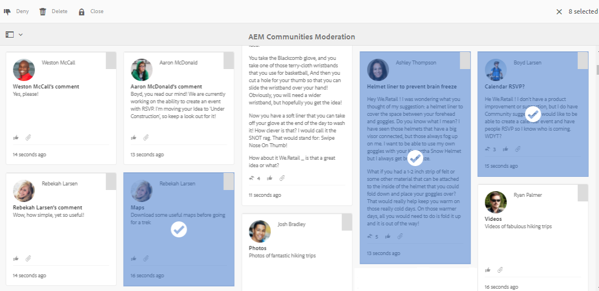

# Consola de moderación {#moderation-console}

En AEM Communities, la [moderación masiva del contenido de la comunidad](moderate-ugc.md) es posible tanto desde los entornos de creación como de publicación por parte de los administradores y los moderadores de la comunidad (miembros de la comunidad de confianza asignados como moderadores).

Los administradores y los moderadores de la comunidad también pueden realizar [moderación en contexto](in-context.md) en el entorno de publicación.

Una característica de todos los [sitios de comunidad](sites-console.md) es un elemento de menú `Administration`disponible para los usuarios que inician sesión con privilegios administrativos. El vínculo `Administration`proporciona acceso a la consola Moderación.

Desde la consola Moderación, los administradores y los moderadores de la comunidad tendrán acceso a todo el contenido generado por el usuario (UGC) para el que tengan permiso de moderación. Si se permite moderar varios sitios, es posible realizar vistas de anuncios en todos los sitios o filtrar por sitios de comunidades seleccionados.

Para obtener información más detallada, visite [Administración de usuarios y grupos de usuarios](users.md).

La consola Moderación admite:
* Realización masiva de tareas de moderación
* Buscando UGC
* Visualización de detalles de UGC
* Visualización de los detalles del autor de UGC

Solo se pueden realizar tareas de moderación cuando se inicia sesión como administrador o como miembro con ` [moderator permissions](in-context.md#identifyingtrustedmembers)`.

## Acceso a Entorno de publicación {#publish-environment-access}

El acceso a la consola Moderación desde un sitio de comunidad publicado se realiza a través de un vínculo Administración que aparece cuando un moderador de la comunidad ha iniciado sesión.

Al seleccionar el vínculo Administración, aparece la consola Moderación:

## Acceso a Entorno de autor {#author-environment-access}

En el entorno de creación, para llegar a la consola Moderación

* Desde la navegación global: **[!UICONTROL Navegación > Comunidades > Moderación]**

Solo se pueden realizar tareas de moderación cuando se inicia sesión como administrador o como miembro con ` [moderator permissions](in-context.md#identifyingtrustedmembers)`. El único contenido de la comunidad que se muestra es aquél que el miembro que ha iniciado sesión puede moderar.

>[!NOTE]
>
>UGC del entorno de publicación solo estará visible para el autor si el SRP elegido implementa un almacén común. Por ejemplo, de forma predeterminada, el almacenamiento es JSRP, que no es un almacén común para la creación y publicación. Consulte [Almacenamiento de contenido de comunidad](working-with-srp.md).

## Interfaz de usuario de la consola de moderación {#moderation-console-ui}

Dejando de lado el carril de navegación izquierdo (que aparece en el autor, pero no en la publicación), la interfaz de usuario de moderación tiene las siguientes áreas principales:

* **[Barra de navegación superior](#top-navigation-bar)**
* **[Barra de herramientas](#toolbar)**
* **[Área de contenido](#content-area)**

### Barra de navegación superior {#top-navigation-bar}

La barra de navegación superior es constante para todas las consolas. Para obtener más información, consulte [Administración básica](../../help/sites-authoring/basic-handling.md).

### Barra de herramientas {#toolbar}

La barra de herramientas, situada debajo de la barra de navegación superior, proporciona el siguiente conmutador en el lado izquierdo:

* [Filtrar ](moderation.md#filter-rail) carril abre un carril que permite elegir las propiedades en las que se filtrará el contenido.

La barra de herramientas, situada debajo de la barra de navegación superior, proporciona el siguiente conmutador en el lado izquierdo:

[Carril de filtro](moderation.md#filter-rail)\
Abre un carril, al seleccionar Buscar, que permite elegir las propiedades en las que se debe filtrar el contenido.

### Área de contenido {#content-area}

El área de contenido contiene información para la UGC publicada:

* La UGC publicó
* Nombre del miembro
* avatar miembro
* Ubicación del anuncio
* Cuando se publicó
* Número de respuestas al anuncio
*  Opinión asociada con la publicación
* Si se aprueba, se muestra una marca de verificación
* Si hay un adjunto, se muestra un clip

>[!NOTE]
>
>El área de contenido incluye un *desplazamiento infinito*, lo que significa que le permitirá continuar el desplazamiento hasta que llegue al final del contenido. La barra de herramientas permanece en una posición fija y visible sobre el área de contenido, incluso mientras se desplaza.

### Carril de filtro {#filter-rail}

El icono del panel lateral abre el carril del filtro. El carril del filtro, que aparece a la izquierda del área de contenido, proporciona diferentes filtros, cada uno de los cuales tiene un efecto inmediato en el UGC referenciado que aparece en el área de contenido.

Los filtros dentro de cada categoría se **OR** emiten juntos y los filtros en diferentes categorías se **AND** emiten juntos.

Por ejemplo: si comprueba tanto **Pregunta** como **Respuesta**, verá contenido que es una **Pregunta** *o* una **Respuesta**.

Sin embargo, si marca **Pregunta** y **Pendiente**, solo verá contenido que sea una **Pregunta** y que esté **Pendiente**.

>[!NOTE]
>
>Los moderadores de la comunidad pueden marcar los filtros predefinidos en la interfaz de usuario de la consola de moderación. A medida que estos filtros se anexan hacia el final de la dirección URL (como parámetros de cadena de consulta), los moderadores pueden volver más tarde a los filtros marcados y también compartir estos vínculos.

Cuando el carril del filtro está abierto, el icono de búsqueda activa el panel lateral cerrado. Sin embargo, para cerrar el carril del filtro y solo realizar la vista del contenido generado por el usuario, haga clic en el icono Buscar y seleccione la opción Solo contenido.

#### Ruta de contenido {#content-path}

Ruta del contenido limita la UGC de referencia mostrada a los anuncios colocados en el repositorio de contenido especificado.

#### Búsqueda de texto {#text-search}

La búsqueda de texto limita la UGC referenciada mostrada a las publicaciones en las que se incluye el texto introducido.

#### Sitio {#site}

El sitio limita el UGC referenciado mostrado a los anuncios en los sitios de comunidad seleccionados. Si no hay sitios marcados, se muestran todas las referencias a UGC.

>[!NOTE]
>
>Cuando un administrador accede a la consola de moderación masiva, se muestran todas las referencias a UGC, incluidos los sitios no creados con el [asistente para la creación de sitios](sites-console.md), como los ejemplos de Geometrixx.
>
>Cuando un miembro de la comunidad de confianza accede a la consola de moderación masiva al publicar, solo se muestran las referencias a UGC creadas para los sitios de la comunidad que el miembro está autorizado a moderar y se pueden filtrar con el filtro del sitio.

#### Tipo de contenido {#content-type}

El tipo de contenido limita el UGC referenciado mostrado a los anuncios del tipo de recurso seleccionado. Se puede seleccionar uno o más de los siguientes tipos. Todos los tipos se muestran si no se selecciona ninguno.

* **Comentario**
* **Tema de foro**
* **Respuesta del foro**
* **Pregunta de P y R**
* **Respuesta de P y R**
* **Artículo de blog**
* **Comentario de blog**
* **Evento de calendario**
* **Comentario del calendario**
* **Carpeta de la biblioteca de archivos**
* **Documento de la biblioteca de archivos**
* **Idea**
* **Comentario de ideación**

#### Tipos de contenido adicionales {#additional-content-types}

Para agregar recursos adicionales en los que filtrar:

* En una instancia de autor
* Iniciar sesión como administrador
* Abrir [Consola Web](http://localhost:4502/system/console/configMgr)
* Localizar `AEM Communities Moderation Dashboard Filters`
* Seleccione la configuración que desea abrir en el modo de edición
* Introduzca el ResourceType de un componente en el que desea filtrar
   * Por ejemplo, para filtrar los componentes de voto incluidos, introduzca:\
      `Voting=social/tally/components/hbs/voting`

* Seleccione Guardar
* Actualizar la consola Comunidades - Moderación

El resultado es un nuevo filtro seleccionable para `Voting`dentro del grupo de filtros `Content Type`.

Cuando se selecciona ese filtro, el contenido del panel mostrará UGC que coincida con cualquiera de los ResourceTypes especificados.

#### Estado {#status}

El estado limita el UGC referenciado mostrado a las publicaciones del estado seleccionado, que pueden ser una o más de Pendiente, Aprobado, Denegado o Cerrado, así como Borrador o Programado para Artículos de Blog y Respondido o No Respondido para Preguntas de Preguntas y Respuestas. Si no hay ninguno seleccionado, se muestran todos.

>[!NOTE]
>
>Si solo se selecciona el estado No respondida, el moderador verá todo el contenido (para todos los tipos de contenido) excepto las preguntas respondidas. Es así porque la propiedad responsable de la pregunta respondida no existe en el caso de preguntas no respondidas y otro contenido como tema del foro, artículo del blog o comentarios.

#### Indicación {#flagging}

El marcado limita el UGC referenciado mostrado a las publicaciones que están marcadas u ocultas.

Una vez marcado un fragmento de contenido, permanece marcado hasta que se desmarca ese fragmento de contenido seleccionando de nuevo el botón **[!UICONTROL Marcar]**. Tenga en cuenta que no hay niveles de señalización, como importante o de seguimiento.

#### Miembros {#members}

Los miembros limitan el UGC referenciado que se muestra en UGC publicado por el nombre del miembro introducido.

#### Enviado en el último {#posted-in-the-last}

Publicado en Última limita el UGC referenciado que se muestra a las publicaciones realizadas en la última hora, día, semana, mes o año.

#### Opinión {#sentiment}

[La ](moderate-ugc.md#sentiment) opinión limita el UGC referenciado mostrado a las publicaciones con un valor de opinión positivo, negativo o neutro.

## Acciones de moderación {#moderation-actions}

[Las ](moderate-ugc.md#moderation-actions) acciones de moderación se pueden llevar a cabo en una o varias selecciones realizadas en el área de contenido o al ver los detalles del contenido.

Para moderar las publicaciones de forma masiva, en el área de contenido, haga clic en el icono Seleccionar ( ) de una publicación, que aparece al pasar el ratón (escritorio) sobre ella o presionando y sosteniendo un dedo en la publicación (móvil). Al hacer esto, se entra en el modo de selección múltiple y ahora puede seleccionar las publicaciones subsiguientes que se van a moderar de forma masiva haciendo clic en ellas. Utilice los botones que se muestran en la barra de herramientas para realizar acciones de moderación en los anuncios seleccionados. Todas las acciones solicitarán confirmación.

Para moderar una sola publicación en el área de contenido, pase el ratón sobre ella (escritorio) o mantenga presionado el dedo sobre la publicación (móvil) para que aparezcan los botones en la publicación. Cuando se trabaja con un solo detalle de contenido, solo una acción de eliminación solicitará confirmación.

### Moderación de varias publicaciones {#moderating-multiple-posts}

Para acceder al modo de selección masiva, haga clic en el icono `Select` de una publicación:

Para salir del modo de selección masiva, seleccione el icono Cancelar (x) en la barra de herramientas:

Las acciones de moderación que se pueden realizar en varias publicaciones son:

* Denegar
* Eliminar
* Cerrar/volver a abrir los anuncios

Los iconos que permiten estas acciones solo aparecen en la barra de herramientas cuando se seleccionan varios anuncios.

### Moderación de una sola publicación {#moderating-a-single-post}

En el modo de selección única, es posible

* Vista de los detalles del usuario seleccionando el nombre del usuario
* Vista del anuncio en contexto seleccionando el vínculo al anuncio
* [respuesta](#reply)
* [Permitir](#allow)
* [Denegar](#deny)
* [Eliminar](#delete)
* [Cerrar](#close)
* Vista [Historial de moderación](#moderation-history)
* [Ver detalles](#viewdetails)

Presente en la vista de la tarjeta sobre los iconos de la acción de moderación es el texto de la publicación y debajo hay datos que indican

* Si las respuestas están precedidas por el número de respuestas
* Si se ha marcado
* Si se ha aprobado
* Cuando se publicó UGC

#### respuesta {#reply}

Al trabajar con un solo anuncio, aparecerá un icono de respuesta si el tipo UGC admite respuestas y está configurado para permitir respuestas.

#### Permitir {#allow}

Al trabajar con un solo anuncio, el icono Permitir aparecerá cuando el anuncio se haya marcado o denegado. Si se marca, al seleccionar Permitir se borrarán todos los indicadores.

#### Denegar {#deny}

La acción de moderación **Denegar** solo está disponible para contenido moderado y no aparece en contenido no moderado excepto en modo de selección múltiple.

El contenido que no se modera siempre se aprueba.

El contenido que se modera inicialmente entra en un estado Pendiente y luego se puede modificar para aprobarlo o denegarlo.

El contenido que deja el estado pendiente nunca puede volver a un estado pendiente. El contenido marcado como aprobado o denegado se puede cambiar a otro estado en cualquier momento.

#### Eliminar {#delete}

En el modo de selección única o masiva, puede seleccionar elementos y eliminarlos. La acción de eliminar resulta en un cuadro de diálogo de confirmación. Una vez eliminados, esos elementos desaparecen inmediatamente del área de contenido. **Una vez que se elimina UGC, se elimina permanentemente del repositorio y no se puede recuperar posteriormente.**

#### Cerrar {#close}

Al trabajar con un solo anuncio, aparecerá un icono de cierre si el tipo UGC admite la capacidad de evitar más anuncios para ese recurso.

#### Historial de moderación {#moderation-history}

Al trabajar con una sola publicación, aparecerá un icono Historial de moderación al pasar el ratón por encima. Al seleccionar el icono, se mostrará un panel que contiene un historial de acciones realizadas con respecto al anuncio de UGC.

Para volver a la visualización del área de contenido de varias publicaciones UGC, seleccione la X en la esquina superior derecha del panel de detalles de la vista.

Por ejemplo:

#### Ver detalles {#view-detail}

Al trabajar con una sola publicación, se pueden ver más detalles abriendo el UGC en modo detallado.

Para ello, coloque el puntero sobre el anuncio para mostrar el icono `View Detail` y selecciónelo para mostrar un panel que contenga más detalles del anuncio.

Para volver a la visualización del área de contenido de varias publicaciones UGC, seleccione la X en la esquina superior derecha del panel de detalles de la vista.

Por ejemplo:

