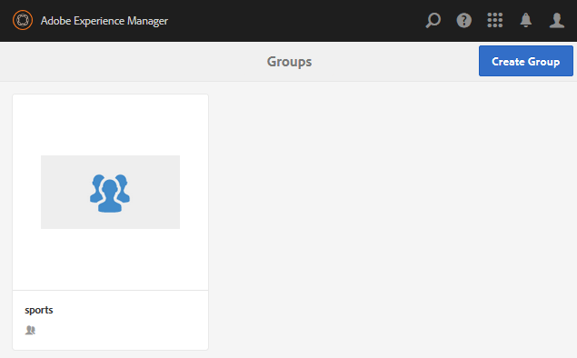

# Creación de grupos anidados {#authoring-nested-groups}

## Creación de grupos en el autor {#creating-groups-on-author}

En el autor, desde la navegación global

* Seleccione **[!UICONTROL Comunidades > Sitios]**
* Seleccione **[!UICONTROL carpeta de participación]** para abrirla
* Seleccione la tarjeta para el **[!UICONTROL Tutorial de introducción]** sitio en inglés
   * Seleccionar la imagen de la tarjeta
   * *no* seleccione un icono

El resultado es llegar a la [consola de grupos](groups.md):

La función de grupos se mostrará como una carpeta en la que se crearán las instancias de grupos. Seleccione la carpeta Grupos para abrirla. El grupo creado al publicar está visible.

## Crear grupo de artes principales {#create-main-arts-group}

Este grupo se puede crear porque la estructura del sitio para la participación incluye una función de grupo. La configuración de la función en el `Reference Template` del sitio permite la selección de cualquier plantilla de grupo habilitada. Por lo tanto, la plantilla elegida para este nuevo grupo será `Reference Group`.

Estas consolas son muy similares a la consola Sitios de comunidades.

* Seleccione **[!UICONTROL Crear grupo]**
* `1 Community Group Template`:
   * Título del grupo de la comunidad: Artes
   * Descripción del grupo de la comunidad: Un grupo de padres para varios grupos de artes.
   * Raíz del grupo de la comunidad: *dejar como predeterminado*
   * Idioma(s) adicional(s) disponible(s) del grupo de la comunidad:utilice el menú desplegable para seleccionar los idiomas disponibles del grupo de la comunidad. El menú muestra todos los idiomas en los que se crea el sitio de comunidad principal. Los usuarios pueden seleccionar entre estos idiomas para crear grupos en varias configuraciones regionales en este solo paso. El mismo grupo se crea en varios idiomas especificados en la consola Grupos de los respectivos sitios de la comunidad.
   * Nombre del grupo de la comunidad: artes
   * Plantilla: desplegable para seleccionar `Reference Group`
   * Seleccione `Next`

      

Continúe por los demás paneles con esta configuración:

* **2 Diseño**
   * Puede cambiar el diseño o permitir que el diseño del sitio principal sea el predeterminado
   * Seleccione **[!UICONTROL Siguiente]**
* **3 Configuración**
   * **Moderación**
      * Dejar vacío (heredar del sitio principal)
   * **Suscripción**
      * use predeterminado `Optional Membership`
   * **Miniatura**
      * `optional`
   * Seleccione `Next`
* Seleccione **[!UICONTROL Crear]**

### Anidado de grupos dentro del grupo de artes {#nesting-groups-within-arts-group}

La carpeta `groups` ahora debe contener dos grupos (puede que sea necesario actualizar la página).

#### Publicar grupo {#publish-group}

Antes de crear grupos anidados dentro del grupo `arts`, pase el ratón por encima de la tarjeta `arts` y seleccione el icono de publicación para publicarla.

Espere a que se confirme que se publicó el grupo.

El grupo `arts` también debe contener una carpeta `groups`, pero una carpeta vacía y en la que se pueden crear nuevos grupos. Vaya a la carpeta del grupo de artes y cree 3 grupos anidados, cada uno con una configuración de pertenencia diferente:

1. Visitante
   * Título: `Visual Arts`
   * Nombre: `visual`
   * Plantilla: `Reference Group`
   * Membresía: select `Optional Membership`
Un grupo público, abierto a todos los miembros
1. Auditorio
   * Título: `Auditory Arts`
   * Nombre: `auditory`
   * Plantilla: `Reference Group`
   * Membresía: select `Required Membership`
Un grupo abierto, disponible para que los miembros se unan

1. Historia

   * Título: `Art History`
   * Nombre: `history`
   * Plantilla: `Reference Group`
   * Membresía: select `Restricted Membership`
Un grupo secreto, visible sólo para los miembros invitados como ejemplo, invitar 
[usuario de demostración](tutorials.md#demo-users) `emily.andrews@mailinator.com`

Actualice la página para ver los tres grupos anidados (subcomunidades).

Si es necesario, para desplazarse a los grupos anidados desde la consola Sitios de comunidades:

* Seleccione **[!UICONTROL carpeta de participación]**
* Seleccione la tarjeta **[!UICONTROL Tutorial de introducción]**
* Seleccionar **[!UICONTROL carpeta Grupos]**
* Seleccionar **[!UICONTROL tarjeta de artes]**
* Seleccionar **[!UICONTROL carpeta Grupos]**

## Grupos de publicaciones {#publishing-groups}

Después de publicar el sitio de la comunidad principal, es necesario

* Publicar cada grupo individualmente
   * Esperando confirmación de que se publicó el grupo
* Publicar grupo principal antes de publicar cualquier grupo anidado en
   * Todos los grupos deben publicarse de manera vertical.

## Experiencia en publicación {#experience-on-publish}

Es posible experimentar los diferentes grupos al iniciar sesión, por ejemplo con los [usuarios de demostración](tutorials.md#demo-users) que se utilizan para

* Miembro del grupo Arte/Historia: emily.andrews@mailinator.com/password
   * El grupo restringido (secreto), arte/historia, será visible
   * Puede ver grupos opcionales (públicos)
   * Pueden unirse a grupos restringidos (abiertos)
* Administrador de grupos: aaron.mcdonald@mailinator.com/password
   * Puede ver grupos opcionales (públicos)
   * puede unirse a grupos restringidos (abiertos)
   * No se verán grupos restringidos (secretos)

Acceda a las consolas Comunidades [Miembros y Grupos](members.md) del autor para agregar otros usuarios a varios grupos de miembros que se correspondan con los grupos de la comunidad.
