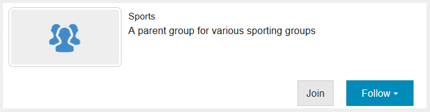

# Experiencia del sitio publicado {#experience-the-published-site}

>[!CAUTION]
>
>AEM 6.4 ha llegado al final de la compatibilidad ampliada y esta documentación ya no se actualiza. Para obtener más información, consulte nuestra [períodos de asistencia técnica](https://helpx.adobe.com/es/support/programs/eol-matrix.html). Buscar las versiones compatibles [here](https://experienceleague.adobe.com/docs/).

## Buscar nuevo sitio en la publicación {#browse-to-new-site-on-publish}

Ahora que se ha publicado el sitio de comunidades recién creado, vaya a la URL mostrada al crear el sitio, pero en el servidor de publicación, por ejemplo:

* URL de autor = http://localhost:4502/content/sites/engage/en.html
* URL de publicación = http://localhost:4503/content/sites/engage/en.html

Para minimizar la confusión sobre qué miembro ha iniciado sesión en el autor y en la publicación, se recomienda utilizar distintos navegadores para cada instancia.

Al llegar por primera vez al sitio publicado, el visitante del sitio no suele haber iniciado sesión y sería anónimo.

## http://localhost:4503/content/sites/engage/en.html {#http-localhost-content-sites-engage-en-html}

## Visitante anónimo del sitio {#anonymous-site-visitor}

Un visitante anónimo del sitio ve lo siguiente en la interfaz de usuario:

* Título del sitio. Tutorial sobre introducción
* Sin vínculo de perfil
* Ningún vínculo de mensajes
* Ningún vínculo de notificaciones
* Campo de búsqueda
* Iniciar sesión en el vínculo
* El banner de la marca
* Vínculos de menú para los componentes incluidos en la plantilla del sitio de referencia

Si selecciona varios vínculos, verá que están en modo de solo lectura.

## Impedir el acceso anónimo en JCR {#prevent-anonymous-access-on-jcr}

Una limitación conocida expone el contenido del sitio de la comunidad a visitantes anónimos a través del contenido jcr y json , aunque **permitir acceso anónimo** está desactivado para el contenido del sitio. Sin embargo, este comportamiento se puede controlar mediante restricciones de Sling como solución.

Para proteger el contenido del sitio de la comunidad del acceso de usuarios anónimos a través del contenido jcr y json , siga estos pasos:

1. En la instancia de AEM Author, vaya a https://&lt;host>:&lt;port>/editor.html/content/site/&lt;sitename>.html.

   >[!NOTE]
   >
   >No vaya al sitio localizado.

1. Vaya a **[!UICONTROL Propiedades de página]**.

   

1. Vaya a **[!UICONTROL Avanzadas]** pestaña .

   

1. Habilitar **[!UICONTROL Requisito de autenticación]**.
1. Añada la ruta de la página de inicio de sesión. Por ejemplo, `/content/......./GetStarted`.
1. Publique la página.

## Miembro de la comunidad de confianza {#trusted-community-member}

Esta experiencia supone [Aaron McDonald](tutorials.md#demo-users) se le asignaron las funciones de [administrador de la comunidad y moderador](create-site.md#roles). Si no es así, vuelva al entorno de creación a [modificar la configuración del sitio](sites-console.md#modifying-site-properties) y seleccione Aaron McDonald como administrador de la comunidad y moderador.

En la esquina superior derecha, seleccione `Log in`y firme con el nombre de usuario &quot;aaron.mcdonald@mailinator.com&quot; y la contraseña &quot;password&quot;. Tenga en cuenta la capacidad de iniciar sesión con credenciales de Twitter o Facebook.

Una vez que haya iniciado sesión, observe que hay un nuevo elemento de menú, `Administration`, que aparece porque al miembro se le asignó la función de moderador. Ahora, seleccionar varios vínculos es más interesante.

Observe que la página de calendario es la página principal porque la plantilla de sitio de referencia elegida incluyó primero la función de calendario, seguida de la función de flujo de actividad, la función de foro, etc. Esta estructura se puede ver en la sección [Plantilla del sitio](sites.md#edit-site-template) o al modificar las propiedades del sitio en el entorno de creación:

>[!NOTE]
>
>Para obtener más información sobre los componentes y funciones de Communities, visite
>
>* [Componentes de Communities](author-communities.md) (para autores)
>* [Componentes, funciones y características esenciales](essentials.md) (para desarrolladores)
>

## Vínculo del foro {#forum-link}

Para ver la función básica del foro, seleccione el vínculo Foro .

Los miembros pueden publicar un tema nuevo o seguir un tema.

Los visitantes del sitio pueden ver las publicaciones y ordenarlas de diversas maneras.

## Vínculo de grupos {#groups-link}

Dado que Aaron es administrador de grupos, la selección del vínculo Grupos permitirá a Aaron crear un nuevo grupo de comunidades seleccionando una plantilla de grupo, una imagen, si el grupo es abierto o secreto, e invitando a los miembros.

Este es un ejemplo de cómo se crea un grupo en el entorno de publicación.

Los grupos también se pueden crear en el entorno de creación y administrar dentro del sitio de la comunidad en el entorno de creación (el [Consola de grupos de la comunidad](groups.md)). La experiencia de [creación de grupos en author](nested-groups.md) es siguiente en este tutorial.

Crear un grupo de referencia:

1. Select **[!UICONTROL Nuevo grupo]**
1. **[!UICONTROL Ficha Configuración]**
   * Nombre del grupo: `Sports`
   * Descripción: `A parent group for various sporting groups`
   * Nombre de URL del grupo: `sports`
   * select `Open Group` (permitir que cualquier miembro de la comunidad participe mediante la unión)
1. **[!UICONTROL Ficha Plantilla]**
   * Select `Reference Group` (contiene una función de grupos en su estructura para permitir grupos anidados)
1. Select **[!UICONTROL Crear grupo]**

Una vez creado el nuevo grupo, **seleccione el nuevo grupo Deportes** para crear dos grupos (anidados) dentro de él. Como la estructura de un sitio no puede comenzar con la función de grupos, después de abrir el grupo Deportes, es necesario seleccionar el vínculo Grupos :

El segundo conjunto de vínculos, comenzando por `Blog`, pertenezcan al grupo seleccionado actualmente, la variable `Sports`grupo. Seleccionando los deportes&#39; `Groups` , es posible anidar dos grupos dentro del grupo de deportes.

Como ejemplo, agregue dos `ew groups.`

* Un nombre `Baseball`
   * Deje establecido como `Open Group` (pertenencia requerida)
   * En la ficha Plantillas, seleccione `Conversational Group`
* Un nombre `Gymnastics`
   * Cambie su configuración a `Member Only Group` (membresía restringida)
   * En la ficha Plantillas, seleccione `Conversational Group`

**Aviso**:

* Puede que sea necesario actualizar la página antes de que se muestren ambos grupos
* Esta plantilla *no *incluye la función de grupos, por lo que no es posible anidar más grupos
* Al autor, la variable [Consola Grupos](groups.md) ofrece una tercera opción: `Public Group` (abono opcional)

Una vez creados ambos grupos, seleccione el grupo de béisbol, un grupo abierto y observe sus enlaces: `Discussions` `What's New` `Members`
Los vínculos del grupo se muestran debajo de los vínculos del sitio principal y los resultados se muestran de la siguiente manera:

En el autor: con privilegios administrativos, vaya a la [Consola Grupos de comunidades](members.md) y agregue Weston McCall a la `Community Engage Gymnastics <uid> Members` grupo.

Continuando con la publicación, cierre la sesión como Aaron McDonald y vea los grupos en el grupo de deportes como un visitante anónimo del sitio:

* Desde la página de inicio
* Select `Groups`vínculo
* Select `Sports`vínculo
* Seleccione Sports&#39; `Groups`vínculo

Sólo el grupo de béisbol será visible.

Inicie sesión como Weston McCall (weston.mccall@dodgit.com / password) y navegue a la misma ubicación. Observe que Weston puede `Join` abrir `Baseball` grupo y `enter or Leave` privado `Gymnastics`grupo.

## Vínculo de página web {#web-page-link}

Para ver la página web básica incluida en el sitio, seleccione el vínculo Página web . Las herramientas AEM de creación estándar se pueden utilizar para añadir contenido a esta página en el entorno de creación.

Por ejemplo, vaya a **author** , abra el `engage` en la carpeta [Consola Sitios de Communities](sites-console.md), seleccione **Abrir sitio** para entrar al modo de edición de autor. A continuación, seleccione el modo de vista previa para seleccionar la variable `Web Page`vínculo y, a continuación, seleccione el modo de edición para añadir los componentes Título y Texto . Por último, vuelva a publicar solo la página o todo el sitio.

## Vínculo de administración {#administration-link}

Cuando el miembro de la comunidad tiene privilegios de moderación, el vínculo Administración será visible y, al seleccionarlo, se mostrará el contenido de la comunidad publicado y se permitirá que [moderado](moderate-ugc.md) de forma similar a la [consola de moderación](moderation.md) en el entorno de creación.

Utilice el botón Atrás del explorador para volver al sitio publicado. No se puede acceder a la mayoría de las consolas desde la navegación global en el entorno de publicación.

## Autoregistro {#self-registration}

Después de cerrar la sesión, es posible crear un nuevo registro de usuario.

* Seleccionar `Log In`
* Seleccionar `Sign up for a new account`

 

De forma predeterminada, la dirección de correo electrónico es el identificador de inicio de sesión. Si no está marcada, el visitante puede introducir su propio ID de inicio de sesión (nombre de usuario). El nombre de usuario debe ser único en el entorno de publicación.

Después de especificar el nombre, el correo electrónico y la contraseña del usuario, seleccione `Sign Up`creará el usuario y le permitirá firmarlo.

Una vez que haya iniciado sesión, la primera página presentada será su `Profile`, que pueden personalizar.

Si el miembro olvida su id de inicio de sesión, es posible recuperar si utiliza su dirección de correo electrónico.

