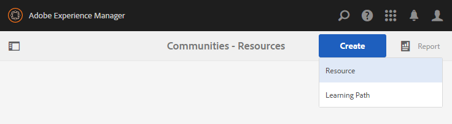

# Crear y asignar recursos de habilitación {#create-and-assign-enablement-resources}

>[!CAUTION]
>
>AEM 6.4 ha llegado al final de la compatibilidad ampliada y esta documentación ya no se actualiza. Para obtener más información, consulte nuestra [períodos de asistencia técnica](https://helpx.adobe.com/es/support/programs/eol-matrix.html). Buscar las versiones compatibles [here](https://experienceleague.adobe.com/docs/).

## Agregar un recurso de habilitación {#add-an-enablement-resource}

Para agregar un recurso de habilitación al nuevo sitio de la comunidad:

* En la instancia de autor
   * Por ejemplo, [http://localhost:4502/](http://localhost:4503/)
* Iniciar sesión como administrador del sistema
* En la navegación global, seleccione **Comunidades > [Recursos](resources.md)**

   
   
* Seleccione el sitio de la comunidad al que se añaden los recursos de habilitación
   * Seleccionar `Enablement Tutorial`
* En el menú , seleccione ` Create`
* Select **[!UICONTROL Recurso]**

### Información básica {#basic-info}

Complete la información básica del recurso:

* **[!UICONTROL Nombre del sitio]**: se establece en el nombre del sitio de comunidad seleccionado: Tutorial de habilitación
* **[!UICONTROL Nombre&amp;ast de recurso;]**: Lección de esquí 1
* **[!UICONTROL Etiquetas]**: Tutorial: Deportes / esquí
* **[!UICONTROL Mostrar en el catálogo]**: Activado
* **[!UICONTROL Descripción]**: Deslizar sobre la nieve para principiantes
* **[!UICONTROL Agregar imagen]**: Agregue una imagen para representar el recurso al miembro en la vista Asignaciones
   
* Seleccione **[!UICONTROL Siguiente]**

### Añadir contenido {#add-content}

Aunque aparece como si se pudieran seleccionar varios recursos, solo se permite uno.

Seleccione el `'+' icon`, en la esquina superior derecha, para comenzar el proceso de selección del recurso identificando el origen.

 

Cargar un recurso. Si se usa un recurso de vídeo, cargue una imagen personalizada para que se muestre antes de que se inicie la reproducción del vídeo o permita que se genere una miniatura a partir del vídeo (puede tardar unos minutos, no es necesario esperar).

* select **[!UICONTROL Siguiente]**

### Configuración {#settings}

* **[!UICONTROL Configuración social]**
Deje la configuración predeterminada para experimentar comentarios y clasificaciones de los recursos de habilitación por parte de los alumnos.
* **[!UICONTROL Fecha de vencimiento]**

   *(Opcional)* Se puede seleccionar una fecha en la que se debe completar la asignación.
* **[!UICONTROL Autor del medio]**

   *(Opcional)* Deje en blanco.
* **[!UICONTROL Contacto&amp;ast de recursos;]**

   *(Obligatorio)* Utilice el menú desplegable para seleccionar un miembro `Quinn Harper`.
* **[!UICONTROL Experto de medios]**

   *(Opcional)* Deje en blanco.
   **Nota**: si los usuarios o grupos no están visibles, compruebe que se añadieron al informe `Community Enable Members` grupo y *Guardado* en la instancia de publicación.
   
* Seleccione **[!UICONTROL Siguiente]**

### Asignaciones {#assignments}

* **[!UICONTROL Agregar usuarios asignados]**
Deje sin configurar, ya que este recurso de habilitación se agregará a una ruta de aprendizaje. Si se asigna un alumno al recurso de habilitación individual, así como a una ruta de aprendizaje que contenga el recurso de habilitación, el alumno se asignará dos veces al recurso de habilitación.

* Seleccione **[!UICONTROL Crear]**

La creación correcta del recurso vuelve a la consola Recursos con el recurso recién creado seleccionado. Desde esta consola, es posible publicar, añadir estudiantes y cambiar otras configuraciones.

Para cargar una nueva versión del recurso de habilitación, se recomienda crear un nuevo recurso y, a continuación, anular la inscripción de miembros de la versión antigua e inscribirlos en la nueva versión.

### Publicar el recurso {#publish-the-resource}

Antes de que los alumnos puedan ver el recurso asignado, debe publicarse:

* Seleccionar el mundo `Publish`icono

La activación se confirma con un mensaje de éxito:

## Agregar un segundo recurso de habilitación {#add-a-second-enablement-resource}

Repita los pasos anteriores para crear y publicar un segundo recurso de habilitación relacionado desde el que se creará una ruta de aprendizaje.

**Publicación** el segundo recurso.

Vuelva a la lista de tutoriales de habilitación de sus recursos.

*Sugerencia: si ambos recursos no están visibles, actualice la página.*

## Agregar una ruta de aprendizaje {#add-a-learning-path}

Una ruta de aprendizaje es una agrupación lógica de recursos de habilitación que forman un curso.

* En la consola Recursos, seleccione `+ Create`
* Select **[!UICONTROL Ruta de aprendizaje]**

Agregue la variable **[!UICONTROL Información básica]**:

* **[!UICONTROL Nombre de la ruta de aprendizaje]**: Lecciones de esquí
* **[!UICONTROL Etiquetas]**: Tutorial: Esquí
* **[!UICONTROL Mostrar en el catálogo]**: dejar sin marcar
* **[!UICONTROL Cargar una imagen]** para representar la ruta de aprendizaje en la consola Recursos

* Seleccione **[!UICONTROL Siguiente]**

Omita el panel siguiente, ya que no hay rutas de aprendizaje previas que añadir.

* Seleccione **[!UICONTROL Siguiente]**

En el panel Agregar recursos

* Select `+ Add Resources` para seleccionar los recursos de las 2 lecciones de esquí que se agregarán a la ruta de aprendizaje

   Nota: Solo **publicado** Los recursos se pueden seleccionar.

>[!NOTE]
>
>Solo puede seleccionar los recursos disponibles en el mismo nivel que la ruta de aprendizaje. Por ejemplo, para una ruta de aprendizaje creada en un grupo solo están disponibles los recursos de nivel de grupo; para una ruta de aprendizaje creada en un sitio de comunidad, los recursos de ese sitio están disponibles para añadirlos a la ruta de aprendizaje.

* Seleccione **[!UICONTROL Enviar]**.

 

* Seleccione **[!UICONTROL Siguiente]**

* **[!UICONTROL Agregar usuarios asignados]**
Utilice el menú desplegable para seleccionar la variable 
`Community Ski Class` grupo, que debería incluir miembros `Riley Taylor` y `Sidney Croft.`

* **[!UICONTROL Ruta de aprendizaje Contacto&amp;ast;]**

   *(Obligatorio)* Utilice el menú desplegable para seleccionar un miembro `Quinn Harper`.

* Seleccione **[!UICONTROL Crear]**

La creación correcta de la ruta de aprendizaje vuelve a la consola Recursos con la ruta de aprendizaje recién creada seleccionada. Desde esta consola, es posible publicar, añadir estudiantes y cambiar otras configuraciones.

**Publicación** la ruta de aprendizaje.
