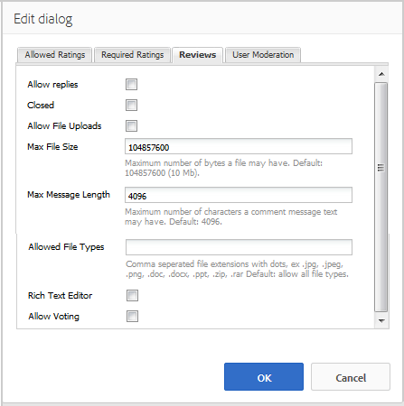

# Uso del resumen de revisiones y revisiones (visualización) {#using-reviews-and-reviews-summary-display}

>[!CAUTION]
>
>AEM 6.4 ha llegado al final de la compatibilidad ampliada y esta documentación ya no se actualiza. Para obtener más información, consulte nuestra [períodos de asistencia técnica](https://helpx.adobe.com/es/support/programs/eol-matrix.html). Buscar las versiones compatibles [here](https://experienceleague.adobe.com/docs/).

La variable `Reviews`es una composición de [ `Comments`](comments.md) y [ `Rating`](rating.md) componentes listos para su uso.

La variable `Reviews Summary (Display)` proporciona un resumen de una instancia activa o cerrada de un `Reviews` para mostrar en cualquier parte del sitio.

>[!NOTE]
>
>No se admite la publicación anónima de una revisión. Los visitantes del sitio deben registrarse (convertirse en miembros) e iniciar sesión para participar. El visitante que haya iniciado sesión puede actualizar su revisión en cualquier momento.

## Adición de una revisión a una página {#adding-a-review-to-a-page}

Para agregar un `Reviews` a una página en modo de autor, utilice el navegador de componentes para localizar `Communities / Reviews` y arrástrela a su lugar en una página, por ejemplo, una posición relativa a la función para que los usuarios la revisen.

Para obtener la información necesaria, visite [Conceptos básicos de los componentes de Communities](basics.md).

Cuando la variable [bibliotecas requeridas del lado del cliente](reviews-basics.md#essentials-for-client-side) se incluyen, así es como se muestra la variable `Reviews`aparecerá el componente.

## Configuración de revisiones {#configuring-reviews}

Seleccione la colocación `Reviews` para acceder y seleccionar el componente `Configure` que abre el cuadro de diálogo de edición.

En el **[!UICONTROL Clasificaciones permitidas]** especifique la lista completa de clasificaciones que se mostrarán a los miembros. La primera calificación debe ser general/general, ya que es la que proporciona la calificación media para la `Review Summary (Display)` componente. A las dos clasificaciones siguientes de la configuración predeterminada se les debe dar un título diferente, que no sea &quot;Subrating 1&quot; o &quot;Subrating 2&quot;.

* **[!UICONTROL Clasificaciones permitidas]**

   Lista de clasificaciones de las que puede elegir un miembro.

   Utilice la flecha arriba, la flecha abajo y los botones para eliminar para modificar las selecciones visibles.

   Haga clic en **[!UICONTROL Agregar elemento]** para añadir otra opción de clasificación.

En el **[!UICONTROL Clasificaciones requeridas]** , vuelva a introducir elementos de la lista de **[!UICONTROL Clasificaciones permitidas]** que deben clasificarse. Si un elemento solo se especifica en la ficha Clasificaciones permitidas , puede dejarse sin marcar cuando lo envíe el miembro.

En el sitio web, las clasificaciones requeridas se marcan con un asterisco. Si se requiere un elemento y se deja sin marcar, se mostrará un mensaje al miembro y se denegará el envío hasta que se marquen todas las clasificaciones requeridas.

* **[!UICONTROL Clasificaciones obligatorias]**

   Un subconjunto de clasificaciones permitidas que indica qué clasificaciones se requieren.

   Utilice la flecha arriba, la flecha abajo y los botones para eliminar para modificar las selecciones visibles.

   Haga clic en **[!UICONTROL Agregar elemento]** para añadir otra opción de respuesta.

>[!NOTE]
>
>Si se introduce un elemento en la variable **[!UICONTROL Clasificaciones requeridas]** que no se especifica en la pestaña **[!UICONTROL Clasificaciones permitidas]** , no se incluye en los elementos que se van a clasificar.

En el **[!UICONTROL Reseñas]** especifique cómo se gestionan las revisiones.

* **[!UICONTROL Permitir respuestas]**
Si está activada, permita que las respuestas a las revisiones se realicen. El valor predeterminado no está seleccionado.

* **[!UICONTROL Cerrado]**
Si se selecciona, el examen queda cerrado a nuevos exámenes y respuestas. El valor predeterminado no está seleccionado.

* **[!UICONTROL Permitir cargas de archivos]**
Si está activada, permita que los archivos adjuntos se carguen para su revisión. El valor predeterminado no está seleccionado.

* **[!UICONTROL Tamaño máximo del archivo]**
Solo relevante si **[!UICONTROL Permitir cargas de archivos]** está activada. Este campo limita el tamaño (en bytes) de un archivo cargado. El valor predeterminado es 10 MB.

* **[!UICONTROL Longitud máxima del mensaje]**
Número máximo de caracteres que se pueden introducir en el cuadro de texto. El valor predeterminado es de 4096 caracteres.

* **[!UICONTROL Tipos de archivo permitidos]**
Solo relevante si **[!UICONTROL Permitir cargas de archivos]** está activada. Lista de extensiones de archivo separados por coma con el separador &quot;punto&quot;. Por ejemplo: .jpg, .jpeg, .png, .doc, .docx, .pdf. Si se especifica algún tipo de archivo, no se permitirán los no especificados. El valor predeterminado no se especifica de forma que se permitan todos los tipos de archivo.

* **[!UICONTROL Editor de texto enriquecido]**
Si se selecciona, los anuncios se pueden introducir con marcado. El valor predeterminado no está seleccionado.

* **[!UICONTROL Permitir votación]**
Si está marcada esta opción, incluya la función Votación de un tema. El valor predeterminado no está seleccionado.

En el **[!UICONTROL Moderación del usuario]** especifique cómo se administran las revisiones publicadas. Para obtener más información, consulte [Moderación del contenido generado por el usuario](moderate-ugc.md).

* **[!UICONTROL Premoderación]**
Si se selecciona, las revisiones deben aprobarse antes de que aparezcan en un sitio de publicación. El valor predeterminado no está seleccionado.

* **[!UICONTROL Eliminar revisiones]**
Si se selecciona, el miembro que publicó la revisión tiene la capacidad de eliminarla. El valor predeterminado no está seleccionado.

* **[!UICONTROL Denegar revisiones]**
Si está marcada esta opción, permita que los moderadores denieguen las revisiones. El valor predeterminado no está seleccionado.

* **[!UICONTROL Cerrar/volver a abrir revisiones]**
Si se selecciona, permita que los moderadores cierren y vuelvan a abrir las revisiones. El valor predeterminado no está seleccionado.

* **[!UICONTROL Marcar revisiones]**
Si se selecciona, permita a los miembros marcar las revisiones como inadecuadas. El valor predeterminado no está seleccionado.

* **[!UICONTROL Lista de motivos del indicador]**
Si se selecciona, permita que los miembros elijan, desde una lista desplegable, el motivo por el que marcan una revisión como inapropiada. El valor predeterminado no está seleccionado.

* **[!UICONTROL Razón de marca personalizada]**
Si se selecciona, permita a los miembros introducir sus propios motivos para marcar una revisión como inapropiada. El valor predeterminado no está seleccionado.

* **[!UICONTROL Umbral de moderación]**
Introduzca el número de veces que los miembros deben marcar una revisión antes de que se notifique a los moderadores. El valor predeterminado es una sola vez (1).

* **[!UICONTROL Límite de marcado]**
Especifique el número de veces que se debe marcar una revisión antes de ocultarla de la vista pública. Este número debe ser bueno o igual que la variable **[!UICONTROL Umbral de moderación]**. El valor predeterminado es 5.

### Adición de un resumen de revisión (visualización) a una página {#adding-a-review-summary-display-to-a-page}

Para agregar un `Reviews Summary (Display)` a una página en modo de autor, busque el componente

* `Communities / Reviews Summary (Display)`

y arrástrela a su lugar en una página donde se mostrará un resumen de una revisión activa o cerrada.

Para obtener la información necesaria, visite [Conceptos básicos de los componentes de Communities](basics.md).

Cuando la variable [bibliotecas requeridas del lado del cliente](reviews-basics.md#essentials-for-client-side) se incluyen, así es como se muestra la variable `Reviews Summary (Display)`aparecerá el componente.

>[!NOTE]
>
>El &quot;Promedio&quot; refleja los votos del primer elemento que aparece en las pestañas Clasificación permitida de la revisión que se está resumiendo.

### Configuración del resumen de revisiones (visualización) {#configuring-reviews-summary-display}

Seleccione la colocación `Reviews Summary (Display)` para acceder y seleccionar el componente `Configure` que abre el cuadro de diálogo de edición.

En el **[!UICONTROL Resumen de revisión]** ficha

* `Review Path`

   introduzca o busque la instancia colocada del `reviews`para resumir, por ejemplo, si se añade a la página web del [Sitio de Geometrixx,](getting-started.md) la ruta sería:

   /content/sites/engagement/es/page/jcr:content/content/primary/review

* `Include histogram`

   Si está marcada esta opción, incluya la visualización de un gráfico de barras que indique cuántos de cada clasificación de estrellas hay en las revisiones que se resumen. El valor predeterminado no está seleccionado.

### Cambio a un tipo de revisión personalizado {#changing-to-a-custom-review-type}

El componente Revisiones utiliza el sistema de comentarios.

Al cambiar el tipo de recurso de comentario, el sistema de comentarios ya no generará una instancia de un comentario con el valor predeterminado, sino una instancia que los desarrolladores hayan personalizado (ampliado).

Una vez que se conozcan los tipos de recursos personalizados, introduzca [Modo de diseño](../../help/sites-authoring/default-components-designmode.md) y haga doble clic en la `Comments` para abrir un cuadro de diálogo con una pestaña adicional.

En el **[!UICONTROL Tipos de recurso]** especifique el resourceType personalizado para nuevas instancias de la pestaña `Comments or Voting`componentes:

* **[!UICONTROL Tipo de medio de comentario]**

   Vaya al resourceType de una extensión `comment`en /apps. Por ejemplo, `/apps/social/commons/components/hbs/comments/comment`. 

   Este recurso identifica el resourceType del UGC creado cuando un visitante publica un comentario.

* **[!UICONTROL Tipo de medio de votación]**

   Vaya al resourceType de una extensión `voting`en /apps. Por ejemplo, `/apps/social/components/hbs/voting`. 

   Este recurso identifica el tipo de recurso del UGC creado cuando un visitante publica una votación.

* **[!UICONTROL Tipo de recurso del sistema de comentarios]**

   Vaya al resourceType de una extensión `comments`(sistema de comentarios) en /apps. Dejar en blanco a menos que la plantilla de página [incluye dinámicamente](scf.md#add-or-include-a-communities-component) el sistema de comentarios en la secuencia de comandos subyacente en lugar de agregarse a la página como recurso (nodo comentarios). Para obtener más información, consulte [{{include}} helper](handlebars-helpers.md#include)

## Experiencia del visitante del sitio {#site-visitor-experience}

### Moderadores y administradores {#moderators-and-administrators}

Cuando el usuario que ha iniciado sesión tiene privilegios de moderador o administrador, puede realizar las tareas de moderación permitidas por la configuración del componente, independientemente de quién haya creado la revisión.

### Miembros {#members}

Cuando el visitante del sitio ha iniciado sesión, según la configuración, es posible que

* Publicar una nueva revisión
* Editar su propia revisión
* Eliminar su propia revisión
* Marcar los comentarios de revisión de otros

Solo se permite una clasificación por miembro. El miembro podrá cambiar su calificación en cualquier momento.

### Anónimo {#anonymous}

Los visitantes del sitio que no hayan iniciado sesión solo podrán leer las revisiones publicadas, traducirlas si son compatibles, pero no pueden añadir una clasificación ni una revisión, ni marcar los comentarios de revisión de otros.

## Información adicional {#additional-information}

Puede encontrar más información en la [Revisar elementos esenciales](reviews-basics.md) para desarrolladores.

Para moderar los comentarios publicados, consulte [Moderación del contenido generado por el usuario](moderate-ugc.md).

Para ver la traducción de los comentarios publicados, consulte [Traducción del contenido generado por el usuario](translate-ugc.md).
