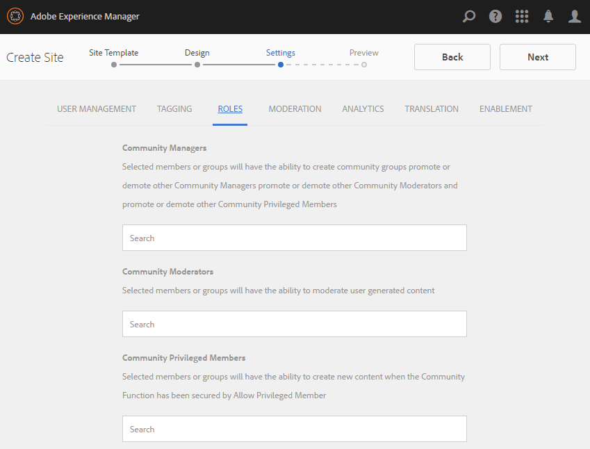
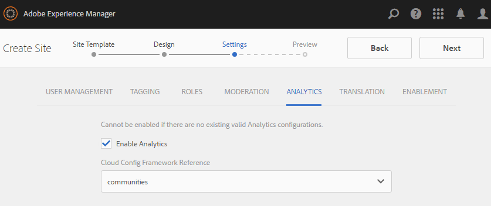
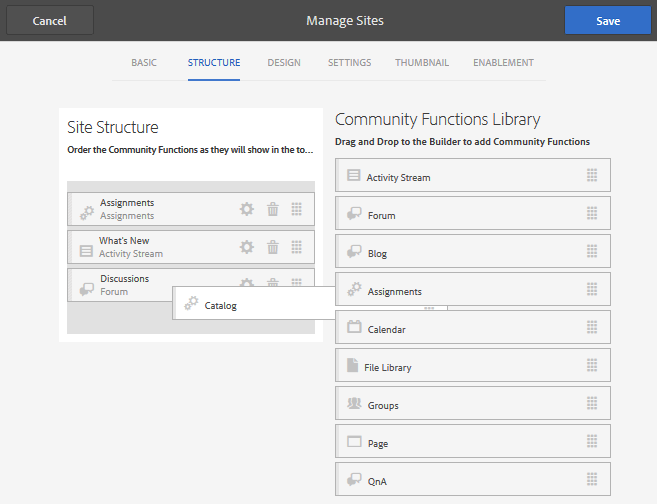

# Consola Sitios de comunidades {#communities-sites-console}

La consola Sitios de Communities proporciona acceso a:

* Creación de sitios
* Edición del sitio
* Administración del sitio
* [Creación y edición de grupos anidados](groups.md)  (subcomunidades)

Consulte [Introducción a AEM Communities](getting-started.md) para conocer la rapidez con la que se puede crear un sitio de comunidad en el entorno de creación, así como cómo crear grupos de comunidad a partir de los entornos de autor y publicación.

>[!NOTE]
>
>Los menús principales de Communities para la creación de [sitios de la comunidad](sites-console.md), [plantillas de sitios de la comunidad](sites.md), [plantillas de grupos de la comunidad](tools-groups.md) y [funciones de la comunidad](functions.md) solo se deben usar en el entorno de creación.

## Requisitos previos {#prerequisites}

Antes de crear un sitio de comunidad, es *obligatorio*:

* Asegúrese de que se estén ejecutando una o más instancias de publicación
* Habilite el [servicio de túnel](deploy-communities.md#tunnel-service-on-author) para administrar miembros y grupos de miembros
* Identifique el [publicador principal](deploy-communities.md#primary-publisher)
* [Configure la ](deploy-communities.md#replication-agents-on-author) replicación cuando el puerto del editor principal no sea el predeterminado (4503)

Una práctica recomendada para garantizar que el sitio esté preparado para admitir muchas funciones es realizar los siguientes pasos:

* Instale el [paquete de funciones más reciente](deploy-communities.md#latestfeaturepack)
* Habilitar [Adobe Analytics](analytics.md) para AEM Communities
* Configurar [correo electrónico](email.md)
* Identificación de [administradores de la comunidad](users.md#creating-community-members)
* [Habilitar el ](social-login.md#adobe-granite-oauth-authentication-handler) controlador OAuth para el inicio de sesión social

## Acceso a la consola Sitios de Communities {#accessing-communities-sites-console}

En el entorno de creación, para llegar a la consola Sitios de Communities:

* Desde la navegación global: **[!UICONTROL Comunidades > Sitios]**

La consola Sitios de comunidades muestra los sitios de la comunidad existentes. Desde esta consola, se pueden crear, editar, administrar y eliminar sitios de la comunidad.

Para crear un nuevo sitio de comunidad, seleccione el icono **Crear**.

Para acceder a un sitio de comunidad existente, con el fin de crear, modificar, publicar, exportar o agregar un grupo anidado, seleccione el icono de carpeta de los sitios.

Por ejemplo, la siguiente imagen muestra la consola principal Sitios de comunidades mostrando las carpetas de dos sitios de comunidad: [habilitar](getting-started-enablement.md) y [comprometer](getting-started.md):

## Creación de sitios {#site-creation}

La consola de creación de sitios proporciona un enfoque paso a paso para ensamblar características del sitio en función de una [plantilla de sitio de la comunidad](sites.md) y la configuración seleccionadas.

Todos los sitios creados incluyen una característica de inicio de sesión, ya que los visitantes del sitio deben iniciar sesión antes de poder anunciar contenido, enviar mensajes o participar en un grupo. Otras funciones incluidas son perfiles de usuario, mensajería, notificaciones, menú del sitio, búsqueda, temática y promoción de la marca.

El proceso se inicia seleccionando el botón `Create` situado en la parte superior de la consola Sitios de Communities.

El proceso de creación es una serie de pasos presentados como paneles que contienen un conjunto de funciones que se deben configurar (presentados como subpaneles). Es posible pasar al paso **Siguiente** o **Atrás** al paso anterior antes de comprometer el sitio en el paso final.

### Paso 1: Plantilla del sitio {#step-site-template}

En el panel Plantilla del sitio , se especifican el título, la descripción, la raíz del sitio, el idioma base, el nombre y la plantilla del sitio:

* **[!UICONTROL Título]** del sitio de la comunidad: Título que se muestra para el sitio.

   El título aparece en el sitio publicado, así como en la interfaz de usuario del administrador del sitio.

* **[!UICONTROL Descripción]** del sitio de la comunidad: Descripción del sitio.

   La descripción no aparece en el sitio publicado.

* **[!UICONTROL Raíz del sitio de la comunidad]**: La ruta raíz al sitio.

   La raíz predeterminada es `/content/sites`, pero la raíz puede moverse a cualquier ubicación dentro del sitio web.

* **[!UICONTROL Idioma]** base del sitio de la comunidad: (deje intacto para un solo idioma: Inglés) utilice el menú desplegable para elegir uno  *o* más idiomas de los idiomas disponibles: alemán, italiano, francés, japonés, español, portugués (Brasil), chino (tradicional) y chino (simplificado). Se creará un sitio de comunidad para cada idioma agregado y existirá dentro de la misma carpeta de sitio siguiendo la práctica recomendada descrita en [Traducción de contenido para sitios multilingües](../../help/sites-administering/translation.md). La página raíz de cada sitio contendrá una página secundaria denominada por el código de idioma de uno de los idiomas seleccionados, como &quot;en&quot; para inglés o &quot;fr&quot; para francés.

* **[!UICONTROL Nombre]** del sitio de la comunidad: El nombre de la página raíz del sitio que aparece en la dirección URL

   * Vuelva a comprobar el nombre porque no es fácil cambiarlo después de crear el sitio
   * La dirección URL base ( `https://*server:port/site root/site name*)`) se muestra debajo de `Community Site Name`
   * Para una URL válida, añada un código de idioma base + &quot;.html&quot;

      *Por ejemplo*, `http://localhost:4502/content/sites/mysight/en.html`

* **[!UICONTROL Sitio de la comunidad]** Templatemenu: Utilice el menú desplegable para elegir una plantilla [ de sitio de la ](tools.md)comunidad disponible.

Seleccione **[!UICONTROL Siguiente]**

### Paso 2: Diseño {#step-design}

El panel Diseño contiene 2 subpaneles para seleccionar el tema y el banner de marca:

#### TEMA DEL SITIO DE LA COMUNIDAD {#community-site-theme}

El marco de trabajo utiliza `Twitter Bootstrap` para llevar un diseño flexible y adaptable al sitio. Se puede seleccionar uno de los muchos temas del Bootstrap precargados para darle estilo a la plantilla del sitio de la comunidad seleccionada, o se puede cargar un tema del Bootstrap.

Cuando se selecciona, el tema se superpone con una marca de verificación azul opaca.

Una vez publicado el sitio de la comunidad, es posible [editar las propiedades](#modifying-site-properties) y seleccionar un tema diferente.

#### MARCA DE SITIOS DE LA COMUNIDAD {#community-site-branding}

La marca del sitio de la comunidad es una imagen que se muestra como un encabezado en la parte superior de cada página.

El tamaño de la imagen debe ser tan grande como la visualización esperada de la página en el explorador y 120 píxeles de altura.

Al crear o seleccionar una imagen, tenga en cuenta:

* La altura de la imagen se recortará a 120 píxeles medidos desde el borde superior de la imagen
* La imagen se fija en el borde izquierdo de la ventana del explorador
* No hay cambio de tamaño de la imagen, por lo que cuando el ancho de la imagen es...

   * Menos que el ancho del explorador, la imagen se repetirá horizontalmente
   * Bueno que el ancho del explorador, la imagen parece estar recortada

Seleccione **[!UICONTROL Siguiente]**.

### Paso 3: Configuración {#step-settings}

El panel Configuración contiene varios subpaneles que presentan las funciones que se deben configurar antes de pasar al último paso para crear el sitio.

* [ADMINISTRACIÓN DE USUARIOS](#user-management)
* [ETIQUETADO](#tagging)
* [FUNCIONES](#roles)
* [MODERACIÓN](#moderation)
* [ANALYTICS](#analytics)
* [TRADUCCIÓN](#translation)
* [HABILITACIÓN](#enablement)

>[!NOTE]
>
>**Habilitar el servicio de túnel**
>
>Varios subpaneles de Configuración permiten que la asignación de un miembro de confianza modere UGC, administre grupos o sea contacto para recursos de habilitación en el entorno de publicación.
>
>La convención es para que los [usuarios y grupos de usuarios](users.md) (miembros y grupos de miembros) del lado de publicación no se dupliquen en el entorno de creación.
>
>Por lo tanto, al crear el sitio de comunidad en el entorno de creación y asignar miembros de confianza a varias funciones, es necesario recuperar los datos de miembros del entorno de publicación.
>
>Esto se logra habilitando ` [AEM Communities Publish Tunnel Service](deploy-communities.md#tunnel-service-on-author)`para el entorno de creación.

#### ADMINISTRACIÓN DE USUARIOS {#user-management}

>[!NOTE]
>
>Se recomienda que los [sitios de la comunidad de habilitación](overview.md#enablement-community) sean privados (póngase en contacto con el representante de la cuenta para obtener más información).
>
>Un sitio de la comunidad es privado cuando se deniega el acceso a visitantes anónimos del sitio, es posible que no se registre por sí mismo y que no utilice el inicio de sesión en redes sociales.

* **[!UICONTROL Permitir el registro de usuarios]**

   Si se selecciona, los visitantes del sitio pueden convertirse en miembros de la comunidad mediante el registro propio.

   Si no está marcada, el sitio de la comunidad está *restringido* y los visitantes del sitio deben asignarse al grupo de miembros del sitio de la comunidad, realizar una solicitud o recibir una invitación por correo electrónico. Si no se selecciona, no se debe permitir el acceso anónimo.

   Desmarque un *privado* sitio de la comunidad. El valor predeterminado está marcado.

* **[!UICONTROL Permitir acceso anónimo]**

   Si se selecciona, el sitio de la comunidad está *abierto* y cualquier visitante del sitio puede acceder al sitio.

   Si no está marcada, solo los miembros con sesión iniciada pueden acceder al sitio.

   Desmarque un *privado* sitio de la comunidad. El valor predeterminado está marcado.

* **[!UICONTROL Permitir mensajes]**

   Si se selecciona, los miembros pueden enviarse mensajes entre sí y al grupo dentro del sitio de la comunidad.

   Si no se selecciona, la mensajería no está configurada para la comunidad.

   El valor predeterminado no está seleccionado.

* **[!UICONTROL Permitir inicios de sesión de redes sociales: Facebook]**

   Si está marcada esta opción, permita que los visitantes del sitio inicien sesión con sus credenciales de cuenta de Facebook. La [configuración de nube de Facebook](social-login.md#create-a-facebook-connect-cloud-service) seleccionada debe configurarse para agregar usuarios al grupo de miembros del sitio de la comunidad una vez que se haya creado el sitio de la comunidad.

   Si está desactivada, no se muestra ningún inicio de sesión de Facebook.

   Deje sin marcar un *privado* sitio de la comunidad. El valor predeterminado no está seleccionado.

* **[!UICONTROL Permitir inicios de sesión de redes sociales: Twitter]**

   Si está marcada esta opción, permita que los visitantes del sitio inicien sesión con sus credenciales de cuenta de Twitter. La [configuración de nube de Twitter](social-login.md#create-a-twitter-connect-cloud-service) seleccionada debe configurarse para agregar usuarios al grupo de miembros del sitio de la comunidad una vez que se haya creado el sitio de la comunidad.

   Si está desactivada, no se muestra ningún inicio de sesión de Twitter.

   Deje sin marcar un *privado* sitio de la comunidad. El valor predeterminado no está seleccionado.

>[!NOTE]
>
>**[!UICONTROL Permitir inicios de sesión sociales]**
>
>Aunque pueden existir configuraciones de Facebook y Twitter de ejemplo que se pueden seleccionar, para un [entorno de producción](../../help/sites-administering/production-ready.md), es necesario crear aplicaciones de Facebook y Twitter personalizadas. Consulte [Inicio de sesión social con Facebook y Twitter](social-login.md).

#### ETIQUETADO {#tagging}

Las etiquetas que se pueden aplicar al contenido de la comunidad se controlan seleccionando Espacios de nombres de etiquetas definidos previamente a través de la [Consola de etiquetado](../../help/sites-administering/tags.md#tagging-console).

Además, la selección de áreas de nombres de etiquetas para el sitio de la comunidad limita la selección presentada al definir catálogos y recursos. Consulte [Etiquetado de recursos de habilitación](tag-resources.md) para obtener información importante.

* Cuadro de búsqueda de texto: empiece a escribir para identificar las etiquetas permitidas para usar en el sitio

#### FUNCIONES {#roles}

Las [funciones de los miembros de la comunidad](users.md) se asignan con esta configuración.

Encontrar miembros de la comunidad es fácil mediante la búsqueda por tipo.

* **[!UICONTROL Administradores de la comunidad]**

   Comience a escribir para seleccionar uno o varios miembros de la comunidad o grupos de miembros que puedan administrar los miembros de la comunidad y los grupos de miembros.

* **[!UICONTROL Moderadores de la comunidad]**

   Comience a escribir para seleccionar uno o varios miembros de la comunidad o grupos de miembros de los que se debe confiar como moderadores del contenido generado por el usuario.

* **[!UICONTROL Miembros privilegiados de la comunidad]**

   Empiece a escribir para seleccionar uno o más miembros de la comunidad o grupos de miembros a los que se dará la capacidad de crear contenido nuevo cuando se haya seleccionado `Allow Privileged Member` para una [función de comunidad](functions.md).

#### MODERACIÓN {#moderation}

La configuración global para moderar el contenido generado por el usuario (UGC) se controla mediante esta configuración. Los componentes individuales tienen una configuración adicional para controlar la moderación.

* **[!UICONTROL Contenido con moderación previa]**

   Si se selecciona, el contenido de la comunidad publicado no aparecerá hasta que lo apruebe un moderador. El valor predeterminado no está seleccionado. Para obtener más información, consulte [Moderación del contenido de la comunidad](moderate-ugc.md#premoderation).

* **[!UICONTROL Umbral de indicación antes de ocultar el contenido]**

   Si es bueno que no sea 0, el número de veces que un tema o publicación debe marcarse antes de ocultarse a la vista del público. Si se establece en -1, el tema o la publicación marcados nunca se ocultan de la vista pública. El valor predeterminado es 5.

#### ANALYTICS {#analytics}

* **[!UICONTROL Activar Analytics]**

   Solo está disponible cuando Adobe Analytics ha sido [configurado](analytics.md) para las funciones de Communities.

   El valor predeterminado no está seleccionado. Cuando se selecciona, aparece un menú de selección adicional:

* **[!UICONTROL Referencia de la estructura de configuración de la nube]**

   En el menú desplegable, seleccione el marco de servicios de nube de Analytics configurado para este sitio de comunidad.

   `Communities`es el ejemplo del marco de la documentación de Configuración de  [Analytics para ](analytics.md#aem-analytics-framework-configuration) funciones de Communities.

#### TRADUCCIÓN {#translation}

* **[!UICONTROL Permitir]**
traducción automáticaCuando está activada (la opción predeterminada está desactivada), la traducción automática está habilitada para UGC dentro del sitio. Esto no afecta a ningún otro contenido, como el contenido de la página, aunque el sitio esté configurado como sitio multilingüe. Consulte [Traducción de contenido generado por el usuario](translate-ugc.md) para obtener información sobre cómo configurar un servicio de traducción con licencia para AEM Communities. Consulte [Traducción de contenido para sitios multilingües](../../help/sites-administering/translation.md) para obtener una descripción general completa.

* **[!UICONTROL Activar la traducción automática para los idiomas seleccionados]**

   Los idiomas habilitados para la traducción automática se configuran de forma predeterminada en la configuración del sistema especificada por la [configuración de integración de traducción](translate-ugc.md#translation-integration-configuration). Esta configuración predeterminada se puede anular para este sitio eliminando los valores predeterminados o seleccionando otros idiomas en el menú desplegable.

* **[!UICONTROL Seleccione un proveedor de traducciones]**

   De forma predeterminada, el proveedor de servicios es un servicio de prueba que utiliza `microsoft`solo para la demostración. Si no hay licencia de ningún proveedor de servicios de traducción, **Allow Machine Translation** debe desmarcarse.

* **[!UICONTROL Elegir almacén compartido global]**

   Para un sitio web con varias copias de idiomas, una tienda compartida global proporciona un único subproceso de conversación, visible desde cada copia de idioma. Esto se logra seleccionando uno de los idiomas incluidos como copia de idioma. El valor predeterminado es *Sin tienda compartida global*.

* **[!UICONTROL Elija la configuración del proveedor de traducciones]**

   Elija un [marco de integración de traducción](../../help/sites-administering/tc-tic.md) creado para el proveedor de traducción con licencia.

* **Seleccione las opciones de traducción del sitio de la comunidad**

   * **[!UICONTROL Traducir toda la página]**

      Si se selecciona, todo el UGC de una página se traduce al idioma base de la página.

      El valor predeterminado es *no seleccionado*.

   * **[!UICONTROL Traducir solo la selección]**

      Si se selecciona, aparece una opción de traducción al lado de cada anuncio que permite traducir anuncios individuales al idioma base de la página.

      El valor predeterminado es *seleccionado*.

* **Seleccione las opciones de persistencia**

   * **[!UICONTROL Traducir las contribuciones a petición del usuario y continuar en el futuro]**

      Si se selecciona, el contenido no se traduce hasta que se realiza una solicitud. Una vez traducida, la traducción se almacena en el repositorio.

      El valor predeterminado es *no seleccionado*.

   * **[!UICONTROL No continuar traduciendo]**

      Si se selecciona, las traducciones no se almacenan en el repositorio.

      Si no se selecciona, las traducciones se mantienen.

      El valor predeterminado es *no seleccionado*.

* **[!UICONTROL Renderización]**
inteligenteSeleccione una de las

   * `Always show contributions in the original language` (predeterminada)
   * `Always show contributions in user preferred language`
   * `Show contributions in user preferred language for only logged-in users`

#### HABILITACIÓN {#enablement}

La configuración `ENABLEMENT`es aplicable cuando la plantilla de sitio de la comunidad elegida incluye la [función de asignaciones](functions.md#assignments-function), que está disponible cuando las funciones de habilitación tienen licencia y [están configuradas](enablement.md). La plantilla de sitio de referencia que incluye la función de asignaciones es `Reference Structured Learning Site Template.`

* **[!UICONTROL Administradores de habilitación]**

   (obligatorio) Solo los miembros del grupo `Community Enablementmanagers` están disponibles para ser seleccionados para administrar esta comunidad de habilitación. Los administradores de habilitación son responsables de asignar miembros a los recursos. Consulte también [Administración de usuarios y grupos de usuarios](users.md).

* **[!UICONTROL ID de organización de Marketing Cloud]**

   (opcional) El ID de una licencia [Video Heartbeat Analytics](analytics.md#video-heartbeat-analytics).

Seleccione **[!UICONTROL Siguiente]**.

### Paso 4: Crear sitio de comunidades {#step-create-communities-site}

Si es necesario realizar algún ajuste, utilice el botón **Back** para hacerlo.

Una vez que **Create** se selecciona e inicia, no se puede interrumpir el proceso de creación del sitio.

Una vez creado el sitio:

* No se admite el cambio de la dirección URL (nombre de nodo)
* Los cambios futuros en la plantilla del sitio de la comunidad no afectarán al sitio de la comunidad creado
* La desactivación de la plantilla del sitio de la comunidad no afectará al sitio de la comunidad creado
* Es posible editar la [ESTRUCTURA](#modify-structure) de un sitio de comunidad modificando sus propiedades

Cuando el proceso termina, la carpeta del nuevo sitio se muestra en la consola Sitios de Communities, desde donde los autores pueden agregar contenido de página o los administradores pueden modificar las propiedades del sitio.

Para modificar un sitio de comunidad, seleccione su carpeta de proyecto para abrirlo:

Al pasar el ratón por encima de un sitio o tocar una tarjeta del sitio, aparecen iconos que permiten [editar el sitio en modo de autor](#authoring-site-content), [abrir las propiedades del sitio para modificarlo](#modifying-site-properties), [publicar el sitio](#publishing-the-site), [exportar el sitio](#exporting-the-site) y [eliminar el sitio](#deleting-the-site).

## Creación de contenido del sitio {#authoring-site-content}

El contenido de un sitio puede crearse con las mismas herramientas que cualquier otro sitio web AEM. Para abrir el sitio para la creación, seleccione el icono `Open Site` que aparece al pasar el ratón por el sitio. El sitio se abrirá en una pestaña nueva para que la consola Sitios de Communities siga siendo accesible.

>[!NOTE]
>
>Si no está familiarizado con AEM, consulte la documentación de [basic handling](../../help/sites-authoring/basic-handling.md) y una [guía rápida para la creación de páginas](../../help/sites-authoring/qg-page-authoring.md).

## Modificación de las propiedades del sitio {#modifying-site-properties}

Las propiedades de un sitio existente, especificadas durante el proceso de creación del sitio, se pueden modificar seleccionando el icono `Edit Site`que aparece al pasar el sitio con el ratón.

`Details of the following properties match the descriptions provided in the` [Creación ](#site-creation) del sitio .

### Modificar básico {#modify-basic}

El panel BASIC permite la modificación de

* Título del sitio de la comunidad
* Descripción del sitio de la comunidad

El nombre del sitio de la comunidad no podrá modificarse.

Elegir una plantilla de sitio de comunidad diferente no tendría ningún efecto en un sitio de comunidad existente, ya que no queda ninguna conexión entre plantillas y sitios.

En su lugar, se puede modificar la [ESTRUCTURA](#modify-structure) del sitio de la comunidad.

### Modificar estructura {#modify-structure}

El panel ESTRUCTURA permite modificar la estructura creada inicialmente a partir de la plantilla de sitio de la comunidad seleccionada. Desde el panel, es posible

* Arrastre y suelte [funciones de comunidad](functions.md) adicionales en la estructura del sitio
* En una instancia de una función de comunidad en la estructura del sitio:

   * **`gear icon`**

      editar la configuración, incluido el título para mostrar y el nombre y la dirección URL; último;

      así como [grupos de miembros privilegiados](users.md#privilegedmembersgroups)

   * **`trashcan icon`**

      quitar (eliminar) funciones de la estructura del sitio

   * **`grid icon`**

      modificar el orden de las funciones tal y como se muestra en la barra de navegación de nivel superior del sitio

>[!NOTE]
>
>Puede cambiar el orden de todas las funciones de la estructura del sitio, excepto la función de la parte superior. Por lo tanto, la página principal del sitio de comunidades no se puede cambiar.

>[!CAUTION]
>
>Aunque el título de visualización puede cambiarse sin efectos secundarios, no se recomienda editar el nombre de la URL de una función de comunidad que pertenece a un sitio de comunidad.
>
>Por ejemplo, cambiar el nombre de la URL no moverá el UGC existente, lo que tendrá el efecto de &quot;perder&quot; UGC.

>[!CAUTION]
>
>La función de grupos debe *no* ser la *primera ni la única* de la estructura del sitio.
>
>Cualquier otra función, como la [función de página](functions.md#page-function), debe incluirse y enumerarse primero.

#### Ejemplo: Adición de una función de catálogo a una estructura de sitio de comunidad {#example-adding-a-catalog-function-to-a-community-site-structure}

### Modificar diseño {#modify-design}

El panel DISEÑO permite aplicar un nuevo tema:

* [Tema del sitio de la comunidad](#community-site-theme)
* [Marca del sitio de la comunidad](#community-site-branding)
   * Desplácese hasta la parte inferior del panel para cambiar la imagen de marca

### Modificar configuración {#modify-settings}

El panel CONFIGURACIÓN permite acceder a la mayoría de los ajustes de los subpaneles de para el paso 3 de la creación del sitio de la comunidad:

* [Administración de usuarios](#user-management)
* [Etiquetas](#tagging)
* [Moderación](#moderation)
* [Funciones de miembro](#roles)
* [Análisis](#analytics)
* [Traducción](#translation)

### Modificar miniatura {#modify-thumbnail}

El panel MINIATURA permite cargar una imagen para representar el sitio en la consola Sitios de Communities.

### Modificar habilitación {#modify-enablement}

El panel ACTIVACIÓN permite acceder a la configuración proporcionada durante la creación del sitio de la comunidad.

Consulte la descripción [ENABLEMENT](#enablement).

## Publicación del sitio {#publishing-the-site}

Una vez que un sitio de comunidad se ha creado o modificado recientemente, es posible publicar (activar) el sitio seleccionando el icono `Publish Site` que aparece al pasar el ratón por encima del sitio.

Habrá una indicación después de que el sitio se publique correctamente.

### Publicación con grupos anidados {#publishing-with-nested-groups}

Después de publicar un sitio de comunidad, es necesario publicar individualmente cada subcomunidad (grupo anidado) creada mediante la [Consola de grupos](groups.md).

## Exportación del sitio {#exporting-the-site}

Seleccione el icono de exportación, al pasar el ratón por encima del sitio, para crear un paquete del sitio de la comunidad que esté almacenado en [administrador de paquetes](../../help/sites-administering/package-manager.md) y descargado.\
Tenga en cuenta que UGC no se incluye en el paquete del sitio.

## Eliminación del sitio {#deleting-the-site}

Para eliminar el sitio de la comunidad, seleccione el icono Eliminar sitio que aparece al pasar el ratón por encima del sitio en la Consola de sitio de Communities. Esta acción elimina todos los elementos asociados con el sitio, como UGC, grupos de usuarios, activos y registros de base de datos.

## Grupos de usuarios de la comunidad creada {#created-community-user-groups}

Una vez publicado el nuevo sitio de la comunidad, se crean nuevos grupos de miembros (los grupos de usuarios se crean en el entorno de publicación) que tienen los permisos adecuados establecidos para diversas funciones administrativas y de miembro.

El nombre creado para los grupos de miembros incluye el *nombre del sitio* dado al sitio en [Paso 1](#step13asitetemplate) (el nombre que aparece en la dirección URL), así como un ID único para evitar conflictos con sitios de la comunidad y grupos que tienen el mismo nombre del sitio para diferentes raíces del sitio de la comunidad.

Por ejemplo, si el nombre fuera &quot;Participación&quot; para un sitio titulado &quot;Tutorial de introducción&quot;, el grupo de usuarios para moderadores sería:

* Título: Moderadores de participación de la comunidad
* Nombre: community-*engagement-uid*-moderators

Tenga en cuenta que los miembros a los que se asignen funciones como moderadores o administradores de grupo durante la creación del sitio, se asignarán al grupo correspondiente y al grupo de miembros. Estos grupos y asignaciones de miembros se crean en la publicación cuando se publica el nuevo sitio.

Para obtener más información, consulte [Administración de usuarios y grupos de usuarios](users.md).

>[!NOTE]
>
>Si [Permitir inicio de sesión social: Facebook](#user-management) está habilitado una vez que el grupo de usuarios
>
>* community-*&lt;site-name>*-*&lt;uid>*-Members

se crea, el [servicio de nube de Facebook](social-login.md#createafacebookcloudservice) aplicado debe configurarse para agregar usuarios a este grupo.

## Configurar para error de autenticación {#configure-for-authentication-error}

De forma predeterminada, un sitio de la comunidad redireccionará a una página de inicio de sesión de ejemplo cuando el usuario introduzca las credenciales incorrectas y no inicie sesión. Este inicio de sesión de ejemplo no estará presente en un [servidor de producción](../../help/sites-administering/production-ready.md).

Para redireccionar correctamente, una vez que un sitio se ha configurado y se ha insertado para publicar, complete estos pasos para obtener el error de autenticación para redirigir al sitio de la comunidad:

* En cada instancia de publicación AEM
* Iniciar sesión por primera vez con privilegios de administrador
* Acceda a la [Consola Web](../../help/sites-deploying/configuring-osgi.md)
   * Por ejemplo, [http://localhost:4503/system/console/configMgr](http://localhost:4503/system/console/configMgr)

* Localizar `Adobe Granite Login Selector Authentication Handler`
* Seleccione el icono `pencil`para abrir la configuración y editarla
* Introduzca **[!UICONTROL Login Page Mappings]** de la siguiente manera:

   `/content/sites/<site-name>/path/to/login/page:/content/sites/<site-name>`

   por ejemplo:

   `/content/sites/engage/en/signin:/content/sites/engage/en`

* Seleccione **[!UICONTROL Guardar]**

### Redirección de autenticación de prueba {#test-authentication-redirection}

En la misma instancia de publicación AEM configurada con una asignación de página de inicio de sesión para el sitio de la comunidad:

* Vaya a la página de inicio del sitio de la comunidad
   * Por ejemplo, [http://localhost:4503/content/sites/engage/en.html](http://localhost:4503/content/sites/engage/en.html)

* Seleccionar Cerrar sesión
* Seleccionar inicio de sesión
* Escriba credenciales obviamente incorrectas, como el nombre de usuario &quot;x&quot; y la contraseña &quot;x&quot;
* La página de inicio de sesión debe mostrarse con un error de &quot;inicio de sesión no válido&quot;

## Acceso a sitios de la comunidad desde la consola Sitios principales {#accessing-community-sites-from-main-sites-console}

Desde la consola de navegación global Sitios, los sitios de la comunidad se encuentran en la carpeta `Community Sites`.

Aunque es posible acceder a un sitio de la comunidad de esta manera, para tareas administrativas, se debe acceder al sitio de la comunidad desde la consola Sitios de Communities.

