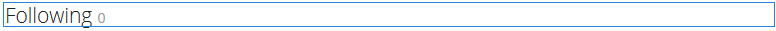

# Uso del gráfico social {#using-social-graph}

>[!CAUTION]
>
>AEM 6.4 ha llegado al final de la compatibilidad ampliada y esta documentación ya no se actualiza. Para obtener más información, consulte nuestra [períodos de asistencia técnica](https://helpx.adobe.com/es/support/programs/eol-matrix.html). Buscar las versiones compatibles [here](https://experienceleague.adobe.com/docs/).

## Introducción {#introduction}

La capacidad de un miembro de la comunidad para seguir [actividades](activities.md) además de ser seguido, se establece mediante dos componentes: `Follow`y `Following`.

La variable `Follow`debe asociarse con otro recurso, y esta asociación ya está establecida para miembros de la comunidad y características.

La variable `Following`simplemente enumera los miembros que siguen al miembro actual o a los que sigue el miembro actual. Este gráfico social de las relaciones entre miembros se incluye en el perfil de usuario establecido para un [sitio de la comunidad](overview.md#communitiessites).

## Adición de lo siguiente a una página {#adding-following-to-a-page}

Si desea agregar un `Following`a una página en modo de autor, busque el componente `Communities / Following` y arrástrela a su lugar en una página donde debería aparecer el gráfico social.

Para obtener la información necesaria, visite [Conceptos básicos de los componentes de Communities](basics.md).

Cuando la variable [bibliotecas requeridas del lado del cliente](essentials-socialgraph.md#essentials-for-client-side) se incluyen, así es como se muestra la variable `Following` aparecerá el componente:

## Configuración de lo siguiente {#configuring-following}

Actualmente, es necesario establecer la propiedad para determinar si el componente muestra la variable `follows`o `following`relación.

## Información adicional {#additional-information}

Puede encontrar más información en la [Social Graph Essentials](essentials-socialgraph.md) para desarrolladores.
