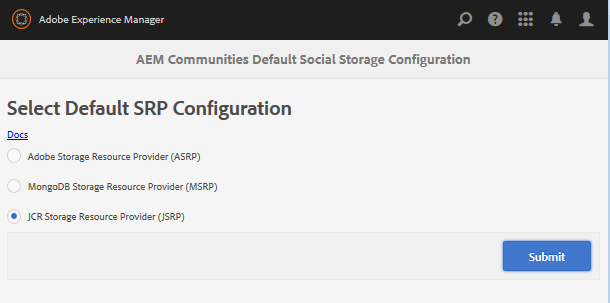

# Configuración de almacenamiento {#storage-configuration}

>[!CAUTION]
>
>AEM 6.4 ha llegado al final de la compatibilidad ampliada y esta documentación ya no se actualiza. Para obtener más información, consulte nuestra [períodos de asistencia técnica](https://helpx.adobe.com/es/support/programs/eol-matrix.html). Buscar las versiones compatibles [here](https://experienceleague.adobe.com/docs/).

La configuración del almacenamiento es la forma de identificar el almacenamiento elegido para el contenido de la comunidad, también conocido como contenido generado por el usuario (UGC).

Esta configuración informa al código de AEM Communities de qué implementación del proveedor de recursos de almacenamiento (SRP) se utilizará al acceder a UGC y debe reflejar la topología establecida cuando se implementó AEM.

Para consultar las opciones de almacenamiento y las topologías de implementación, visite

* [Almacenamiento de contenido de la comunidad](working-with-srp.md)
* [Topologías recomendadas](topologies.md)

## Consola de configuración de almacenamiento {#storage-configuration-console}

En el entorno de creación, para llegar a la consola de configuración de almacenamiento

* Desde la navegación global: **[!UICONTROL Herramientas > Comunidades > Configuración de almacenamiento]**

Para seleccionar una opción de almacenamiento que no sea el JCR predeterminado:

* seleccionar una opción
* Configure correctamente

   * Consulte los detalles para [selección de MSRP](msrp.md#select-msrp)
   * Consulte los detalles para [seleccionar DSRP](dsrp.md#select-dsrp)
   * Consulte los detalles para [seleccionar ASRP](asrp.md#select-asrp)

* Seleccione **[!UICONTROL Enviar]**

### Acerca del almacenamiento JCR {#about-jcr-storage}

Tenga en cuenta que si no se realiza ninguna selección, el valor predeterminado es el repositorio AEM, JCR.

JCR es *not* una tienda común compartida por los entornos de autor y publicación. El contenido de la comunidad solo será visible desde el entorno de creación o publicación en el que se creó.

Visita [Almacenamiento JCR](jsrp.md) para obtener más información.

>[!NOTE]
>
>La ausencia del nodo `srpc`under `/etc/socialconfig` indica el valor predeterminado [Almacén JCR](jsrp.md).
