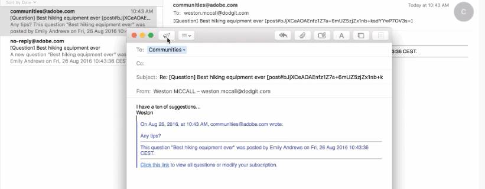
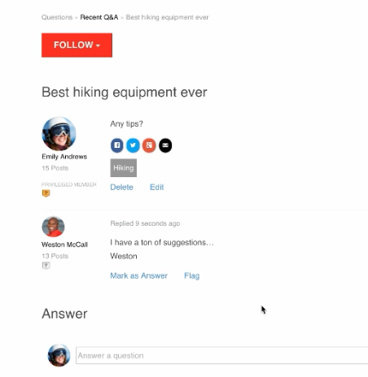

# Suscripciones de Communities {#communities-subscriptions}

>[!CAUTION]
>
>AEM 6.4 ha llegado al final de la compatibilidad ampliada y esta documentación ya no se actualiza. Para obtener más información, consulte nuestra [períodos de asistencia técnica](https://helpx.adobe.com/es/support/programs/eol-matrix.html). Buscar las versiones compatibles [here](https://experienceleague.adobe.com/docs/).

## Información general {#overview}

Como comunidades [FP1](deploy-communities.md#latestfeaturepack), los miembros de la comunidad pueden interactuar con la comunidad por correo electrónico con una función denominada como suscripciones.

Las suscripciones son similares a [notificaciones](notifications.md) como miembros pueden suscribirse a los artículos de blog, temas de foro o preguntas de control de calidad.

Lo que distingue las suscripciones de las notificaciones es:

* Los Miembros no podrán suscribirse si se sigue a otros miembros
* La única acción que deben realizar los miembros es seleccionar `Email Subscriptions` cuando:
* Cuando se configura la respuesta por correo electrónico, los miembros pueden publicar contenido simplemente respondiendo al correo electrónico recibido

### Requisitos  {#requirements}

**Configurar correo electrónico**

El correo electrónico debe configurarse para que las suscripciones funcionen y para que los miembros respondan por correo electrónico.

Para obtener instrucciones sobre la configuración del correo electrónico, consulte [Configuración del correo electrónico](email.md).

**Habilitar suscripciones y seguir**

Los componentes deben configurarse para habilitar las suscripciones *y* a continuación. Funciones que permiten suscripciones [blog](blog-feature.md), [foro](forum.md) y [QnA](working-with-qna.md).

## Suscripciones de lo siguiente {#subscriptions-from-following}

La variable **Seguir** proporciona un medio para seguir entradas como actividades, suscripciones o notificaciones. Cada vez que se usa la variable **Seguir** está seleccionado, es posible activar o desactivar una selección.

Si se selecciona cualquier método de seguimiento, el texto del botón cambia a **A continuación**. Para mayor comodidad, es posible seleccionar `Unfollow All` para desactivar todos los métodos.

La variable **Seguir** incluirá `Email Subscriptions` solo cuando un foro, control de calidad o blog está configurado para habilitar suscripciones de correo electrónico. Aparecerá este botón

* En la página de características principal del foro, control de calidad o blog habilitados

   * Enviará un correo electrónico para todas las actividades relacionadas con esa función

* Para una entrada específica, como un tema de foro, una pregunta de control de calidad o un artículo de blog

   * Enviará un correo electrónico cuando haya actividad para esa entrada específica

## Responder por correo electrónico {#reply-by-email}

Cuando el correo electrónico es [configurado para responder por correo electrónico](email.md#configure-polling-importer), el miembro que se haya suscrito recibirá un correo electrónico con el contenido publicado y un vínculo al contenido en línea.

Si responden al correo electrónico, el contenido que introduzcan en la respuesta aparecerá como contenido en línea.

La cantidad de tiempo que se tarda en publicar una respuesta está controlada por la variable [intervalo de actualización del importador de encuestas](email.md#configure-polling-importer).

