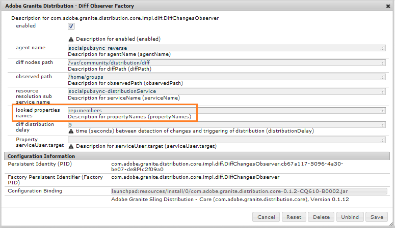

# Sincronización de usuarios de Communities {#communities-user-synchronization}

>[!CAUTION]
>
>AEM 6.4 ha llegado al final de la compatibilidad ampliada y esta documentación ya no se actualiza. Para obtener más información, consulte nuestra [períodos de asistencia técnica](https://helpx.adobe.com/es/support/programs/eol-matrix.html). Buscar las versiones compatibles [here](https://experienceleague.adobe.com/docs/).

## Introducción {#introduction}

En AEM Communities, desde el entorno de publicación (según los permisos configurados), *visitantes del sitio* puede convertirse en *miembros*, crear *grupos de usuarios* y editar sus *perfil de miembro*.

*Datos de usuario* es un término que se utiliza para hacer referencia a *usuarios*, *perfiles de usuario* y *grupos de usuarios*.

*Miembros* es un término que se utiliza para hacer referencia a *usuarios* registrado en el entorno de publicación, a diferencia de los usuarios registrados en el entorno de creación.

Para obtener más información sobre los datos de usuario, visite [Administración de usuarios y grupos de usuarios](users.md).

## Sincronización de usuarios en un conjunto de servidores de publicación {#synchronizing-users-across-a-publish-farm}

Por diseño, los datos de usuario creados en el entorno de publicación no aparecen en el entorno de creación.

La mayoría de los datos de usuario creados en el entorno de creación están pensados para permanecer en el entorno de creación y no se sincronizan ni replican para publicar instancias.

Cuando la variable [topología](topologies.md) es [publicar granja](../../help/sites-deploying/recommended-deploys.md#tarmk-farm), el registro y las modificaciones realizadas en una instancia de publicación deben sincronizarse con otras instancias de publicación. Los miembros deben poder iniciar sesión y ver sus datos en cualquier nodo de publicación.

Cuando la sincronización de usuarios está habilitada, los datos de usuario se sincronizan automáticamente en las instancias de publicación de la granja.

### Instrucciones de configuración de sincronización de usuarios {#user-sync-setup-instructions}

Para obtener instrucciones detalladas paso a paso sobre cómo habilitar la sincronización en un conjunto de servidores de publicación, consulte

* [Sincronización de usuarios](../../help/sites-administering/sync.md)

## Sincronización de usuarios en segundo plano  {#user-sync-in-the-background}


* **Paquete VLT**: es un archivo zip de todos los cambios realizados en un publicador, que debe distribuirse entre los editores. Los cambios en un publicador generan eventos que selecciona el detector de eventos de cambio. Esto crea un paquete vlt que contiene todos los cambios.

* **Paquete de distribución**: contiene información de distribución para Sling. Esa es información sobre dónde debe distribuirse el contenido y cuándo se distribuyó por última vez.

## Qué sucede cuando... {#what-happens-when}

### Publicar sitio desde la consola Sitios de Communities {#publish-site-from-communities-sites-console}

Al autor, cuando se publica un sitio de la comunidad desde el [Consola Sitios de Communities](sites-console.md), el efecto es [replicar](../../help/sites-deploying/configuring.md#replication-reverse-replication-and-replication-agents) las páginas asociadas y Sling distribuyen los grupos de usuarios de la comunidad creados dinámicamente, incluida su pertenencia.

### El usuario se crea o edita el perfil en la publicación {#user-is-created-or-edits-profile-on-publish}

Por diseño, los usuarios y perfiles creados en el entorno de publicación (por ejemplo, mediante registro propio, inicio de sesión social, autenticación LDAP) no aparecen en el entorno de creación.

Cuando la topología es un [publicar granja](topologies.md) y la sincronización de usuarios se ha configurado correctamente, la variable *usuario* y *perfil de usuario* se sincroniza en la granja de publicación mediante la distribución Sling.

### Se crea un nuevo grupo de comunidad en Publicar {#new-community-group-is-created-on-publish}

Aunque se inicia desde una instancia de publicación, la creación del grupo de comunidad, que da como resultado páginas de sitio nuevas y un grupo de usuarios nuevo, se produce en la instancia de autor.

Como parte del proceso, las nuevas páginas del sitio se replican en todas las instancias de publicación. El grupo de usuarios de la comunidad creado dinámicamente y su pertenencia a Sling se distribuyen en todas las instancias de publicación.

### Los usuarios o grupos de usuarios se crean mediante la Consola de seguridad {#users-or-user-groups-are-created-using-security-console}

Por diseño, los datos de usuario creados en el entorno de publicación no aparecen en el entorno de creación y viceversa.

Cuando la variable [Administración de usuarios y seguridad](../../help/sites-administering/security.md) se utiliza para agregar nuevos usuarios en el entorno de publicación, la sincronización de usuarios sincroniza a los nuevos usuarios y su pertenencia a grupos con otras instancias de publicación, si es necesario. La sincronización de usuarios también sincronizará los grupos de usuarios creados mediante la consola de seguridad.

### Publicaciones de usuario de contenido al publicar {#user-posts-content-on-publish}

Para el contenido generado por el usuario (UGC), se accede a los datos introducidos en una instancia de publicación a través de la variable [SRP configurado](srp-config.md).

## Prácticas recomendadas {#bestpractices}

De forma predeterminada, la sincronización de usuarios es **disabled**. Habilitar la sincronización de usuarios implica modificar *existente* Configuraciones de OSGi. No se deben agregar nuevas configuraciones como resultado de habilitar la sincronización de usuarios.

La sincronización de usuarios depende del entorno de creación para administrar las distribuciones de datos de usuario, aunque los datos de usuario no se creen en el autor .

**Requisitos previos**

1. Si los usuarios y grupos de usuarios ya se han creado en un publicador, se recomienda [sincronizar manualmente](../../help/sites-administering/sync.md#manually-syncing-users-and-user-groups) los datos de usuario se envían a todos los editores antes de configurar y habilitar la sincronización de usuarios.

   Una vez habilitada la sincronización de usuarios, solo se sincronizan los usuarios y grupos recién creados.

1. Asegúrese de que se ha instalado el código más reciente:

   * [AEM actualizaciones de la plataforma](https://helpx.adobe.com/es/experience-manager/kb/aem62-available-hotfixes.html)
   * [Actualizaciones de AEM Communities](deploy-communities.md#latestfeaturepack)

Las siguientes configuraciones son necesarias para habilitar la sincronización de usuarios en AEM Communities. Asegúrese de que estas configuraciones son correctas para evitar que la distribución de contenido de sling falle.

### Agente de distribución Apache Sling: fábrica de agentes de sincronización {#apache-sling-distribution-agent-sync-agents-factory}

Esta configuración busca el contenido que se va a sincronizar entre los editores. La configuración está en la instancia de autor. El autor debe realizar un seguimiento de todos los editores que están allí y dónde sincronizar toda la información.

Los valores predeterminados de la configuración son para una sola instancia de publicación. Como la sincronización de usuarios es útil para sincronizar varias instancias de publicación, como para un conjunto de publicaciones, es necesario agregar instancias de publicación adicionales a la configuración.

**¿Cómo se sincroniza el contenido?**

La instancia de autor indica el extremo de exportador de los editores. Cada vez que se crea o actualiza un usuario en editores específicos (n), el Autor obtiene el contenido de los puntos finales de sus exportadores y [inserta el contenido](sync.md#main-pars-image-1413756164) a otros editores (n-1, que está separado de los editores desde los que se obtiene el contenido).

<!--This section used to be an accordion until converted to straight Markdown. When accordions are enabled, revert-->

### Para configurar la configuración de los agentes de sincronización de Apache Sling

En AEM instancia de autor:

1. Inicie sesión con privilegios de administrador.
1. Acceda a la [Consola web](https://helpx.adobe.com/experience-manager/6-4/sites/deploying/using/configuring-osgi.html).

   Por ejemplo, [http://localhost:4502/system/console/configMgr](http://localhost:4502/system/console/configMgr).
1. Localizar **[!UICONTROL Agente de distribución Apache Sling: fábrica de agentes de sincronización]**.

   * Seleccione la configuración existente para abrirla y editarla (icono de lápiz).
   * Verificar nombre: **`socialpubsync`.**
   * Seleccione el **[!UICONTROL Habilitado]** casilla de verificación.
   * Select **[!UICONTROL Uso de varias colas]**.
   * Especifique **[!UICONTROL Puntos finales del exportador]** y **[!UICONTROL Puntos finales del importador]** (puede agregar más extremos de exportador e importador).

      Estos puntos finales definen de dónde desea obtener el contenido y desde dónde desea insertar el contenido. El autor obtiene el contenido del extremo del exportador especificado y lo envía a los editores (distintos del editor desde el que obtuvo el contenido).
   

### Distribución de Adobe Granite: proveedor secreto de transporte de contraseña cifrada {#adobe-granite-distribution-encrypted-password-transport-secret-provider}

Permite al autor identificar al usuario autorizado como si tuviera permiso para sincronizar datos de usuario de autor a publicación.

La variable [usuario autorizado creado](../../help/sites-administering/sync.md#createauthuser) en todas las instancias de publicación ayuda a los editores a conectarse con el autor y a configurar la distribución de Sling en el autor. Este usuario autorizado tiene todos los requisitos [ACL](../../help/sites-administering/sync.md#howtoaddacl).

Siempre que se vayan a instalar o recuperar datos de editores, el autor se conectará con los editores mediante las credenciales (nombre de usuario y contraseña) establecidas en esta configuración.

<!--This section used to be an accordion until converted to straight Markdown. When accordions are enabled, revert-->

### Para conectar el autor con editores mediante un usuario autorizado

En AEM instancia de autor:

1. Inicie sesión con privilegios de administrador.
1. Acceda a la [Consola web](../../help/sites-deploying/configuring-osgi.md).

   Por ejemplo, [http://localhost:4502/system/console/configMgr](http://localhost:4502/system/console/configMgr).
1. Localizar **[!UICONTROL Distribución de Adobe Granite: proveedor secreto de transporte de contraseña cifrada]**.
1. Seleccione la configuración existente para abrirla y editarla (icono de lápiz).

   Verificar propiedad `name:` **`socialpubsync`\- `publishUser` .**
1. Configure el nombre de usuario y la contraseña en la variable [usuario autorizado](../../help/sites-administering/sync.md#createauthorizeduser).

   Por ejemplo, **`usersync`\-admin**

   

### Agente de distribución Apache Sling: fábrica de agentes de cola {#apache-sling-distribution-agent-queue-agents-factory}

Esta configuración se utiliza para configurar los datos que desea sincronizar entre editores. Cuando los datos se crean o actualizan en rutas especificadas en **[!UICONTROL Raíces permitidas]**, se activa &quot;var/community/distribution/diff&quot; y el replicador creado recupera los datos de un publicador y los instala en otros editores.

<!--This section used to be an accordion until converted to straight Markdown. When accordions are enabled, revert-->

### Para configurar los datos (rutas de nodos) para sincronizar

En AEM instancia de publicación:

1. Inicie sesión con privilegios de administrador.
1. Acceda a la [Consola web](https://helpx.adobe.com/experience-manager/6-4/sites/deploying/using/configuring-osgi.html).

   Por ejemplo, [http://localhost:4503/system/console/configMgr](http://localhost:4503/system/console/configMgr).
1. Localizar **[!UICONTROL Agente de distribución Apache Sling: fábrica de agentes de cola]**.
1. Seleccione la configuración existente para abrirla y editarla (icono de lápiz).

   Comprobar nombre: `socialpubsync` \-inverso.
1. Seleccione el **[!UICONTROL Habilitado]** y guarde.
1. Especifique las rutas de nodos que se van a replicar en **[!UICONTROL Raíces permitidas]**.
1. Repetir para cada `publish` instancia.

   

### Distribución de Adobe Granite - Fábrica de Observadores de Diff {#adobe-granite-distribution-diff-observer-factory}

Esta configuración sincroniza la pertenencia a grupos entre editores.\
Si al cambiar la pertenencia a un grupo en un publicador no se actualiza su pertenencia a otros editores, asegúrese de que **ref:Members** se añade a **nombres de propiedades miradas**.

<!--This section used to be an accordion until converted to straight Markdown. When accordions are enabled, revert-->

### Para garantizar la sincronización de miembros

En cada instancia de publicación AEM:

1. Inicie sesión con privilegios de administrador.
1. Acceda a la [Consola web](https://helpx.adobe.com/experience-manager/6-4/sites/deploying/using/configuring-osgi.html).

   Por ejemplo, [http://localhost:4503/system/console/configMgr](http://localhost:4503/system/console/configMgr).
1. Localizar **[!UICONTROL Distribución de Adobe Granite - Fábrica de Observadores de Diff]**.
1. Seleccione la configuración existente para abrirla y editarla (icono de lápiz).

   Verificar **[!UICONTROL nombre del agente]**: `socialpubsync` \-reverse&amp;ast;&amp;ast;..
1. Seleccione el **[!UICONTROL Habilitado]** casilla de verificación.
1. Especifique **rep`:members`** como `description` para propertyName en **[!UICONTROL nombres de propiedades miradas]** y Guardar.

   

### Déclencheur de distribución de Apache Sling: fábrica de Déclencheur programados {#apache-sling-distribution-trigger-scheduled-triggers-factory}

Esta configuración le permite configurar el intervalo de sondeo (después del cual el autor hace ping y extrae los cambios) para sincronizar los cambios entre los editores.

El autor sondea a los editores cada 30 segundos (valor predeterminado). Si hay paquetes presentes en la carpeta */var/sling/distribution/packages/ socialpubsync - vlt /shared*, recuperará esos paquetes e los instalará en otros editores.

<!--This section used to be an accordion until converted to straight Markdown. When accordions are enabled, revert-->

### Modificación del intervalo de sondeo

En AEM instancia de autor:

1. Inicie sesión con privilegios de administrador.
1. Acceda a la [Consola web](../../help/sites-deploying/configuring-osgi.md), por ejemplo, [http://localhost:4502/system/console/configMgr](http://localhost:4502/system/console/configMgr)
1. Localizar **[!UICONTROL Déclencheur de distribución de Apache Sling: fábrica de Déclencheur programados]**

   * Seleccione la configuración existente para abrirla y editarla (icono de lápiz)
   * Verificar `Name:` **`socialpubsync`\-scheduled-déclencheur**
   * Establezca el intervalo en segundos en el intervalo deseado y guárdelo.

   

### Oyente de sincronización de usuarios de AEM Communities {#aem-communities-user-sync-listener}

Para problemas en la distribución de Sling en los que hay una discrepancia en las suscripciones y que se muestra a continuación, compruebe si las siguientes propiedades en **[!UICONTROL Oyente de sincronización de usuarios de AEM Communities]** están configuradas:

* NodeTypes
* IgnorableProperties
* IgnorableNodes
* Carpetas distribuidas

<!--This section used to be an accordion until converted to straight Markdown. When accordions are enabled, revert-->

### Para sincronizar suscripciones, seguimientos y notificaciones

En cada instancia de publicación AEM:

1. Inicie sesión con privilegios de administrador.
1. Acceda a la [Consola web](../../help/sites-deploying/configuring-osgi.md). Por ejemplo, [http://localhost:4503/system/console/configMgr](http://localhost:4503/system/console/configMgr).
1. Localizar **[!UICONTROL Oyente de sincronización de usuarios de AEM Communities]**.
1. Seleccione la configuración existente para abrirla y editarla (icono de lápiz).

   Comprobar nombre: **`socialpubsync`\-scheduled-déclencheur**
1. Establezca lo siguiente **`NodeTypes`** :

   rep:Usuario

   `nt` :sin estructurar

   `nt` :resource

   rep:ACL

   sling:Folder

   sling:OrderedFolder

   Los tipos de nodo especificados en esta propiedad se sincronizarán y la información de notificaciones (blogs y configuraciones seguidas) se sincronizará entre diferentes editores.
1. Añada todas las carpetas para sincronizar en **[!UICONTROL Carpetas distribuidas]**. Por ejemplo,

   segmentos/puntuación

   social/relaciones

   actividades

1. Establezca el **`ignorablenodes`** en:

   .tokens

   system

   rep `:cache` (dado que utilizamos sesiones adhesivas, no es necesario sincronizar este nodo con diferentes editores)

   

### ID único de Sling {#unique-sling-id}

AEM instancia de autor utiliza el ID de Sling para identificar de dónde provienen los datos y a qué editores debe (o no necesita) enviar el paquete de nuevo a.

Asegúrese de que todos los editores de un conjunto de servidores de publicación tengan un ID de Sling único. Si el ID de Sling es el mismo para varias instancias de publicación en un conjunto de servidores de publicación, la sincronización de usuarios fallará. Como el autor no sabe dónde recuperar el paquete y desde dónde instalarlo.

<!--This section used to be an accordion until converted to straight Markdown. When accordions are enabled, revert-->

### Para garantizar un ID de Sling único de los editores en la granja de servidores de publicación

En cada instancia de publicación:

1. Vaya a [https://_host:port_/system/console/status-slingsettings](http://localhost:4503/system/console/status-slingsettings).
1. Comprobar el valor de **[!UICONTROL Sling ID]**.

   

   Si el ID de Sling de una instancia de publicación coincide con el ID de Sling de cualquier otra instancia de publicación, entonces:

1. Detenga una de las instancias de publicación que tenga un ID de Sling coincidente.
1. En el `crx-quickstart/launchpad/felix` , busque y elimine el archivo denominado _sling.id.file.

   *por ejemplo, en un sistema Linux:*

   `rm -i $(find . -type f -name sling.id.file)`

   *por ejemplo, en un sistema Windows:*

   `use windows explorer and search for _sling.id.file_`

1. Inicie la instancia de publicación. Al inicio, se le asignará un nuevo ID de Sling.
1. Valide que la variable **[!UICONTROL Sling ID]** ahora es único.

Repita estos pasos hasta que todas las instancias de publicación tengan un ID de Sling único.

### Fábrica de generador de paquetes de almacenamiento {#vault-package-builder-factory}

Para que las actualizaciones se sincronicen correctamente, es necesario modificar el creador de paquetes de bóveda para la sincronización de usuarios.\
En `/home/users`, `/rep:cache` se crea. Es una caché que se utiliza para encontrar que si consultamos el nombre principal de un nodo, esta caché se puede utilizar directamente.

La sincronización de usuarios se puede detener si `rep:cache `los nodos se sincronizan entre editores.

<!--This section used to be an accordion until converted to straight Markdown. When accordions are enabled, revert-->

### Para asegurarse de que las actualizaciones se sincronizan correctamente entre editores

En cada instancia de publicación AEM:

1. Acceda a la [Consola web](../../help/sites-deploying/configuring-osgi.md), por ejemplo, [http://localhost:4503/system/console/configMgr](http://localhost:4503/system/console/configMgr).
1. Busque la variable **[!UICONTROL Paquete de distribución Apache Sling: Nombre del generador de fábrica del generador de paquetes Vault]**: socialpubsync-vlt.
1. Seleccione el icono de edición.
1. Añadir dos filtros de paquete:

   * `/home/users|-.\*/.tokens`
   * `/home/users|**+**.\*/rep:cache`
1. Gestión de políticas
   * Para sobrescribir una rep existente `:policy` nodos con nuevos, añada un tercer filtro de paquete:

      `/home/users|**+**.\*/rep:policy`
   * Para evitar que las políticas se distribuyan, establezca

      Gestión De Acl: IGNORE


## Solución de problemas de la distribución de Sling en AEM Communities {#troubleshoot-sling-distribution-in-aem-communities}

Si la distribución de Sling falla, pruebe los siguientes pasos de depuración:

1. **Comprobar [configuraciones agregadas incorrectamente](../../help/sites-administering/sync.md#improperconfig).** Asegúrese de que no se agreguen ni editen varias configuraciones; en su lugar, se deben editar las configuraciones predeterminadas existentes.
1. **Comprobar configuraciones**. Asegúrese de que todas las variables [configuraciones](sync.md#bestpractices) se establecen correctamente en la instancia de autor de AEM, como se menciona en la [Prácticas recomendadas](sync.md#main-pars-header-863110628).
1. **Comprobar permisos de usuario autorizados**. Si los paquetes no están instalados correctamente, compruebe que la variable [usuario autorizado](../../help/sites-administering/sync.md#createauthuser) creada en la primera instancia de publicación tiene las ACL correctas.

   Para validar esto, en lugar de la variable [usuario autorizado creado](../../help/sites-administering/sync.md#createauthuser) cambie el [Distribución de Adobe Granite: proveedor secreto de transporte de contraseña cifrada](../../help/sites-administering/sync.md#adobegraniteencpasswrd) en la instancia de autor para utilizar las credenciales de usuario de administrador. Ahora intente instalar los paquetes de nuevo. Si la sincronización de usuarios funciona bien con las credenciales del administrador, significa que el usuario de publicación creado no tenía las ACL adecuadas.

1. **Comprobar la configuración de la fábrica de observadores de diferencias**. Si solo no se sincronizan nodos específicos en la granja de publicación (por ejemplo, los miembros del grupo no se sincronizan), asegúrese de que la variable [Distribución de Adobe Granite - Fábrica de Observadores de Diff](../../help/sites-administering/sync.md#diffobserver) la configuración está habilitada y **rep:miembros** están configurados en **nombres de propiedades miradas**.
1. **Compruebe la configuración del oyente de sincronización de usuarios de AEM Communities.** Si los usuarios creados están sincronizados pero las suscripciones y los siguientes no funcionan, asegúrese de que la configuración del Receptor de sincronización de usuarios de AEM Communities tenga:

   * Tipos de nodos: se establecen en **rep:User, nt:unstructured**, **nt:resource**, **rep:ACL**, **sling:Folder** y **sling:OrderedFolder**
   * Nodos ignorables: se establecen en **.tokens**, **sistema** y **rep:cache**
   * Carpetas distribuidas: configure en las carpetas que desee distribuir.

1. **Comprobar registros generados en la creación de usuarios en la instancia de publicación**. Si las configuraciones anteriores están correctamente configuradas pero la sincronización de usuarios no funciona, compruebe los registros generados al crear el usuario.

   Compruebe si el orden de los registros es el mismo, de la siguiente manera:

   ```shell
   15.05.2016 18:33:01.523 *INFO* [sling-oak-observation-7422] com.adobe.cq.social.sync.impl.PublisherSyncServiceImpl Handing these paths to the distribution subsystem: [/home/users/C, /home/users/C/Cw-5avWqilmqsNn5hCvK]
   15.05.2016 18:33:01.523 *INFO* [sling-oak-observation-7422] org.apache.sling.distribution.agent.impl.SimpleDistributionAgent [agent][socialpubsync-reverse] REQUEST-START DSTRQ2: ADD paths=[/home/users/C, /home/users/C/Cw-5avWqilmqsNn5hCvK], user=communities-user-admin
   15.05.2016 18:33:01.523 *INFO* [sling-oak-observation-7431] com.adobe.cq.social.sync.impl.PublisherSyncServiceImpl Handing these paths to the distribution subsystem: [/home/users/C/Cw-5avWqilmqsNn5hCvK, /home/users/C/Cw-5avWqilmqsNn5hCvK/profile, /home/users/C/Cw-5avWqilmqsNn5hCvK/rep:policy]
   15.05.2016 18:33:01.523 *INFO* [sling-oak-observation-7431] org.apache.sling.distribution.agent.impl.SimpleDistributionAgent [agent][socialpubsync-reverse] REQUEST-START DSTRQ3: ADD paths=[/home/users/C/Cw-5avWqilmqsNn5hCvK, /home/users/C/Cw-5avWqilmqsNn5hCvK/profile, /home/users/C/Cw-5avWqilmqsNn5hCvK/rep:policy], user=communities-user-admin
   15.05.2016 18:33:01.757 *INFO* [sling-oak-observation-7431] org.apache.jackrabbit.vault.packaging.impl.JcrPackageDefinitionImpl unwrapping package sling/distribution:socialpubsync-vlt_1463337181554_ebb27ad9-a861-4405-9342-d64c916654e2:0.0.1
   15.05.2016 18:33:01.820 *INFO* [sling-oak-observation-7422] org.apache.jackrabbit.vault.packaging.impl.JcrPackageDefinitionImpl unwrapping package sling/distribution:socialpubsync-vlt_1463337181554_58811273-5861-48fe-95d2-4aff367b99c3:0.0.1
   15.05.2016 18:33:02.023 *INFO* [sling-oak-observation-7430] com.adobe.cq.social.sync.impl.PublisherSyncServiceImpl Handing these paths to the distribution subsystem: [/home/users/C/Cw-5avWqilmqsNn5hCvK/profile]
   15.05.2016 18:33:02.023 *INFO* [sling-oak-observation-7430] org.apache.sling.distribution.agent.impl.SimpleDistributionAgent [agent][socialpubsync-reverse] REQUEST-START DSTRQ4: ADD paths=[/home/users/C/Cw-5avWqilmqsNn5hCvK/profile], user=communities-user-admin
   15.05.2016 18:33:02.273 *INFO* [sling-oak-observation-7430] org.apache.jackrabbit.vault.packaging.impl.JcrPackageDefinitionImpl unwrapping package sling/distribution:socialpubsync-vlt_1463337182039_f34f4fa6-10b9-42eb-8740-4da9d4d38f99:0.0.1
   ```

   Para depurar:

   1. Desactivar la sincronización de usuarios:
   1. En AEM instancia de autor, inicie sesión con privilegios de administrador.

      1. Acceda a la [Consola web](../../help/sites-deploying/configuring-osgi.md). Por ejemplo, [http://localhost:4502/system/console/configMgr](http://localhost:4502/system/console/configMgr).
      1. Localizar la configuración **[!UICONTROL Agente de distribución Apache Sling: fábrica de agentes de sincronización]**.

      1. Anule la selección de **[!UICONTROL Habilitado]** casilla de verificación.
      Al desactivar la sincronización de usuarios en la instancia de autor, los extremos (exportador e importador) se desactivan y la instancia de autor es estática. La variable **[!UICONTROL vlt]** el autor no pinged ni fetched.

      Ahora, si se crea un usuario en una instancia de publicación, la variable **[!UICONTROL vlt]** se crea en */var/sling/distribution/packages/ socialpubsync - vlt /data* nodo . Y si estos paquetes son transferidos por el autor a otro servicio. Puede descargar y extraer estos datos para comprobar qué propiedades se insertan en otros servicios.

   1. Vaya a un publicador y cree un usuario en el publicador. Como resultado, se crean eventos.
   1. Marque la [orden de registros](sync.md#troubleshoot-sling-distribution-in-aem-communities), creado al crear el usuario.
   1. Compruebe si una **[!UICONTROL vlt]** se crea en `/var/sling/distribution/packages/socialpubsync-vlt/data`.
   1. Ahora, habilite la sincronización de usuarios en AEM instancia de autor.
   1. En el editor, cambie los extremos del exportador o del importador en **[!UICONTROL Agente de distribución Apache Sling: fábrica de agentes de sincronización]**.

      Podemos descargar y extraer datos de paquetes para comprobar qué propiedades se insertan en otros editores y qué datos se pierden.
