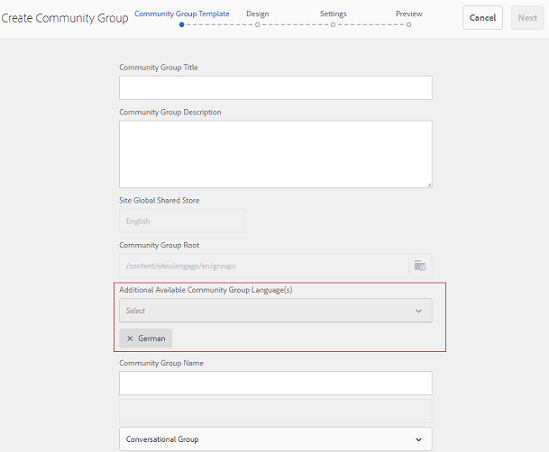

# What&#39;s New in AEM 6.4 Communities {#what-s-new-in-aem-communities}

AEM Communities oferta un entorno para que las empresas colaboren entre sus socios, clientes y empleados. Imparte capacidades sociales para estructurar sitios web y ayuda a las empresas a involucrar e impartir conocimientos a sus accionistas, para mejorar el valor de su marca a su manera.

AEM 6.4 Las comunidades aportan funcionalidades para mejorar las experiencias de los usuarios de la comunidad y facilitar las tareas diarias de los administradores, moderadores y administradores de la comunidad.

Siga leyendo para obtener una introducción rápida a las nuevas funciones y mejoras. Consulte también las notas de [la versión de AEM 6.4 Communities](../release-notes/communities-release-notes.md). Para obtener AEM documentación de comunidades 6.4, visite [AEM Guía](home.md)del usuario de comunidades 6.4.

## Administración de subcomunidades o grupos de la comunidad {#managing-sub-communities-or-community-groups}

AEM Communities permite a los administradores de la comunidad crear grupos y subgrupos dentro del sitio de la comunidad, mediante plantillas predefinidas, en el entorno de creación. Estos grupos sirven como subcomunidades, que pueden heredar muchas configuraciones, como temáticas y estilos del sitio principal. Sin embargo, estos grupos pueden diferir del sitio principal, por ejemplo tener un conjunto diferente de moderadores de grupo o pueden variar en el nivel de seguridad. Estos grupos funcionan como minicomunidades independientes y de pleno derecho, que se ven fortalecidas por las siguientes mejoras.

### Crear grupos de varias configuraciones regionales en un solo paso {#create-multi-locale-groups-in-single-step}

Como parte de un sitio de comunidad, se pueden crear grupos multilingües en una sola operación. **[!UICONTROL El campo Idioma(s)]** de grupo de la comunidad disponible adicional en la página Plantilla **[!UICONTROL de grupo de la]** comunidad, que está disponible al crear un [nuevo grupo](groups.md) de comunidad dentro de un sitio de comunidad, lo hace posible.

Para crear estos grupos, los usuarios pueden desplazarse a la colección de grupos del sitio de comunidades deseado desde la consola Sitios. Cree un grupo y especifique los idiomas que desee en el campo Idioma(s) **[!UICONTROL de grupo de comunidad]** adicional disponible de la página Plantilla **[!UICONTROL de grupo de]** comunidad.

### Eliminar grupos de comunidad de la consola de grupos {#delete-community-groups-from-groups-console}

AEM 6.4 Comunidades proporciona el icono Eliminar grupo en los grupos de comunidad existentes, en la colección Grupos de comunidad dentro de la consola Sitios de la comunidad. Esto permite la eliminación [de](groups.md#deleting-the-group) grupos con un solo clic, junto con la eliminación de todos los elementos asociados (como contenido y pertenencia de usuarios) al grupo.

### Crear y asignar recursos de habilitación dentro de grupos {#create-and-assign-enablement-resources-within-groups}

El contenido de aprendizaje ahora se puede crear, administrar y publicar para un conjunto específico de miembros de la comunidad objetivo. Debido a la disponibilidad de funciones de catálogo y asignación para grupos de la comunidad (y no sólo para todo el sitio de la comunidad), los administradores de habilitación pueden [asignar recursos](resource.md) de habilitación y ruta de aprendizaje a un pequeño grupo de personas también.

## Moderación del contenido generado por el usuario {#moderating-user-generated-content}

AEM 6.4 Las ofertas de las comunidades son escasas para mejorar la moderación, lo que contribuye a facilitar la vida cotidiana de los moderadores de la comunidad.

### Detección automática de spam  {#automatic-spam-detection}

El nuevo motor de detección de spam ayuda a filtrar el contenido generado por usuarios no deseados y no solicitados en los sitios o grupos de la comunidad. Cuando está habilitada, esta funcionalidad puede marcar un fragmento de contenido generado por el usuario como correo no deseado o no deseado según un conjunto predefinido de palabras no deseadas. Los moderadores también pueden actuar en función del contenido para denegarlo o permitir que aparezca en la instancia de publicación. Estas acciones de moderación se pueden realizar en línea o a través de una consola de moderación masiva.

[El detector](moderate-ugc.md#spam-detection) de correo no deseado busca y marca un determinado contenido generado por el usuario con una precisión del 90%. Sin embargo, esta funcionalidad no está habilitada de forma predeterminada. Para habilitarlo, los administradores de la comunidad deben navegar a configMgr en el sistema o la consola y agregar el proceso de correo no deseado.

### Nuevos filtros (respondidos/no respondidos) para la garantía de calidad {#new-answered-unanswered-filters-for-qna}

AEM 6.4 agrega dos [nuevos filtros](moderation.md#filter-rail), llamados Respondido y No Respondido para preguntas de control de calidad, a la consola de moderación masiva. Estos filtros están disponibles en Estado en Carril de filtro.

Al seleccionar el estado Respondido, todas las preguntas respondidas son visibles para el moderador en el área de contenido. Mientras que, si solo se selecciona el estado No respondido, el moderador verá todo el contenido (para todos los tipos de contenido) excepto las preguntas respondidas, porque la propiedad responsable de la pregunta respondida no existe en el caso de preguntas no respondidas y otro contenido como tema del foro, artículo del blog o comentarios.

### filtros de moderación de marcadores {#bookmark-moderation-filters}

AEM Communities permite [marcar los filtros](moderation.md#filter-rail) de moderación predefinidos en la consola de moderación. Estos marcadores guardados se pueden volver a examinar más adelante y compartir con otros usuarios.

Los usuarios simplemente necesitan seleccionar los filtros deseados en el carril de filtro en la consola de moderación, para vista de la UGC filtrada y marcar los filtros en sus navegadores. Estos filtros se anexan al final de la cadena URL y, por lo tanto, se pueden compartir, reutilizar y volver a examinar más adelante.

## Administración de sitios de la comunidad {#managing-community-sites}

AEM 6.4 Las comunidades proporcionan mejoras en la administración del sitio, que garantizan que los administradores del sitio creen, administren y eliminen fácilmente numerosos sitios de la comunidad en distintos idiomas.

### Crear sitios de comunidad con varias configuraciones regionales en un solo paso {#create-multi-locale-community-sites-in-one-step}

AEM Communities permite crear sitios [de comunidad](create-site.md) multilingües en una sola operación. Esto es posible debido a la disponibilidad de varios idiomas para seleccionar en el campo Idioma **[!UICONTROL base del sitio de la]** comunidad en la página Plantilla **[!UICONTROL del]** sitio, mientras se crea un nuevo sitio de comunidad desde la consola Sitios.

Los usuarios pueden seleccionar carpetas de configuración, marcas y muchas otras configuraciones a la vez para todos estos sitios.

### Eliminar sitios de comunidad de la consola Sitios {#delete-community-sites-from-sites-console}

AEM 6.4 Comunidades proporciona el icono Eliminar sitio en los sitios de comunidad existentes, en la consola Sitios de comunidad. Esto permite la [eliminación del sitio](create-site.md) y los elementos asociados con un solo clic.

## Administración de UGC y perfiles de usuario {#managing-ugc-and-user-profiles}

Al mantener la protección de datos de los usuarios en el centro de la experiencia de las comunidades, AEM Communities expone [las API integradas](user-ugc-management-service.md) y el servlet de [muestra](https://github.com/Adobe-Marketing-Cloud/aem-communities-ugc-migration/tree/master/bundles/communities-ugc-management-servlet). Estas API ayudan a administrar de forma masiva (eliminación masiva y exportación masiva) el contenido generado por los usuarios y a eliminar perfiles de los usuarios, y son fundamentales para gestionar las solicitudes de cumplimiento del RGPD de la UE.

## Cambios {#what-s-changed}

* La verificación de Captcha, al crear un nuevo sitio de comunidad, ya no está disponible de forma predeterminada en las comunidades de AEM 6.4. Sin embargo, el sitio Communities puede personalizarse para incluir el componente [Google reCAPTCHA](https://helpx.adobe.com/experience-manager/using/aem_recaptcha.html) con el fin de mejorar la seguridad.
* La opción de cargar una CSS personalizada se ha eliminado del tema de grupos y sitios de la comunidad.
* Los iconos Solo contenido y Búsqueda se han añadido en la barra de filtros de la IU de moderación masiva.
* El filtro de ruta de contenido se ha agregado en el carril de filtros en la interfaz de usuario de moderación masiva.
* El cambio al modo masivo y el modo masivo de salida se han eliminado de la interfaz de usuario de Moderación masiva. Para entrar en el modo de selección múltiple, haga clic en el icono Seleccionar ( ) de una publicación, que aparece al pasar el ratón (escritorio) o al pulsar y mantener un dedo en la publicación (móvil).
