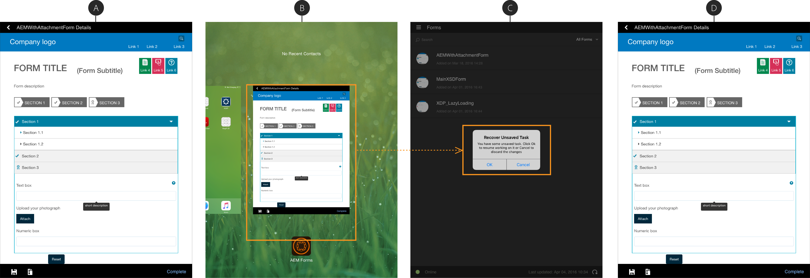

# Uso del guardado automático en la aplicación de AEM Forms {#using-autosave-in-aem-forms-app}

Cuando un usuario introduce datos en la aplicación de Adobe Experience Manager Forms, la función de guardado automático los guarda a intervalos regulares. La función de guardado automático de la aplicación de AEM Forms ayuda a evitar la pérdida de datos si la aplicación se cierra accidentalmente.

La aplicación se puede cerrar accidentalmente:

* Si el dispositivo se apaga debido a la batería baja
* Si el usuario mata la aplicación
* Si se produce un bloqueo inesperado

Puede especificar los intervalos a partir de los cuales la aplicación guarda los datos introducidos.

>[!NOTE]
>
>Seleccione la frecuencia de guardado automático con prudencia. Las operaciones frecuentes de guardado automático pueden tener un impacto notable en el rendimiento del dispositivo.

Siga estos pasos para utilizar la función de guardado automático en la aplicación de AEM Forms:

1. Inicie sesión en la aplicación y vaya a **[!UICONTROL Configuración > General]**.
1. En la pantalla General, utilice la opción **[!UICONTROL Frecuencia de guardado automático]** para seleccionar los intervalos en los que desea que la aplicación guarde los datos introducidos.
   

1. Al reiniciar la aplicación e iniciar sesión con el mismo usuario, se le pedirá que restaure la tarea con el cuadro de diálogo Recuperar Tarea no guardada. Haga clic en **[!UICONTROL Aceptar]** en el cuadro de diálogo Recuperar Tarea no guardada para reanudar el trabajo con la tarea guardada. Puede hacer clic en **[!UICONTROL Cancelar]** para eliminar los datos guardados correspondientes al último guardado automático y inicio activado que funciona con una nueva tarea.

   Al hacer clic en **[!UICONTROL Aceptar]**, la tarea se restaura con los datos correspondientes a la última función de guardado automático activada antes de que la aplicación se bloquee. Incluye los datos del formulario y todos los datos adjuntos asociados a la tarea.
   **recuperación de una tareaA.** Un formulario de trabajo en curso  **B.** App se cerró con fuerza  **C.** App reiniciado con el cuadro de diálogo Recuperar Tarea no guardada  **D.** Form restaurado con datos originales

