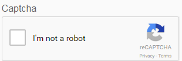

# Uso de CAPTCHA en formularios adaptables {#using-captcha-in-adaptive-forms}

CAPTCHA (prueba de Turing pública completamente automatizada para distinguir entre ordenadores y humanos) es un programa que se utiliza comúnmente en transacciones en línea para distinguir entre humanos y programas o bots automatizados. Plantea un desafío y evalúa la respuesta del usuario para determinar si es un humano o un bot que interactúa con el sitio. Evita que el usuario siga adelante si la prueba falla y ayuda a que las transacciones en línea sean seguras al impedir que los bots publiquen contenido no deseado o con fines malintencionados.

AEM Forms admite CAPTCHA en formularios adaptables. Google puede usar el servicio reCAPTCHA para implementar CAPTCHA.

>[!NOTE]
>
>AEM Forms solo admite reCaptcha v2. No se admite ninguna otra versión.
>
>CAPTCHA en formularios adaptables no es compatible en modo sin conexión en la aplicación AEM Forms.

## Configurar el servicio ReCAPTCHA de Google {#google-recaptcha}

Los autores de formularios pueden utilizar el servicio reCAPTCHA de Google para implementar CAPTCHA en formularios adaptables. Ofrece funciones CAPTCHA avanzadas para proteger su sitio. Para obtener más información sobre cómo funciona reCAPTCHA, consulte [Google reCAPTCHA](https://developers.google.com/recaptcha/).

Para implementar el servicio reCAPTCHA en AEM Forms:

1. Obtenga [par de claves de API reCAPTCHA](https://www.google.com/recaptcha/admin) de Google. Incluye una clave de sitio y un secreto.
1. Cree un contenedor de configuración para Cloud Services.

   1. Vaya a **[!UICONTROL Tools > General > Configuration Browser]**.
      * Consulte la [Documentación del explorador de configuración](/help/sites-administering/configurations.md) para obtener más información.
   1. Haga lo siguiente para habilitar la carpeta global para configuraciones de nube o omita este paso para crear y configurar otra carpeta para configuraciones de servicios de nube.

      1. En el Explorador de configuración, seleccione la carpeta **[!UICONTROL global]** y pulse **[!UICONTROL Propiedades]**.
      1. En el cuadro de diálogo Propiedades de configuración, habilite **[!UICONTROL Configuraciones de nube]**.
      1. Pulse **[!UICONTROL Guardar y cerrar]** para guardar la configuración y salir del cuadro de diálogo.
   1. En el Explorador de configuración, pulse **[!UICONTROL Crear]**.
   1. En el cuadro de diálogo Crear configuración, especifique un título para la carpeta y habilite **[!UICONTROL Configuraciones de nube]**.
   1. Toque **[!UICONTROL Crear]** para crear la carpeta habilitada para las configuraciones del servicio en la nube.

1. Configure el servicio en la nube para reCAPTCHA.

   1. En la instancia de autor de AEM, vaya a  > **Cloud Services**.
   1. Toque **[!UICONTROL reCAPTCHA]**. Se abre la página Configuraciones. Seleccione el contenedor de configuración creado en el paso anterior y pulse **[!UICONTROL Crear]**.
   1. Especifique Nombre, Clave del sitio y Clave secreta para el servicio reCAPTCHA y pulse **[!UICONTROL Crear]** para crear la configuración del servicio en la nube.
   1. En el cuadro de diálogo Editar componente , especifique el sitio y las claves secretas obtenidas en el paso 1. Pulse **[!UICONTROL Guardar configuración]** y, a continuación, pulse **[!UICONTROL Aceptar]** para completar la configuración.

   Una vez configurado el servicio reCAPTCHA, está disponible para su uso en formularios adaptables. Para obtener más información, consulte [Uso de CAPTCHA en formularios adaptables](#using-captcha).

## Utilizar CAPTCHA en formularios adaptables {#using-captcha}

Para utilizar CAPTCHA en formularios adaptables:

1. Abra un formulario adaptable en modo de edición.

   >[!NOTE]
   >
   >Asegúrese de que el contenedor de configuración seleccionado al crear el formulario adaptable contiene el servicio en la nube reCAPTCHA. También puede editar las propiedades del formulario adaptable para cambiar el contenedor de configuración asociado al formulario.

1. Desde el navegador de componentes, arrastre y suelte el componente **[!UICONTROL Captcha]** en el formulario adaptable.

   >[!NOTE]
   >
   >No se admite el uso de más de un componente Captcha en un formulario adaptable. Además, no se recomienda utilizar CAPTCHA en un panel marcado para la carga diferida o en un fragmento.

   >[!NOTE]
   >
   >Captcha distingue entre tiempo y caduca en aproximadamente un minuto. Por lo tanto, se recomienda colocar el componente Captcha justo antes del botón Enviar en el formulario adaptable.

1. Seleccione el componente Captcha que ha agregado y pulse  para editar sus propiedades.
1. Especifique un título para el widget CAPTCHA. El valor predeterminado es **Captcha**. Seleccione **[!UICONTROL Ocultar título]** si no desea que aparezca el título.
1. En la lista desplegable **[!UICONTROL Captcha service]**, seleccione **[!UICONTROL reCaptcha]** para habilitar el servicio reCAPTCHA si lo configuró como se describe en el servicio [ReCAPTCHA de Google](#google-recaptcha). Seleccione una configuración en la lista desplegable Configuración . Además, seleccione el tamaño como **[!UICONTROL Normal]** o **[!UICONTROL Compacto]** para el widget reCAPTCHA.

   >[!NOTE]
   >
   >No seleccione **[!UICONTROL Default]** en la lista desplegable del servicio Captcha porque el servicio AEM CAPTCHA predeterminado está obsoleto.

1. Guarde las propiedades.

El servicio reCAPTCHA está habilitado en el formulario adaptable. Puede obtener una vista previa del formulario y ver cómo funciona CAPTCHA.
