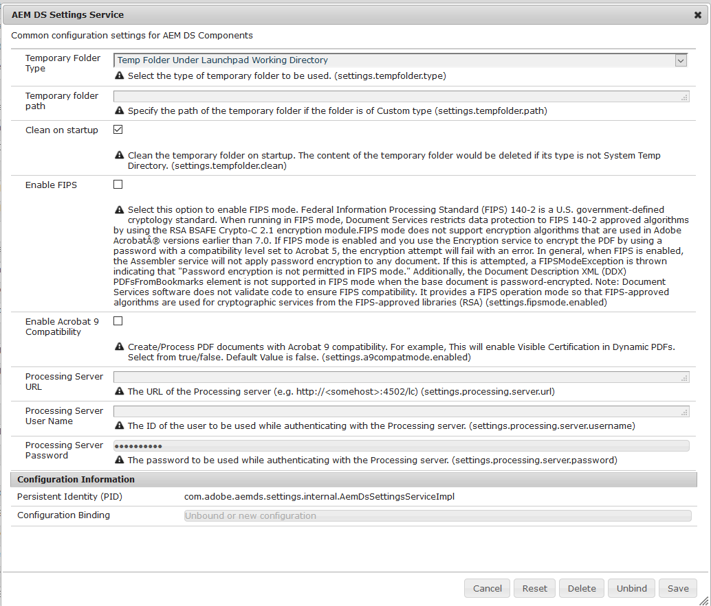

# Configuración de AEM DS {#configuring-aem-ds-settings}

Este artículo describe cómo configurar **AEM Servicio de configuración de DS**. Esta configuración se puede utilizar en varios escenarios, por ejemplo:

* En la gestión de correspondencia

   * Para configurar el flujo de trabajo de AEM Forms
   * Mientras se utiliza el portal de formularios para el guardado remoto del borrador/envío

* En formularios adaptables para casos en los que el formulario adaptable se envía desde una instancia de publicación

A continuación se indican los pasos para configurar la **[!UICONTROL AEM Configuración de DS]**:

1. Abra el Administrador de configuración en la instancia de publicación mediante la URL:

   *http://localhost:port/system/console/configMgr*.

   

1. En la ventana **[!UICONTROL Adobe Experience Manager Web Console Configuration]**, busque y haga clic en la opción **[!UICONTROL AEM Configuración de DS]**.

   

1. La ventana **[!UICONTROL AEM Servicio de configuración de DS]** muestra los ajustes de configuración comunes para AEM componentes de DS.

   

1. Añada la siguiente información en los campos respectivos:

   **[!UICONTROL URL]** del servidor de procesamiento: El servidor de procesamiento es el servidor en el que se debe activar el flujo de trabajo de Forms o AEM. Puede ser la misma que la URL de la instancia de autor de AEM o de la otra URL de servidor (es decir, http:// localhost:port/).

   **[!UICONTROL Nombre]** de usuario del servidor de procesamiento: Nombre de usuario del usuario del flujo de trabajo  [basado en la URL del servidor que se está utilizando]

   **[!UICONTROL Contraseña]** del servidor de procesamiento: Contraseña del usuario del flujo de trabajo

   >[!NOTE]
   >
   >* Al utilizar Forms o AEM flujos de trabajo, antes de realizar cualquier envío desde el servidor de publicación, es necesario configurar el servicio de configuración de DS. De lo contrario, el envío del formulario fallará.

