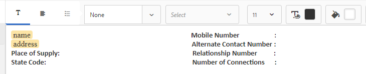

# Tutorial: Crear fragmentos de documento {#tutorial-create-document-fragments}

Creación de fragmentos de documento para la comunicación interactiva

Este tutorial es un paso de la serie [Create your first Interactive Communication](/help/forms/using/create-your-first-interactive-communication.md) . Se recomienda seguir la serie en secuencia cronológica para comprender, realizar y demostrar el caso de uso completo del tutorial.

Los fragmentos de documento son componentes reutilizables de una correspondencia que se utilizan para componer una comunicación interactiva. Los fragmentos del documento son de los siguientes tipos:

* Texto : un recurso de texto es un fragmento de contenido que consta de uno o más párrafos de texto. Un párrafo puede ser estático o dinámico.
* Lista : Lista es un grupo de fragmentos de documento, que incluyen texto, listas, condiciones e imágenes.
* Condición : las condiciones permiten definir qué contenido se incluye en la comunicación interactiva en función de los datos recibidos del modelo de datos del formulario.

Este tutorial lo acompaña durante los pasos para crear varios fragmentos de documento de texto basados en la anatomía proporcionada en la sección [Planificación de la comunicación interactiva](/help/forms/using/planning-interactive-communications.md). Al final de este tutorial, podrá:

* Crear fragmentos de documento
* Crear variables
* Crear y aplicar reglas

A continuación se muestra la lista de fragmentos de documento creados en este tutorial:

* [Detalles de la factura](/help/forms/using/create-document-fragments.md#step-create-bill-details-text-document-fragment)
* [Detalles del cliente](/help/forms/using/create-document-fragments.md#step-create-customer-details-text-document-fragment)
* [Resumen de la factura](/help/forms/using/create-document-fragments.md#step-create-bill-summary-text-document-fragment)
* [Resumen de gastos](/help/forms/using/create-document-fragments.md#step-create-summary-of-charges-text-document-fragment)

Cada fragmento de documento incluye campos con texto estático, datos recibidos del modelo de datos de formulario y datos introducidos mediante la interfaz de usuario del agente. Todos estos campos se muestran en la sección [Plan the Interactive Communication](/help/forms/using/planning-interactive-communications.md).

Al crear fragmentos de documento en este tutorial, las variables se crean para campos que reciben datos mediante la interfaz de usuario del agente.

Utilice **FDM_Create_First_IC**, tal como se describe en la sección [Crear modelo de datos de formulario](create-form-data-model-tutorial.md), como modelo de datos de formulario para crear fragmentos de documento en este tutorial.

## Paso 1: Crear fragmento de documento Detalles de la lista {#step-create-bill-details-text-document-fragment}

El fragmento de documento Detalles de la factura incluye los siguientes campos:

| Campo | Fuente de datos |
|---|---|
| Nº de factura | IU del agente |
| Período de facturación | IU del agente |
| Fecha de factura | IU del agente |
| Su plan | Modelo de datos de formulario |

Ejecute los siguientes pasos para crear variables para campos con la interfaz de usuario del agente como fuente de datos, crear texto estático y utilizar elementos del modelo de datos de formulario en el fragmento de documento:

1. Seleccione **[!UICONTROL Forms]** > **[!UICONTROL Fragmentos de documento]**.

1. Seleccione **Crear** > **Texto**.
1. Especifique la siguiente información:

   1. Introduzca **bill_details_first_ic** como nombre en el campo **Title**. El título se rellena automáticamente en el campo **Name**.
   1. Seleccione **Modelo de datos de formulario** en la sección **Modelo de datos**.
   1. Seleccione **FDM_Create_First_IC** como modelo de datos de formulario y pulse **Seleccionar**.
   1. Toque **Siguiente**.

1. Seleccione la pestaña **Variables** en el panel izquierdo y pulse **Crear**.
1. En la sección **Crear variable**:

   1. Introduzca **Invoicenumber** como nombre de la variable.
   1. Seleccione **String** como tipo.
   1. Toque **Crear**.

   

   Repita los pasos 4 y 5 para crear las siguientes variables:

   * Billperiod: Tipo de cadena
   * Fecha de factura: Tipo de fecha

   

1. Cree texto estático para los campos siguientes utilizando el panel derecho:

   * Nº de factura
   * Período de facturación
   * Fecha de factura
   * Su plan

   

1. Sitúe el cursor junto al campo **Invoice No** y haga doble clic en la variable **InvoiceNumber** en la pestaña **Variables** del panel izquierdo.
1. Coloque el cursor junto al campo **Período de factura** y haga doble clic en la variable **Período de facturación**.
1. Coloque el cursor junto al campo **Fecha de factura** y haga doble clic en la variable **Fecha de factura**.
1. Seleccione la pestaña **Objetos del modelo de datos** en el panel izquierdo.
1. Sitúe el cursor junto al campo **Your Plan** y haga doble clic en la propiedad **customer** > **customerplan**.

   

1. Haga clic en **Guardar** para crear el fragmento de documento Detalles de la lista .

## Paso 2: Crear fragmento de documento de detalles del cliente {#step-create-customer-details-text-document-fragment}

El fragmento de documento Detalles del cliente incluye los siguientes campos:

| Campo | Fuente de datos |
|---|---|
| Nombre del cliente | Modelo de datos de formulario |
| Dirección | Modelo de datos de formulario |
| Lugar de suministro | IU del agente |
| Código de estado | IU del agente |
| Número de móvil | Modelo de datos de formulario |
| Número de contacto alternativo | Modelo de datos de formulario |
| Número de relación | Modelo de datos de formulario |
| Número de conexiones | IU del agente |

Ejecute los siguientes pasos para crear variables para campos con la interfaz de usuario del agente como fuente de datos, crear texto estático y utilizar elementos del modelo de datos de formulario en el fragmento de documento:

1. Seleccione **[!UICONTROL Forms]** > **[!UICONTROL Fragmentos de documento]**.
1. Seleccione **Crear** > **Texto**.
1. Especifique la siguiente información:

   1. Introduzca **customer_details_first_ic** como nombre en el campo **Title**. El título se rellena automáticamente en el campo **Name**.
   1. Seleccione **Modelo de datos de formulario** en la sección **Modelo de datos**.
   1. Seleccione **FDM_Create_First_IC** como modelo de datos de formulario y pulse **Seleccionar**.
   1. Toque **Siguiente**.

1. Seleccione la pestaña **Variables** en el panel izquierdo y pulse **Crear**.
1. En la sección **Crear variable**:

   1. Introduzca **Placesupply** como nombre de la variable.
   1. Seleccione **String** como tipo.
   1. Toque **Crear**.

   Repita los pasos 4 y 5 para crear las siguientes variables:

   * Código de estado: Tipo de número
   * Numeración de conexiones: Tipo de número

1. Seleccione la pestaña **Data Model Objects**, coloque el cursor en el panel derecho y haga doble clic en la propiedad **customer** > **name**.
1. Pulse Intro para mover el cursor a la línea siguiente y haga doble clic en la propiedad **customer** > **address** .
1. Cree texto estático para los campos siguientes utilizando el panel derecho:

   * Número de móvil
   * Número de contacto alternativo
   * Lugar de suministro
   * Número de relación
   * Código de estado
   * Número de conexiones

   

1. Sitúe el cursor junto al campo **Mobile Number** y haga doble clic en la propiedad **customer** > **mobilenum**.
1. Coloque el cursor junto al campo **Número de contacto alternativo** y haga doble clic en la propiedad **customer** > **alternatemobilenumber** .
1. Sitúe el cursor junto al campo **Relationship Number** y haga doble clic en la propiedad **customer** > **relation number**.
1. Seleccione la pestaña **Variables**, coloque el cursor junto al campo **Lugar de aprovisionamiento** y haga doble clic en la variable **Placesupply**.
1. Sitúe el cursor junto al campo **State Code** y haga doble clic en la variable **Statcode**.
1. Sitúe el cursor junto al campo **Number of Connections** y haga doble clic en la variable **Numbers**.

   

1. Haga clic en **Guardar** para crear el fragmento de documento de texto Detalles del cliente .

## Paso 3: Crear fragmento de documento de resumen de lista {#step-create-bill-summary-text-document-fragment}

El fragmento de documento Resumen de factura incluye los siguientes campos:

| Campo | Fuente de datos |
|---|---|
| Saldo anterior | IU del agente |
| Pagos | IU del agente |
| Ajustes | IU del agente |
| Cargos período de factura actual | Modelo de datos de formulario |
| Importe vencido | IU del agente |
| Fecha de vencimiento | IU del agente |

Ejecute los siguientes pasos para crear variables para campos con la interfaz de usuario del agente como fuente de datos, crear texto estático y utilizar elementos del modelo de datos de formulario en el fragmento de documento:

1. Seleccione **[!UICONTROL Forms]** > **[!UICONTROL Fragmentos de documento]**.
1. Seleccione **Crear** > **Texto**.
1. Especifique la siguiente información:

   1. Introduzca **bill_summary_first_ic** como nombre en el campo **Title**. El título se rellena automáticamente en el campo **Name**.
   1. Seleccione **Modelo de datos de formulario** en la sección **Modelo de datos**.
   1. Seleccione **FDM_Create_First_IC** como modelo de datos de formulario y pulse **Seleccionar**.
   1. Toque **Siguiente**.

1. Seleccione la pestaña **Variables** en el panel izquierdo y pulse **Crear**.
1. En la sección **Crear variable**:

   1. Introduzca **Preview** como nombre de la variable.
   1. Seleccione **Number** como tipo.
   1. Toque **Crear**.

   Repita los pasos 4 y 5 para crear las siguientes variables:

   * Pagos: Tipo de número
   * Ajustes: Tipo de número
   * Importe: Tipo de número
   * Destinado: Tipo de fecha

1. Cree texto estático para los campos siguientes utilizando el panel derecho:

   * Saldo anterior
   * Pagos
   * Ajustes
   * Cargos período de factura actual
   * Importe vencido
   * Fecha de vencimiento
   * Cargos por demora en el pago después de Fecha de Vencimiento es $ 20

   

1. Sitúe el cursor junto al campo **Previous Balance** y haga doble clic en la variable **Preview**.
1. Sitúe el cursor junto al campo **Payments** y haga doble clic en la variable **Payments**.
1. Coloque el cursor junto al campo **Ajustes** y haga doble clic en la variable **Ajustes**.
1. Sitúe el cursor junto al campo **Amount Due** y haga doble clic en la variable **Amount**.
1. Sitúe el cursor junto al campo **Fecha de vencimiento** y haga doble clic en la variable **Duplicate**.
1. Seleccione la pestaña **Objetos del modelo de datos**, coloque el cursor junto al campo **Cargos del periodo de la lista actual** en el panel derecho y haga doble clic en la propiedad **facturas** > **cambios de uso**.

   

1. Haga clic en **Guardar** para crear el fragmento de documento de texto Detalles del cliente .

## Paso 4: Crear resumen de cargos fragmento de documento {#step-create-summary-of-charges-text-document-fragment}

El fragmento de documento Resumen de cargos incluye los siguientes campos:

| Campo | Fuente de datos |
|---|---|
| Cargos de llamada | Modelo de datos de formulario |
| Cargos por llamada de conferencia | Modelo de datos de formulario |
| Cargos por SMS | Modelo de datos de formulario |
| Cargos por Internet móvil | Modelo de datos de formulario |
| Cargos de itinerancia nacionales | Modelo de datos de formulario |
| Cargos de itinerancia internacionales | Modelo de datos de formulario |
| Cargos por servicios de valor agregado | Modelo de datos de formulario |
| Cargos totales | Modelo de datos de formulario |
| TOTAL PAGADO | Modelo de datos de formulario |

Ejecute los siguientes pasos para crear texto estático y utilizar elementos del modelo de datos de formulario en el fragmento de documento:

1. Seleccione **[!UICONTROL Forms]** > **[!UICONTROL Fragmentos de documento]**.
1. Seleccione **Crear** > **Texto**.
1. Especifique la siguiente información:

   1. Introduzca **summary_charge_first_ic** como nombre en el campo **Title**. El título se rellena automáticamente en el campo Nombre .
   1. Seleccione **Modelo de datos de formulario** en la sección **Modelo de datos**.
   1. Seleccione **FDM_Create_First_IC** como modelo de datos de formulario y pulse **Seleccionar**.
   1. Toque **Siguiente**.

1. Cree texto estático para los campos siguientes utilizando el panel derecho:

   * Cargos de llamada
   * Cargos por llamada de conferencia
   * Cargos por SMS
   * Cargos por Internet móvil
   * Cargos de itinerancia nacionales
   * Cargos de itinerancia internacionales
   * Cargos por servicios de valor agregado
   * Cargos totales
   * TOTAL PAGADO

   

1. Seleccione la pestaña **Objetos del modelo de datos**.
1. Sitúe el cursor junto al campo **Call Charges** y haga doble clic en la propiedad **bill** > **callcharge**.
1. Sitúe el cursor junto al campo **Conference Call Charges** y haga doble clic en la propiedad **bill** > **ConfigureCargos**.
1. Sitúe el cursor junto al campo **SMS Charges** y haga doble clic en la propiedad **bill** > **smscharge**.
1. Sitúe el cursor junto al campo **Mobile Internet Charges** y haga doble clic en la propiedad **bill** > **internetcharge**.
1. Sitúe el cursor junto al campo **National Roaming Charges** y haga doble clic en la propiedad **bill** > **roamingnational**.
1. Sitúe el cursor junto al campo **International Roaming Charges** y haga doble clic en la propiedad **bill** > **roamingintnl**.
1. Sitúe el cursor junto al campo **Value Added Services Charges** y haga doble clic en la propiedad **bill** > **vas**.
1. Sitúe el cursor junto al campo **Total Charges** y haga doble clic en la propiedad **bill** > **usagecharges**.
1. Sitúe el cursor junto al campo **TOTAL PAYABLE** y haga doble clic en la propiedad **bill** > **usagecharges**.

   

1. Seleccione el texto de la fila **Value Added Services Charges** y pulse **Crear regla** para crear una condición basada en la cual se muestre la fila en la comunicación interactiva:
1. En la ventana emergente **Crear regla**:

   1. Seleccione **Modelos de datos y variables** y luego **listas** > **cargas de llamadas**.
   1. Seleccione **es menor que** como operador.
   1. Seleccione **Number** e introduzca el valor como **60**.

   En función de esta condición, la fila Cargos de servicios de valor añadido solo se muestra si el valor del campo Cargos de llamadas es inferior a 60.

   

1. Haga clic en **Guardar** para crear el fragmento de documento de resumen de cargos.

