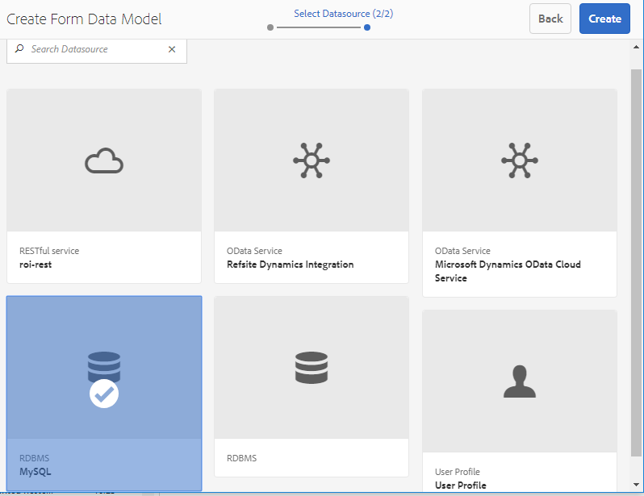
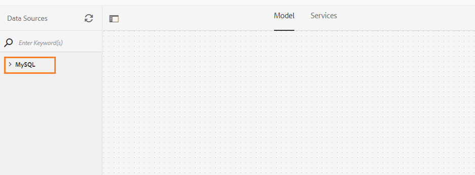
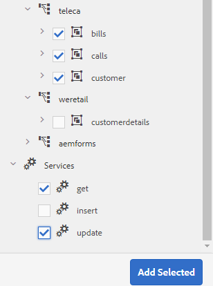
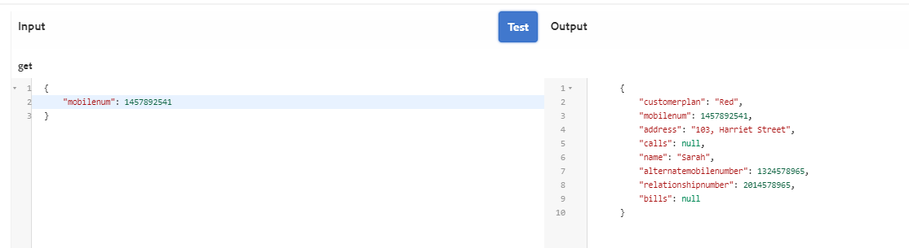
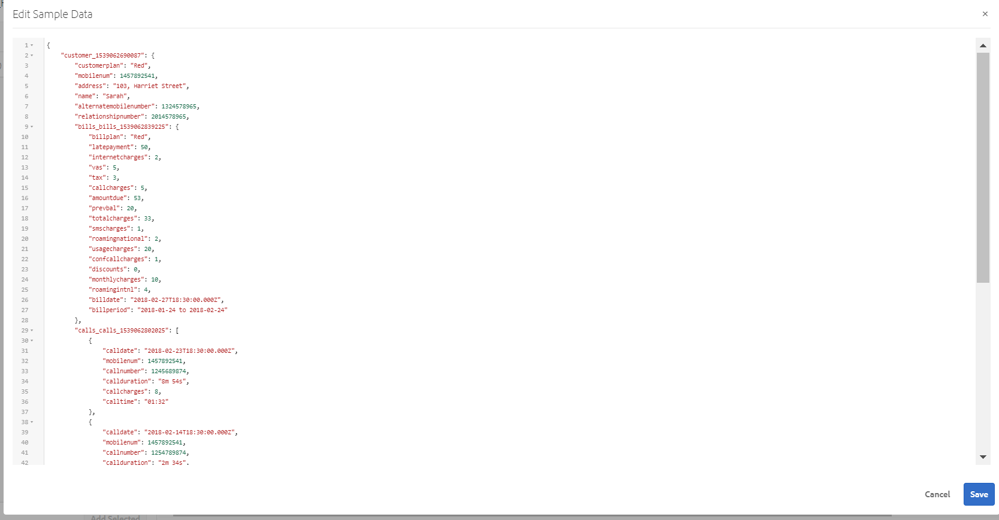

# Tutorial: Crear modelo de datos de formulario {#tutorial-create-form-data-model}

Crear modelo de datos de formulario para comunicación interactiva


Este tutorial es un paso en la serie [Crear su primera comunicación interactiva](/help/forms/using/create-your-first-interactive-communication.md). Se recomienda seguir la serie en secuencia cronológica para comprender, realizar y demostrar el caso de uso completo del tutorial.

## Acerca del tutorial {#about-the-tutorial}

El módulo de integración de datos de AEM Forms le permite crear un modelo de datos de formulario a partir de orígenes de datos de back-end dispares, como AEM perfil del usuario, servicios web RESTful, servicios web basados en SOAP, servicios OData y bases de datos relacionales. Puede configurar objetos y servicios de modelo de datos en un modelo de datos de formulario y asociarlo a un formulario adaptable. Los campos de formulario adaptables están enlazados a las propiedades del objeto del modelo de datos. Los servicios permiten rellenar previamente el formulario adaptable y escribir los datos del formulario enviados en el objeto del modelo de datos.

Para obtener más información sobre la integración de datos de formularios y el modelo de datos de formularios, consulte [Integración de datos de AEM Forms](data-integration.md).

Este tutorial lo acompaña a través de los pasos para preparar, crear, configurar y asociar un modelo de datos de formulario con una comunicación interactiva. Al final de este tutorial, podrá:

* [Configuración de la base de datos](#step-set-up-the-database)
* [Configurar la base de datos MySQL como fuente de datos](#step-configure-mysql-database-as-data-source)
* [Crear modelo de datos de formulario](#step-create-form-data-model)
* [Configurar modelo de datos de formulario](#step-configure-form-data-model)
* [Probar modelo de datos de formulario](#step-test-form-data-model-and-services)

El modelo de datos de formulario tiene un aspecto similar al siguiente:


**A.** Fuentes de datos configuradas  **B.esquemas** de fuentes de datos  **C.** Servicios disponibles  **D.** Objetos del modelo de datos  **E.** Servicios configurados

## Requisitos previos {#prerequisites}

Antes de comenzar, asegúrese de que dispone de lo siguiente:

* Base de datos MySQL con datos de ejemplo como se indica en la sección [Configurar la base de datos](#step-set-up-the-database).
* Paquete OSGi para el controlador JDBC MySQL como se explica en [Compilación del controlador de base de datos JDBC](https://helpx.adobe.com/experience-manager/6-3/sites-developing/jdbc.html#bundling-the-jdbc-database-driver)

## Paso 1: Configure la base de datos {#step-set-up-the-database}

Una base de datos es esencial para crear una comunicación interactiva. Este tutorial utiliza una base de datos para mostrar el modelo de datos de formulario y las capacidades de persistencia de las comunicaciones interactivas. Configure una base de datos que contenga tablas de cliente, facturas y llamadas.\
La siguiente imagen ilustra los datos de muestra de la tabla de clientes:


Utilice la siguiente instrucción DDL para crear la tabla **customer** en la base de datos.

```sql
CREATE TABLE `customer` (
   `mobilenum` int(11) NOT NULL,
   `name` varchar(45) NOT NULL,
   `address` varchar(45) NOT NULL,
   `alternatemobilenumber` int(11) DEFAULT NULL,
   `relationshipnumber` int(11) DEFAULT NULL,
   `customerplan` varchar(45) DEFAULT NULL,
   PRIMARY KEY (`mobilenum`),
   UNIQUE KEY `mobilenum_UNIQUE` (`mobilenum`)
 ) ENGINE=InnoDB DEFAULT CHARSET=utf8
```

Utilice la siguiente instrucción DDL para crear la tabla **bill** en la base de datos.

```sql
CREATE TABLE `bills` (
   `billplan` varchar(45) NOT NULL,
   `latepayment` decimal(4,2) NOT NULL,
   `monthlycharges` decimal(4,2) NOT NULL,
   `billdate` date NOT NULL,
   `billperiod` varchar(45) NOT NULL,
   `prevbal` decimal(4,2) NOT NULL,
   `callcharges` decimal(4,2) NOT NULL,
   `confcallcharges` decimal(4,2) NOT NULL,
   `smscharges` decimal(4,2) NOT NULL,
   `internetcharges` decimal(4,2) NOT NULL,
   `roamingnational` decimal(4,2) NOT NULL,
   `roamingintnl` decimal(4,2) NOT NULL,
   `vas` decimal(4,2) NOT NULL,
   `discounts` decimal(4,2) NOT NULL,
   `tax` decimal(4,2) NOT NULL,
   PRIMARY KEY (`billplan`)
 ) ENGINE=InnoDB DEFAULT CHARSET=utf8
```

Utilice la siguiente instrucción DDL para crear la tabla **llamadas** en la base de datos.

```sql
CREATE TABLE `calls` (
   `mobilenum` int(11) DEFAULT NULL,
   `calldate` date DEFAULT NULL,
   `calltime` varchar(45) DEFAULT NULL,
   `callnumber` int(11) DEFAULT NULL,
   `callduration` varchar(45) DEFAULT NULL,
   `callcharges` decimal(4,2) DEFAULT NULL,
   `calltype` varchar(45) DEFAULT NULL
 ) ENGINE=InnoDB DEFAULT CHARSET=utf8
```

La tabla **llamadas** incluye los detalles de la llamada, tales como fecha de llamada, hora de llamada, número de llamada, duración de la llamada y cargos de llamada. La tabla **client** está vinculada a la tabla de llamadas mediante el campo Número móvil (mobilenum). Por cada número de móvil que aparece en la tabla **client**, hay varios registros en la tabla **llamadas**. Por ejemplo, puede recuperar los detalles de la llamada para el número móvil **1457892541** haciendo referencia a la tabla **llamadas**.

La tabla **facturas** incluye los detalles de la factura, como la fecha de facturación, el período de facturación, los cargos mensuales y los cargos de llamadas. La tabla **client** está vinculada a la tabla **bill** mediante el campo Plan de facturación. Hay un plan asociado a cada cliente en la tabla **client**. La tabla **facturas** incluye los detalles de precios de todos los planes existentes. Por ejemplo, puede recuperar los detalles del plan para **Sarah** de la tabla **customer** y utilizar esos detalles para recuperar los detalles de precios de la tabla **bill**.

## Paso 2: Configurar la base de datos MySQL como fuente de datos {#step-configure-mysql-database-as-data-source}

Puede configurar distintos tipos de orígenes de datos para crear un modelo de datos de formulario. Para este tutorial, usted configurará la base de datos MySQL que está configurada y llena con datos de muestra. Para obtener información sobre otras fuentes de datos admitidas y cómo configurarlas, consulte [Integración de datos de AEM Forms](data-integration.md).

Haga lo siguiente para configurar su base de datos MySQL:

1. Instale el controlador JDBC para la base de datos MySQL como un paquete OSGi:

   1. Inicie sesión en AEM Forms Author Instance como administrador y vaya a AEM paquetes de consola web. La dirección URL predeterminada es [http://localhost:4502/system/console/bundles](http://localhost:4502/system/console/bundles).
   1. Toque **Instalar/Actualizar**. Aparece un cuadro de diálogo **Cargar / Instalar paquetes**.
   1. Toque **Elija Archivo** para buscar y seleccionar el paquete OSGi del controlador JDBC de MySQL. Seleccione **Paquete de Inicio** y **Actualizar paquetes** y toque **Instalar** o **Actualizar**. Asegúrese de que el controlador JDBC de Oracle Corporation para MySQL esté activo. El controlador está instalado.

1. Configure la base de datos MySQL como una fuente de datos:

   1. Vaya a AEM consola web en [http://localhost:4502/system/console/configMgr](http://localhost:4502/system/console/configMgr).
   1. Localice la configuración de **Apache Sling Connection Pooled DataSource**. Toque para abrir la configuración en modo de edición.
   1. En el cuadro de diálogo de configuración, especifique los siguientes detalles:

      * **Nombre del origen de datos:** puede especificar cualquier nombre. Por ejemplo, especifique **MySQL**.
      * **Nombre** de propiedad del servicio DataSource: Especifique el nombre de la propiedad de servicio que contiene el nombre de DataSource. Se especifica al registrar la instancia del origen de datos como servicio OSGi. Por ejemplo, **datasource.name**.
      * **Clase** de controlador JDBC: Especifique el nombre de clase Java del controlador JDBC. Para la base de datos MySQL, especifique **com.mysql.jdbc.Driver**.
      * **URI** de conexión JDBC: Especifique la dirección URL de conexión de la base de datos. Para la base de datos MySQL que se ejecuta en el puerto 3306 y esquema teleca, la dirección URL es: `jdbc:mysql://[server]:3306/teleca?autoReconnect=true&useUnicode=true&characterEncoding=utf-8`
      * **Nombre de usuario:** Nombre de usuario de la base de datos. Es necesario habilitar el controlador JDBC para establecer una conexión con la base de datos.
      * **Contraseña:** Contraseña de la base de datos. Es necesario habilitar el controlador JDBC para establecer una conexión con la base de datos.
      * **Prueba de endeudamiento:** active la opción  **Prueba de** prepago.
      * **Prueba al volver:** active la opción  **Prueba al** volver.
      * **Consulta de validación:** especifique una consulta SQL SELECT para validar conexiones desde el grupo. La consulta debe devolver al menos una fila. Por ejemplo, **seleccione &amp;ast; del cliente**.
      * **Aislamiento** de transacciones: Establezca el valor en  **READ_COMMITTED**.

   Deje otras propiedades con valores [predeterminados](https://tomcat.apache.org/tomcat-7.0-doc/jdbc-pool.html) y toque **Guardar**.

   Se crea una configuración similar a la siguiente.

   

## Paso 3: Crear modelo de datos de formulario {#step-create-form-data-model}

AEM Forms proporciona una interfaz de usuario intuitiva para [crear un modo de datos de formulario](data-integration.md)l a partir de orígenes de datos configurados. Puede utilizar varios orígenes de datos en un modelo de datos de formulario. Para el caso de uso en este tutorial, utilizará MySQL como fuente de datos.

Para crear el modelo de datos de formulario, haga lo siguiente:

1. En AEM instancia de autor, vaya a **Forms** > **Integraciones de datos**.
1. Puntee **Crear** > **Modelo de datos de formulario**.
1. En el asistente Crear modelo de datos de formulario, especifique un **nombre** para el modelo de datos de formulario. Por ejemplo, **FDM_Create_First_IC**. Toque **Siguiente**.
1. La pantalla Seleccionar origen de datos lista todas las fuentes de datos configuradas. Seleccione **MySQL** fuente de datos y toque **Crear**.

   

1. Haga clic en **Listo**. Se crea el modelo de datos de formulario **FDM_Create_First_IC**.

## Paso 4: Configurar modelo de datos de formulario {#step-configure-form-data-model}

La configuración del modelo de datos de formulario incluye:

* [adición de objetos y servicios del modelo de datos](#add-data-model-objects-and-services)
* [creación de propiedades secundarias calculadas para el objeto del modelo de datos](#create-computed-child-properties-for-data-model-object)
* [adición de asociaciones entre objetos de modelo de datos](#add-associations-between-data-model-objects)
* [edición de propiedades del objeto del modelo de datos](#edit-data-model-object-properties)
* [configuración de servicios para objetos de modelo de datos](#configure-services)

### Añadir objetos y servicios del modelo de datos {#add-data-model-objects-and-services}

1. En AEM instancia de autor, vaya a **Forms** > **Integraciones de datos**. La dirección URL predeterminada es [http://localhost:4502/aem/forms.html/content/dam/formsanddocuments-fdm](http://localhost:4502/aem/forms.html/content/dam/formsanddocuments-fdm).
1. El modelo de datos de formulario **FDM_Create_First_IC** que creó anteriormente se muestra aquí. Selecciónelo y toque **Editar**.

   La fuente de datos seleccionada **MySQL** se muestra en el panel **Fuentes de datos**.

   

1. Expanda el árbol de origen de datos **MySQL**. Seleccione los siguientes objetos y servicios del modelo de datos del esquema **teleca**:

   * **Objetos** del modelo de datos:

      * facturas
      * llamadas
      * cliente
   * **Servicios:**

      * get
      * actualizar

   Toque **Añadir seleccionados** para agregar objetos y servicios del modelo de datos seleccionado al modelo de datos de formulario.

   

   Los objetos de listas, llamadas y modelos de datos del cliente se muestran en el panel derecho de la ficha **Modelo**. Los servicios de obtención y actualización se muestran en la ficha **Servicios**.

   

### Crear propiedades secundarias calculadas para el objeto del modelo de datos {#create-computed-child-properties-for-data-model-object}

Una propiedad calculada es aquella cuyo valor se calcula en función de una regla o una expresión. Mediante una regla, puede establecer el valor de una propiedad calculada en una cadena literal, un número, un resultado de una expresión matemática o el valor de otra propiedad en el modelo de datos de formulario.

En función del caso de uso, cree la propiedad **usagecharges** secundaria calculada en el objeto del modelo de datos **bill** utilizando la siguiente expresión matemática:

* cargos de uso = cargos de llamada + cargos de llamada de conferencia + cargos por SMS + cargos por Internet móvil + roaming nacional + itinerancia internacional + VAS (todas estas propiedades existen en el objeto del modelo de datos de facturas)

   Para obtener más información sobre la propiedad **usagecharges** secundaria calculada, consulte [Plan the Interactive Communication](/help/forms/using/planning-interactive-communications.md).

Ejecute los siguientes pasos para crear propiedades secundarias calculadas para el objeto de modelo de datos de listas:

1. Active la casilla de verificación situada en la parte superior del objeto del modelo de datos **bill** para seleccionarlo y toque **Crear propiedad secundaria**.
1. En el panel **Crear propiedad secundaria**:

   1. Escriba **usagecharges** como nombre de la propiedad secundaria.
   1. Habilite **Calculado**.
   1. Seleccione **Float** como tipo y toque **Done** para agregar la propiedad secundaria al objeto del modelo de datos **bill**.

   

1. Toque **Editar regla** para abrir el Editor de reglas.
1. Toque **Crear**. Se abre la ventana de la regla **Establecer valor**.
1. En la lista desplegable Seleccionar opción, seleccione **Expresión matemática**.

   

1. En la expresión matemática, seleccione **cargas de llamada** y **cargas de llamada** como objetos primero y segundo, respectivamente. Seleccione **plus** como operador. Toque dentro de la expresión matemática y toque **Ampliar Expresión** para agregar **smsloads**, **internetloads**, **roamingnational**, **roamingintnl** y **vas 11/> objetos de la expresión.**

   La siguiente imagen muestra la expresión matemática en el editor de reglas:

   

1. Puntee **Listo**. La regla se crea en el Editor de reglas.
1. Toque **Cerrar** para cerrar la ventana del Editor de reglas.

### Añadir asociaciones entre objetos del modelo de datos {#add-associations-between-data-model-objects}

Una vez definidos los objetos del modelo de datos, puede crear asociaciones entre ellos. La asociación puede ser uno a uno o uno a varios. Por ejemplo, puede haber varios dependientes asociados a un empleado. Se denomina asociación de uno a varios y se describe con 1:n en la línea que conecta objetos del modelo de datos asociados. Sin embargo, si una asociación devuelve un nombre de empleado único para un ID de empleado determinado, se denomina asociación uno a uno.

Cuando se agregan objetos de modelo de datos asociados en un origen de datos a un modelo de datos de formulario, sus asociaciones se conservan y se muestran como conectadas por líneas de flecha.

En función del caso de uso, cree las siguientes asociaciones entre los objetos del modelo de datos:

| Asociación | Objetos del modelo de datos |
|---|---|
| 1:n | cliente:llamadas (se pueden asociar varias llamadas con un cliente en una factura mensual) |
| 1:1 | cliente:facturas (una factura está asociada con un cliente durante un mes en particular) |

Realice los siguientes pasos para crear asociaciones entre objetos del modelo de datos:

1. Active la casilla de verificación situada en la parte superior del objeto del modelo de datos **cliente** para seleccionarlo y toque **Añadir asociación**. Se abre el panel de propiedades **Añadir asociación**.
1. En el panel **Añadir asociación**:

   * Especifique un título para la asociación. Es un campo opcional.
   * Seleccione **Uno a varios** en la lista desplegable **Tipo**.
   * Seleccione **llamadas** en la lista desplegable **Objeto del modelo**.
   * Seleccione **get** en la lista desplegable **Service**.
   * Toque **Añadir** para vincular el objeto del modelo de datos **client** al objeto del modelo de datos **Calls** mediante una propiedad. En función del caso de uso, el objeto del modelo de datos de llamadas debe estar vinculado a la propiedad de número móvil en el objeto del modelo de datos del cliente. Se abre el cuadro de diálogo **Añadir argumento**.

   

1. En el cuadro de diálogo **Añadir argumento**:

   * Seleccione **mobilenum** en la lista desplegable **Name**. La propiedad mobile number es una propiedad común que está disponible en el cliente y llama a objetos del modelo de datos. Como resultado, se utiliza para crear una asociación entre el cliente y los objetos del modelo de datos de llamadas.

      Para cada número móvil disponible en el objeto del modelo de datos del cliente, hay varios registros de llamadas disponibles en la tabla de llamadas.

   * Especifique un título y una descripción opcionales para el argumento.
   * Seleccione **cliente** en la lista desplegable **Enlace a**.
   * Seleccione **mobilenum** en la lista desplegable **Valor de enlace**.
   * Toque **Añadir**.

   

   La propiedad mobilenum se muestra en la sección **Argumentos**.

   

1. Toque **Listo** para crear una asociación 1:n entre los objetos del modelo de datos de cliente y de llamada.

   Una vez que haya creado una asociación entre los objetos del modelo de datos cliente y las llamadas, cree una asociación 1:1 entre el cliente y los objetos del modelo de datos de facturación.

1. Active la casilla de verificación situada en la parte superior del objeto del modelo de datos **cliente** para seleccionarlo y toque **Añadir asociación**. Se abre el panel de propiedades **Añadir asociación**.
1. En el panel **Añadir asociación**:

   * Especifique un título para la asociación. Es un campo opcional.
   * Seleccione **Uno a Uno** en la lista desplegable **Tipo**.
   * Seleccione **listas** en la lista desplegable **Objeto del modelo**.
   * Seleccione **get** en la lista desplegable **Service**. La propiedad **billplan**, que es la clave principal de la tabla de facturas, ya está disponible en la sección **Argumentos**.

      Los objetos del modelo de datos de clientes y facturas se vinculan mediante las propiedades de plan de facturación (facturas) y plan del cliente (cliente), respectivamente. Cree un enlace entre estas propiedades para recuperar los detalles del plan de cualquier cliente disponible en la base de datos de MySQL.

   * Seleccione **cliente** en la lista desplegable **Enlace a**.
   * Seleccione **plan del cliente** en la lista desplegable **Valor de enlace**.
   * Toque **Listo** para crear un enlace entre las propiedades de plan de facturación y plan del cliente.

   

   La siguiente imagen muestra las asociaciones entre los objetos del modelo de datos y las propiedades utilizadas para crear asociaciones entre ellos:

   

### Editar propiedades del objeto del modelo de datos {#edit-data-model-object-properties}

Después de crear asociaciones entre el cliente y otros objetos del modelo de datos, edite las propiedades del cliente para definir la propiedad en función de la cual se recuperan los datos del objeto del modelo de datos. En función del caso de uso, el número móvil se utiliza como propiedad para recuperar datos del objeto del modelo de datos del cliente.

1. Seleccione la casilla de verificación situada en la parte superior del objeto del modelo de datos **cliente** para seleccionarlo y toque **Editar propiedades**. Se abre el panel **Editar propiedades**.
1. Especifique **client** como el objeto **Modelo de nivel superior**.
1. Seleccione **get** en la lista desplegable **Servicio de lectura**.
1. En la sección **Argumentos**:

   * Seleccione **Solicitar atributo** en la lista desplegable **Enlace a**.
   * Especifique **mobilenum** como valor de enlace.

1. Seleccione **actualizar** en la lista desplegable **Escribir** servicio.
1. En la sección **Argumentos**:

   * Para la propiedad **mobilenum**, seleccione **client** en la lista desplegable **Binding To**.
   * Seleccione **mobilenum** en la lista desplegable **Valor de enlace**.

1. Toque **Listo** para guardar las propiedades.

   

1. Seleccione la casilla de verificación situada en la parte superior del objeto del modelo de datos **llamadas** para seleccionarlo y tocar **Editar propiedades**. Se abre el panel **Editar propiedades**.
1. Deshabilite el objeto del modelo de nivel superior **a1/> para** llamadas **objeto del modelo de datos.**
1. Puntee **Listo**.

   Repita los pasos 8 a 10 para configurar las propiedades del objeto del modelo de datos **bill**.

### Configurar servicios {#configure-services}

1. Vaya a la ficha **Servicios**.
1. Seleccione el servicio **get** y toque **Editar propiedades**. Se abre el panel **Editar propiedades**.
1. En el panel **Editar propiedades**:

   * Introduzca un título y una descripción opcionales.
   * Seleccione **cliente** en la lista desplegable **Objeto del modelo de salida**.
   * Toque **Listo** para guardar las propiedades.

   

1. Seleccione el servicio **update** y toque **Editar propiedades**. Se abre el panel **Editar propiedades**.
1. En el panel **Editar propiedades**:

   * Introduzca un título y una descripción opcionales.
   * Seleccione **cliente** en la lista desplegable **Objeto del modelo de entrada**.
   * Puntee **Listo**.
   * Toque **Guardar** para guardar el modelo de datos de formulario.

   

## Paso 5: Probar el modelo y los servicios de datos de formulario {#step-test-form-data-model-and-services}

Puede probar el objeto y los servicios del modelo de datos para comprobar que el modelo de datos de formulario está configurado correctamente.

Para ejecutar la prueba, haga lo siguiente:

1. Vaya a la ficha **Modelo**, seleccione el objeto del modelo de datos **cliente** y toque **Objeto del modelo de prueba**.
1. En la ventana **Probar modelo de datos de formulario**, seleccione **Leer objeto de modelo** en la lista desplegable **Seleccionar modelo/servicio**.
1. En la sección **Entrada**, especifique un valor para la propiedad **mobilenum** que existe en la base de datos MySQL configurada y toque **Prueba**.

   Los detalles del cliente asociados con la propiedad mobilenum especificada se recuperan y se muestran en la sección Salida, como se muestra a continuación. Cierre el cuadro de diálogo.

   

1. Vaya a la ficha **Servicios**.
1. Seleccione el servicio **get** y toque **Test Service.**
1. En la sección **Entrada**, especifique un valor para la propiedad **mobilenum** que existe en la base de datos MySQL configurada y toque **Prueba**.

   Los detalles del cliente asociados con la propiedad mobilenum especificada se recuperan y se muestran en la sección Salida, como se muestra a continuación. Cierre el cuadro de diálogo.

   

### Editar y guardar datos de muestra {#edit-and-save-sample-data}

El editor del modelo de datos de formulario permite generar datos de ejemplo para todas las propiedades de objeto del modelo de datos, incluidas las propiedades calculadas, en un modelo de datos de formulario. Es un conjunto de valores aleatorios que cumplen el tipo de datos configurado para cada propiedad. También puede editar y guardar datos, que se conservan aunque vuelva a generar los datos de ejemplo.

Para generar, editar y guardar datos de ejemplo, haga lo siguiente:

1. En la página del modelo de datos de formulario, toque **Editar datos de ejemplo**. Genera y muestra los datos de ejemplo en la ventana Editar datos de muestra.

   

1. En la ventana **Editar datos de ejemplo**, edite los datos según sea necesario y toque **Guardar**. Cierre la ventana.

