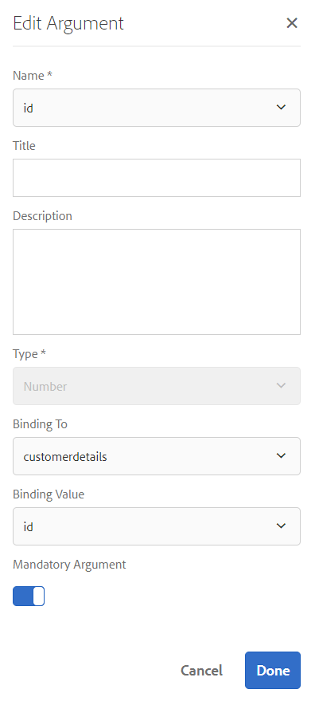

# Tutorial: Crear modelo de datos de formulario {#tutorial-create-form-data-model}

Este tutorial es un paso de la serie [Create Your First Adaptive Form](/help/forms/using/create-your-first-adaptive-form.md). Se recomienda seguir la serie en secuencia cronológica para comprender, realizar y demostrar el caso de uso completo del tutorial.

## Acerca del tutorial {#about-the-tutorial}

El módulo de integración de datos de AEM Forms le permite crear un modelo de datos de formulario a partir de fuentes de datos backend dispares, como AEM perfil de usuario, servicios web RESTful, servicios web basados en SOAP, servicios OData y bases de datos relacionales. Puede configurar objetos y servicios del modelo de datos en un modelo de datos de formulario y asociarlo a un formulario adaptable. Los campos de formulario adaptables están enlazados a las propiedades de objeto del modelo de datos. Los servicios permiten rellenar previamente el formulario adaptable y escribir los datos de formulario enviados en el objeto del modelo de datos.

Para obtener más información sobre la integración de datos de formulario y el modelo de datos de formulario, consulte [AEM Forms Data Integration](/help/forms/using/data-integration.md).

Este tutorial lo acompaña durante los pasos para preparar, crear, configurar y asociar un modelo de datos de formulario con un formulario adaptable. Al final de este tutorial, podrá:

* [Configurar la base de datos MySQL como fuente de datos](#config-database)
* [Creación de un modelo de datos de formulario mediante la base de datos MySQL](#create-fdm)
* [Configuración del modelo de datos de formulario](#config-fdm)
* [Probar modelo de datos de formulario](#test-fdm)

El modelo de datos de formulario tendrá un aspecto similar al siguiente:

**A.** Fuentes de datos configuradas  **B.** Esquemas de fuentes de datos  **C.** Servicios disponibles  **D.** Objetos de modelos de datos  **E.** Servicios configurados

## Requisitos previos {#prerequisites}

Antes de empezar, asegúrese de que dispone de lo siguiente:

* Base de datos MySQL con datos de ejemplo como se indica en la sección Requisitos previos de [Crear su primer formulario adaptable](/help/forms/using/create-your-first-adaptive-form.md)
* Paquete OSGi para el controlador JDBC MySQL como se explica en [Agrupación del controlador de base de datos JDBC](/help/sites-developing/jdbc.md#bundling-the-jdbc-database-driver)
* Formulario adaptable, tal como se explica en el primer tutorial [Crear un formulario adaptable](/help/forms/using/create-adaptive-form.md)

## Paso 1: Configurar la base de datos MySQL como fuente de datos {#config-database}

Puede configurar distintos tipos de orígenes de datos para crear un modelo de datos de formulario. Para este tutorial, configuraremos la base de datos MySQL que ha configurado y rellenado con datos de ejemplo. Para obtener información sobre otras fuentes de datos compatibles y cómo configurarlas, consulte [AEM Forms Data Integration](/help/forms/using/data-integration.md).

Haga lo siguiente para configurar la base de datos MySQL:

1. Instale el controlador JDBC para la base de datos MySQL como un paquete OSGi:

   1. Inicie sesión en la instancia de autor de AEM Forms como administrador y vaya a AEM paquetes de consola web. La dirección URL predeterminada es [http://localhost:4502/system/console/bundles](http://localhost:4502/system/console/bundles).

   1. Pulse **Instalar/Actualizar**. Aparece un cuadro de diálogo **Cargar / Instalar paquetes**.

   1. Toque **Choose File** para buscar y seleccionar el paquete OSGi del controlador JDBC de MySQL. Seleccione **Iniciar paquete** y **Actualizar paquetes** y pulse **Instalar o actualizar**. Asegúrese de que el controlador JDBC de Oracle Corporation para MySQL esté activo. El controlador está instalado.

1. Configure la base de datos MySQL como fuente de datos:

   1. Vaya a AEM consola web en [http://localhost:4502/system/console/configMgr](http://localhost:4502/system/console/configMgr).
   1. Busque la configuración **Apache Sling Connection Pooled DataSource**. Pulse para abrir la configuración en modo de edición.
   1. En el cuadro de diálogo de configuración, especifique los siguientes detalles:

      * **Nombre del origen de datos:** puede especificar cualquier nombre. Por ejemplo, especifique **WeRetailMySQL**.
      * **Nombre** de propiedad del servicio DataSource: Especifique el nombre de la propiedad de servicio que contiene el nombre de DataSource. Se especifica al registrar la instancia de origen de datos como servicio OSGi. Por ejemplo, **datasource.name**.
      * **Clase** de controlador JDBC: Especifique el nombre de clase Java del controlador JDBC. Para la base de datos MySQL, especifique **com.mysql.jdbc.Driver**.
      * **URI** de conexión JDBC: Especifique la dirección URL de conexión de la base de datos. Para la base de datos MySQL que se ejecuta en el puerto 3306 y el esquema weretail, la URL es: `jdbc:mysql://[server]:3306/weretail?autoReconnect=true&useUnicode=true&characterEncoding=utf-8`
      * **Nombre de usuario:** Nombre de usuario de la base de datos. Es necesario permitir que el controlador JDBC establezca una conexión con la base de datos.
      * **Contraseña:** Contraseña de la base de datos. Es necesario permitir que el controlador JDBC establezca una conexión con la base de datos.
      * **Probar en la toma de prestado:** active la opción  **Probar en** la toma de prestado.
      * **Probar al volver:** active la opción  **Probar al** volver.
      * **Consulta de validación:** especifique una consulta SQL SELECT para validar conexiones desde el grupo. La consulta debe devolver al menos una fila. Por ejemplo, **seleccione &amp;ast; de customerdetails**.
      * **Aislamiento** de transacciones: Establezca el valor en  **READ_COMMITTED**.

      Deje otras propiedades con [valores](https://tomcat.apache.org/tomcat-7.0-doc/jdbc-pool.html) predeterminados y pulse **Guardar**.
   Se crea una configuración similar a la siguiente.

   

## Paso 2: Crear modelo de datos de formulario {#create-fdm}

AEM Forms proporciona una interfaz de usuario intuitiva para [crear un modelo de datos de formulario](data-integration.md) a partir de orígenes de datos configurados. Puede utilizar varios orígenes de datos en un modelo de datos de formulario. Para nuestro caso de uso, utilizaremos la fuente de datos MySQL configurada.

Para crear el modelo de datos de formulario, haga lo siguiente:

1. En AEM instancia de autor, vaya a **Forms** > **Data Integration** s.
1. Pulse **Crear** > **Modelo de datos de formulario**.
1. En el cuadro de diálogo Crear modelo de datos de formulario, especifique un **nombre** para el modelo de datos de formulario. Por ejemplo, **customer-Shipping-billing-details**. Toque **Siguiente**.
1. La pantalla seleccionar fuente de datos enumera todas las fuentes de datos configuradas. Seleccione el origen de datos **WeRetailMySQL** y pulse **Crear**.

   

Se crea el modelo de datos de formulario **customer-Shipping-billing-details**.

## Paso 3: Configurar el modelo de datos de formulario {#config-fdm}

La configuración del modelo de datos de formulario implica:

* adición de objetos y servicios del modelo de datos
* configuración de servicios de lectura y escritura para objetos del modelo de datos

Para configurar el modelo de datos de formulario, haga lo siguiente:

1. En AEM instancia de autor, vaya a **Forms > Integraciones de datos**. La dirección URL predeterminada es [http://localhost:4502/aem/forms.html/content/dam/formsanddocuments-fdm](http://localhost:4502/aem/forms.html/content/dam/formsanddocuments-fdm).
1. El modelo de datos de formulario **customer-Shipping-billing-details** que ha creado anteriormente se muestra aquí. Ábrala en modo de edición.

   El origen de datos seleccionado **WeRetailMySQL** está configurado en el modelo de datos de formulario.

   

1. Expanda el árbol de fuentes de datos WeRailMySQL. Seleccione los siguientes objetos y servicios del modelo de datos del esquema **weretail** > **customerdetails** al modelo de datos de formulario:

   * **Objetos** del modelo de datos:

      * id
      * name
      * ShippingAddress
      * ciudad
      * estado
      * zipcode
   * **Servicios:**

      * get
      * actualizar

   Toque **Agregar seleccionado** para agregar objetos y servicios del modelo de datos seleccionado al modelo de datos de formulario.

   

   >[!NOTE]
   >
   >Los servicios predeterminados de obtener, actualizar e insertar para orígenes de datos JDBC se proporcionan ya preparados con el modelo de datos de formulario .

1. Configure los servicios de lectura y escritura para el objeto del modelo de datos.

   1. Seleccione el objeto del modelo de datos **customerdetails** y pulse **Editar propiedades**.
   1. Seleccione **get** en la lista desplegable Leer servicio . El argumento **id**, que es la clave principal del objeto del modelo de datos customerdetails, se agrega automáticamente. Pulse  y configure el argumento como se indica a continuación.

      

   1. Del mismo modo, seleccione **update** como servicio de escritura. El objeto **customerdetails** se agrega automáticamente como argumento. El argumento se configura de la siguiente manera.

      

      Añada y configure el argumento **id** como se indica a continuación.

      

   1. Toque **Listo** para guardar las propiedades del objeto del modelo de datos. A continuación, pulse **Guardar** para guardar el modelo de datos del formulario.

      Los servicios **get** y **update** se añaden como servicios predeterminados para el objeto del modelo de datos.

      

1. Vaya a la pestaña **Services** y configure los servicios **get** y **update**.

   1. Seleccione el servicio **get** y pulse **Editar propiedades**. Se abre el cuadro de diálogo de propiedades.
   1. Especifique lo siguiente en el cuadro de diálogo Editar propiedades:

      * **Título**: Especifique el título del servicio. Por ejemplo: Recupere la dirección de envío.
      * **Descripción**: Especifique la descripción que contiene el funcionamiento detallado del servicio. Por ejemplo:

         Este servicio recupera la dirección de envío y otros detalles del cliente de la base de datos MySQL

      * **Objeto** de modelo de salida: Seleccione el esquema que contiene los datos del cliente. Por ejemplo:

         customerdetail schema
      * **Matriz** de devolución: Desactive la  **opción** Volver a la matriz.
      * **Argumentos**: Seleccione el argumento llamado  **ID**.

      Puntee **Listo**. El servicio para recuperar los detalles del cliente de la base de datos MySQL está configurado.

      

   1. Seleccione el servicio **update** y pulse **Editar propiedades**. Se abre el cuadro de diálogo de propiedades.

   1. Especifique lo siguiente en el cuadro de diálogo Editar propiedades:

      * **Título**: Especifique el título del servicio. Por ejemplo, Actualizar dirección de envío.

      * **Descripción**: Especifique la descripción que contiene el funcionamiento detallado del servicio. Por ejemplo:

         Este servicio actualiza la dirección de envío y los campos relacionados en la base de datos MySQL

      * **Objeto** de modelo de entrada: Seleccione el esquema que contiene los datos del cliente. Por ejemplo:

         customerdetail schema

      * **Tipo** de salida: Seleccione  **BOOLEAN**.
      * **Argumentos**: Seleccione un argumento denominado  **** IDy detalles del  **cliente**.

      Puntee **Listo**. El servicio **update** para actualizar los detalles del cliente en la base de datos MySQL está configurado.

      

Se configuran el objeto y los servicios del modelo de datos de formulario. Ahora puede probar el modelo de datos de formulario.

## Paso 4: Probar modelo de datos de formulario {#test-fdm}

Puede probar el objeto y los servicios del modelo de datos para comprobar que el modelo de datos del formulario está configurado correctamente.

Haga lo siguiente para ejecutar la prueba:

1. Vaya a la pestaña **Model**, seleccione el objeto del modelo de datos **customerdetails** y pulse **Test Model Object**.
1. En la ventana **Test Model / Service**, seleccione **Read model object** en la lista desplegable **Select Model / Service**.
1. En la sección **customerdetails**, especifique un valor para el argumento **id** que existe en la base de datos MySQL configurada y pulse **Test**.

   Los detalles del cliente asociados con el id especificado se recuperan y se muestran en la sección **Output** como se muestra a continuación.

   

1. Del mismo modo, puede probar el objeto y los servicios del modelo de escritura.

   En el siguiente ejemplo, el servicio de actualización actualiza correctamente los detalles de dirección del id 7102715 de la base de datos.

   

   Ahora, si vuelve a probar el servicio de modelo de lectura para el id 7107215, recuperará y mostrará los detalles actualizados del cliente como se muestra a continuación.

   

