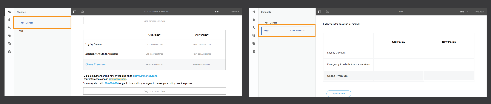

# Crear una comunicación interactiva  {#create-an-interactive-communication}

Cree una comunicación interactiva con el editor de comunicación interactiva. Utilice la funcionalidad de arrastrar y soltar para crear la comunicación interactiva y previsualización tanto las salidas de impresión como las salidas web en diferentes tipos de dispositivos.

## Información general {#overview}

Las comunicaciones interactivas centralizan y gestionan la creación, el ensamblaje y las correspondencias interactivas y personalizadas de envío. Utilice la impresión como canal maestro para la Web, puede minimizar la duplicación de esfuerzos al crear la salida web de la comunicación interactiva.

### Requisitos previos {#prerequisites}

Los siguientes son los requisitos previos para crear una comunicación interactiva:

* Configure un modelo [de datos de](/help/forms/using/data-integration.md) formulario que contenga datos de prueba o un origen de datos real, como una instancia de Microsoft® Dynamics.
* Asegúrese de que tiene los fragmentos [de](/help/forms/using/document-fragments.md)Documento.
* Asegúrese de que dispone de [plantillas para impresión y canal](/help/forms/using/web-channel-print-channel.md)web.
* Asegúrese de que tiene el [tema](/help/forms/using/themes.md) requerido para el canal web.

## Crear comunicación interactiva {#createic}

1. Inicie sesión en la instancia de creación de AEM y vaya a **[!UICONTROL Adobe Experience Manager]** > **[!UICONTROL Forms]** > **[!UICONTROL Forms y Documentos]**.
1. Toque **[!UICONTROL Crear]** y seleccione Comunicación **** interactiva. Aparece la página Crear comunicación interactiva.

   

1. Indique la siguiente información. :

   * **[!UICONTROL Título]**: Introduzca el título de la comunicación interactiva.
   * **[!UICONTROL Nombre*]**: El nombre de la comunicación interactiva se deriva del título que se introduce. Edite si es necesario.
   * **[!UICONTROL Descripción]**: Escriba una descripción de la comunicación interactiva.
   * **[!UICONTROL Modelo de datos de formulario*]**: Explore y seleccione el modelo de datos de formulario. Para obtener más información sobre el modelo de datos de formulario, consulte Integración [de datos de](/help/forms/using/data-integration.md)AEM Forms.
   * **[!UICONTROL Servicio]** de relleno previo: Seleccione el servicio de rellenado previo para recuperar los datos y rellenar previamente la comunicación interactiva.
   * **[!UICONTROL Tipo]** de proceso posterior: Puede seleccionar el flujo de trabajo de AEM o Forms que se activará al enviar la comunicación interactiva. Seleccione el tipo de flujo de trabajo que se va a activar.
   * **[!UICONTROL Post Process]**: Seleccione el nombre del flujo de trabajo que se va a activar. Cuando seleccione AEM flujo de trabajo, proporcione Ruta de datos adjuntos, Ruta de diseño, Ruta de acceso a PDF, Ruta de datos de impresión y Ruta de datos web.
   * **[!UICONTROL Etiquetas]**: Seleccione las etiquetas que desee aplicar a la comunicación interactiva. También puede escribir un nombre de etiqueta nuevo o personalizado y pulsar Intro para crearlo.
   * **[!UICONTROL Autor]**: el nombre del autor se toma automáticamente del nombre de usuario del usuario que ha iniciado sesión.
   * **[!UICONTROL Fecha de publicación:]** Introduzca la fecha de publicación de la comunicación interactiva.
   * **[!UICONTROL Fecha]** de cancelación de publicación: Introduzca la fecha para cancelar la publicación de la comunicación interactiva.

1. Puntee **[!UICONTROL Siguiente]**. Aparece la pantalla para especificar los detalles de impresión y canal web.
1. Introduzca lo siguiente:

   * **[!UICONTROL Imprimir]**: Seleccione esta opción para generar el canal de impresión de la comunicación interactiva.
   * **[!UICONTROL Imprimir plantilla*:]** Busque y seleccione un XDP como plantilla de impresión.
   * **[!UICONTROL Usar Imprimir Como Canal Principal Para Web:]** Seleccione esta opción para crear el canal web en sincronización con el canal de impresión. El uso del canal de impresión como maestro para el canal web garantiza que el contenido y el enlace de datos del canal web se deriven del canal de impresión y que los cambios realizados en el canal de impresión se reflejen en el canal web al tocar Sincronizar. Sin embargo, los autores pueden romper la herencia de componentes específicos del canal web, según sea necesario. Para obtener más información, consulte [Sincronizar canal web con canal](/help/forms/using/create-interactive-communication.md#synchronize)de impresión.
   * **[!UICONTROL Web:]** Seleccione esta opción para generar el canal web o el resultado interactivo de la comunicación interactiva.
   * **[!UICONTROL Plantilla web de comunicación interactiva*:]** Busque y seleccione la plantilla web.
   * **[!UICONTROL Tema]** y **[!UICONTROL seleccionar tema*]**: Explore y seleccione el tema para aplicar estilo al canal web de la comunicación interactiva. Para obtener más información, consulte [Temáticas en AEM Forms](/help/forms/using/themes.md).

   Para obtener más información sobre el canal de impresión y el canal web, consulte [Imprimir canal y canal](/help/forms/using/web-channel-print-channel.md)web.

1. Toque **[!UICONTROL Crear]**. Se crea la comunicación interactiva y aparece un cuadro de alerta. Puntee en **[!UICONTROL Editar]** para crear el contenido de la comunicación interactiva según se explica en [Añadir contenido mediante la interfaz](#step2)de usuario de creación de la comunicación interactiva. También puede tocar **[!UICONTROL Listo]** y elegir editar la comunicación interactiva más adelante.

## Añadir contenido a la comunicación interactiva {#step2}

Después de crear una comunicación interactiva, puede utilizar la interfaz de creación de comunicación interactiva para crear su contenido.

Para obtener más información sobre la interfaz de creación de Interactive Communication, consulte [Introducción a la creación](/help/forms/using/introduction-interactive-communication-authoring.md)de Interactive Communication.

1. La interfaz de creación de Interactive Communication se inicia cuando toca Editar como se indica en [Crear comunicación](#createic)interactiva. También puede navegar a un recurso de comunicación interactiva existente en AEM, seleccionarlo y tocar **[!UICONTROL Editar]** para iniciar la interfaz de creación de comunicación interactiva.

   De forma predeterminada, aparece el canal de impresión de la comunicación interactiva, a menos que la comunicación interactiva sea solo canal web. El canal de impresión de la comunicación interactiva muestra las áreas de destinatario, tal como están disponibles en la plantilla de canal XDP/impresión seleccionada. En estas áreas y campos de destinatario, puede agregar componentes o recursos.

1. Con el canal Imprimir seleccionado, seleccione la ficha **[!UICONTROL Componentes]** . Los siguientes componentes están disponibles en el canal de impresión:

   | **Componente** | **Funcionalidad** |
   |---|---|
   | Gráfico | Añade un gráfico que puede utilizar en Comunicación interactiva para la representación visual de datos bidimensionales recuperados de una colección de modelos de datos de formulario. Para obtener más información, consulte [Uso de gráficos en Interactive Communications](/help/forms/using/chart-component-interactive-communications.md). |
   | Fragmento de documento | Permite agregar un componente reutilizable, como texto, lista o condición, a una comunicación interactiva. El componente agregado puede estar basado en modelo de datos de formulario o sin modelo de datos de formulario. |
   | Imagen | Permite insertar una imagen. |

   Arrastre y suelte los componentes en la comunicación interactiva y configúrelos según sea necesario.

1. Con el canal de impresión seleccionado, vaya a la ficha **[!UICONTROL Recursos]** y aplique el filtro para mostrar solo los recursos que desee ver.

   Con el navegador de recursos, también puede arrastrar y soltar recursos directamente en áreas de destinatario de comunicación interactiva.

   

1. Arrastre y suelte los fragmentos de documento en la comunicación interactiva. A continuación se indican los tipos de fragmentos de documento que puede utilizar en el canal de impresión de la Comunicación interactiva.

<table> 
 <tbody> 
  <tr> 
   <td><strong>Tipo de fragmento de documento</strong></td> 
   <td><strong>Ejemplo de propósito</strong></td> 
  </tr> 
  <tr> 
   <td><a href="/help/forms/using/texts-interactive-communications.md" target="_blank">Texto</a></td> 
   <td>Texto para agregar la dirección, el correo electrónico del destinatario y el texto principal de la carta </td> 
  </tr> 
  <tr> 
   <td><a href="/help/forms/using/conditions-interactive-communications.md" target="_blank">Condición</a></td> 
   <td>Condición para agregar la imagen de encabezado adecuada a la comunicación en función del tipo de directiva: Standard o Premium.   </td> 
  </tr> 
  <tr> 
   <td>Lista</td> 
   <td>Grupo de fragmentos de documento, incluidos texto, condiciones, otras listas e imágenes.   </td> 
  </tr> 
 </tbody> 
</table>

Para obtener más información sobre los fragmentos de documento, consulte Fragmentos [de Documento](/help/forms/using/document-fragments.md).

1. Para configurar el enlace de variables, toque una variable, seleccione  (Configurar) y, a continuación, configure las propiedades de enlace en el panel Propiedades de la barra lateral.

   * **[!UICONTROL Ninguno]**: El agente rellenará el valor de la variable.
   * **[!UICONTROL Fragmento]** de texto: Si está seleccionada, puede examinar y seleccionar un fragmento de documento de texto cuyo contenido se procesa en el campo. Solo los fragmentos de documento de texto pueden enlazarse a variables que no tengan variables dentro.
   * **[!UICONTROL Objeto]** del modelo de datos: Seleccione una propiedad del modelo de datos de formulario cuyo valor se rellene en el campo.

   También puede configurar el fragmento de documento de texto relevante. El panel Propiedades muestra la lista de variables en el fragmento de documento de texto. Puede tocar  (Editar) al lado del nombre de una variable para mostrar la configuración de esa variable para editarla.

1. Para agregar una tabla, con el canal de impresión seleccionado, en la ficha **[!UICONTROL Recursos]** aplique el filtro para mostrar solo los fragmentos de diseño. Arrastre y suelte el fragmento de diseño necesario en la comunicación interactiva. Un fragmento de diseño se basa en un XDP y puede utilizarse para crear diseños gráficos o tablas estáticas y dinámicas en Comunicación interactiva que se rellenan con datos dinámicos.

   Ejemplo: Una tabla de diseño para mostrar la prima bruta, el descuento por lealtad % y la disponibilidad de asistencia de emergencia en carretera para las políticas antiguas y nuevas.

   Para obtener más información sobre los fragmentos de diseño, consulte Fragmentos [de Documento](/help/forms/using/document-fragments.md).

1. Con el canal de impresión seleccionado, en la ficha **[!UICONTROL Recursos]** aplique el filtro para mostrar las imágenes. Arrastre y suelte las imágenes necesarias en la Comunicación interactiva, como el logotipo de compañía.

   Además, gestione lo siguiente en la Comunicación interactiva:

   * [Añadir y configurar gráficos](/help/forms/using/chart-component-interactive-communications.md)
   * [Sincronización del canal web con el canal de impresión](/help/forms/using/create-interactive-communication.md#synchronize)

      * Sincronización automática
      * Cancelar herencia
      * Volver a habilitar la herencia
      * Sincronizar
   * [Datos adjuntos y acceso a la biblioteca](/help/forms/using/create-interactive-communication.md#attachmentslibrary)
   * [Propiedades del campo XDP/Layout](/help/forms/using/create-interactive-communication.md#xdplayoutfieldproperties)
   * [Añadir reglas a componentes](/help/forms/using/create-interactive-communication.md#rules)

1. Cambiar a Canal **** web. El canal web aparece en el editor de comunicación interactiva. Al cambiar del canal Imprimir al canal Web por primera vez, se produce la sincronización automática. Para obtener más información, consulte [Sincronización de canales web desde el canal](/help/forms/using/create-interactive-communication.md#synchronize)de impresión.

   Dado que en este ejemplo utilizamos Imprimir como imagen principal de la Web, los marcadores de posición, el contenido y el enlace de datos del canal de impresión se sincronizan con el canal web. Sin embargo, puede cambiar y personalizar el contenido específico en el canal web según sea necesario.

   

1. Para agregar componentes adicionales en el canal Web, con el canal Web seleccionado, toque **[!UICONTROL Componentes]**. Arrastre y suelte los componentes en el canal web de la comunicación interactiva según sea necesario y continúe configurándolos.

   | Componentes | Funcionalidad |
   |---|---|
   | Gráfico | Añade un gráfico que puede utilizar en Comunicación interactiva para la representación visual de datos bidimensionales recuperados de una colección de modelos de datos de formulario. Para obtener más información, consulte [Uso del componente](/help/forms/using/chart-component-interactive-communications.md)de gráfico. |
   | Fragmento de documento | Permite agregar un componente, texto, lista o condición reutilizables a una comunicación interactiva. El componente reutilizable que se agrega a una comunicación interactiva puede estar basado en modelos de datos de formulario o sin modelo de datos de formulario. |
   | Imagen | Permite insertar una imagen. |
   | Panel | El componente Panel es un marcador de posición para agrupar otros componentes y controla cómo se distribuye un grupo de componentes, como acordeón y fichas, en la Comunicación interactiva. Un componente de panel también permite hacer que un grupo de componentes se pueda repetir para el usuario final, como en varias entradas necesarias para rellenar las credenciales educativas. |
   | Tabla | Agrega una tabla que le permite organizar los datos en filas y columnas. |
   | Área de destino | Inserta un área de destinatario en un canal web para organizar los componentes específicos del canal web. El área de Destinatario es un contenedor sencillo que le permite agrupar componentes específicos de canal web. |
   | Texto | Añade texto enriquecido al canal web de una comunicación interactiva. El texto también puede utilizar objetos del modelo de datos de formulario para hacer que el contenido sea dinámico. |

1. Si es necesario, inserte recursos en el canal web.

   Puede [previsualización de la comunicación](#previewic) interactiva para ver el aspecto de las salidas de impresión y web de la comunicación interactiva y seguir realizando los cambios necesarios.

## Previsualización de la comunicación interactiva {#previewic}

Puede utilizar la opción de **[!UICONTROL Previsualización]** para evaluar el aspecto de la comunicación interactiva. El canal web de comunicación interactiva también ofrece una opción para emular la experiencia de una comunicación interactiva para varios dispositivos. Por ejemplo, iPhone, iPad y Escritorio. Puede utilizar las opciones de **[!UICONTROL Previsualización]** y de **[!UICONTROL regla del emulador]** de forma conjunta  para previsualización de las salidas web de dispositivos de diferentes tamaños de pantalla. Los datos de ejemplo de la previsualización se rellenan desde el modelo de datos de formularios especificado.

1. Seleccione el canal (de impresión o web) para la previsualización y toque la previsualización. Aparece la comunicación interactiva.

   >[!NOTE]
   >
   >La previsualización se rellena con los datos de ejemplo del modelo de datos de formulario especificado. Para obtener más información sobre la vista previa de la comunicación interactiva con otros datos o el uso del servicio de cumplimentación previa, consulte [Uso del modelo](/help/forms/using/using-form-data-model.md) de datos de formulario y [Trabajo con el modelo](/help/forms/using/work-with-form-data-model.md)de datos de formulario.

1. Para el canal web, utilice la  para vista del aspecto de la comunicación interactiva en varios dispositivos.

   

Además, puede [preparar y enviar la comunicación interactiva mediante la interfaz de usuario](/help/forms/using/prepare-send-interactive-communication.md)del agente.

## Configuración de propiedades en Interactive Communication  {#configuring-properties-in-interactive-communication}

### Datos adjuntos y acceso a la biblioteca {#attachmentslibrary}

En el canal de impresión, puede configurar los archivos adjuntos y el acceso a la biblioteca para permitir que el agente administre los archivos adjuntos en la interfaz de usuario del agente para la comunicación interactiva:

1. En el canal Imprimir, resalte el Contenedor de Documento y toque **[!UICONTROL Propiedades]**.

   

   El panel Propiedades aparece en la barra lateral.

   

1. Expanda **[!UICONTROL Archivos adjuntos]** y especifique las siguientes propiedades:

   * **[!UICONTROL Permitir acceso]** a la biblioteca: Seleccione esta opción para habilitar el acceso a la biblioteca para el agente en la interfaz de usuario del agente. Si está activado, el agente puede agregar archivos de la biblioteca mientras prepara la comunicación interactiva.
   * **[!UICONTROL Permitir Reordenación De Archivos Adjuntos]**: Seleccione esta opción para permitir que el agente vuelva a ordenar los archivos adjuntos con la comunicación interactiva.
   * **[!UICONTROL Número Máximo De Datos Admitidos]**: Especifique el número máximo de datos adjuntos permitidos con la comunicación interactiva.
   * **[!UICONTROL Archivos Para Adjuntar]**: Toque **[!UICONTROL Añadir]** y examinar para seleccionar los archivos que desea adjuntar y especifique lo siguiente:

      * **[!UICONTROL Adjuntar Este Archivo A Documento De Forma Predeterminada]**: Puede cambiar esta opción si sólo el archivo adjunto no es obligatorio.
      * **[!UICONTROL Obligatorio:]** El agente no podrá quitar los datos adjuntos en la interfaz de usuario del agente.

   

1. Puntee **[!UICONTROL Listo]**.

### Propiedades del campo XDP/Layout {#xdplayoutfieldproperties}

1. Mientras edita el canal de impresión de una comunicación interactiva, pase el ratón sobre un campo, que está integrado en la plantilla canal de impresión, y seleccione  (Configurar).

   El cuadro de diálogo Propiedades aparece en la barra lateral.

   

1. Especifique lo siguiente:

   * **[!UICONTROL Nombre]**: Nombre del nodo JCR.
   * **[!UICONTROL Título]**: Escriba un título que será visible para el agente en la interfaz de usuario del agente y en el árbol de Contenedores del Documento.
   * **[!UICONTROL Tipo]** de enlace: Seleccione uno de los siguientes tipos de enlace para el campo.

      * Ninguno: El agente rellenará el valor de la propiedad.
      * Fragmento de texto: Si está seleccionada, puede examinar y seleccionar un fragmento de documento de texto cuyo contenido se procese en el campo.
      * Objeto del modelo de datos: Seleccione una propiedad del modelo de datos de formulario cuyo valor se rellene en el campo.
   * **[!UICONTROL Valores]** predeterminados: El valor predeterminado garantiza que el campo no esté vacío cuando el objeto del modelo de datos o fragmento de texto especificado no proporcione ningún valor. Si el tipo de enlace de datos es ninguno, el valor predeterminado se rellena previamente en el campo.
   * **[!UICONTROL Editable por agente]**: Seleccione esta opción para permitir que el agente edite el valor en el campo en la interfaz de usuario del agente. Esta configuración no se aplica si el tipo de enlace es Fragmento de texto.
   * **[!UICONTROL Etiqueta]**: Especifique una cadena de texto que se muestre con el campo al agente en la interfaz de usuario del agente. Esta configuración no se aplica si el tipo de enlace es Fragmento de texto.
   * **[!UICONTROL Información del objeto]**: Introduzca una cadena de texto que estará visible al pasar el ratón por encima del agente en la interfaz de usuario del agente. Esta configuración no se aplica si el tipo de enlace es Fragmento de texto.
   * **[!UICONTROL Requerido]**: Seleccione esta opción para que el campo sea obligatorio para el agente. Esta configuración no se aplica si el tipo de enlace es Fragmento de texto.
   * **[!UICONTROL Permitir varias líneas]**: Seleccione este campo para permitir varias líneas de texto como entrada en el campo. Esta configuración no se aplica si el tipo de enlace es Fragmento de texto.

1. Toque .

## Aplicación de reglas a los componentes de comunicación interactiva {#rules}

Para condicionalizar componentes o contenido en la comunicación interactiva, toque el componente o elemento de contenido y seleccione  (Crear regla) para iniciar el Editor de reglas.

Para obtener más información, consulte:

* [Editor de reglas](/help/forms/using/rule-editor.md)
* [Introducción a la creación de comunicación interactiva](/help/forms/using/introduction-interactive-communication-authoring.md)

## Uso de tablas {#tables}

### Tablas dinámicas en comunicación interactiva {#dynamic-tables-in-interactive-communication}

Puede agregar tablas dinámicas en Comunicación interactiva mediante fragmentos de diseño. Los pasos siguientes utilizan un ejemplo de extracto de tarjeta de crédito para ilustrar el uso de un fragmento de diseño para crear una tabla dinámica en una comunicación interactiva.

1. Asegúrese de que el fragmento de diseño necesario para crear la tabla está disponible en AEM.
1. En el canal de impresión de la comunicación interactiva, arrastre y suelte un fragmento de diseño (con una tabla de varias columnas) en un área de Destinatario desde el navegador de recursos.

   

   Aparece una tabla en el área de diseño Comunicación interactiva.

   

1. Especifique el enlace de datos para cada una de las celdas de la tabla. Para crear una fila repetible, inserte las propiedades del modelo de datos de formulario en la fila que pertenezca a una propiedad de colección común.

   1. Puntee en una celda de la tabla y seleccione  (Configurar).

      El cuadro de diálogo Propiedades aparece en la barra lateral.

      

   1. Configure las propiedades:

      * **[!UICONTROL Nombre]**: Nombre del nodo JCR.
      * **[!UICONTROL Título]**: Escriba un título que estará visible en el editor de comunicación interactiva.
      * **[!UICONTROL Tipo]**&amp;amp de enlace;último;: Seleccione uno de los siguientes tipos de enlace para el campo.

         * **[!UICONTROL Ninguna]**
         * **[!UICONTROL Objeto]** del modelo de datos: El valor de una propiedad del modelo de datos de formulario se rellena en el campo.
      * **[!UICONTROL Objeto]** del modelo de datos: Propiedad del modelo de datos de formulario cuyo valor se rellena en el campo.
      * **[!UICONTROL Valor]** predeterminado: El valor predeterminado garantiza que el campo no esté vacío cuando el objeto del modelo de datos especificado no proporciona ningún valor. El valor predeterminado se rellena previamente en el campo.
      * **[!UICONTROL Editable por agente]**: Seleccione esta opción para permitir que el agente edite el valor en el campo en la interfaz de usuario del agente.
   1. Toque .

1. Previsualización la comunicación interactiva para ver la tabla representada con los datos.

   

### Tablas solo de canal web {#web-channel-only-tables}

Puede crear una tabla dinámica solo de canal web en una comunicación interactiva mediante una propiedad de modelo de datos de colección de tipos. Dicha tabla es una representación de las propiedades secundarias de una propiedad de colección. Solo se pueden editar las propiedades de formato de las distintas celdas de la tabla.

1. Cambie al canal Web y, a continuación, elija mostrar el explorador de fuentes de datos.
1. Arrastre y coloque una propiedad de colección en un subformulario.

   Se crea una tabla en el subformulario.

1. Previsualización la tabla en la previsualización web de la comunicación interactiva.

## Sincronización del canal web con el canal de impresión {#synchronize}

Al seleccionar Imprimir como Canal principal para Web al crear una comunicación interactiva, el canal Web se crea de forma sincronizada con el canal Imprimir y el contenido y el enlace de datos del canal Web se deriva del canal de impresión y los cambios realizados en el canal de impresión se reflejan en el canal Web al tocar Sincronizar.

Sin embargo, los autores pueden romper la herencia de los componentes del canal web, según sea necesario.
[Haga clic para ampliar](assets/printweb_2-3.png)

### Sincronización automática {#auto-sync}

Si utiliza Imprimir canal como el maestro para el canal Web y cambia al canal Web desde el canal Imprimir, se produce la sincronización automática. La sincronización automática lleva los marcadores de posición, el contenido y el enlace de datos al canal Web desde el canal Imprimir. Según la complejidad y el contenido de la comunicación interactiva, la sincronización automática puede tardar un poco.

>[!NOTE]
>
>Al sincronizar los canales, solo se sincronizan los fragmentos de documento, las imágenes, las condiciones, las listas y los fragmentos de diseño desde el canal de impresión hasta el canal web. Los subformularios o nodos principales de los que se incluyen dichos elementos no se sincronizan.

### Cancelar herencia {#cancel-inheritance}

En el canal web, los componentes se incrustan en las áreas de destinatario.

Pase el ratón sobre el área de destinatario relevante en el canal web, seleccione  (Cancelar herencia) y, a continuación, en el cuadro de diálogo Cancelar herencia, toque **[!UICONTROL Sí]**.

La herencia de los componentes dentro del área de destinatario se cancela y ahora puede editarlos según sea necesario.

### Volver a activar la herencia {#re-enable-inheritance}

En el canal Web, si ha cancelado la herencia de un componente, puede volver a activarlo. Para volver a habilitar la herencia, pase el ratón sobre el límite del área de destinatario correspondiente, que incluye el componente, y toque .

Aparecerá el cuadro de diálogo Revertir herencia.

Si es necesario, seleccione **[!UICONTROL Sincronizar la página después de revertir la herencia]**. Seleccione esta opción para sincronizar toda la comunicación interactiva. Si no selecciona esta opción, solo se sincronizará el área de destinatario relevante al restablecer la herencia.

Puntee **[!UICONTROL Sí]**.

### Sincronizar {#synchronize-1}

Si utiliza Imprimir como Canal principal para Web y realiza cambios en el canal de impresión, puede tocar Sincronizar para introducir los cambios recién realizados en el canal Web.

1. Para sincronizar el canal Web con el canal Imprimir, toque **[!UICONTROL Sincronizar]**.

   Aparece el cuadro de diálogo Sincronizar contenido desde Canal principal.

   

1. Toque una de las siguientes opciones:

   * **[!UICONTROL Descartar cambios]**: Descarta todos los cambios realizados en el canal Web, independientemente de los cambios realizados en el canal Web.
   * **[!UICONTROL Mantener cambios]**: Sincroniza el contenido únicamente para las áreas de destinatario en las que no se cancela la herencia.

