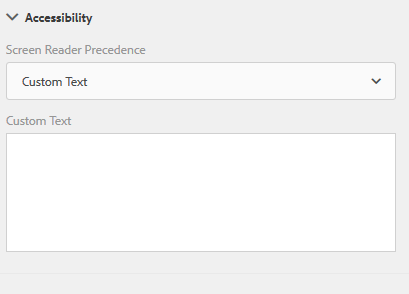

# Creación de formularios adaptables accesibles {#creating-accessible-adaptive-forms}

## Introducción {#introduction}

Un formulario accesible es un formulario que todos pueden utilizar, incluidos los usuarios con necesidades especiales. Adobe Experience Manager (AEM) incluye una serie de funciones y capacidades que mejoran la facilidad de uso de los formularios adaptables para los usuarios con diferentes capacidades. La solución también ayuda a los autores de formularios a crear formularios adaptables accesibles.

Crear la accesibilidad en formularios adaptables no solo permite la mayor audiencia posible para el contenido, sino que también es un requisito al proporcionar documentos en áreas geográficas en las que se exige el cumplimiento de los estándares de accesibilidad. AEM Forms ayuda a los desarrolladores de formularios a cumplir con los estándares de accesibilidad.

Durante la creación de un formulario adaptable, el autor debe tener en cuenta los siguientes puntos para crear un formulario adaptable accesible:

* Proporcionar las etiquetas adecuadas para los controles del formulario
* Proporcionar equivalentes de texto para las imágenes
* Proporcionar suficiente contraste de color
* Asegúrese de que los controles del formulario son accesibles mediante el teclado

## Proporcionar las etiquetas adecuadas para los controles del formulario {#provide-proper-labels-for-form-controls}

La etiqueta o el título de un componente identifica lo que representa el componente del formulario. Por ejemplo, el texto “Nombre” indica a los usuarios que deben introducir su nombre en un campo de texto. Para que los lectores de pantalla puedan acceder, la etiqueta está asociada programáticamente a un componente del formulario. Como alternativa, el control del formulario se configura con información de accesibilidad adicional.

La etiqueta que perciben los lectores de pantalla no necesariamente debe ser la misma que el pie de ilustración visual. En algunos casos, es posible que desee ser más específico sobre el propósito del control. Para cada objeto de campo de un formulario, se pueden utilizar opciones de accesibilidad para especificar lo que anuncia el lector de pantalla para identificar el campo de formulario específico.

Para utilizar la opción Accesibilidad, haga lo siguiente:

1. Seleccione un componente y pulse .
1. Haga clic en **Accesibilidad** en la barra lateral para elegir la opción de accesibilidad deseada.

### Opciones de accesibilidad en componentes del formulario {#accessibility-options-in-form-components}

**Texto personalizado** Los autores de formularios proporcionan el contenido en la opción de accesibilidad Campo de texto personalizado. La tecnología de asistencia, como los lectores de pantalla, utiliza este texto personalizado. El uso de la configuración del título es la mejor opción en la mayoría de los casos. Considere la posibilidad de crear texto personalizado del lector de pantalla solo cuando utilice el título o cuando no sea posible hacer una descripción breve.

**Descripción breve** Para la mayoría de los componentes, la descripción breve aparece durante el tiempo de ejecución cuando el usuario pasa el puntero sobre el componente. Puede establecer esta opción en el campo de descripción breve, bajo la opción de contenido de ayuda.

**Título** Utilice esta opción para permitir que AEM Forms utilice la etiqueta visual asociada al campo de formulario como texto del lector de pantalla.

**Nombre** Puede especificar un valor en el campo Nombre de la pestaña Enlace. El nombre no puede contener espacios.

**Ninguno** Si selecciona Ninguno, el objeto del formulario no tendrá nombre en el formulario publicado. Ninguno no es una configuración recomendada para los controles del formulario.

>[!NOTE]
>
>El botón de opción y la casilla de verificación solo pueden tener dos opciones para la accesibilidad, a saber, Texto personalizado y Título.

>[!NOTE]
>
>Para los formularios adaptables basados en XFA, la opción de accesibilidad se hereda de las opciones de accesibilidad establecidas en el XDP. La información del objeto de XDP se asigna a la descripción breve y el pie de ilustración se asigna al título. Las otras opciones funcionan tal cual.

## Proporcionar equivalentes de texto para las imágenes {#provide-text-equivalents-for-images}

Las imágenes pueden ayudar a mejorar la comprensión de algunos usuarios. Sin embargo, para los usuarios que utilizan lectores de pantalla, las imágenes reducen la accesibilidad del formulario. Si decide utilizar imágenes, proporcione descripciones de texto para todas las imágenes.

Asegúrese de que el texto describa el objeto y su propósito en el formulario. Un lector de pantalla lee este texto alternativo cuando encuentra una imagen. Una imagen siempre debe tener un texto alternativo especificado.

Seleccione un componente de imagen y pulse . En la barra lateral, en Propiedades, especifique el texto alternativo de una imagen.

## Proporcionar suficiente contraste de color {#provide-sufficient-color-contrast}

El diseño de accesibilidad implica considerar directrices adicionales para el uso del color. Los autores de formularios pueden utilizar colores para mejorar el aspecto de los formularios, resaltando los distintos componentes del formulario. Sin embargo, un uso inapropiado del color puede hacer que una forma sea difícil o imposible de leer para personas con capacidades diferentes.

Los usuarios con deficiencias visuales dependen del alto contraste entre el texto y el fondo para poder leer el contenido digital. Sin un contraste suficiente, una forma puede resultar difícil, si no imposible, de leer para algunos usuarios.

Se recomienda utilizar la fuente y los colores de fondo predeterminados, contenido en color negro sobre fondo blanco. Si cambia los colores predeterminados, elija un color de primer plano oscuro en un color de fondo claro o viceversa.

Consulte [Creación de temas personalizados para formularios adaptables](/help/forms/using/creating-custom-adaptive-form-themes.md), para obtener más información sobre cómo cambiar el contraste de color y el tema para los formularios adaptables.

## Asegúrese de que los controles del formulario son accesibles mediante el teclado {#ensure-that-form-controls-are-keyboard-accessible}

Un formulario accesible se puede rellenar por completo utilizando solo el teclado o un dispositivo de entrada equivalente. Es posible que los usuarios con movilidad reducida o problemas de visión no tengan otra opción que utilizar el teclado y que muchos usuarios que pueden utilizar un ratón simplemente prefieran utilizar el teclado. Al permitir varios métodos de entrada no solo se crean formularios accesibles, sino que también se crean formularios que se adaptan mejor a las preferencias de todos los usuarios.

Los siguientes métodos abreviados del teclado están disponibles en AEM Forms.

| Acción | Métodos abreviados del teclado |
|---|---|
| Mover el cursor hacia adelante a través de un formulario | Tab |
| Mover el cursor hacia atrás a través de un formulario | Mayús + Tab |
| Mover al siguiente panel | Alt+Flecha derecha |
| Mover al panel anterior | Alt+Flecha izquierda |
| Restablecer los datos rellenados en un formulario | Alt + R |
| Enviar un formulario | Alt + S | configuring-watched-folder-endpoints.md |
