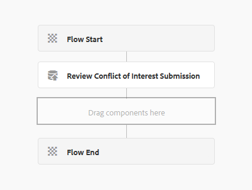
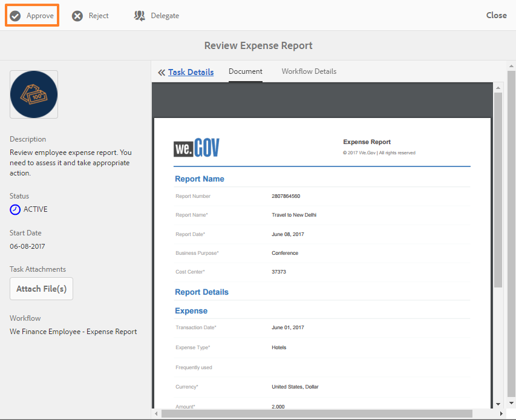

# Recorrido por el sitio de referencia de autoservicio para empleados {#employee-self-service-reference-site-walkthrough}

## Requisitos previos {#prerequisite}

Configure los sitios de referencia tal como se describe en [Configuración de sitios de referencia de AEM Forms](/help/forms/using/setup-reference-sites.md).

## Información general {#overview}

Los sistemas de autoservicio de los empleados, generalmente alojados en la Intranet de la empresa, proporcionan a los empleados acceso a una gran cantidad de información y servicios que pueden utilizar desde sus escritorios. Permite a los empleados realizar acciones como acceder a sus datos de empleo, solicitar licencia y presentar informes de gastos, y les da control total. Por otra parte, ayuda a las organizaciones a mejorar la eficiencia de los procesos y a reducir los costos, manteniendo a los empleados informados y comprometidos.

El sitio de referencia de autoservicio para empleados muestra cómo puede aprovechar AEM Forms para implementar el sistema de autoservicios de los empleados en su organización.

>[!NOTE]
>
>Los casos de uso de autoservicio para empleados están disponibles en los sitios de referencia de We.Finance y We.Gov. Los ejemplos, imágenes y descripciones utilizados en los tutoriales utilizan el sitio de referencia We.Finance . Sin embargo, puede ejecutar estos casos de uso y revisar los artefactos utilizando We.Gov también. Para ello, debe reemplazar **we-finance** con **we-gov** en las URL mencionadas.

## Recorrido por el cuestionario sobre conflictos de interés {#conflict-of-interest-questionnaire-walkthrough}

Las organizaciones de vez en cuando piden a sus empleados que presenten cuestionarios sobre Conflicto de intereses que identifiquen actividades externas o relaciones personales de sus empleados que podrían entrar en conflicto con su organización.

El departamento de Cumplimiento de la organización de Sarah ha pedido a los empleados que presenten el cuestionario sobre Conflicto de Interés.

### Sarah presenta el cuestionario sobre el conflicto de intereses {#sarah-submits-the-conflict-of-interest-questionnaire}

Sarah va al portal de su organización, inicia sesión y hace clic en Empleado para acceder al panel de empleados. Encuentra un cuestionario sobre Conflicto de Interés en el panel del empleado y hace clic en él. **[!UICONTROL Aplicar]**.

**Figura:** *Portal de organización*

**Figura:** *Panel de empleados*

Sarah navega por el formulario con el botón Siguiente y lee las secciones Introducción y Definición . Responde a las preguntas de la sección Preguntas. Por último, firma y presenta el cuestionario.

El portal y el cuestionario de la organización son adaptables y fáciles de usar en los móviles. El siguiente flujo de trabajo muestra cómo Sarah navega por y envía el cuestionario en su dispositivo móvil.

**Funcionamiento**

El portal de organización y el panel de empleados son páginas de AEM Sites. El panel enumera varias opciones de autoservicio como el cuestionario sobre conflictos de interés. El botón Aplicar está vinculado a un formulario adaptable.

El formulario adaptable utiliza reglas para mostrar y ocultar información en función de la respuesta proporcionada en la pestaña Preguntas . Además, el formulario utiliza el componente Scribble para firmar en la ficha Declaración. Consulte el formulario adaptable en `https://[authorHost]:[authorPort]/editor.html/content/forms/af/we-finance/employee/self-service/conflict-of-interest.html`.

**Véalo usted mismo**

Vaya a `https://[publishHost]:[publishPort]/content/we-finance/global/en/self-service-forms.html` e inicie sesión utilizando `srose/srose` como nombre de usuario/contraseña para Sarah. Haga clic en **[!UICONTROL Empleado]** para acceder al tablero y, a continuación, haga clic en **[!UICONTROL Aplicar]** sobre el cuestionario sobre el conflicto de intereses. Revisar y enviar el cuestionario.

### Gloria revisa y aprueba la presentación del cuestionario sobre el conflicto de intereses {#gloria-reviews-and-approves-the-conflict-of-interest-questionnaire-submission}

El cuestionario sobre Conflicto de Interés presentado por Sarah se asigna a Gloria Rios para su revisión. Gloria trabaja como Oficial de Cumplimiento en la organización. Gloria inicia sesión en su Bandeja de entrada AEM y revisa las tareas asignadas a ella. Aprueba el cuestionario presentado por Sarah y completa la tarea.

**Figura:** *La bandeja de entrada de Gloria*

**Figura:** *Abrir tarea*

**Funcionamiento**

La acción de envío del cuestionario Conflict of Interest déclencheur un flujo de trabajo que crea una tarea en la bandeja de entrada de Gloria para su aprobación. Consulte al Forms Workflow en `https://[authorHost]:[authorPort]/editor.html/conf/global/settings/workflow/models/we-finance/employee/self-service/we-finance-employee-conflict-of-interest.html`

**Véalo usted mismo**

Vaya a `https://[publishHost]:[publishPort]/content/we-finance/global/en/login.html?resource=/aem/inbox.html` e inicie sesión utilizando `grios/password` como nombre de usuario/contraseña para Gloria Rios. Abra la tarea creada para el cuestionario Conflict of Interest y apruebe.

## Recorrido por la aplicación de tarjetas corporativas {#corporate-card-application-walkthrough}

Sarah viaja mucho por negocios y requiere una tarjeta de crédito corporativa para pagar sus cuentas en movimiento. Solicita una tarjeta corporativa a través del portal de empleados de su organización.

### Sarah presenta la solicitud de tarjeta corporativa {#sarah-submits-the-corporate-card-application}

Sarah va al portal de su organización, inicia sesión y hace clic **[!UICONTROL Empleado]** para acceder al panel de empleados. Ella encuentra la aplicación de tarjetas de empresa en el panel del empleado y hace clic en **[!UICONTROL Aplicar]**.

**Figura:** *Portal de organización*

**Figura:** *Panel de empleados*

Ella hace clic **[!UICONTROL Aplicar]** en la aplicación de tarjeta corporativa. Se abre una aplicación de una sola página. Ella llena todos los detalles y clics **[!UICONTROL Aplicar]** para enviar la solicitud.

**Funcionamiento**

El portal de organización y el panel de empleados son páginas de AEM Sites. El tablero enumera varias opciones de autoservicio, como la aplicación de tarjeta corporativa. El botón Aplicar de la aplicación está vinculado a un formulario adaptable.

El formulario adaptable para la aplicación de tarjetas corporativas es un formulario adaptable sencillo, de una página y adaptable. Utiliza componentes básicos de formulario adaptable, como texto, teléfono, cuadro numérico y paso numérico. Revise el formulario adaptable en:\
`https://[authorHost]:[authorPort]/editor.html/content/forms/af/we-finance/employee/self-service/corporate-card.html`.

**Véalo usted mismo**

Vaya a `https://[publishHost]:[publishPort]/content/we-finance/global/en/self-service-forms.html` e inicie sesión utilizando `srose/srose` como nombre de usuario/contraseña para Sarah. Haga clic en **[!UICONTROL Empleado]** para acceder al tablero y, a continuación, haga clic en **[!UICONTROL Aplicar]** en la aplicación de tarjeta corporativa. Complete los detalles y envíe la solicitud.

### Gloria revisa y aprueba la aplicación de tarjeta corporativa {#gloria-reviews-and-approves-the-corporate-card-application}

La solicitud de tarjeta corporativa presentada por Sarah se asigna a Gloria Rios para su revisión. Gloria inicia sesión en su Bandeja de entrada AEM y revisa las tareas asignadas a ella. Aprueba la solicitud presentada por Sarah y completa la tarea.

**Figura:** *La bandeja de entrada de Gloria*

**Figura:** *Abrir tarea*

**Funcionamiento**

El flujo de trabajo de envío en la aplicación de tarjeta corporativa déclencheur un flujo de trabajo de Forms que crea una tarea en la bandeja de entrada de Gloria para su aprobación. Consulte al Forms Workflow en `https://[authorHost]:[authorPort]/editor.html/conf/global/settings/workflow/models/we-finance/employee/self-service/we-finance-employee-corporate-card.html`

**Véalo usted mismo**

Vaya a `https://[publishHost]:[publishPort]/content/we-finance/global/en/login.html?resource=/aem/inbox.html` e inicie sesión utilizando `grios/password` como nombre de usuario/contraseña para Gloria Rios. Abra la tarea creada para la aplicación de tarjeta corporativa y agréguela.

## Recorrido para el envío de informes de gastos {#expense-report-submission-walkthrough}

Como Sarah gasta durante viajes de negocios, necesita presentar informes de gastos para su aprobación. La opción de autoservicio de su organización le permite enviar el informe de gastos en línea.

### Sarah presenta la aplicación Informe de gastos {#sarah-submits-the-expense-report-application}

Sarah va al portal de su organización, inicia sesión y hace clic **[!UICONTROL Empleado]** para acceder al panel de empleados. Ella encuentra la aplicación Informe de gastos en el panel del empleado y hace clic en **[!UICONTROL Aplicar]**.

**Figura:** *Portal de organización*

**Figura:** *Panel de empleados*

Ella hace clic **[!UICONTROL Aplicar]** en la aplicación Informe de gastos. Se abre un formulario de aplicación que tiene dos fichas: Nombre del informe y Detalles del informe. La variable **+** en la pestaña Detalles del informe le permite agregar más que gastos en un informe.

El portal y las aplicaciones de la organización son interactivos y fáciles de usar en los móviles. El siguiente flujo de trabajo muestra cómo Sarah navega por su dispositivo móvil y envía el informe de gastos.

**Funcionamiento**

El portal de organización y el panel de empleados son páginas de AEM Sites. El tablero enumera varias opciones de autoservicio, como la aplicación Informe de gastos. El botón Aplicar está vinculado a un formulario adaptable.

Las pestañas Nombre del informe y Detalles del informe del formulario adaptable son componentes de Panel . El panel Detalles del informe contiene el panel Gastos. Es un panel repetible que permite agregar varios gastos en el informe. Consulte el formulario adaptable y sus configuraciones en `https://[authorHost]:[authorPort]/editor.html/content/forms/af/we-finance/employee/expense-report.html`.

**Véalo usted mismo**

Vaya a `https://[publishHost]:[publishPort]/content/we-finance/global/en/self-service-forms.html` e inicie sesión utilizando `srose/srose` como nombre de usuario/contraseña para Sarah. Haga clic en **[!UICONTROL Empleado]** para acceder al tablero y, a continuación, haga clic en **[!UICONTROL Aplicar]** en la aplicación Informe de gastos. Complete los detalles y envíe la solicitud.

### Gloria revisa y aprueba el informe de gastos {#gloria-reviews-and-approves-the-expense-report}

El informe de gastos presentado por Sarah se asigna a Gloria Rios para su revisión. Gloria inicia sesión en su Bandeja de entrada AEM y revisa las tareas asignadas a ella. Aprueba la solicitud presentada por Sarah y completa la tarea.

**Figura:** *La bandeja de entrada de Gloria*

**Figura:** *Abrir tarea*

**Funcionamiento**

El flujo de trabajo de envío de la aplicación Informe de gastos déclencheur un flujo de trabajo de Forms que crea una tarea en la bandeja de entrada de Gloria para su aprobación. Consulte al Forms Workflow en `https://[authorHost]:[authorPort]/editor.html/conf/global/settings/workflow/models/we-finance/employee/self-service/we-finance-employee-expense-report-workflow.html`

**Véalo usted mismo**

Vaya a `https://[publishHost]:[publishPort]/content/we-finance/global/en/login.html?resource=/aem/inbox.html` e inicie sesión utilizando `grios/password` como nombre de usuario/contraseña para Gloria Rios. Abra la tarea creada para la aplicación Informe de gastos y agréguela.

## Salir del tutorial de la aplicación {#leave-application-walkthrough}

Sarah está planeando unas vacaciones familiares el próximo mes y quiere solicitar una semana de licencia laboral.

### Sarah presenta la solicitud de licencia {#sarah-submits-the-leave-application}

Sarah va al portal de su organización, inicia sesión y hace clic **[!UICONTROL Empleado]** para acceder al panel de empleados. Ella encuentra la solicitud de licencia en el panel del empleado y hace clic en **[!UICONTROL Aplicar]**.

**Figura:** *Portal de organización*

**Figura:** *Panel de empleados*

La solicitud de licencia se abre con el nombre de Sarah y el ID de empleado previamente rellenado en el formulario. También muestra su historial y equilibrio de licencia. Completa los detalles de la licencia y presenta la solicitud de aprobación.

El portal y las aplicaciones de la organización son interactivos y fáciles de usar en los móviles. El siguiente flujo de trabajo muestra cómo Sarah navega por la aplicación y la envía en su dispositivo móvil.

**Funcionamiento**

El portal de organización y el panel de empleados son páginas de AEM Sites. En el tablero se enumeran varias opciones de autoservicio, como la aplicación de permiso. El botón Aplicar está vinculado a un formulario adaptable.

El formulario adaptable para la aplicación de licencias se basa en el modelo de datos hojas de trabajo de empleados. En la sección Saldo de la Licencia, la tabla de saldo de la licencia se rellena utilizando la variable `getLeavesOf` Modelo de datos de formulario . Los campos Fechas de inicio y finalización utilizan reglas para validar que los valores de fecha son iguales o posteriores a la fecha actual. La duración de la licencia se calcula utilizando la variable `calcBusinessDays` función.

Puede revisar el formulario adaptable y el Modelo de datos de formulario en las siguientes ubicaciones:

`https://[authorHost]:[authorPort]/editor.html/content/forms/af/we-finance/employee/self-service/leave-application.html`

`https://[authorHost]:[authorPort]/aem/fdm/editor.html/content/dam/formsanddocuments-fdm/db`

**Véalo usted mismo**

Vaya a `https://[publishHost]:[publishPort]/content/we-finance/global/en/self-service-forms.html` e inicie sesión utilizando `srose/srose` como nombre de usuario/contraseña para Sarah. Haga clic en **[!UICONTROL Empleado]** para acceder al tablero y, a continuación, haga clic en **[!UICONTROL Aplicar]** al salir de la aplicación. Complete los detalles y envíe la solicitud.

### Gloria revisa y aprueba la solicitud de licencia {#gloria-reviews-and-approves-the-leave-application}

La solicitud de licencia presentada por Sarah se asigna a Gloria Rios para su revisión. Gloria inicia sesión en su Bandeja de entrada AEM y revisa las tareas asignadas a ella. Aprueba la solicitud presentada por Sarah y completa la tarea.

**Figura:** *La bandeja de entrada de Gloria*

**Figura:** *Abrir tarea*

**Funcionamiento**

El flujo de trabajo de envío en la aplicación de salida déclencheur un flujo de trabajo de Forms que crea una tarea en la bandeja de entrada de Gloria para su aprobación. Consulte al Forms Workflow en `https://[authorHost]:[authorPort]/editor.html/conf/global/settings/workflow/models/we-finance/employee/self-service/we-finance-employee-leave-application.html`

**Véalo usted mismo**

Vaya a `https://[publishHost]:[publishPort]/content/we-finance/global/en/login.html?resource=/aem/inbox.html` e inicie sesión utilizando `grios/password` como nombre de usuario/contraseña para Gloria Rios. Abra la tarea creada para salir de la aplicación y aprobarla.
