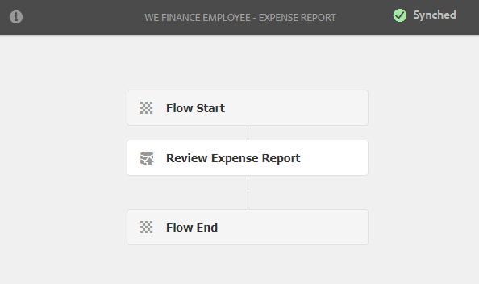

# Recorrido del sitio de referencia de autoservicio de los empleados {#employee-self-service-reference-site-walkthrough}

## Requisitos previos {#prerequisite}

Configure los sitios de referencia tal como se describe en [Configure y configure los sitios de referencia de AEM Forms](/help/forms/using/setup-reference-sites.md).

## Información general {#overview}

Los sistemas de autoservicio de los empleados, generalmente alojados en la Intranet de la compañía, proporcionan a los empleados acceso a una gran cantidad de información y servicios que pueden utilizar en sus escritorios. Permite a los empleados y les da control total para realizar acciones como acceder a sus datos laborales, solicitar licencias y enviar informes de gastos. Por otra parte, ayuda a las organizaciones a mejorar la eficiencia de los procesos y a reducir los costos manteniendo a los empleados informados y comprometidos.

El sitio de referencia de autoservicio de los empleados muestra cómo puede aprovechar AEM Forms para implementar el sistema de autoservicios de los empleados en su organización.

>[!NOTE]
>
>Los casos de uso de autoservicio para empleados están disponibles en los sitios de referencia de We.Finance y We.Gov. Los ejemplos, imágenes y descripciones utilizados en los tutoriales utilizan el sitio de referencia We.Finance. Sin embargo, puede ejecutar estos casos de uso y revisar los artefactos usando We.Gov también. Para ello, debe reemplazar **we-finance** por **we-gov** en las direcciones URL mencionadas.

## Anuncio del cuestionario sobre conflictos de interés {#conflict-of-interest-questionnaire-walkthrough}

De vez en cuando, las organizaciones piden a sus empleados que presenten un cuestionario sobre Conflicto de intereses para identificar actividades externas o relaciones personales de sus empleados que puedan entrar en conflicto con su organización.

El departamento de Cumplimiento de la organización de Sarah ha pedido a los empleados que presenten el cuestionario de Conflicto de Intereses.

### Sarah presenta el cuestionario sobre conflictos de intereses {#sarah-submits-the-conflict-of-interest-questionnaire}

Sarah va al portal de su organización, inicia sesión y hace clic en Empleado para acceder al panel del empleado. Encuentra el cuestionario Conflicto de intereses en el panel del empleado y hace clic **[!UICONTROL Aplicar]**.

**homeFigura:Portal** *de organización*

**tableroFigura:panel** *de empleado*

Sarah navega por el formulario con el botón Siguiente y lee las secciones Introducción y Definición. Ella responde a las preguntas en la sección Preguntas. Por último, firma y presenta el cuestionario.

El portal y el cuestionario de la organización responden a las necesidades de los usuarios y se adaptan a las necesidades de los usuarios. El siguiente flujo de trabajo muestra cómo Sarah navega y envía el cuestionario en su dispositivo móvil.

**Cómo funciona**

El portal de organización y el panel de empleados son páginas de AEM Sites. El panel lista varias opciones de autoservicio, como el cuestionario sobre conflictos de intereses. El botón Aplicar está vinculado a un formulario adaptable.

El formulario adaptable utiliza reglas para mostrar y ocultar información en función de la respuesta proporcionada en la ficha Preguntas. Asimismo, el formulario utiliza el componente Garabatos para firmar en la ficha Declaración. Revise el formulario adaptable en `https://[authorHost]:[authorPort]/editor.html/content/forms/af/we-finance/employee/self-service/conflict-of-interest.html`.

**Véalo usted mismo**

Vaya a `https://[publishHost]:[publishPort]/content/we-finance/global/en/self-service-forms.html` e inicie sesión usando `srose/srose` como nombre de usuario/contraseña para Sarah. Haga clic en **[!UICONTROL Empleado]** para acceder al panel y luego haga clic en **[!UICONTROL Aplicar]** al cuestionario Conflicto de intereses. Revisar y enviar el cuestionario.

### Gloria revisa y aprueba la presentación del cuestionario sobre conflictos de intereses {#gloria-reviews-and-approves-the-conflict-of-interest-questionnaire-submission}

El cuestionario sobre el conflicto de intereses presentado por Sarah se asigna a Gloria Rios para su revisión. Gloria trabaja como Oficial de Cumplimiento en la organización. Gloria inicia sesión en su Bandeja de entrada AEM y revisa las tareas asignadas a ella. Aprueba el cuestionario enviado por Sarah y completa la tarea.

**bandeja de entrada:bandeja de entrada de** *Gloria*

**aprobada por conflictos:tarea** *abierta*

**Cómo funciona**

La acción de envío del cuestionario Conflicto de intereses desencadena un flujo de trabajo que crea una tarea en la bandeja de entrada de Gloria para su aprobación. Revise el Forms Workflow en `https://[authorHost]:[authorPort]/editor.html/conf/global/settings/workflow/models/we-finance/employee/self-service/we-finance-employee-conflict-of-interest.html`

**Véalo usted mismo**

Vaya a `https://[publishHost]:[publishPort]/content/we-finance/global/en/login.html?resource=/aem/inbox.html` e inicie sesión utilizando `grios/password` como nombre de usuario/contraseña para Gloria Rios. Abra la tarea creada para el cuestionario Conflicto de intereses y agréguelo.

## Recorrido de la aplicación de tarjetas corporativas {#corporate-card-application-walkthrough}

Sarah viaja mucho por negocios y requiere una tarjeta de crédito corporativa para pagar sus facturas en movimiento. Ella solicita una tarjeta corporativa a través del portal de empleados de su organización.

### Sarah envía la aplicación de tarjeta corporativa {#sarah-submits-the-corporate-card-application}

Sarah va al portal de su organización, inicia sesión y hace clic **[!UICONTROL Empleado]** para acceder al panel del empleado. Encuentra la aplicación de tarjeta corporativa en el panel del empleado y hace clic **[!UICONTROL Aplicar]**.

**Figura:Portal** *de organización*

**Figura:panel** *de empleado*

Ella hace clic **[!UICONTROL Aplicar]** en la aplicación de tarjeta corporativa. Se abre una aplicación de una sola página. Ella rellena todos los detalles y hace clic **[!UICONTROL Aplicar]** para enviar la aplicación.

**Cómo funciona**

El portal de organización y el panel de empleados son páginas de AEM Sites. El panel lista varias opciones de autoservicio, como la aplicación de tarjeta corporativa. El botón Aplicar de la aplicación está vinculado a un formulario adaptable.

El formulario adaptable para la aplicación de tarjetas corporativas es un formulario adaptable sencillo, de una página y adaptable. Utiliza componentes de formulario adaptables básicos como texto, teléfono, cuadro numérico y paso numérico. Revise el formulario adaptable en:\
`https://[authorHost]:[authorPort]/editor.html/content/forms/af/we-finance/employee/self-service/corporate-card.html`.

**Véalo usted mismo**

Vaya a `https://[publishHost]:[publishPort]/content/we-finance/global/en/self-service-forms.html` e inicie sesión usando `srose/srose` como nombre de usuario/contraseña para Sarah. Haga clic en **[!UICONTROL Empleado]** para acceder al panel y luego haga clic en **[!UICONTROL Aplicar]** en la aplicación de tarjeta corporativa. Complete los detalles y envíe la solicitud.

### Gloria revisa y aprueba la aplicación de tarjetas corporativas {#gloria-reviews-and-approves-the-corporate-card-application}

La solicitud de tarjeta corporativa presentada por Sarah se asigna a Gloria Rios para su revisión. Gloria inicia sesión en su Bandeja de entrada AEM y revisa las tareas asignadas a ella. Aprueba la solicitud presentada por Sarah y completa la tarea.

**inboxFigura:bandeja de entrada de** *Gloria*

**aprobadaFigura:** *Abrir tarea*

**Cómo funciona**

El flujo de trabajo de envío de la aplicación de tarjeta corporativa activa un flujo de trabajo de Forms que crea una tarea en la bandeja de entrada de Gloria para su aprobación. Revise el Forms Workflow en `https://[authorHost]:[authorPort]/editor.html/conf/global/settings/workflow/models/we-finance/employee/self-service/we-finance-employee-corporate-card.html`

**Véalo usted mismo**

Vaya a `https://[publishHost]:[publishPort]/content/we-finance/global/en/login.html?resource=/aem/inbox.html` e inicie sesión utilizando `grios/password` como nombre de usuario/contraseña para Gloria Rios. Abra la tarea creada para la aplicación de tarjeta corporativa y agréguela.

## Recorrido para el envío de informes de gastos {#expense-report-submission-walkthrough}

Mientras Sarah invierte en viajes de negocios, necesita presentar informes de gastos para su aprobación. La opción de autoservicio de su organización le permite enviar el informe de gastos en línea.

### Sarah envía la aplicación Informe de gastos {#sarah-submits-the-expense-report-application}

Sarah va al portal de su organización, inicia sesión y hace clic **[!UICONTROL Empleado]** para acceder al panel del empleado. Encuentra la aplicación Informe de gastos en el panel del empleado y hace clic **[!UICONTROL Aplicar]**.

**Figura:Portal** *de organización*

**Figura:panel** *de empleado*

Ella hace clic **[!UICONTROL Aplicar]** en la aplicación Informe de gastos. Se abre un formulario de aplicación que tiene dos fichas: Nombre del informe y Detalles del informe. El icono **+** de la ficha Detalles del informe le permite agregar más gastos que en un informe.

El portal y las aplicaciones de la organización son adaptables y fáciles de usar para los dispositivos móviles. El siguiente flujo de trabajo muestra cómo Sarah navega por el dispositivo móvil y envía el informe de gastos.

**Cómo funciona**

El portal de organización y el panel de empleados son páginas de AEM Sites. El panel lista varias opciones de autoservicio, como la aplicación Informe de gastos. El botón Aplicar está vinculado a un formulario adaptable.

Las fichas Nombre del informe y Detalles del informe del formulario adaptable son componentes del panel. El panel Detalles del informe contiene el panel Gastos. Es un panel repetible que permite agregar varios gastos en el informe. Revise el formulario adaptable y sus configuraciones en `https://[authorHost]:[authorPort]/editor.html/content/forms/af/we-finance/employee/expense-report.html`.

**Véalo usted mismo**

Vaya a `https://[publishHost]:[publishPort]/content/we-finance/global/en/self-service-forms.html` e inicie sesión usando `srose/srose` como nombre de usuario/contraseña para Sarah. Haga clic en **[!UICONTROL Empleado]** para acceder al panel y luego haga clic en **[!UICONTROL Aplicar]** en la aplicación Informe de gastos. Rellene los detalles y envíe la solicitud.

### Gloria revisa y aprueba el informe de gastos {#gloria-reviews-and-approves-the-expense-report}

El informe de gastos presentado por Sarah se asigna a Gloria Rios para su revisión. Gloria inicia sesión en su Bandeja de entrada AEM y revisa las tareas asignadas a ella. Aprueba la solicitud presentada por Sarah y completa la tarea.

**inboxFigura:bandeja de entrada de** *Gloria*

**approvedFigura:** *Abrir tarea*

**Cómo funciona**

El flujo de trabajo de envío de la aplicación Informe de gastos desencadena un flujo de trabajo de Forms que crea una tarea en la bandeja de entrada de Gloria para su aprobación. Revise el Forms Workflow en `https://[authorHost]:[authorPort]/editor.html/conf/global/settings/workflow/models/we-finance/employee/self-service/we-finance-employee-expense-report-workflow.html`

**Véalo usted mismo**

Vaya a `https://[publishHost]:[publishPort]/content/we-finance/global/en/login.html?resource=/aem/inbox.html` e inicie sesión utilizando `grios/password` como nombre de usuario/contraseña para Gloria Rios. Abra la tarea creada para la aplicación Informe de gastos y agréguela.

## Salir del tutorial de la aplicación {#leave-application-walkthrough}

Sarah está planeando unas vacaciones familiares el mes que viene y quiere solicitar una semana de licencia laboral.

### Sarah presenta la solicitud de licencia {#sarah-submits-the-leave-application}

Sarah va al portal de su organización, inicia sesión y hace clic **[!UICONTROL Empleado]** para acceder al panel del empleado. Encuentra la solicitud de salida en el panel del empleado y hace clic **[!UICONTROL Aplicar]**.

**Figura:Portal** *de organización*

**Figura:panel** *de empleado*

La solicitud de licencia se abre con el nombre de Sarah y la identificación del empleado cumplimentados previamente en el formulario. También muestra su historial y balance de vacaciones. Ella rellena los detalles de la licencia y presenta la solicitud de aprobación.

El portal y las aplicaciones de la organización son adaptables y fáciles de usar para los dispositivos móviles. El siguiente flujo de trabajo muestra cómo Sarah navega por la aplicación y la envía en su dispositivo móvil.

**Cómo funciona**

El portal de organización y el panel de empleados son páginas de AEM Sites. El panel lista varias opciones de autoservicio, como la aplicación de licencia. El botón Aplicar está vinculado a un formulario adaptable.

El formulario adaptable para la aplicación de salida se basa en el modelo de datos Hojas de empleados. En la sección Saldo de salida, la tabla de saldo de salida se rellena con el servicio `getLeavesOf` Modelo de datos de formulario. Los campos de fechas Inicio y Fin utilizan reglas para validar que los valores de fecha sean iguales o posteriores a la fecha actual. La duración de la licencia se calcula mediante la función `calcBusinessDays`.

Puede revisar el formulario adaptable y el modelo de datos de formulario en las siguientes ubicaciones:

`https://[authorHost]:[authorPort]/editor.html/content/forms/af/we-finance/employee/self-service/leave-application.html`

`https://[authorHost]:[authorPort]/aem/fdm/editor.html/content/dam/formsanddocuments-fdm/db`

**Véalo usted mismo**

Vaya a `https://[publishHost]:[publishPort]/content/we-finance/global/en/self-service-forms.html` e inicie sesión usando `srose/srose` como nombre de usuario/contraseña para Sarah. Haga clic en **[!UICONTROL Empleado]** para acceder al panel y luego haga clic en **[!UICONTROL Aplicar]** al salir de la aplicación. Rellene los detalles y envíe la solicitud.

### Gloria revisa y aprueba la solicitud de licencia {#gloria-reviews-and-approves-the-leave-application}

La solicitud de licencia presentada por Sarah se asigna a Gloria Rios para su revisión. Gloria inicia sesión en su Bandeja de entrada AEM y revisa las tareas asignadas a ella. Aprueba la solicitud presentada por Sarah y completa la tarea.

**inboxFigura:bandeja de entrada de** *Gloria*

**aprobarFigura:** *Abrir tarea*

**Cómo funciona**

El flujo de trabajo de envío de la aplicación de salida desencadena un flujo de trabajo de Forms que crea una tarea en la bandeja de entrada de Gloria para su aprobación. Revise el Forms Workflow en `https://[authorHost]:[authorPort]/editor.html/conf/global/settings/workflow/models/we-finance/employee/self-service/we-finance-employee-leave-application.html`

**Véalo usted mismo**

Vaya a `https://[publishHost]:[publishPort]/content/we-finance/global/en/login.html?resource=/aem/inbox.html` e inicie sesión utilizando `grios/password` como nombre de usuario/contraseña para Gloria Rios. Abra la tarea creada para dejar la aplicación y aprobarla.
