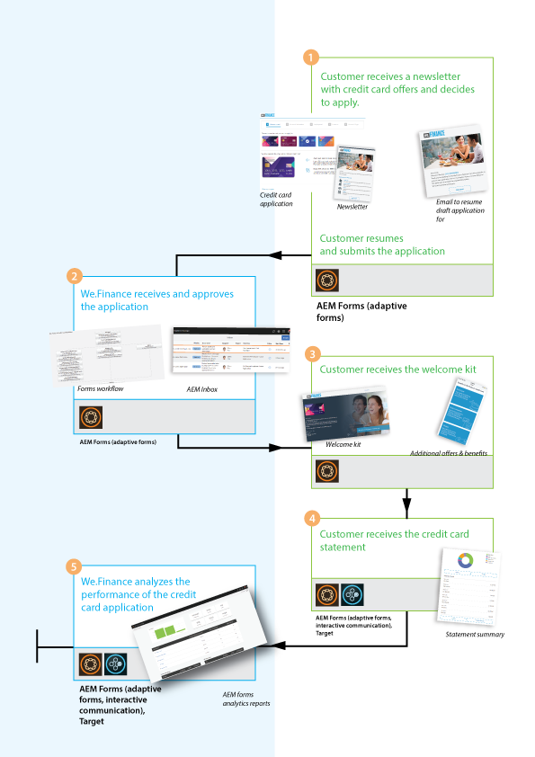
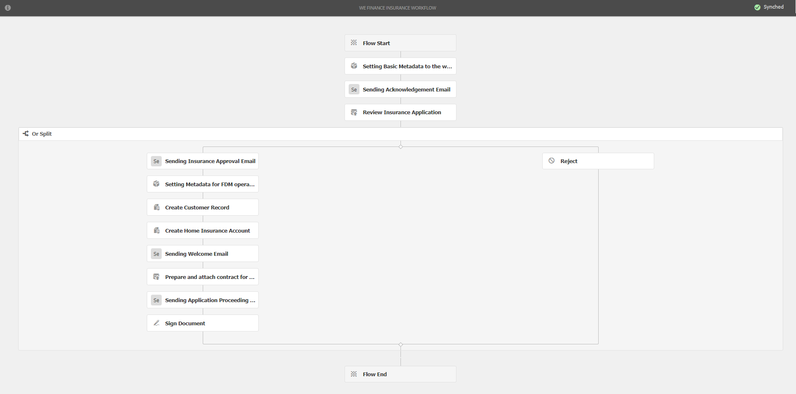

# Recorrido por el sitio web de referencia de We.Finance {#we-finance-reference-site-walkthrough}

>[!CAUTION]
>
>AEM 6.4 ha llegado al final de la compatibilidad ampliada y esta documentación ya no se actualiza. Para obtener más información, consulte nuestra [períodos de asistencia técnica](https://helpx.adobe.com/es/support/programs/eol-matrix.html). Buscar las versiones compatibles [here](https://experienceleague.adobe.com/docs/).

## Requisitos previos {#pre-requisites}

Configure los sitios de referencia tal como se describe en [Configuración de sitios de referencia de AEM Forms](/help/forms/using/setup-reference-sites.md).

## Situaciones de sitio de referencia de We.Finance {#we-finance-reference-site-scenarios}

We.Finance es una organización líder en el ámbito de los servicios financieros que ofrece soluciones financieras completas y personalizadas para satisfacer los requisitos de diversos perfiles de clientes. Ofrecen tarjetas de crédito, hipotecas y servicios de seguro de viviendas.

Su objetivo es llegar a los clientes existentes y potenciales en su dispositivo preferido, explicar los beneficios de sus servicios y ayudarles a inscribirse en sus servicios. Además, buscan presentar más productos financieros como tarjetas adicionales que los clientes puedan encontrar interesantes.

Siga leyendo para obtener información detallada sobre los casos de uso de We.Finance y comprenda cómo AEM Forms ayuda a las organizaciones financieras a lograr sus objetivos. Se cubren los siguientes tutoriales:

* [Recorrido por la aplicación de tarjeta de crédito](#credit-card-application-walkthrough)
* [Recorrido por aplicación de hipoteca](#home-mortgage-application-walkthrough)
* [Recorrido por la aplicación hipotecaria con Microsoft Dynamics](#home-mortgage-application-walkthrough-with-microsoft-dynamics)
* [Recorrido por la aplicación de seguro de domicilio](#home-insurance-application-walkthrough)
* [Recorrido por la gestión de la riqueza](#wealthmanagementwalkthrough)
* [Recorrido por aplicación de seguro automático](#autoinsuranceapplicationwalkthrough)

## Recorrido por la aplicación de tarjeta de crédito {#credit-card-application-walkthrough}

El escenario de la solicitud de tarjeta de crédito We.Finance incluye las siguientes personas:

* Sarah Rose, una clienta de We.Finance
* Gloria Rios, directora de tarjetas de crédito e hipotecas de We.Finance

La siguiente infografía muestra el flujo de trabajo paso a paso de la aplicación de tarjeta de crédito.

Veamos en detalle el escenario del sitio de referencia para comprender cómo AEM Forms ayuda a We.Finance a lograr sus objetivos.

### Sarah recibe un boletín de We.Finance y solicita una tarjeta de crédito {#sarah-receives-a-newsletter-from-we-finance-and-applies-for-a-credit-card}

Sarah Rose es una cliente existente de We.Finance. Recibe un boletín de We.Finance sobre las nuevas tarjetas de crédito que se ofrecen. Ella encuentra emocionante las ofertas y decide solicitar una tarjeta de crédito. Ella hace clic en el botón Aplicar ahora del boletín, que la lleva a la aplicación de tarjeta de crédito en el portal de We.Finance.

#### Funcionamiento {#how-it-works}

La newsletter enviada a Sarah es una implementación personalizada que envía un déclencheur de correo electrónico al ID de correo electrónico especificado. El botón Aplicar ahora del correo electrónico está vinculado a la aplicación de tarjeta de crédito, que es un formulario adaptable en una instancia de publicación.

#### Puede verlo usted mismo {#see-it-yourself}

Abra la siguiente URL en la instancia de publicación para enviar un déclencheur por correo electrónico a la newsletter. Asegúrese de reemplazar `[emailID]` con una cuenta de correo electrónico válida para recibir la newsletter. Abra la newsletter y haga clic en **[!UICONTROL Aplicar ahora]** para ir a la aplicación de tarjeta de crédito.

`https://[publishServer]:[publsihPort]/content/campaigns/we-finance/start.html?app=cc&email=[emailID]&givenName=Sarah&familyName=Rose`

### Sarah encuentra interesante la oferta y opta por postular {#sarah-finds-the-offer-interesting-and-chooses-to-apply}

Sarah decide solicitar la tarjeta de crédito y las toques **[!UICONTROL Aplicar ahora]** en el correo electrónico. Lleva a Sarah a la aplicación de tarjetas de crédito en el portal de We.Finance. El formulario de la aplicación está organizado en secciones que utilizan una presentación de tarjeta.

Sarah selecciona una tarjeta de crédito de las opciones disponibles y hace clic en **[!UICONTROL Continuar]**.

En la página Información Personal, mientras Sarah proporciona su Número de Seguridad Social, recibe un mensaje para iniciar sesión con sus credenciales.

Sarah es una cliente existente de We.Finance. Inicia sesión con sus credenciales de cuenta de We.Finance y sus datos personales se rellenan automáticamente en el formulario. Sarah sigue rellenando el formulario de solicitud y es entonces cuando aparece un recordatorio para una reunión a la que debe asistir. Ella hace clic **[!UICONTROL Guardar mi progreso]** en el formulario de la aplicación. Guarda toda la información que Sarah ha rellenado hasta ahora y aparece un diálogo para confirmar si desea recibir un correo electrónico con un enlace a su solicitud de borrador para completarlo más tarde.

Sarah hace clic **[!UICONTROL Enviar correo]**. Recibe un correo electrónico con un enlace para reanudar su solicitud de tarjeta de crédito.

<!--Theses sections used to be an accordion until converted to straight Markdown. When accordions are enabled, revert-->

### Sarah accede a la aplicación de tarjeta de crédito desde su dispositivo móvil {#a-sarah-access}

Si Sarah está accediendo a la aplicación de tarjeta de crédito desde su dispositivo móvil, la aplicación adaptable se abre en una vista optimizada para dispositivos móviles. En esta vista, el formulario de la aplicación se muestra en una sección a la vez. Permite a Sarah ver y proporcionar información progresivamente a medida que navega por la aplicación.

### Funcionamiento {#a-how-it-works}

La variable **[!UICONTROL Aplicar ahora]** dirige a Sarah a la aplicación de tarjeta de crédito. La aplicación es un formulario adaptable que se puede revisar en las instancias de creación en `https://[host]:[Port]/editor.html/content/forms/af/we-finance/cc-app.html`.

Algunas de las funciones clave que puede revisar en el formulario adaptable son:

* Se basa en un esquema XSD.
* Se crea utilizando el tema A de We Finance para el estilo y la plantilla de We.Finance para el diseño. Además, utiliza Presentación sin títulos de panel en el diseño de encabezado del formulario para la navegación móvil. Muestra un diseño móvil progresivo al abrirlo desde un dispositivo móvil. Puede revisar la plantilla en `https://[host]:[Port]/libs/wcm/core/content/sites/templates.html/conf/we-finance` y el tema de `https://[host]:[Port]/editor.html/content/dam/formsanddocuments-themes/we-finance/we-finance-theme-a/jcr:content`.
* Incluye reglas de formulario adaptables para invocar los servicios del Modelo de datos de formulario con el fin de rellenar previamente los detalles del usuario que ha iniciado sesión. También invoca a los servicios para que rellenen previamente la información por número de la seguridad social o por dirección de correo electrónico proporcionada en el formulario. Puede consultar los modelos de datos de formulario y sus servicios en `https://[host]:[Port]/aem/forms.html/content/dam/formsanddocuments-fdm`.
* Utiliza varios componentes de formulario adaptables para capturar entradas y adaptarse a las respuestas del usuario. También utiliza componentes como Correo electrónico que admiten tipos de entrada de HTML5.
* Utiliza el componente Paso de firma para mostrar el formulario completado y permite la firma electrónica en el formulario.
* El botón Guardar mi progreso genera un ID único para el usuario y guarda la aplicación parcialmente rellenada como un borrador en un nodo de AEM repositorio. Además, muestra un cuadro de diálogo en el que se busca permiso para enviar un correo electrónico con un vínculo al nodo que contiene el borrador de la aplicación. El botón Enviar correo del cuadro de diálogo de confirmación déclencheur un correo electrónico con un vínculo al nodo que contiene el borrador.
* Utiliza la acción Invocar AEM envío del flujo de trabajo para almacenar en déclencheur el flujo de trabajo de aprobación de la tarjeta de crédito. Puede revisar el flujo de trabajo utilizado en este formulario en `https://[host]:[Port]/editor.html/conf/global/settings/workflow/models/we-finance-credit-card-workflow.html`

Se recomienda revisar el formulario para comprender el esquema, los componentes, las reglas, los modelos de datos de formulario, el flujo de trabajo de los formularios y la acción de envío que se utiliza para crear el formulario.

Además, consulte la siguiente documentación para obtener más información sobre las funciones utilizadas en el formulario adaptable de la aplicación de tarjetas de crédito:

* [Introducción a la creación de formularios adaptables](/help/forms/using/introduction-forms-authoring.md)
* [Crear formularios adaptables mediante el esquema XML](/help/forms/using/adaptive-form-xml-schema-form-model.md)
* [Editor de reglas](/help/forms/using/rule-editor.md)
* [Temáticas](/help/forms/using/themes.md)
* [Integración de datos](/help/forms/using/data-integration.md)
* [Uso de Acrobat Sign en formularios adaptables](/help/forms/using/working-with-adobe-sign.md)
* [Flujo de trabajo centrado en Forms en OSGi](/help/forms/using/aem-forms-workflow.md)

### Puede verlo usted mismo {#a-see-it-yourself}

Cuando haya iniciado sesión como Sarah Rose, haga clic en el botón **[!UICONTROL Aplicar ahora]** en la aplicación de tarjeta de crédito. Rellene algunos detalles, explore los distintos componentes del formulario adaptable y haga clic en **[!UICONTROL Guardar mi progreso]** para recibir un correo electrónico con un **[!UICONTROL Reanudar]** que se vincula al borrador de la aplicación. Asegúrese de especificar su ID de correo electrónico en el formulario de la aplicación para recibir el correo electrónico.

Revise el tema de We.Finance disponible en:

`https://<host>:<AuthorPort>/editor.html/content/dam/formsanddocuments-themes/we-Finance/we-Finance-Theme-A/jcr:content`

Puede revisar la plantilla de We.Finance en:

`https://<host>:<AuthorPort>/editor.html/conf/we-finance/settings/wcm/templates/we-finance-template/structure.html`

### Sarah reanuda y presenta la solicitud {#sarah-resumes-and-submits-the-application}

Sarah regresa más tarde y encuentra un correo electrónico de We.Finance. Ella hace clic en el **[!UICONTROL Reanudar]** en el correo electrónico que la lleva a su solicitud de tarjeta de crédito borrador. La información que rellenó antes viene prepoblada. Completa el formulario de solicitud restante, firma la solicitud y la presenta.

También puede acceder a su proyecto de solicitud en **[!UICONTROL Mi Forms]** en la página de inicio de We.Finance .

#### Funcionamiento {#how-it-works-1}

El botón Reanudar del correo electrónico redirige a Sarah al nodo que contiene el borrador de la aplicación.

#### Puede verlo usted mismo {#see-it-yourself-1}

Debe haber recibido un correo electrónico con un vínculo a la aplicación borrador en el ID de correo electrónico que especificó al rellenar el formulario de solicitud. Continúe, rellene las secciones restantes de la aplicación y envíelas.

### We.Finance recibe y aprueba la aplicación {#approving-the-application}

We.Finance recibe la solicitud de tarjeta de crédito presentada por Sarah. Se asigna una tarea a Gloria Rios. Revisa la tarea en su Bandeja de entrada AEM y la aprueba.

#### Funcionamiento {#how-it-works-2}

Cuando Sarah rellena y envía la solicitud de tarjeta de crédito, se crea un déclencheur de Forms Workflow y una tarea en la bandeja de entrada de AEM de Gloria.

AEM Forms en OSGi proporciona flujos de trabajo centrados en formularios que le permiten crear flujos de trabajo adaptables basados en formularios. Estos flujos de trabajo se pueden utilizar para revisiones y aprobaciones, flujos de procesos empresariales, para iniciar document services, integrarse con el flujo de trabajo de firmas de Acrobat Sign, etc. Para obtener más información, consulte [Flujo de trabajo centrado en Forms en OSGi](/help/forms/using/aem-forms-workflow.md).

La siguiente imagen muestra el flujo de trabajo AEM que procesa la aplicación de tarjeta de crédito y genera una salida de PDF de la aplicación.

#### Puede verlo usted mismo {#see-it-yourself-2}

Puede acceder a AEM bandeja de entrada del sitio web de we.finance desde https://&lt;*hostname*>:&lt;*Puerto de publicación*>/content/we-finance/global/en.html. En la página, pulse **[!UICONTROL Iniciar sesión]**, seleccione **[!UICONTROL Iniciar sesión como representante]** , inicie sesión en la bandeja de entrada de AEM mediante `grios/password` como nombre de usuario/contraseña para Gloria Rios, y apruebe la solicitud de tarjeta de crédito. Para obtener información sobre el uso de la Bandeja de entrada AEM para tareas de flujo de trabajo centradas en Forms, consulte [Administrar aplicaciones y tareas de Forms en Bandeja de entrada AEM](/help/forms/using/manage-applications-inbox.md).

Al aprobar la solicitud, Sarah recibe un correo electrónico con el kit de bienvenida.

### Sarah recibe el kit de bienvenida y solicita una tarjeta complementaria {#sarah-receives-the-welcome-kit-and-applies-for-an-add-on-card}

A medida que se aprueba la solicitud de tarjeta de crédito de Sarah, recibe un correo electrónico con un enlace al kit de bienvenida. Abre el kit de bienvenida, que incluye los datos de su cuenta de tarjeta de crédito. El kit de bienvenida también muestra ofertas promocionales personalizadas para Sarah. A medida que se desplaza hacia abajo, el kit de bienvenida contiene un formulario incrustado para solicitar una tarjeta de complemento. Sarah rellenó rápidamente los detalles requeridos desde el kit de bienvenida y solicita la tarjeta adicional. Aparecerá un cuadro de diálogo de confirmación para la aplicación de tarjeta de complemento.

El kit de bienvenida está personalizado para Sarah y muestra información relevante para ella. Le ofrece la opción de descargar una versión PDF del kit de bienvenida.

El kit de bienvenida incluye otro formulario de solicitud que Sarah puede rellenar y enviar para solicitar una tarjeta adicional desde el kit de bienvenida sin visitar el portal de We.Finance.

#### Funcionamiento {#how-it-works-3}

El kit de bienvenida es una comunicación interactiva incluida en la `cq-we-finance-content-pkg.zip` paquete. Las tarjetas interactivas de la versión de escritorio para mostrar los beneficios de la tarjeta de crédito en el kit de bienvenida es un diseño personalizado creado utilizando el diseño de tarjeta predeterminado de un fragmento de documento.

La aplicación de tarjeta complementaria es un formulario adaptable integrado en la comunicación interactiva del kit de bienvenida.

#### Puede verlo usted mismo {#see-it-yourself-3}

Haga clic en el **[!UICONTROL Reanudar]** en el correo electrónico que recibió en el paso anterior. Abre el borrador de la aplicación. Rellene todos los detalles y envíe la solicitud. A continuación, recibirá un kit de bienvenida. Revise el kit de bienvenida.

También puede ver el kit de bienvenida en la siguiente URL:

https://&lt;*host*>:&lt;*puerto*>/content/aemforms-refsite/doclink.html?document=/content/forms/af/we-finance/credit-card/creditcardwelcomkit&amp;customerId=197&amp;channel=web

Puede acceder a él en instancias de autor y publicación.

### Sarah recibe un extracto de tarjeta de crédito {#sarah-receives-a-credit-card-statement}

Cuando Sarah empieza a usar la tarjeta de crédito, recibe otro correo electrónico de We.Finance que incluye su extracto de la tarjeta de crédito. Las siguientes imágenes muestran el correo electrónico con un vínculo al extracto de la tarjeta de crédito en dispositivos móviles.

Sarah hace clic en Ver extracto en el correo electrónico para ver el extracto de la tarjeta de crédito. La declaración es una comunicación interactiva. Tiene las versiones Web e Print (PDF). La instrucción se integra con el Modelo de datos de Forms para recuperar datos, específicos del cliente, de la base de datos. La declaración interactiva constituye varios elementos:

* Resumen de la declaración
* Informe de gastos detallado
* Análisis de gastos gráficos
* Opción para realizar un pago por la cantidad debida desde el estado de cuenta
* Descargue el recibo de pago

Sarah no necesita ir al portal o buscar en sus correos electrónicos la versión PDF del extracto de la tarjeta de crédito para archivarlo fuera de línea. Ella solo hace clic en la Declaración de descarga para descargar una versión PDF de la declaración.

La declaración detallada se presenta en una tabla interactiva. En el estado financiero también se ofrece la opción de pagar una parte o la totalidad de la suma adeudada desde el estado de cuentas.

Sarah programa el pago desde la declaración. Sarah también puede utilizar la opción de pago Flexi para dividir el pago en partes iguales.

#### Funcionamiento {#how-it-works-4}

El extracto de la tarjeta de crédito es una comunicación interactiva. La tabla de gastos detallada de la instrucción es una tabla interactiva. El gráfico para análisis de gastos es un componente de gráfico, lee la tabla de gastos y genera el gráfico circular.

#### Puede verlo usted mismo {#see-it-yourself-4}

Puede revisar el extracto interactivo de la tarjeta de crédito en la siguiente URL:

https://&lt;*hostname*>:&lt;*puerto*>/content/aemforms-refsite/doclink.html?document=/content/forms/af/we-finance/Credit-card/credit-card-statement&amp;customerId=197&amp;channel=web

Puede acceder a él en instancias de autor y publicación.

El extracto de la tarjeta de crédito muestra las ofertas promocionales hacia el final del extracto. Puede integrar Adobe Target con la comunicación interactiva de AEM Forms para ofrecer ofertas con objetivo promocional basadas en segmentos específicos de clientes. Para configurar la comunicación interactiva para que utilice Adobe Target para ofertas personalizadas y segmentadas, consulte [crear experiencias segmentadas](/help/forms/using/experience-targeting-forms.md).

### We.Finance analiza el rendimiento de la aplicación de tarjeta de crédito {#we-finance-analyzes-the-performance-of-the-credit-card-application}

We.Finance, de vez en cuando, revisa el rendimiento de su aplicación de tarjeta de crédito para comprobar si hay algún problema que los clientes puedan estar enfrentando. Utilizan este análisis para tomar decisiones informadas sobre los cambios requeridos en la aplicación de tarjeta de crédito para mejorar la experiencia del usuario, reducir la tasa de abandono de formularios y así mejorar la conversión. Aprovechan la integración de AEM Forms con Adobe Analytics para su análisis. La siguiente imagen muestra su panel de análisis.

Para obtener más información sobre cómo interpretar el panel de análisis, consulte [Visualización y comprensión de los informes de análisis de AEM Forms](/help/forms/using/view-understand-aem-forms-analytics-reports.md).

#### Funcionamiento {#how-it-works-5}

Las métricas de rendimiento del formulario de aplicación de tarjeta de crédito se rastrean mediante Adobe Analytics. Para obtener más información sobre la configuración de Adobe Analytics y la visualización de informes, consulte [Configuración de analytics para formularios y documentos](/help/forms/using/configure-analytics-forms-documents.md).

#### Puede verlo usted mismo {#see-it-yourself-br}

Para que pueda ver y explorar el informe de análisis, proporcionamos datos semilla para la aplicación de tarjeta de crédito en el sitio de referencia. Antes de utilizar los datos de origen, consulte [Configuración de Analytics](/help/forms/using/setup-reference-sites.md#configureanalytics). Realice los siguientes pasos en la instancia de autor para ver el informe con los datos semilla:

1. Vaya a **[!UICONTROL Forms y documentos]** IU en https://&lt;*hostname*>:&lt;*AuthorPort*>/aem/forms.html/content/dam/formsanddocuments.

1. Haga clic en para abrir el **[!UICONTROL We.Finance]** Carpeta.
1. Select **[!UICONTROL Solicitud de tarjeta de crédito]** formulario adaptable y, a continuación, en la barra de herramientas, haga clic en **[!UICONTROL Habilitar Analytics]**.

1. Seleccione de nuevo el formulario adaptable y haga clic en **[!UICONTROL Informe de Analytics]** en la barra de herramientas para generar el informe. Inicialmente verá un informe en blanco.

Para generar un informe de análisis con datos semilla:

1. En el navegador de direcciones de CRXDE lite, escriba: `/apps/we-finance/demo-artifacts/analyticsTestData/Credit card Analytics Test Data`
1. Los datos de prueba se seleccionan en la estructura de directorio del lado izquierdo.
1. Haga doble clic en el archivo seleccionado para abrir su contenido en el panel de la derecha.
1. Copie todo el contenido del archivo de datos semilla.
1. En CRXDE, navegue hasta: `/content/dam/formsanddocuments/we-finance/cc-app/jcr:content/analyticsdatanode/lastsevendays`
1. En el **[!UICONTROL analyticsdata]** campo bajo **[!UICONTROL Propiedades]**, pegue el contenido copiado del archivo de datos semilla.

1. Select **Solicitud de tarjeta de crédito** formulario adaptable y haga clic en **[!UICONTROL Informe de Analytics]** en la barra de herramientas para generar el informe con datos semilla.

**Prueba A/B de la aplicación de tarjeta de crédito**

Además de analizar el rendimiento de la aplicación de tarjetas de crédito y mejorarla constantemente, We.Finance aprovecha la integración de AEM Forms con Target para crear pruebas A/B. Les permite ofrecer diferentes experiencias en el formulario de solicitud de tarjeta de crédito e identificar la experiencia que causa una mejor tasa de conversión en términos de cumplimentación y envío de formularios.

Para configurar Target en el servidor de AEM Forms, consulte [Configuración e integración de Target en AEM Forms](/help/forms/using/ab-testing-adaptive-forms.md#set%20up%20and%20integrate%20target%20in%20aem%20forms).

Siga estos pasos para experimentar la creación de una prueba A/B para el formulario de solicitud de tarjeta de crédito de We.Finance:

1. Vaya a **[!UICONTROL Forms y documentos]** en https://&lt;*hostname*>:&lt;*AuthorPort*>/aem/forms.html/content/dam/formsanddocuments.

1. Haga clic en para abrir el **[!UICONTROL We.Finance]** carpeta.
1. Select **[!UICONTROL Solicitud de tarjeta de crédito]** formulario adaptable.
1. Haga clic en **[!UICONTROL Más]** en la barra de herramientas y seleccione **[!UICONTROL Configurar pruebas A/B]**. Se abrirá la página Configurar prueba A/B.

1. Especifique un **[!UICONTROL Nombre de la actividad]**.
1. En la lista desplegable Audiencia, seleccione la audiencia a la que desee ofrecer diferentes experiencias del formulario. Por ejemplo, **Visitantes que utilicen Chrome**.
1. En el campo **[!UICONTROL Distribución de experiencias]** para las experiencias A y B, especifique la distribución, en términos de porcentaje, para determinar la distribución de experiencias entre la audiencia total. Por ejemplo, si especifica 40 o 60 para las experiencias A y B, respectivamente, la experiencia A se ofrecerá al 40 % de la audiencia y el 60 % restante verá la experiencia B.
1. Haga clic en **Configurar**. Aparecerá un cuadro de diálogo para confirmar la creación de la prueba A/B.
1. Haga clic en **Listo**.
1. Seleccione el **Solicitud de tarjeta de crédito** formulario y haga clic en **Editar**. Permite abrir una de las experiencias. Haga clic en **Experiencia B**. El formulario se abre en modo de edición.

1. Modifique el formulario como desee para crear una experiencia diferente a la experiencia predeterminada A.
1. Vaya a la interfaz de usuario de Forms y Documents, seleccione el formulario y haga clic en **Más** y seleccione **Iniciar pruebas A/B**.

1. Ahora, abra el formulario en el navegador Chrome varias veces con la siguiente URL:

   `https://[hostname]:[port]/content/dam/formsanddocuments/we-finance/cc-app/jcr:content?wcmmode=disabled`

   >[!NOTE]
   >
   >Elimine la cookie con el nombre **mbox** de la persistencia de cookies del explorador antes de abrir el formulario la próxima vez. Verá la experiencia A y B del formulario al azar.

1. Seleccione el formulario, haga clic en **Más** y haga clic en **Informe de prueba A/B**. No encontrará muchos datos en el informe, ya que acaba de comenzar la prueba. Proporcionemos ahora algunos datos semilla para ver el aspecto que tiene el informe de prueba A/B.

1. Abra el CRXDE Lite y realice una copia de seguridad del siguiente archivo: /libs/fd/fmaddon/gui/components/admin/targetreport/clientlibs/targetreport/js/targetreport.js
1. Reemplazar la definición de función `onReportLoadSuccess` en el archivo mencionado anteriormente con la definición de función en el siguiente archivo: /apps/we-finance/demo-artifacts/targetreport.js

   **Nota:** Estos cambios solo tienen un propósito de demostración. Asegúrese de restaurar el contenido del archivo después de completar este procedimiento.

1. Actualice el informe que ha generado y verá algo como lo siguiente. Revise el tablero de informes.

Para finalizar la prueba A/B, haga clic en **Finalizar prueba A/B** en el panel de informes. En este momento, un cuadro de diálogo le pedirá que declare una experiencia. Elija un ganador y confirme que desea finalizar la prueba A/B.

Si elige la experiencia A como ganadora, la prueba A/B finalizará y, en adelante, solo se ofrecerá la experiencia A a todas las audiencias, incluidas las de Chrome.

## Recorrido por aplicación de hipoteca {#home-mortgage-application-walkthrough}

El escenario de hipoteca We.Finance implica a las siguientes personas:

* Sarah Rose, una clienta de We.Finance
* Gloria Rios, directora de tarjetas de crédito e hipotecas de We.Finance
* John Doe, Representante del Servicio de atención al cliente de We.Finance

La siguiente infografía muestra el flujo de trabajo paso a paso de una aplicación hipotecaria.

Ahora analicemos en detalle los pasos del escenario del sitio de referencia para ver cómo AEM Forms ayuda a We.Finance a lograr sus objetivos.

### Sarah visita el sitio web de We.Finance y solicita la hipoteca {#sarah-visits-we-finance-website-and-applies-for-home-mortgage}

Sarah Rose está planeando comprar una casa y buscar planes de hipoteca. Es cliente de We.Finance y por lo tanto visita el portal We.Finance para explorar las ofertas de hipotecas. Ella va a la sección de Préstamos y encuentra una calculadora de hipotecas en el portal. Ella rellena los detalles y hace clic Calcula mi hipoteca, que devuelve un plan de hipoteca.

 
**Figura:** *Calculadora de hipoteca*

**Figura:** *Resultado del calculador hipotecario*

#### Funcionamiento {#how-it-works-6}

La calculadora de hipotecas inmobiliarias de la página Préstamos es un formulario adaptable incorporado en la página de AEM Sites. Puede revisar la página Préstamos en modo de edición en `https://[authorHost]:[authorPort]/editor.html/content/we-finance/global/en/loan-landing-page.html`.

La calculadora de hipotecas incrustadas, que es un formulario adaptable, utiliza reglas para calcular el importe del IME en función de los detalles del préstamo proporcionados en los campos de la calculadora. Puede revisar el formulario adaptable en `https://[authorHost]:[authorPort]/editor.html/content/forms/af/we-finance/hm-calc.html`.

#### Puede verlo usted mismo {#see-it-yourself-5}

Vaya al portal de We.Finance en `https://<publishHost>:<publishPort>/content/we-finance/global/en.html` y haga clic en **[!UICONTROL Préstamos]**. Proporcione detalles en la calculadora de hipotecas y vea los resultados.

### Sarah encuentra interesante la oferta y opta por postular {#sarah-finds-the-offer-interesting-and-chooses-to-apply-1}

Sarah elige solicitar la hipoteca y los clics **[!UICONTROL Aplicar ahora]** en resultados de calculadora de hipotecas inmobiliarias. Abre la solicitud de hipoteca.

Si Sarah está accediendo a la aplicación hipotecaria desde su dispositivo móvil, el formulario de la aplicación se abre en una vista optimizada para su visualización en un dispositivo móvil. En esta vista, el formulario de aplicación procesa una sección a la vez. Permite a Sarah ver y proporcionar información progresivamente a medida que navega por el formulario de solicitud.

Las siguientes imágenes muestran el flujo de trabajo mientras Sarah navega por la aplicación hipotecaria en su dispositivo móvil.

Si Sarah hace clic **Aplicar ahora** desde su escritorio, el formulario de solicitud hipotecaria se abre de la siguiente manera. La información proporcionada por Sarah en la calculadora de hipotecas se rellena previamente en el formulario de solicitud. Sarah rellena los detalles y clics restantes **Continuar**.

Según la información que Sarah rellenó en la calculadora de hipotecas, se le presentan algunos planes hipotecarios. Elige el plan que se adapte a sus necesidades y continúa llenando la solicitud. Finalmente firma y presenta la solicitud.

La solicitud presentada va a We.Finance para su aprobación.

#### Funcionamiento {#how-it-works-7}

La variable **Aplicar ahora** dirige a Sarah a la aplicación hipotecaria. La aplicación es un formulario adaptable que se puede revisar en las instancias de creación en `https://[host]:[Port]/editor.html/content/forms/af/we-finance/hm-app.html`.

Algunas de las funciones clave que puede revisar en el formulario adaptable son:

* Se basa en un esquema XSD, `homeMortgageApplication.xsd`.
* Se crea utilizando el tema B de We Finance para el estilo y la plantilla de We.Finance para el diseño. Además, utiliza Presentación sin títulos de panel en el diseño de encabezado del formulario para la navegación móvil. Muestra un diseño móvil progresivo al abrirlo desde un dispositivo móvil. Puede revisar la plantilla y el tema utilizado en el formulario adaptable en las siguientes ubicaciones de la instancia de autor de AEM:

   * `https://[host]:[Port]/libs/wcm/core/content/sites/templates.html/conf/we-finance`
   * `https://[host]:[Port]/editor.html/content/dam/formsanddocuments-themes/we-finance/we-finance-theme-b/jcr:content`

* La primera pestaña, Introducción, de la aplicación es una calculadora de hipotecas dinámica que muestra las opciones en función de la selección del usuario. Por ejemplo, los campos y valores son diferentes para las opciones de compra y refinanciación. Esta funcionalidad se logra mediante reglas de mostrar y ocultar. Además, al hacer clic en Continuar y inicializar la ficha Planes, se invoca un servicio web configurado en un Modelo de datos de formulario para recuperar y mostrar planes hipotecarios. Puede revisar los modelos de datos de formulario y los servicios configurados en `https://[host]:[Port]/aem/forms.html/content/dam/formsanddocuments-fdm`.
* Utiliza varios componentes de formulario adaptables para capturar entradas y adaptarse a las respuestas del usuario. También utiliza componentes como Correo electrónico que admiten tipos de entrada de HTML5.
* Utiliza el componente Paso de firma para mostrar el formulario completado y permite la firma electrónica en el formulario.
* Utiliza la acción de envío Invocar AEM flujo de trabajo para almacenar en déclencheur el flujo de trabajo de AEM Hipotecario de We Finance. Puede revisar el flujo de trabajo utilizado en este formulario en `https://[host]:[Port]/editor.html/conf/global/settings/workflow/models/we-finance-home-mortgage-workflow.html`

Se recomienda revisar el formulario para comprender el esquema, los componentes, las reglas, los modelos de datos de formulario, el flujo de trabajo de los formularios y la acción de envío que se utiliza para crear el formulario.

Además, consulte la siguiente documentación para obtener más información acerca de las funciones utilizadas en el formulario adaptable de la aplicación hipotecaria:

* [Introducción a la creación de formularios adaptables](/help/forms/using/introduction-forms-authoring.md)
* [Crear formularios adaptables mediante el esquema XML](/help/forms/using/adaptive-form-xml-schema-form-model.md)
* [Editor de reglas](/help/forms/using/rule-editor.md)
* [Temáticas](/help/forms/using/themes.md)
* [Integración de datos](/help/forms/using/data-integration.md)
* [Uso de Acrobat Sign en formularios adaptables](/help/forms/using/working-with-adobe-sign.md)
* [Flujo de trabajo centrado en Forms en OSGi](/help/forms/using/aem-forms-workflow.md)

#### Puede verlo usted mismo {#see-it-yourself-6}

Vaya a `https://[server]:[port]/content/we-finance/global/en/all-forms.html` y haga clic en el botón **Aplicar ahora** en la aplicación hipotecaria propia. Complete los detalles de la ficha Introducción , pruebe con diferentes opciones y envíe la aplicación.

Asegúrese de especificar un ID de correo electrónico válido en la aplicación para recibir un correo de acuse de recibo en la bandeja de entrada.

### We.Finance recibe la aplicación {#approving_the_application-1}

We.Finance recibe la solicitud de hipoteca presentada por Sarah. La tarea de aprobar o rechazar la aplicación se asigna a Gloria Rios. Ella revisa la solicitud y encuentra que la identificación del gobierno de Sarah está desaparecida.

Gloria abre la tarea y hace clic en ¿Necesita más información? y pone un comentario sobre la falta de ID de gobierno.

La tarea ahora se asigna a John Doe, un representante de atención al cliente con We.Finance. Abre la tarea y revisa el comentario de Gloria. Se pone en contacto con Sarah y le pide que envíe una copia de su documento de identidad. Después de recibir una copia del documento de identidad de Sarah, lo adjunta a la tarea y presenta la solicitud de reevaluación.

La tarea se reasigna a Gloria. Revisa el ID adjunto y aprueba la solicitud.

#### Funcionamiento {#how-it-works-8}

Cuando Sarah rellena y envía la solicitud de hipoteca, se crea un déclencheur Forms Workflow y una tarea en la bandeja de entrada de la AEM de Gloria. A medida que Gloria revisa la aplicación y solicita más información, la tarea se asigna a John Doe. Cuando John Doe adjunta el ID y vuelve a enviar la aplicación, se asigna a Gloria. Esto se define en el flujo de trabajo AEM asociado con la aplicación hipotecaria.

AEM Forms en OSGi proporciona flujos de trabajo centrados en formularios que le permiten crear flujos de trabajo adaptables basados en formularios. Estos flujos de trabajo se pueden utilizar para revisiones y aprobaciones, flujos de procesos empresariales, para iniciar document services, integrarse con el flujo de trabajo de firmas de Acrobat Sign, etc. Para obtener más información, consulte [Flujo de trabajo centrado en Forms en OSGi](/help/forms/using/aem-forms-workflow.md).

La siguiente imagen muestra el flujo de trabajo de AEM asociado con la aplicación de hipoteca.

#### Puede verlo usted mismo {#see-it-yourself-7}

Puede acceder a la bandeja de entrada de AEM en https://&lt;***hostname***>:&lt;***AuthorPort***>/content/we-finance/global/en/login.html?resource=/aem/inbox.html. Inicie sesión en la bandeja de entrada de AEM mediante `grios/password` como nombre de usuario/contraseña para Gloria Rios y `jdoe/jdoe` para John Doe y explore el flujo de trabajo de la aplicación de hipoteca de origen.

Para obtener información sobre el uso de la Bandeja de entrada AEM para tareas de flujo de trabajo centradas en Forms, consulte [Administrar aplicaciones y tareas de Forms en Bandeja de entrada AEM](/help/forms/using/manage-applications-inbox.md).

### Sarah recibe el kit de bienvenida {#sarah-receives-the-welcome-kit}

A medida que se aprueba la solicitud hipotecaria de Sarah, recibe un correo electrónico con un enlace al kit de bienvenida. Abre el kit de bienvenida, que incluye un carrusel con ofertas promocionales personalizadas para Sarah.

El kit de bienvenida está personalizado para Sarah y muestra información relevante para ella. Le ofrece la opción de descargar una versión PDF del kit de bienvenida. El botón de flecha en la parte inferior permite a Sarah desplazarse hacia abajo y navegar por otras secciones del kit de bienvenida.

#### Funcionamiento {#how-it-works-9}

El kit de bienvenida es una comunicación interactiva incluida en la `cq-we-finance-content-pkg.zip` paquete. Las ofertas promocionales en el kit de bienvenida son proporcionadas por el servidor de Adobe Target. Las ofertas se personalizan y se dirigen a segmentos específicos de clientes. El kit de bienvenida incluye ofertas de un servidor Adobe Target preconfigurado para un segmento de audiencia de clientes femeninos.

Las tarjetas interactivas de la versión de escritorio del kit de bienvenida utilizan un diseño personalizado creado con el diseño de tarjeta predeterminado de un fragmento de documento.

#### Puede verlo usted mismo {#see-it-yourself-8}

Si ha proporcionado su ID de correo electrónico al rellenar la solicitud de hipoteca, debería haber recibido un correo electrónico que contenga el enlace al kit de bienvenida. Compruebe su bandeja de entrada y revise el kit de bienvenida.

Puede verlo en AEM instancia de publicación en la siguiente URL:

`https://[host]:[port]/content/forms/af/we-finance/mortgage-loan-welcome-kit.html`

### Sarah recibe un estado de cuenta {#sarah-receives-an-account-statement}

Mientras Sarah obtiene el préstamo y empieza a pagar las cuotas, recibe otro correo electrónico de We.Finance que incluye su cuenta mensual.

Sarah hace clic en Ver extracto en el correo electrónico para ver el extracto de la cuenta hipotecaria. La declaración interactiva constituye varios elementos:

* Resumen de la declaración
* Detalles del estado

La siguiente imagen muestra una parte diferente de la instrucción de cuenta en Desktop.

El estado detallado se presenta en un cuadro adaptable y ofrece la opción de pagar una parte o la totalidad de la cantidad adeudada desde el estado de cuentas.

#### Funcionamiento {#how-it-works-10}

El estado de la hipoteca es una comunicación interactiva. Se genera mediante el proceso de agrupamiento de JSON. La tabla de gastos detallada de la instrucción es una tabla interactiva.

#### Puede verlo usted mismo {#see-it-yourself-9}

Puede revisar el estado de la cuenta hipotecaria interactiva en la siguiente URL:

https://&lt;*hostname*>:&lt;*puerto*>/content/forms/af/we-finance/mortgage-account-statement.html?wcmmode=disabled

Puede acceder a él en instancias de autor y publicación.

### We.Finance analiza el rendimiento de la aplicación hipotecaria {#we-finance-analyzes-the-performance-of-the-mortgage-application}

We.Finance, de vez en cuando, revisa el rendimiento de su aplicación hipotecaria para comprobar si hay problemas que los clientes puedan estar enfrentando. Utilizan este análisis para tomar decisiones informadas sobre los cambios requeridos en la aplicación hipotecaria para mejorar la experiencia del usuario, reducir la tasa de abandono de formularios y, por lo tanto, mejorar la conversión. Aprovechan la integración de AEM Forms con Adobe Analytics para su análisis. La siguiente imagen muestra su panel de análisis.

Para obtener más información sobre cómo interpretar el panel de análisis, consulte [Visualización y comprensión de los informes de análisis de AEM Forms](/help/forms/using/view-understand-aem-forms-analytics-reports.md).

#### Funcionamiento {#how-it-works-11}

Las métricas de rendimiento del formulario de solicitud de hipoteca se rastrean con Adobe Analytics. Para obtener más información sobre la configuración de Adobe Analytics y la visualización de informes, consulte [Configuración de analytics para formularios y documentos](/help/forms/using/configure-analytics-forms-documents.md).

#### Puede verlo usted mismo {#see-it-yourself-br-1}

Para que pueda ver y explorar el informe de análisis, proporcionamos los datos semilla para la aplicación de hipoteca en el sitio de referencia. Antes de utilizar los datos de origen, consulte [Configuración de Analytics](/help/forms/using/setup-reference-sites.md#configureanalytics). Realice los siguientes pasos en la instancia de autor para ver el informe con los datos semilla:

1. Vaya a **Forms y documentos** IU en https://&lt;*hostname*>:&lt;*AuthorPort*>/aem/forms.html/content/dam/formsanddocuments.

1. Haga clic en para abrir el **we-finance** Carpeta.
1. Select **[!UICONTROL Solicitud de hipoteca para el hogar]** formulario adaptable y, a continuación, en la barra de herramientas, haga clic en **[!UICONTROL Habilitar Analytics]**.

1. Seleccione de nuevo el formulario y haga clic en **[!UICONTROL Informe de Analytics]** en la barra de herramientas para generar el informe. Inicialmente verá un informe en blanco.

Para generar un informe de análisis con datos semilla:

1. En el navegador de direcciones de CRXDE lite, escriba lo siguiente: `/apps/we-finance/demo-artifacts/analyticsTestData/HomeMortgageAnalyticsTestData`
1. Los datos de prueba se seleccionan en la estructura de directorio del lado izquierdo.
1. Haga doble clic en el archivo seleccionado para abrir su contenido en el panel de la derecha.
1. Copie todo el contenido del archivo de datos semilla.
1. En CRXDE, navegue hasta: `/content/dam/formsanddocuments/we-finance/hm-app/jcr:content/analyticsdatanode/lastsevendays`
1. En el campo analyticsdata de Properties , pegue el contenido copiado del archivo de datos semilla.
1. Ahora vuelva a generar el informe de análisis para el formulario de solicitud de hipoteca de origen. Verá el informe con los datos semilla.

**Prueba A/B de la aplicación hipotecaria**

Además de analizar el rendimiento de la aplicación hipotecaria y mejorarla constantemente, We.Finance aprovecha la integración de AEM Forms con Target para crear pruebas A/B. Permite ofrecer diferentes experiencias del formulario de solicitud e identificar la experiencia que causa una mejor tasa de conversión en términos de finalización y envío de formularios.

Para configurar Target en el servidor de AEM Forms, consulte [Configuración e integración de Target en AEM Forms](/help/forms/using/ab-testing-adaptive-forms.md#set%20up%20and%20integrate%20target%20in%20aem%20forms).

Realice los siguientes pasos en la instancia de autor para experimentar la creación de la prueba A/B para el formulario de aplicación hipotecaria We.Finance:

1. Vaya a **Forms y documentos** en https://&lt;*hostname*>:&lt;*AuthorPort*>/aem/forms.html/content/dam/formsanddocuments.

1. Haga clic en para abrir el **We.Finance** carpeta.
1. Select **Solicitud de hipoteca para el hogar** formulario adaptable.
1. Haga clic en **Más** en la barra de herramientas y seleccione **Configurar pruebas A/B**. Se abrirá la página Configurar prueba A/B.

1. Especifique un **Nombre de la actividad**.
1. En la lista desplegable Audiencia, seleccione la audiencia a la que desee ofrecer diferentes experiencias del formulario. Por ejemplo, **Visitantes que utilicen Chrome**.
1. En el campo **Distribución de experiencias** para las experiencias A y B, especifique la distribución, en términos de porcentaje, para determinar la distribución de experiencias entre la audiencia total. Por ejemplo, si especifica 40 o 60 para las experiencias A y B, respectivamente, la experiencia A se ofrecerá al 40 % de la audiencia y el 60 % restante verá la experiencia B.
1. Haga clic en **Configurar**. Aparecerá un cuadro de diálogo para confirmar la creación de la prueba A/B.
1. Haga clic en **Listo**.
1. Seleccione el **Solicitud de hipoteca para el hogar** formulario adaptable y haga clic en **Editar**. Permite abrir una de las experiencias. Haga clic en **Experiencia B**. El formulario se abre en modo de edición.

1. Modifique el formulario como desee para crear una experiencia diferente a la experiencia predeterminada A.
1. Vaya a la interfaz de usuario de Forms y Documents, seleccione el formulario y haga clic en **Más** y seleccione **Iniciar pruebas A/B**.

1. Ahora, abra el formulario en el navegador Chrome varias veces con la siguiente URL:

   `https://[hostname]:[port]/content/dam/formsanddocuments/we-finance/hm-app/jcr:content?wcmmode=disabled`

   >[!NOTE]
   >
   >Elimine la cookie con el nombre **mbox** de la persistencia de cookies del explorador antes de abrir el formulario la próxima vez. Verá la experiencia A y B del formulario al azar.

1. Seleccione el formulario, haga clic en **Más** y haga clic en **Informe de prueba A/B**. No encontrará muchos datos en el informe, ya que acaba de comenzar la prueba. Proporcionemos ahora algunos datos semilla para ver el aspecto que tiene el informe de prueba A/B.

1. Abra el CRXDE Lite y realice una copia de seguridad del siguiente archivo: /libs/fd/fmaddon/gui/components/admin/targetreport/clientlibs/targetreport/js/targetreport.js
1. Reemplace la definición del `onReportLoadSuccess` en el archivo mencionado anteriormente con la definición de función en el siguiente archivo: /apps/we-finance/demo-artifacts/targetreport.js

   >[!NOTE]
   >
   >Estos cambios solo tienen un propósito de demostración. Asegúrese de restaurar el contenido del archivo después de completar este procedimiento.

1. Actualice el informe que ha generado y verá algo como lo siguiente. Revise el tablero de informes.

Para finalizar la prueba A/B, haga clic en **Finalizar prueba A/B** en el panel de informes. En este momento, un cuadro de diálogo le pedirá que declare una experiencia. Elija un ganador y confirme que desea finalizar la prueba A/B.

Si elige la experiencia A como ganadora, la prueba A/B finalizará y, en adelante, solo se ofrecerá la experiencia A a todas las audiencias, incluidas las de Chrome.

## Recorrido por la aplicación hipotecaria con Microsoft Dynamics {#home-mortgage-application-walkthrough-with-microsoft-dynamics}

El escenario hipoteca We.Finance con Microsoft Dynamics incluye las siguientes personas:

* Sarah Rose, una clienta de We.Finance
* El administrador de la instancia de Microsoft Dynamics de We.Finance

El tutorial de la aplicación Home Mortgage con Microsoft Dynamics demuestra cómo un cliente de We.Finance puede utilizar el sitio para solicitar una hipoteca cuando el sitio de referencia utiliza Microsoft Dynamics para la integración de datos. El tutorial termina con los datos rellenados por el usuario que recibe Microsoft Dynamics. Antes de continuar con este escenario, debe completar la variable [Configuración de Microsoft Dynamics 365 para el flujo de trabajo de la hipoteca de origen del sitio de referencia de We.Finance](/help/forms/using/ms-dynamics-configuration-home-mortgage.md).

### Sarah visita el sitio web de We.Finance y solicita la hipoteca {#sarah-visits-we-finance-website-and-applies-for-home-mortgage-1}

Sarah Rose está planeando comprar una casa y buscar planes de hipoteca. Es cliente de We.Finance y por lo tanto visita el portal We.Finance para explorar las ofertas de hipotecas. Ella va a la sección de Préstamos y encuentra una calculadora de hipotecas en el portal. Ella rellena los detalles y hace clic Calcula mi hipoteca, que devuelve un plan de hipoteca.

 
**Figura:** *Calculadora de hipoteca*

**Figura:** *Resultado del calculador hipotecario*

#### Funcionamiento {#how-it-works-12}

La calculadora de hipotecas inmobiliarias de la página Préstamos es un formulario adaptable incorporado en la página de AEM Sites. Puede revisar la página Préstamos en modo de edición en `https://[authorHost]:[authorPort]/editor.html/content/we-finance/global/en/loan-landing-page.html`.

La calculadora de hipotecas incrustadas, que es un formulario adaptable, utiliza reglas para calcular el importe del IME en función de los detalles del préstamo proporcionados en los campos de la calculadora. Puede revisar el formulario adaptable en `https://[authorHost]:[authorPort]/editor.html/content/forms/af/we-finance/ms-dynamics/home-mortgage-calculator.html`.

#### Puede verlo usted mismo {#see-it-yourself-10}

Vaya al portal de We.Finance en `https://<publishHost>:<publishPort>/content/we-finance/global/en.html` y haga clic en **[!UICONTROL Préstamos]**. Proporcione detalles en la calculadora de hipotecas y vea los resultados.

### Sarah encuentra interesante la oferta y opta por postular {#sarah-finds-the-offer-interesting-and-chooses-to-apply-2}

Sarah elige solicitar la hipoteca y los clics **[!UICONTROL Aplicar ahora]** en resultados de calculadora de hipotecas inmobiliarias. Abre la solicitud de hipoteca.

Si Sarah está accediendo a la aplicación hipotecaria desde su dispositivo móvil, el formulario de la aplicación se abre en una vista optimizada para su visualización en un dispositivo móvil. En esta vista, el formulario de aplicación procesa una sección a la vez. Permite a Sarah ver y proporcionar información progresivamente a medida que navega por el formulario de solicitud.

Las siguientes imágenes muestran el flujo de trabajo mientras Sarah navega por la aplicación hipotecaria en su dispositivo móvil.

Si Sarah hace clic **Aplicar ahora** desde su escritorio, el formulario de solicitud hipotecaria se abre de la siguiente manera. La información proporcionada por Sarah en la calculadora de hipotecas se rellena previamente en el formulario de solicitud. Sarah rellena los detalles y clics restantes **Continuar**.

Según la información que Sarah rellenó en la calculadora de hipotecas, se le presentan algunos planes hipotecarios. Elige el plan que se adapte a sus necesidades y continúa llenando la solicitud. Finalmente firma y presenta la solicitud.

La solicitud presentada va a We.Finance para su aprobación.

#### Funcionamiento {#how-it-works-13}

La variable **Aplicar ahora** dirige a Sarah a la aplicación hipotecaria. La aplicación es un formulario adaptable que se puede revisar en las instancias de creación en `https://[host]:[Port]/editor.html/content/forms/af/we-finance/ms-dynamics/application-for-home-mortgage.html`.

Algunas de las funciones clave que puede revisar en el formulario adaptable son:

* Se basa en un esquema XSD, `homeMortgageApplication.xsd`.
* Se crea utilizando el tema B de We Finance para el estilo y la plantilla de We.Finance para el diseño. Además, utiliza Presentación sin títulos de panel en el diseño de encabezado del formulario para la navegación móvil. Muestra un diseño móvil progresivo al abrirlo desde un dispositivo móvil. Puede revisar la plantilla y el tema utilizado en el formulario adaptable en las siguientes ubicaciones de la instancia de autor de AEM:

   * `https://[host]:[Port]/libs/wcm/core/content/sites/templates.html/conf/we-finance`
   * `https://[host]:[Port]/editor.html/content/dam/formsanddocuments-themes/we-finance/we-finance-theme-b/jcr:content`

* La primera pestaña, Introducción, de la aplicación es una calculadora de hipotecas dinámica que muestra las opciones en función de la selección del usuario. Por ejemplo, los campos y valores son diferentes para las opciones de compra y refinanciación. Esta funcionalidad se logra mediante reglas de mostrar y ocultar. Además, al hacer clic en Continuar y inicializar la ficha Planes, se invoca un servicio web configurado en un Modelo de datos de formulario para recuperar y mostrar planes hipotecarios. Puede revisar los modelos de datos de formulario y los servicios configurados en `https://[host]:[Port]/aem/forms.html/content/dam/formsanddocuments-fdm`.
* Utiliza varios componentes de formulario adaptables para capturar entradas y adaptarse a las respuestas del usuario. También utiliza componentes como Correo electrónico que admiten tipos de entrada de HTML5.
* Utiliza el componente Paso de firma para mostrar el formulario completado y permite la firma electrónica en el formulario.

Se recomienda revisar el formulario para comprender el esquema, los componentes, las reglas, los modelos de datos de formulario, el flujo de trabajo de los formularios y la acción de envío que se utiliza para crear el formulario.

### El administrador ve los datos enviados en la instancia de Microsoft Dynamics {#the-administrator-views-the-submitted-data-in-the-microsoft-dynamics-instance}

We.Finance recibe la solicitud de hipoteca presentada por Sarah en la instancia de Microsoft Dynamics. El administrador toca la entrada en la columna de posibles clientes para ir al registro de posibles clientes creado para Sarah Rose.

## Recorrido por la aplicación de seguro de domicilio {#home-insurance-application-walkthrough}

El escenario de seguro de casa de We.Finance incluye las siguientes personas:

* Sarah Rose, una clienta de We.Finance
* Gloria Rios, directora de tarjetas de crédito e hipotecas de We.Finance
* Frank De Costa, Agente De Seguros, We.Finance

La siguiente infografía muestra el flujo de trabajo paso a paso de una aplicación de seguro de domicilio.

Ahora analicemos en detalle los pasos del escenario del sitio de referencia para ver cómo AEM Forms ayuda a We.Finance a lograr sus objetivos.

### Sarah recibe un boletín de We.Finance y solicita un seguro de casa {#sarah-receives-a-newsletter-from-we-finance-and-applies-for-home-insurance}

Sarah Rose es una cliente hipotecaria de We.Finance y busca un buen negocio de seguros de vivienda. Ella visita el portal We.Finance y explora los planes de seguro de casa. We.Finance la identificó como una clienta existente y le envía un boletín informativo dirigido por correo electrónico. El boletín informativo contiene ofertas de seguros para el hogar.

#### Funcionamiento {#how-it-works-14}

La newsletter enviada a Sarah es una implementación personalizada que envía un déclencheur de correo electrónico al ID de correo electrónico especificado. El botón Aplicar ahora del boletín está vinculado a la aplicación de seguro de casa, que es un formulario adaptable en una instancia de publicación.

#### Puede verlo usted mismo {#see-it-yourself-11}

Abra la siguiente URL para enviar un déclencheur por correo electrónico a una newsletter. Asegúrese de reemplazar `[emailID]` con una cuenta de correo electrónico válida para recibir la newsletter. Abra la newsletter y haga clic en **[!UICONTROL Aplicar ahora]** para ir a la aplicación de seguro de casa.

`https://[authorServer]:[authorPort]/content/campaigns/we-finance/start.html?app=ins&email=[emailID]&givenName=Sarah&familyName=Rose`

### Sarah encuentra interesante la oferta de seguro de vivienda y opta por postular {#sarah-finds-the-home-insurance-offer-interesting-and-chooses-to-apply}

A Sarah le gusta el plan de seguro en el boletín informativo y decide solicitarlo. Ella hace clic en Aplicar ahora en el boletín, que abre la aplicación de seguro en el portal de We.Finance. El formulario de la aplicación está organizado en secciones que utilizan una presentación de tarjeta.

En la página Información Personal, mientras Sarah proporciona su Número de Seguridad Social, recibe un mensaje para iniciar sesión con sus credenciales.

Sarah es una cliente existente de We.Finance. Inicia sesión con sus credenciales de cuenta de We.Finance y sus datos personales se rellenan automáticamente en el formulario. Ella continúa llenando y presentando la solicitud.

Si Sarah enviara la solicitud en un dispositivo móvil, iría a través de las siguientes pantallas.

#### Funcionamiento {#how-it-works-15}

La variable **Aplicar ahora** en el boletín le dirige a Sarah a la aplicación de seguros de casa en el portal de We.Finance. La aplicación es un formulario adaptable que se puede revisar en la instancia de creación en `https://[host]:[Port]/editor.html/content/forms/af/we-finance/insurance/application-for-insurance.html`.

Algunas de las funciones clave que puede revisar en el formulario adaptable son:

* Se basa en un esquema XSD, `insurance.xsd`.
* Se crea utilizando el tema Seguros para el estilo y utiliza Presentación sin títulos de panel en el diseño de encabezado del formulario para la navegación móvil. Muestra un diseño móvil progresivo al abrirlo desde un dispositivo móvil. Puede revisar la plantilla en `https://[host]:[Port]/libs/wcm/core/content/sites/templates.html/conf/we-finance` y el tema de `https://[host]:[Port]/editor.html/content/dam/formsanddocuments-themes/we-finance/insurance/jcr:content`.

* Incluye reglas de formulario adaptables para invocar los servicios del Modelo de datos de formulario con el fin de rellenar previamente los detalles del usuario que ha iniciado sesión. También invoca a los servicios para que rellenen previamente la información por número de la seguridad social o por dirección de correo electrónico proporcionada en el formulario. Puede consultar los modelos de datos de formulario y sus servicios en `https://[host]:[Port]/aem/forms.html/content/dam/formsanddocuments-fdm`.
* Utiliza varios componentes de formulario adaptables para capturar entradas y adaptarse a las respuestas del usuario. También utiliza componentes como Correo electrónico que admiten tipos de entrada de HTML5.
* El botón Guardar mi progreso genera un ID único para el usuario y guarda la aplicación parcialmente rellenada como un borrador en un nodo de AEM repositorio. Además, muestra un cuadro de diálogo en el que se busca permiso para enviar un correo electrónico con un vínculo al nodo que contiene el borrador de la aplicación. El botón Enviar correo del cuadro de diálogo de confirmación déclencheur un correo electrónico con un vínculo al nodo que contiene el borrador.
* Utiliza la acción de envío Invocar AEM flujo de trabajo para almacenar en déclencheur el flujo de trabajo de aprobación del seguro de casa. Puede revisar el flujo de trabajo utilizado en este formulario en `https://[host]:[Port]/editor.html/conf/global/settings/workflow/models/we-finance-insurance-workflow.html`

Se recomienda revisar el formulario para comprender el esquema, los componentes, las reglas, los modelos de datos de formulario, el flujo de trabajo de los formularios y la acción de envío que se utiliza para crear el formulario.

Además, consulte la siguiente documentación para obtener más información sobre las funciones utilizadas en el formulario adaptable de la aplicación de seguros de domicilio:

* [Introducción a la creación de formularios adaptables](/help/forms/using/introduction-forms-authoring.md)
* [Crear formularios adaptables mediante el esquema XML](/help/forms/using/adaptive-form-xml-schema-form-model.md)
* [Editor de reglas](/help/forms/using/rule-editor.md)
* [Temáticas](/help/forms/using/themes.md)
* [Integración de datos](/help/forms/using/data-integration.md)
* [Uso de Acrobat Sign en formularios adaptables](/help/forms/using/working-with-adobe-sign.md)
* [Flujo de trabajo centrado en Forms en OSGi](/help/forms/using/aem-forms-workflow.md)

#### Puede verlo usted mismo {#see-it-yourself-12}

Haga clic en **Aplicar ahora** en la newsletter que habría recibido en su correo electrónico. Como alternativa, vaya a `https://[publishHost]:[publishPort]/content/we-finance/global/en/all-forms.html` y haga clic en **[!UICONTROL Aplicar]** en la solicitud de seguro. Especifique `123456789` en el campo Número de seguridad social . Cuando se le solicite, inicie sesión con `srose/srose` como nombre de usuario/contraseña.

Rellene los detalles, explore los distintos componentes del formulario adaptable y envíe la aplicación. Puede revisar el formulario adaptable en `https://[authorHost]:[authorPort]/editor.html/content/forms/af/we-finance/insurance/application-for-insurance.html`.

### We.Finance aprueba la solicitud y se firma un contrato {#we-finance-approves-the-application-and-a-contract-is-signed}

We.Finance recibe la solicitud de seguro de casa presentada por Sarah. Se asigna una tarea a Gloria Rios. Revisa la aplicación en su Bandeja de entrada AEM y la aprueba.

Mientras Gloria aprueba la aplicación de seguro de casa de Sarah, se crea una tarea en la Bandeja de entrada AEM de Frank De Costa. Frank revisa la tarea. Prepara un contrato de seguro domiciliario para Sarah, adjunta el contrato a su solicitud y lo envía a Sarah para que firme el contrato. El contrato, que se muestra a continuación en la interfaz de usuario del agente, es la versión de impresión de la comunicación interactiva.

Sarah recibe un correo electrónico con un enlace al contrato de póliza de seguro de domicilio para firmar. Sarah revisa y firma el contrato.

#### Funcionamiento {#how-it-works-16}

Cuando Sarah envía la solicitud de seguro de domicilio, se crea un déclencheur Forms Workflow y una tarea en la bandeja de entrada de AEM de Gloria. Mientras Gloria revisa la solicitud y la aprueba, la tarea se asigna a Frank De Costa. El flujo de tareas de una persona a otra se define en el flujo de trabajo de AEM asociado a la aplicación de seguro. Para obtener más información sobre los flujos de trabajo, consulte [Flujo de trabajo centrado en Forms en OSGi](/help/forms/using/aem-forms-workflow.md).

La siguiente imagen muestra el flujo de trabajo AEM asociado con la aplicación de seguro.

Frank usa la gestión de correspondencia para preparar un contrato de póliza de seguro de vivienda. Descarga el PDF del contrato y lo adjunta a la aplicación de Sarah y hace clic en Enviar contrato. El flujo de trabajo déclencheur un correo a Sarah con contrato de póliza de seguro de domicilio para firmar.

#### Puede verlo usted mismo {#see-it-yourself-13}

Haga lo siguiente:

1. Vaya a AEM bandeja de entrada, `https://[publishHost]:[publishPort]/content/we-finance/global/en/login.html?resource=/aem/inbox.html`e inicie sesión con `grios/grios` como contraseña de nombre de usuario para la personalidad de Gloria. Apruebe la tarea para la aplicación de seguro de casa de Sarah.

1. A continuación, inicie sesión en AEM Bandeja de entrada con `fdcosta/password` como contraseña de nombre de usuario para la persona de Frank. Ver la tarea.
1. Ahora, vaya a `https://[authorHost]:[authorPort]/aem/forms.html/content/dam/formsanddocuments/we-finance/insurance` y previsualice la plantilla de la carta para HomeInsuranceWelcomeKit.
1. Especifique información en el panel Datos . Haga clic en **[!UICONTROL Vista previa]** y luego descargue el PDF en su sistema de archivos local. Asegúrese de que el archivo PDF esté guardado con el nombre de archivo Contract.pdf .
1. Vaya a la Bandeja de entrada AEM de Frank, abra la tarea, adjunte el PDF de contrato descargado y haga clic en **[!UICONTROL Enviar contrato]**.
1. Abra el correo electrónico con contrato y firme el documento.

### Sarah recibe un kit de bienvenida {#sarah-receives-a-welcome-kit}

Mientras Sarah firma el contrato de seguro domiciliario, recibe un correo electrónico con los detalles de la póliza.

En breve, recibe otro correo electrónico de We.Finance con un kit de bienvenida para su póliza de seguro. Desde el kit de bienvenida, Sarah puede acceder a sus documentos de política y ver declaraciones.

#### Puede verlo usted mismo {#see-it-yourself-14}

Si especificara su ID de correo electrónico en la aplicación, habría recibido un correo electrónico con un vínculo al kit de bienvenida. Haga clic en **[!UICONTROL Mi kit de bienvenida]** para abrir el kit de bienvenida.

## Recorrido por el folleto sobre la gestión de la riqueza {#wealth-management-prospectus-walkthrough}

El escenario de la gestión de riqueza de We.Finance incluye la siguiente persona:

* Sarah Rose, una clienta de We.Finance

El tutorial sobre la gestión de la riqueza demuestra cómo un cliente de We.Finance puede usar el sitio para aprender acerca de un fondo mutuo, el Blue Chip Growth Fund. El sitio de referencia utiliza una comunicación interactiva para mostrar información sobre el fondo. La información está disponible en los formatos web y PDF. El recorrido termina con un mensaje de correo electrónico del cliente a su hermano con la versión PDF de la información.

La siguiente imagen muestra el flujo de trabajo del tutorial de gestión de riqueza:

### Sarah visita el sitio web de We.Finance y abre el folleto del Blue Chip Growth Fund {#sarah-visits-we-finance-website-and-opens-the-blue-chip-growth-fund-prospectus}

Sarah Rose está planeando invertir en un fondo mutuo. Es una clienta existente de We.Finance y por lo tanto visita el portal de We.Finance para explorar los fondos mutuos disponibles. Ella va a la sección de Manejo de la Riqueza y abre la página del Fondo de Crecimiento de Chip Azul de We.Finance. La página contiene vínculos a un folleto que contiene detalles sobre los precios actuales e históricos, el rendimiento mensual, la diversificación sectorial, los gastos, las tasas, los impuestos y más información sobre los fondos.

#### Funcionamiento {#how-it-works-17}

El folleto del Fondo para el Crecimiento del Chip Azul es una comunicación interactiva. Utiliza textos, imágenes, gráficos y componentes de tabla (fragmentos de documento) para mostrar el resumen del producto, el estilo de las existencias, el rendimiento del fondo, los detalles del fondo y otra información relacionada. Puede revisar la comunicación interactiva en el modo de edición en https://[authorHost]:[ authorPort]/editor.html/content/forms/af/we-finance/wealth-management/wealth-management/channels/web.html

Los gráficos y tablas recuperan datos de un modelo de datos de formulario. El modelo de datos de formulario se conecta a orígenes de datos configurados, una base de datos en este tutorial, para recuperar información específica del fondo. Puede revisar el modelo de datos de formulario en https://[authorHost]:[authorPort]/aem/fdm/editor.html/content/dam/formsanddocuments-fdm/we-finance/riqueza-management

#### Puede verlo usted mismo  {#see-it-yourself-15}

Vaya al portal de We.Finance en https://[publishHost]:[publishPort]/wefinance, pulse Gestión de la Riqueza, expanda Fondos por Clase de Activos y pulse We.Finance Blue Chip Growth Fund. Se abre el folleto del Fondo de Crecimiento de Chip Azul de We.Finance.

### Sarah explora el folleto del Fondo para el Crecimiento del Chip Azul para conocer el fondo {#sarah-explores-the-blue-chip-growth-fund-prospectus-to-learn-about-the-fund}

Sarah explora las pestañas Visión General, Precio y Rendimiento, Gestión de Portfolio, Tarifas y Mínimo, e Impuestos y Pagos del folleto para conocer los precios actuales e históricos, crecimiento histórico, comparación con el índice S&amp;P 500, diversificación sectorial, personas que administran el fondo y gastos relacionados con el fondo. La información relacionada se divide en distintas pestañas. El folleto es una comunicación interactiva. Las comunicaciones interactivas tienen un diseño interactivo. Puede abrir la comunicación interactiva en un dispositivo de cualquier tamaño de pantalla y la comunicación interactiva refleja el diseño para adaptarse al dispositivo subyacente.

#### Funcionamiento {#how-it-works-18}

La comunicación interactiva del Fondo para el Crecimiento del Chip Azul utiliza paneles principales y secundarios para separar la información relacionada en diferentes secciones. El panel principal organiza todos los paneles secundarios en fichas.

El diseño de la ficha principal se establece en Tabulaciones en la parte superior para convertir todos los paneles secundarios en fichas. Puede revisar los paneles de la comunicación interactiva en el modo de edición en https://[authorHost]:[ authorPort]/editor.html/content/forms/af/we-finance/wealth-management/wealth-management/channels/web.html.

#### Puede verlo usted mismo  {#see-it-yourself-16}

Vaya a la comunicación interactiva Blue Chip Growth Fund en https://[publishHost]:[ publishPort]/content/forms/af/we-finance/wealth-management/wealth-management/channels/web.html?wcmmode=disabled. Explore todas las pestañas.

### Sarah ve y envía un correo electrónico a la versión PDF de la página del Fondo para el Crecimiento de Blue Chip {#sarah-views-and-emails-the-pdf-version-of-the-blue-chip-growth-fund-page}

Sarah está viajando al campo el fin de semana. Ella planea discutir con su hermano mayor sobre el Fondo para el Crecimiento del Chip Azul. Su hermano mayor trabaja con un banco y la ayuda en decisiones relacionadas con las finanzas. Sarah descarga una copia de la versión PDF de la página del Fondo para el Crecimiento de Blue Chip en su portátil para la lectura fuera de línea. También le envía una copia de la versión del PDF a su hermano.

#### Funcionamiento {#how-it-works-19}

El folleto del Fondo para el Crecimiento del Chip Azul es una comunicación interactiva. Tiene un canal web y un canal PDF. La comunicación interactiva se integra con AEM Flujos de trabajo para enviar la versión del PDF por correo electrónico. Puede revisar el modelo de flujo de trabajo en https://[authorHost]:[ authorPort]/editor.html/conf/global/settings/workflow/models/wealthmanagement.html.

#### Puede verlo usted mismo  {#see-it-yourself-17}

Para descargar la versión del PDF, vaya a la comunicación interactiva Blue Chip Growth Fund https://[publishHost]:[ publishPort]/content/forms/af/we-finance/wealth-management/wealth-management/channels/web.html, pulse Descargar PDF.

Para enviar un PDF por correo electrónico, vaya a la comunicación interactiva Blue Chip Growth Fund https://[publishHost]:[ publishPort]/content/forms/af/we-finance/wealth-management/wealth-management/channels/web.html, pulse el PDF de CORREO ELECTRÓNICO. Especifique **Nombre completo** y **Dirección de correo electrónico**. Haga clic en **Enviar correo electrónico**.

## Recorrido por aplicación de seguro automático {#auto-insurance-application-walkthrough}

El escenario de la aplicación de seguro automático de We.Finance implica a la siguiente persona:

* Sarah Rose, una clienta de We.Finance
* Conrad Simms, Agente De Seguros, We.Finance

Sarah Rose es una clienta existente de We.Finance y ha adquirido una póliza de seguro del coche. Se acerca la fecha de renovación de la póliza de su seguro. Conrad Simms, Agente de Seguros, We.Finance envía un recordatorio a Sarah sobre su renovación de pólizas. El correo electrónico del recordatorio contiene un PDF que contiene detalles de renovación de directivas y un vínculo a la versión web de la comunicación interactiva. Las comunicaciones interactivas tienen un diseño adaptable y adaptable para dispositivos móviles. Puede abrir la comunicación interactiva en cualquier dispositivo y la comunicación interactiva se reajusta para adaptarse al tamaño de pantalla del dispositivo subyacente. La versión del PDF de la comunicación interactiva, adjunta al correo electrónico, es útil para la lectura sin conexión.

Sarah sigue las instrucciones proporcionadas en el correo electrónico y renueva correctamente el proceso. La siguiente imagen muestra el flujo de trabajo del tutorial de la aplicación de seguro automático:  

### Conrad envía una comunicación de renovación de pólizas de seguro desde We.Finance {#conrad-sends-an-insurance-policy-renewal-communication-from-we-finance}

Confirmar registros en AEM instancia, abre el panel Seguros automáticos especifica el de Sarah **ID de cliente** y clics **Renovar directiva**. La variable **Interfaz de usuario del agente** se abre con detalles de política de Sarah Rose ya rellenada. Confirmar la dirección de correo electrónico especificada de Sarah y los clics **Submit**. Sarah recibe un correo electrónico con el asunto **Su renovación automática del seguro**.

#### Funcionamiento {#how-it-works-20}

La comunicación de renovación de pólizas de seguro es una comunicación interactiva. Conrad Simms utiliza la interfaz de usuario del agente para enviar la comunicación de renovación de pólizas de seguro a Sarah. La comunicación incluye Imprimir (PDF) y el vínculo al canal web de la comunicación interactiva. La comunicación interactiva utiliza AEM flujo de trabajo para enviar el correo electrónico. Puede ver el flujo de trabajo en https://[authorHost]:[ authorPort]/editor.html/conf/global/settings/workflow/models/we-finance-auto-insurance-renewal.html

#### Puede verlo usted mismo  {#see-it-yourself-18}

Iniciar sesión en **Tablero de seguro automático de We.Finance** como Conrad Simms (csimms/password). La dirección URL es https://[publishhost]:[publishport]/content/we-finance/global/en/login.html?resource=/content/we-finance/ccdashboard.html. Especifique la variable **ID de cliente**. El ID de cliente de Sarah Rose es 900001. Haga clic en **Renovar directiva**. La comunicación interactiva se abre en la interfaz de usuario del agente. En la interfaz de usuario del agente, introduzca una dirección de correo electrónico válida para enviar el correo electrónico con el documento de directiva adjunto y haga clic en **Submit**. Se muestra un mensaje, Envío iniciado, en la pantalla y, a continuación, en pocos segundos, se muestra otro mensaje, Enviado correctamente. Un correo electrónico con el asunto **Su renovación automática del seguro** y se envía a la dirección de correo electrónico especificada. La política ofrecida a Sarah Rose es una política de calidad.

El tutorial de seguro automático también contiene otro cliente, Alison Jones. El ID de cliente de Alison Jones es 900002. Cuando envía la comunicación interactiva a Alison Jones, se envía una directiva estándar. La diferencia entre las políticas estándar y premium es:

* La directiva premium tiene una imagen de banner y la directiva estándar solo tiene texto debajo del bloque de direcciones.
* La política estándar cuesta menos que la de prima.
* La política de primas tiene recompensa antirrobo y la política estándar tiene recompensa por el transporte inteligente.

Ambas políticas utilizan la misma comunicación interactiva. Las secciones de la directiva se cambian u ocultan según la condición de tipo de directiva. Puede acceder y revisar la comunicación interactiva de renovación de seguro automático directamente desde `https://[authorHost]: [authorPort]/aem/formdetails.html/content/dam/formsanddocuments/we-finance/autoinsurance/auto-insurance-renewal`

**Uso de Microsoft Dynamics como fuente de datos**

El sitio de referencia también proporciona una comunicación interactiva que utiliza Microsoft Dynamics como origen de datos para el modelo de datos de formulario. Realice los siguientes pasos para configurar la comunicación interactiva para el recorrido del seguro automático:

1. Inicie sesión en https://[author]:[puerto]/crx/de como administrador.
1. Abra el `/apps/we-finance/components/ccrui/ccrui.jsp`archivo.
1. Establezca el valor de `FormFieldRequestParameter`a `/content/dam/formsanddocuments/we-finance/autoinsurance/auto-insurance-renewal-dynamics`
1. Toque **Guardar todo**. El sitio de referencia está configurado para utilizar comunicación interactiva que utiliza MS Dynamics como fuente de datos.

Ahora, inicie sesión en **Tablero de seguro automático de We.Finance** como Conrad Simms (csimms/password). La dirección URL es https://[publishhost]:[publishport]/content/we-finance/global/en/login.html?resource=/content/we-finance/ccdashboard.html. Especifique la variable **ID de cliente**. El ID de cliente de Sarah Rose es 900001. Haga clic en **Renovar directiva**. La comunicación interactiva se abre en la interfaz de usuario del agente. En la interfaz de usuario del agente, introduzca una dirección de correo electrónico válida para enviar el correo electrónico con el documento de directiva adjunto y haga clic en **Submit**. Se muestra un mensaje, Envío iniciado, en la pantalla y, a continuación, en pocos segundos, se muestra otro mensaje, Enviado correctamente. Un correo electrónico con el asunto **Su renovación automática del seguro** se envía a la dirección de correo electrónico especificada.

>[!NOTE]
>
>Cuando se utiliza la comunicación interactiva que utiliza Microsoft Dynamics como fuente de datos, los vínculos de los correos electrónicos enviados a Sarah dirigen a una comunicación interactiva que no utiliza Microsoft Dynamics. Para solucionar el problema, cambie manualmente los vínculos en las plantillas de correo electrónico.

### Sarah recibe una comunicación sobre la renovación de su póliza de seguro de We.Finance y decide renovarla {#sarah-receives-an-insurance-policy-renewal-communication-from-we-finance-and-decides-to-renew}

Sarah recibe un correo electrónico con un archivo adjunto de We.Finance que le recuerda que su póliza de seguro de automóviles está a punto de caducar. El archivo adjunto es la versión impresa de los detalles de renovación de pólizas de seguro automático.

Sarah hace clic **Renovar ahora** y se dirige a la versión web de su carta de seguro automático. Además de esta carta, Sarah encuentra una cantidad de días para que su política caduque. La página proporciona a Sarah una visión general de los detalles de su póliza de seguro, como Número de póliza, Importe Vencido y otra información, como ofertas de descuento y recompensas de lealtad. Sarah vuelve a hacer clic **Renovar ahora** en la parte inferior de la póliza.

#### Funcionamiento  {#how-it-works-21}

Las salidas web y de impresión de su carta de seguro automático se crean utilizando las capacidades multicanal de Interactive Communications. La variable **Renovar ahora** en el correo electrónico está vinculado a la aplicación de renovación de seguro automático, que es una comunicación interactiva en una instancia de publicación.

#### Puede verlo usted mismo  {#see-it-yourself-19}

Debería haber recibido un correo electrónico con un PDF adjunto. El PDF es una versión impresa de su carta de seguro automático. Haga clic en **Renovar ahora** para acceder a la versión web de la póliza. Compruebe su información personal y los detalles de la directiva y haga clic en **Renovar ahora**. Le lleva a un formulario adaptable para el pago.

El botón **Renovar ahora** que aparece en el correo electrónico lleva a Sarah a la versión web de la póliza. Puede visitar la siguiente URL:

https://[publishServer]:[publishPort]/content/document.html?schema=fdm&amp;documentId=/content/forms/af/we-finance/autoinsurance/auto-insurance-renewal/channels/web.html&amp;customerId=900001

Puede consultar el resumen detallado de la renovación de su seguro de automóvil y hacer clic en **Renovar ahora** en la parte inferior de la página.

### Sarah abre la página de pago y realiza el pago y completa el proceso {#sarah-opens-the-payment-page-and-makes-the-payment-and-completes-the-process}

Cuando Sarah hace clic **Renovar ahora** en la versión web de la comunicación interactiva, se abre la página de pagos. Sarah vuelve a comprobar su número de póliza y la fecha de caducidad de esta con sus registros. En el lado derecho de la página, comprueba que el resumen del pago de su renovación incluye un descuento del 10 % sobre el importe total. Sarah rellena los datos de su tarjeta de crédito y hace clic en **Realizar pago**.

#### Funcionamiento  {#how-it-works-22}

El botón Renovar ahora dirige a Sarah a la página de pago. La página de pago es un formulario adaptable. Sarah rellena los detalles y clics de la tarjeta de crédito **Submit**. El pago con tarjeta de crédito se procesa y aparece un mensaje de agradecimiento configurado en el formulario adaptable en la pantalla.

#### Puede verlo usted mismo  {#see-it-yourself-20}

Haga clic en **Renovar ahora** para acceder a la página de pago. Rellene los datos de la tarjeta de crédito y haga clic en **Realizar pago.** Puede acceder a la página de pago en la instancia de creación en:

https://[authorServer]:[authorPort]/content/document.html?documentId=/content/forms/af/we-finance/credit-card/ccbillpayment.html&amp;schema=fdm&amp;customerId=900001

El mensaje de agradecimiento aparece después de hacer clic en el botón Realizar pago.
