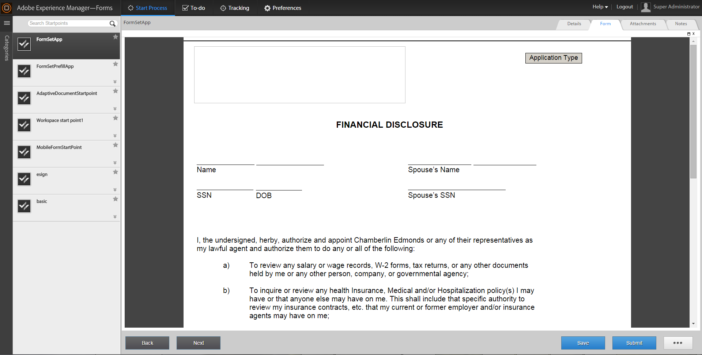

# Uso de conjuntos de formularios en el espacio de trabajo de AEM Forms {#working-with-formsets-in-aem-forms-workspace}

Un conjunto de formularios es una colección de formularios HTML5 agrupados y presentados como un único conjunto de formularios para los usuarios finales. Cuando los usuarios finales inicios en rellenar un conjunto de formularios, se realizan transiciones sin problemas de un formulario a otro. El conjunto de formularios se puede enviar con un solo clic. Para obtener más información sobre los conjuntos de formularios y cómo configurarlos, consulte [Conjunto de formularios en AEM Forms](/help/forms/using/formset-in-aem-forms.md).

El espacio de trabajo de AEM Forms admite conjuntos de formularios. Con los conjuntos de formularios, se pueden agrupar varios formularios relacionados con un servicio o proceso para automatizar un proceso empresarial y presentarlos a los usuarios finales. En este escenario, los usuarios pueden rellenar todo el conjunto como uno y no es necesario archivar, enviar y rastrear formularios o procesos individuales.

## Asociación de un conjunto de formularios al punto de partida en una aplicación de espacio de trabajo de AEM Forms {#attaching-a-formset-to-startpoint-in-an-aem-forms-workspace-app-br}

1. Cree el flujo de trabajo del proceso empresarial en Workbench. Para obtener más información, consulte [Ayuda de Workbench](https://www.adobe.com/go/learn_aemforms_workbench_63).
1. En las propiedades de proceso del punto de partida, seleccione **Utilizar un recurso CRX** en Presentación y datos.

   

1. Haga clic en  (Examinar) junto a la ruta de acceso del recurso CRX. Aparecerá el cuadro de diálogo Seleccionar recurso de formulario.

   

1. Haga clic en la ficha **Conjunto de formularios**, seleccione el conjunto de formularios pertinente en la lista y, a continuación, haga clic en **Aceptar**.

1. Implemente la aplicación después de actualizar otras propiedades de proceso relevantes.

## Uso del conjunto de formularios en el área de trabajo de AEM Forms {#using-formset-in-nbsp-aem-forms-workspace}

Una vez que se adjunta un conjunto de formularios a un punto de inicio, se puede invocar el punto de inicio, como cualquier otro punto de inicio, desde el espacio de trabajo de AEM Forms.

Las operaciones admitidas en el conjunto de formularios a través del espacio de trabajo de AEM Forms son:

* Guardar como borrador
* Bloquear
* Abandonar
* Enviar
* Añadir archivos adjuntos
* Añadir notas
* Desplazamiento entre formularios en un conjunto de formularios mediante los botones Atrás o Siguiente

>[!NOTE]
>
>Para mejorar el rendimiento durante el movimiento de formularios anteriores y siguientes en un conjunto de formularios, todos los botones del espacio de trabajo (Atrás, Siguiente, Guardar, Enviar y ... (Más)) se desactivan hasta que el formulario relevante se procesa completamente.

