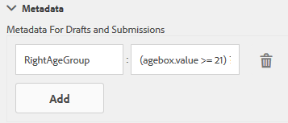

# Agregar información de datos de usuario a los metadatos de envío de formularios {#adding-information-from-user-data-to-form-submission-metadata}

>[!CAUTION]
>
>AEM 6.4 ha llegado al final de la compatibilidad ampliada y esta documentación ya no se actualiza. Para obtener más información, consulte nuestra [períodos de asistencia técnica](https://helpx.adobe.com/es/support/programs/eol-matrix.html). Buscar las versiones compatibles [here](https://experienceleague.adobe.com/docs/).

Puede utilizar los valores introducidos en un elemento del formulario para calcular los campos de metadatos de un borrador o un envío de formulario. Los metadatos le permiten filtrar el contenido en función de los datos de usuario. Por ejemplo, un usuario introduce John Doe en el campo Nombre del formulario. Puede utilizar esta información para calcular los metadatos que pueden categorizar este envío con las iniciales JD.

Para calcular los campos de metadatos con los valores especificados por el usuario, agregue elementos del formulario en los metadatos. Cuando un usuario introduce un valor en ese elemento, un script utiliza el valor para calcular la información. Esta información se añade a los metadatos. Cuando se agrega un elemento como un campo de metadatos, se proporciona una clave para él. La clave se añade como un campo en los metadatos, y la información calculada se registra en este campo.

Por ejemplo, una empresa de seguros de salud publica un formulario. En este formulario, un campo captura la edad de los usuarios finales. El cliente desea comprobar todos los envíos de un intervalo de edad concreto una vez que varios usuarios hayan enviado el formulario. En lugar de revisar todos los datos —lo que resulta más complicado a medida que aumenta el número de formularios—, los metadatos adicionales ayudan al cliente. El autor del formulario puede configurar qué propiedades/datos rellenados por el usuario final se almacenan en el nivel superior para que la búsqueda sea más sencilla. Los metadatos adicionales son la información rellenada por el usuario y almacenada en el nivel superior del nodo de metadatos, según la configuración del autor.

Imagine otro ejemplo de un formulario que captura el ID de correo electrónico y el número de teléfono. Cuando un usuario visita este formulario de forma anónima y lo abandona, el autor puede configurar el formulario para guardar automáticamente el ID de correo electrónico y el número de teléfono. Este formulario se guarda automáticamente, y el número de teléfono y el ID de correo electrónico se almacenan en el nodo de metadatos del borrador. Un caso de uso de esta configuración es el panel de administración de posibles clientes.

## Adición de elementos de formulario a metadatos {#adding-form-elements-to-metadata}

Realice los siguientes pasos para agregar un elemento a los metadatos:

1. Abra el formulario adaptable en el modo Edición.

   Para abrir el formulario en el modo Edición, seleccione el formulario en Forms Manager y pulse **Abrir**.

1. En el modo Edición, seleccione un componente y, a continuación, pulse  > **Contenedor de formulario adaptable** y haga clic en .
1. En la barra lateral, haga clic en **Metadatos**.
1. En la sección Metadatos, haga clic en **Agregar**.
1. Utilice el campo Valor de la pestaña Metadatos para añadir scripts. Los scripts que agregue recopilarán datos de los elementos del formulario y calcularán los valores de los que se alimentan los metadatos.

   Por ejemplo, en los metadatos se registra **True** si la edad introducida es mayor que 21, y **False** si es menor que 21. Introduzca el siguiente script en la pestaña Metadatos:

   `(agebox.value >= 21) ? true : false`

   
   **Figura:** *Secuencia de comandos introducida en la ficha Metadatos*

1. Haga clic en **Aceptar**.

Una vez que un usuario introduce datos en el elemento seleccionado como campo de metadatos, la información calculada se registra en los metadatos. Puede ver los metadatos en el repositorio que configuró para almacenarlos.

## Visualización de metadatos de envíos de formularios actualizados: {#seeing-updated-form-nbsp-submission-metadata}

En el ejemplo anterior, los metadatos se almacenan en el repositorio CRX. Su aspecto es el siguiente:

Si agrega un elemento de casilla de verificación a los metadatos, los valores seleccionados se almacenan como una cadena separada por comas. Por ejemplo, agrega un componente Casilla de verificación al formulario y especifica su nombre como `checkbox1`. En las propiedades del componente Casilla de verificación, agrega los elementos Carné de conducir, Número de la Seguridad Social y Pasaporte para los valores 0, 1 y 2.

Selecciona el contenedor de formulario adaptable y, en las propiedades del formulario, agrega la clave de metadatos `cb1`, que almacena `checkbox1.value`, y publica el formulario. Cuando un cliente rellena el formulario, el cliente selecciona las opciones Pasaporte y Número de la Seguridad Social en el campo de la casilla de verificación. Los valores 1 y 2 se almacenan como 1, 2 en el campo cb1 de los metadatos del envío.

>[!NOTE]
>
>El ejemplo anterior es solo con fines de aprendizaje. Asegúrese de buscar los metadatos en la ubicación correcta, tal y como está configurada en su implementación de AEM Forms.
