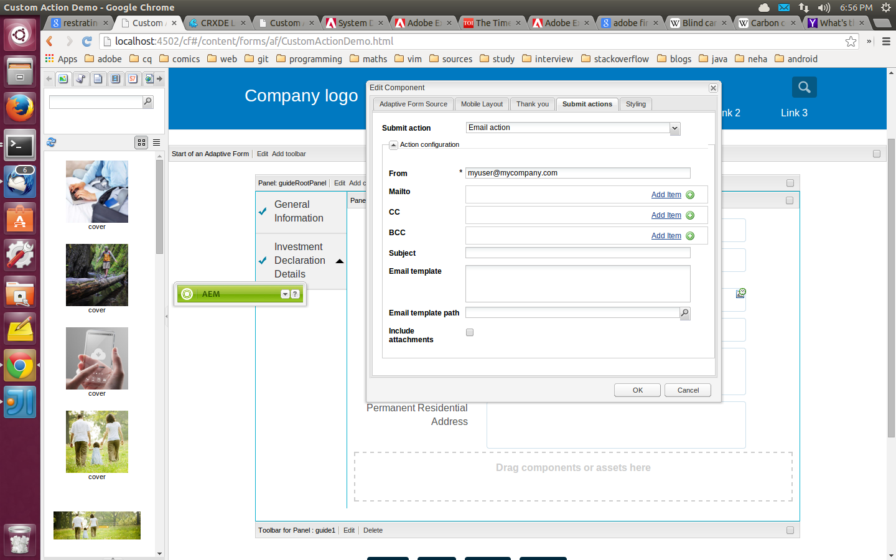

# Enviar una confirmación de envío de formulario por correo electrónico {#sending-a-form-submission-acknowledgement-via-email}

## Envío de datos de formulario adaptable {#adaptive-form-data-submission}

Los formularios adaptables ofrecen varios [enviar acciones](/help/forms/using/configuring-submit-actions.md) flujos de trabajo para enviar los datos del formulario a diferentes extremos.

Por ejemplo, la variable **Acción de correo electrónico** la acción enviar envía un correo electrónico cuando se envía correctamente un formulario adaptable. También se puede configurar el envío de los datos del formulario y el PDF en el correo electrónico.

Este artículo detalla los pasos para habilitar la acción Correo electrónico en un formulario adaptable y las diferentes configuraciones que proporciona.

>[!NOTE]
>
>También puede usar la variable **Acción del PDF de correo electrónico** para enviar el formulario completado por correo electrónico como archivo adjunto de PDF. Las opciones de configuración disponibles para esta acción son las mismas que las opciones disponibles para la acción Correo electrónico . La acción PDF de correo electrónico solo está disponible para formularios adaptables basados en XFA

## Acción de correo electrónico {#email-action}

La acción Correo electrónico permite a un autor enviar correos electrónicos automáticamente a uno o varios destinatarios cuando se envía correctamente un formulario adaptable.

>[!NOTE]
>
>Para utilizar la acción Correo electrónico , debe configurar el servicio de correo AEM como se describe en [Configuración del servicio de correo](/help/sites-administering/notification.md#configuring-the-mail-service).

### Activación de la acción Correo electrónico en un formulario adaptable {#enabling-email-action-on-an-adaptive-form}

1. Abra un formulario adaptable en modo de edición.

1. Haga clic en **Editar** junto a la variable **Inicio de un formulario adaptable** barra de herramientas.

   Se abre el cuadro de diálogo Editar componente.

   

1. Seleccione el **Enviar acciones** y elija **Acción de correo electrónico** en la lista desplegable Acción de envío .

   La pestaña muestra las opciones para configurar la acción Correo electrónico del formulario actual.

   

1. Especifique ID de correo electrónico válidos en los campos Mailto, CC y BCC.

   Especifique el asunto y el cuerpo del correo electrónico en los campos Subject y Email template , respectivamente.

   También puede especificar marcadores de posición de variables en los campos, en cuyo caso, los valores de los campos se procesan cuando un usuario final envía correctamente el formulario. Para obtener más información, consulte [Uso de nombres de campos de formulario adaptables para crear contenido de correo electrónico de forma dinámica](/help/forms/using/form-submission-receipt-via-email.md#p-using-adaptive-form-field-names-to-dynamically-create-email-content-p).

   Seleccione Incluir archivos adjuntos si el formulario incluye archivos adjuntos y desea adjuntarlos en el correo electrónico.

   >[!NOTE]
   >
   >Si elige la opción **Acción del PDF de correo electrónico**, debe seleccionar la opción Include attachment .

1. Haga clic en **Aceptar** para guardar los cambios.

### Uso de nombres de campos de formulario adaptables para crear contenido de correo electrónico de forma dinámica {#using-adaptive-form-field-names-to-dynamically-create-email-content}

Los nombres de campo de un formulario adaptable se denominan marcadores de posición que se sustituyen por el valor de ese campo después de que un usuario envíe el formulario.

En la pestaña Email action , puede utilizar marcadores de posición que se procesan cuando se realiza la acción. Esto implica que los encabezados del correo electrónico (como Mailto, CC, BCC, subject) se generan cuando el usuario envía el formulario.

Para definir un marcador de posición, especifique `${<field name>}` en un campo de la ficha Enviar acciones .

Por ejemplo, si el formulario contiene la variable **Dirección de correo electrónico** campo, con nombre `email_addr`, para capturar el ID de correo electrónico de un usuario, puede especificar lo siguiente en los campos Mailto, CC o BCC.

`${email_addr}`

Cuando un usuario envía el formulario, se envía un correo electrónico al ID de correo electrónico introducido en el campo `email_addr` del formulario.

>[!NOTE]
>
>Puede encontrar el nombre de un campo en el cuadro de diálogo **Editar** del campo.

Los marcadores de posición de variables también se pueden usar en la variable **Asunto** y **Plantilla de correo electrónico** campos.

Por ejemplo:

`Hi ${first_name} ${last_name},`

`Your form has been received by our department. It usually takes ten business days to process the request.`

`Regards`

`Administrator`

>[!NOTE]
>
>Los campos de los paneles repetibles no se pueden usar como marcadores de posición variables.
