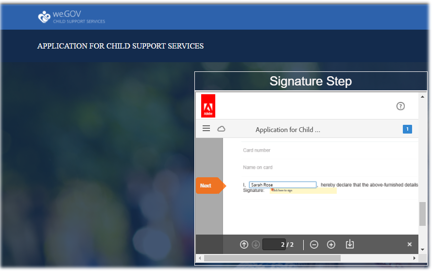
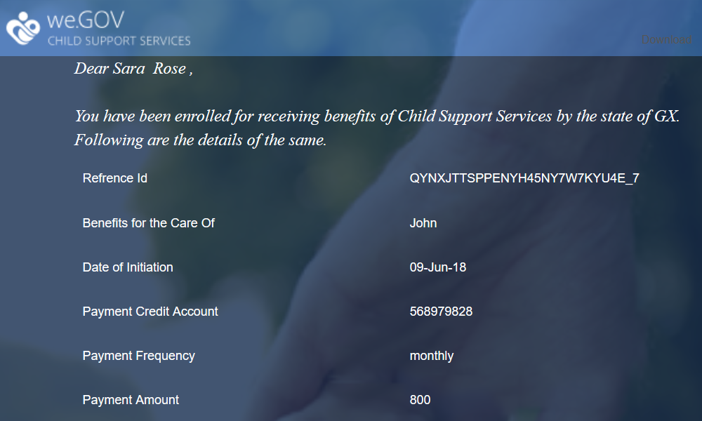

# Recorrido del sitio de referencia de We.Gov {#we-gov-reference-site-walkthrough}

## Requisito previo {#pre-requisite}

Configure el sitio de referencia de We.Gov tal como se describe en [Configure y configure los sitios de referencia de AEM Forms](/help/forms/using/setup-reference-sites.md).

## Escenario del sitio de referencia {#reference-site-scenario}

We.Gov es una organización estatal que permite a los padres adoptivos inscribirse para recibir apoyo infantil si adoptan a un niño. El sitio administra lo siguiente:

* Elegibilidad del solicitante, el padre adoptivo
* Datos personales y profesionales del solicitante (si el solicitante tiene derecho a la pensión alimenticia)
* Datos personales del niño adoptado

   El solicitante puede proporcionar detalles para más de un hijo
* Datos de la cuenta bancaria del solicitante en la que el solicitante puede recibir prestaciones de apoyo a los hijos
* Recuperación de la tasa de solicitud
* Evaluación de la solicitud
* Aprobación de la solicitud
* Comunicación automatizada al solicitante

Una vez presentada la solicitud y abonada la tasa, el solicitante recibe un correo electrónico de la organización con el acuse de recibo de la solicitud presentada.

La organización We.Gov recibe la solicitud. La organización recibe la evaluación de la aplicación y aprueba las solicitudes que son genuinas.

Una vez aprobada la solicitud, el solicitante recibe un correo electrónico del sitio Web We.Gov. La opción **Documento de Vista** del correo electrónico enlaza a un documento con los detalles de inscripción del solicitante.

La siguiente infografía muestra el flujo de trabajo paso a paso del escenario del sitio de referencia We.Gov.

El escenario incluye las siguientes personas:

* Sarah Rose, la madre adoptiva que pide ayuda para niños
* Joe, el niño adoptado
* Gloria Rios, la jefa de división de aprobación, We.Gov
* Conard Simms, el agente de campo encargado de la evaluación de solicitudes

## Sarah inicia su comprobación de elegibilidad {#sarah-initiates-her-eligibility-check}

Un solicitante puede comprobar si reúne los requisitos para solicitar prestaciones por manutención de los hijos. El sitio permite a los usuarios responder preguntas para permitirles determinar si su aplicación es elegible para recibir beneficios. Sarah, una madre adoptiva, es una posible solicitante. El formulario de elegibilidad es parte de la Solicitud de Servicios de Apoyo a la Infancia del sitio Web We.Gov. Para comprobar su elegibilidad, Sarah hace clic **[!UICONTROL Asistencia para niños]** en el sitio Web de We.Gov. En la página Asistencia para niños, Sarah hace clic en **[!UICONTROL Comprobar su elegibilidad]**.

Además del enfoque anterior, Sarah puede hacer clic en **[!UICONTROL Introducción]** en la página principal. Sarah se desplaza a la página Todas las Aplicaciones, donde puede hacer clic en Aplicar en **[!UICONTROL Aplicación para Servicios de Apoyo para Niños]**. A Sarah la llevan a la verificación de elegibilidad.

En la página Verificar elegibilidad para la manutención de los hijos, a Sarah se le hace una serie de preguntas para determinar su elegibilidad para recibir beneficios de manutención de los hijos. A través del conjunto de preguntas, se le hace:

* Si ella es el padre o la madre custodio del niño
* Si ella y el niño viven en el estado de GX
* El grupo de edad de la educación del niño y del niño.

Sarah responde a estas preguntas, y su elegibilidad está validada. Sus respuestas determinan si ella es elegible para la manutención de los hijos.

Sarah ha sido informada de que ella es elegible para la manutención de sus hijos, y la tasa de solicitud es de $25.

### Cómo funciona {#how-it-works}

La elegibilidad de Sarah se valida a través de una barrera de elegibilidad creada con el editor de reglas. El editor de reglas permite especificar las condiciones que se cumplen antes de que un solicitante pueda rellenar el formulario de solicitud. Cuando Sarah, la solicitante, cumple todas las condiciones de elegibilidad, aterriza en el formulario de solicitud.

La comprobación de elegibilidad forma parte del formulario adaptable de la aplicación de soporte secundario. La regla valida la elegibilidad cuando:

* El solicitante es un padre o madre custodio
* El solicitante y el niño permanecen en el estado de GX
* El solicitante tiene el cuidado diario principal del niño
* La edad del niño que recibe servicios de apoyo es de menos de 16 años.

### Véalo usted mismo {#see-it-yourself}

En el explorador, abra `https://<hostname>:<PublishPort>/content/we-gov/en.html`. En el sitio Web de We.Gov, haga clic en Asistencia para niños. En la página Asistencia para niños, haga clic en Verificar su elegibilidad.

Para ver las reglas:

1. Abra el formulario en modo de edición en la instancia de creación. URL: `https://<hostname>:<AuthorPort>/editor.html/content/forms/af/we-gov/child-support/css.html`.
1. Seleccione un componente y haga clic en .

   Se abre el Editor de reglas, que enumera todas las reglas aplicadas en el formulario.

1. En el panel del lado izquierdo, haga clic en reglas `passMsg` y `failMsg` para comprender cómo funciona la comprobación de elegibilidad.

## Sarah inicio su solicitud de ayuda para niños {#sarah-starts-her-application-for-child-support}

Sarah hace clic en **[!UICONTROL Solicitud de Inicio]** después de que se le informe de su elegibilidad para recibir ayuda para niños.\
En la página Solicitud de Servicios de Apoyo para Niños, Sarah proporciona detalles en las siguientes secciones:

* **[!UICONTROL Acerca del solicitante]**: Le permite a Sarah proporcionar sus detalles en esta sección.

* **[!UICONTROL Información]** secundaria: Le permite a Sarah proporcionar información a los niños, que está cubierta por servicios de apoyo.

* **[!UICONTROL Pago]**: Le permite a Sarah proporcionar sus datos bancarios en los que We.Gov puede depositar una compensación mensual de apoyo.

* **[!UICONTROL Pago]** de comisiones: Le permite a Sarah proporcionar los datos de su tarjeta de crédito para pagar la tasa de solicitud.

De forma predeterminada, Sarah se dirige a la sección **[!UICONTROL Acerca del solicitante]**.

En cualquier momento, Sarah puede hacer clic en **[!UICONTROL Volver más tarde]** y reanudar con su aplicación. Cuando hace clic en **[!UICONTROL Volver más tarde]**, su progreso se guarda como borrador y obtiene una opción para enviar el borrador por correo electrónico.

Cuando hace clic en **[!UICONTROL Enviar correo electrónico]**, recibe un correo electrónico con un vínculo al borrador del formulario.

El formulario de soporte secundario del sitio We.Gov utiliza formularios adaptables. Puede usar el enlace en su correo electrónico y rellenar el formulario en su dispositivo móvil.

>[!NOTE]
>
>El flujo de trabajo de reanudación del correo electrónico funciona únicamente con los usuarios que han iniciado sesión. En el escenario del sitio de referencia, asegúrese de añadir al usuario Sarah Rose. Las credenciales de inicio de sesión de Sarah son `srose/password`.

Sarah puede proporcionar detalles en cualquier sección, pero la tasa de solicitud se acepta solamente después de proporcionar la información requerida en todas las secciones. Una aplicación está incompleta sin pago de tarifa y se requieren los campos marcados con un asterisco.

### <strong>Sarah brinda su información</strong> {#strong-sarah-provides-her-information-strong}

Después de que Sarah haga clic en **[!UICONTROL Solicitud de Inicio]**, se le dirigirá a la sección Información del solicitante de la página Solicitud de Servicios de Apoyo para Niños. En Información del solicitante, Sarah navega a través de las fichas y proporciona su información personal para la solicitud. Ella hace clic **[!UICONTROL Siguiente]** para navegar por las fichas.

En Información del solicitante, se le pide que proporcione detalles en las fichas siguientes:

* **[!UICONTROL Información básica]**

En Información básica, Sarah proporciona su prueba de identificación y su información personal. La información personal de Sarah incluye su nombre, ID de correo electrónico y número de la seguridad social.

* **[!UICONTROL Relación]**

   Bajo Relación, Sarah ingresa información sobre su estado civil.

* **[!UICONTROL Información adicional]**

   En Información adicional, Sarah ingresa un número de identificación, su fecha de nacimiento y la dirección y número de teléfono actuales.

### Sarah proporciona información secundaria {#sarah-provides-child-information}

Después de que Sarah proporcione su información personal y haga clic en **[!UICONTROL Siguiente]**, se la llevará a la sección Información del niño.

En la sección Información del niño, proporciona los siguientes detalles:

* Número de niños que solicitan servicios de apoyo a los niños
* Nombre del niño, número de la seguridad social, fecha de nacimiento y lugar de nacimiento

Si Sarah elige más de un niño, obtiene formularios adicionales habilitados con los mismos detalles para rellenar.\
Sarah escoge a su hijo único, Joe, y escribe su nombre.

### Sarah proporciona información de pago {#sarah-provides-payment-information}

Después de que Sarah proporcione información sobre el niño adoptado (o niños) y haga clic **[!UICONTROL Siguiente]**, se la llevará a la sección **[!UICONTROL Información de pago]**.

En la sección Información de Pago, proporciona los detalles de la cuenta bancaria en la que puede recibir las prestaciones de manutención de los hijos.\
Ella ingresa su número de cuenta bancaria de 10 dígitos.

## Sarah paga la tasa de solicitud y firma el formulario {#sarah-pays-the-application-fee-and-signs-the-form}

Después de que Sarah acepta los términos y condiciones de la solicitud, paga la tarifa de solicitud de $25. Se requiere la tasa de solicitud para procesar su solicitud.\
Sarah ingresa los detalles de su tarjeta de crédito y hace clic **[!UICONTROL Pagar ahora]**. Después de pagar las tarifas, aparece una versión en PDF de la aplicación con un campo de firma.

Sarah puede elegir entre escribir, utilizar dibujar para escribir a mano, insertar una imagen de firma o usar la pantalla táctil de su móvil para dibujar su firma. Sarah escribe su nombre y hace clic en Haga clic para firmar.

Su solicitud se envía al sitio Web de We.Gov.

### <strong>Sarah recibe un correo electrónico de confirmación</strong> {#strong-sarah-receives-an-acknowledgement-email-strong}

Después de que Sarah pague la tarifa de la solicitud, recibe un correo electrónico de acuse de recibo del sitio Web We.Gov.\
We.Gov procesa la solicitud, y Sarah está informada que recibirá una compensación mensual después de que su solicitud sea aprobada.

### Cómo funciona {#how-it-works-1}

La aplicación de compatibilidad secundaria utiliza una combinación de diseños de panel como ficha superior, asistente y acordeón para crear la experiencia. Utiliza una plantilla de formulario llamada Plantilla secundaria We.Gov.

El solicitante puede desplazarse por secciones para rellenar distintos componentes del formulario. Cuando el solicitante rellena el formulario, lo envía, acepta los términos y condiciones y paga la tarifa, se inicia un flujo de trabajo personalizado. El flujo de trabajo personalizado envía un correo electrónico automatizado al solicitante que acepta el envío de la solicitud. La solicitud se remite al departamento correspondiente de la organización para su verificación y aprobación.

La presentación del formulario se especifica en el tema del servicio de asistencia para niños del Gobierno. El estilo incluye estilo de componente, fondo de página, formato de estado de error de los componentes y estilos de fuente.

La comprobación de elegibilidad utiliza reglas especificadas en el formulario. Utiliza las comprobaciones de validez especificadas a continuación:

`SHOW passMsgWHEN (Does the child live in the state of GX? is equal to Yes) AND (Do you live in the state of GX? is equal to Yes) AND ( (Who has the main day-to-day care of the child? is equal to You) AND (Are you: is equal to The custodial parent) ) AND (Is the child you are applying for: is equal to Under 16 years) ELSE Hide`

`HIDE failMsg WHEN (Does the child lives in the state of GX? is equal to Yes) AND ( (Do you live in the state of GX? is equal to Yes) AND (Who has the main day-to-day care of the child? is equal to You) ) AND (Is the child you are applying for: is equal to Under 16 years) AND (Are you: is equal to The custodial parent) ELSE Show`

### Véalo usted mismo {#see-it-yourself-1}

En el explorador, abra `https://<hostname>:<PublishPort>/content/forms/af/we-gov/child-support/css.html` y rellene la información requerida. Cuando envía la solicitud después de completar la información requerida, paga las tarifas y firma el documento, recibe el correo electrónico de acuse de recibo.

Consulte la plantilla infantil We.Gov aquí: `https://<hostname>:<AuthorPort>/editor.html/conf/we-gov/settings/wcm/templates/we-gov-child-template/structure.html`

Vea el tema aquí: `https://<hostname>:<AuthorPort>/editor.html/content/dam/formsanddocuments-themes/we-gov/we-gov-theme-A/jcr:content`

Para ver todas las reglas, realice los siguientes pasos:

1. Abra el formulario en el modo de creación.

   URL: `https://<hostname>:<AuthorPort>/editor.html/content/forms/af/we-gov/child-support/css.html`

1. Seleccione un componente y toque . Todas las reglas se enumeran en el editor de reglas, incluidas las reglas enumeradas arriba.

## Gloria recibe la aplicación {#gloria-receives-the-application}

Gloria, jefe de aprobaciones de We.Gov, puede vista, aprobación o rechazo de solicitudes enviadas. AEM Bandeja de entrada le permite ver todas las aplicaciones enviadas en un solo lugar.

### Cómo funciona {#how-it-works-2}

Cuando Sarah rellena y envía la aplicación de soporte para niños, se crea un PDF o Documento de registro de la aplicación y se envía a la bandeja de entrada de Gloria Rios. Gloria puede vista de la solicitud presentada y aceptarla o rechazarla.

### Véalo usted mismo {#see-it-yourself-2}

Abrir página `https://<hostname***>:<PublishPort>/content/we-gov/en.html`. En la página, toque **[!UICONTROL Iniciar sesión]**, seleccione la casilla **[!UICONTROL Iniciar sesión como representante]** e inicie sesión en la bandeja de entrada de AEM con grios/password como nombre de usuario/contraseña para Gloria Rios. Aparece la aplicación de soporte secundario. Para obtener información sobre el uso de AEM Bandeja de entrada para tareas de flujo de trabajo centradas en formularios, consulte [Administración de aplicaciones y tareas de Forms en AEM Bandeja de entrada](/help/forms/using/manage-applications-inbox.md).

Gloria puede ver, aprobar o rechazar la aplicación desde el panel de la aplicación.

### Cómo funciona {#how-it-works-3}

Gloria, jefe de aprobaciones en We.Gov, abre su bandeja de entrada AEM. Ella ve una tarea de revisión en su lista de tareas. Ella abre y vista la tarea de revisión.

Ella ve un PDF del formulario lleno de detalles que Sarah ingresó junto con los documentos que Sarah subió.\
Gloria puede aprobar o rechazar la aplicación. Sin embargo, Gloria hace clic en **[!UICONTROL Evaluación requerida]** para obtener la evaluación de la aplicación.

La aplicación de Sarah es un punto de partida en el flujo de trabajo AEM. Inicia el flujo de trabajo de AEM cuando se envía el formulario de solicitud de soporte secundario. El flujo de trabajo AEM crea una tarea para Gloria, que aparece en su bandeja de entrada AEM. Cuando Gloria solicita una evaluación in situ, se crea una nueva tarea para el agente de campo.

### Véalo usted mismo {#see-it-yourself-3}

Si se ha completado la configuración, el flujo de trabajo de AEM inicio inmediatamente después de enviar el formulario. Inicie sesión en la bandeja de entrada con las credenciales de Gloria.

Acceda a la bandeja de entrada en https://&lt;***hostname***>:&lt;***PublishPort***>/content/we-gov/en.html. En la página, toque **[!UICONTROL Iniciar sesión]**, seleccione la casilla **[!UICONTROL Iniciar sesión como representante]** para utilizar las credenciales predeterminadas de Gloria:

* Nombre de usuario: grios
* Contraseña: password

En su bandeja de entrada AEM, la aplicación de Sarah se agrega como una tarea de revisión. Seleccione la tarea y haga clic en **Evaluación requerida** para continuar con el paso siguiente.

### Conard obtiene la tarea de Evaluación {#conard-assessment-task}

Cuando Gloria hace clic en **[!UICONTROL Evaluación requerida]**, Conard obtiene la tarea de revisión en su Bandeja de entrada AEM. La tarea es el siguiente paso en el flujo de trabajo de AEM definido en el modelo de flujo de trabajo. Él ve la tarea de revisión y la abre.

Conard obtiene la tarea de evaluación del solicitante como se muestra a continuación.

La evaluación de la asistencia secundaria es un formulario asociado a la tarea. Recibe los detalles de Sarah, junto con los documentos de apoyo (adjuntos en los detalles de la tarea). Conard rellena el formulario de evaluación en el campo en un dispositivo y lo envía para su reevaluación.

Conard verifica todos los detalles que Sarah proporcionó, y Sarah firma la evaluación. AEM Forms puede tomar la ubicación y la marca de hora y agregarlas a la firma.

Haga clic en **[!UICONTROL Enviar para reevaluación]** y el flujo de trabajo de AEM envía la evaluación a la organización We.Gov.

### Cómo funciona {#how-it-works-4}

Cuando Gloria solicita una evaluación, se inicia el siguiente paso en AEM flujo de trabajo y se agrega la tarea de evaluación en la bandeja de entrada de Conard. Conard es la persona que trabaja en el campo.

Conard visita el lugar de Sarah, verifica que la información que Sarah proporcionó es genuina y completa el formulario de evaluación. Conard puede acceder a un PDF del formulario completo que Sarah cumplimentó.

### Véalo usted mismo {#see-it-yourself-4}

Abra la bandeja de entrada de AEM en la tablet y utilice las credenciales de Conard para iniciar sesión.

Las credenciales predeterminadas de Conard son:

* Nombre de usuario: csimms
* Contraseña: password

Puede ver una nueva tarea de Solicitud de evaluación agregada en la bandeja de entrada. Envíe la evaluación finalizada y continúe con el paso siguiente.

### Gloria revisa la evaluación y aprueba la aplicación {#gloria-reviews-the-assessment-and-approves-the-application}

Después de que Conard envíe la evaluación, Gloria ve una tarea de Review en su bandeja de entrada. Selecciona y abre **[!UICONTROL Revisar]**.

En Detalles de Tarea, Gloria ve la última acción tomada como &quot;Enviar para reevaluación&quot; (por Conard). Gloria ve que Conard Simms evaluó la aplicación.

### Cómo funciona {#how-it-works-5}

Después de que Conard envíe la evaluación, Gloria ve una tarea de Review en su bandeja de entrada. Selecciona y abre Revisión. En Detalles de Tarea, Gloria ve el comentario de evaluación hecho por Conard, que es &quot;Todo lo encontrado en orden&quot;.

Gloria aprueba la solicitud.

### Véalo usted mismo {#see-it-yourself-5}

Abra la bandeja de entrada e inicie sesión con las credenciales de Gloria. En la bandeja de entrada aparece una nueva tarea denominada Revisar.

Abra la tarea para ver el estado de la última acción realizada. En base a la evaluación, apruebe la aplicación.

## Sarah recibe un correo electrónico de aprobación {#sarah-receives-an-approval-email}

Después de que Gloria apruebe la solicitud, Sarah recibe un correo electrónico de We.Gov en el que se indica que su solicitud ha sido aprobada.

El botón **[!UICONTROL Documento de Vista]** del mensaje de correo electrónico vincula los detalles de su inscripción. Sarah hace clic en **[!UICONTROL Documento de Vista.]**

Los detalles de listas del documento de inscripción como, por ejemplo, el ID de referencia, el hijo cubierto, la fecha de inicio, el número de cuenta bancaria, la frecuencia de pago y el importe de pago.

Sarah puede vista los documentos que cargó en la misma página.

### Cómo funciona {#how-it-works-6}

Cuando Gloria aprueba la aplicación, Sarah recibe un correo electrónico automatizado con un enlace al documento de inscripción.

El documento de inscripción es una comunicación interactiva y se puede ver en cualquier dispositivo. Contiene detalles del servicio de apoyo a la infancia e información proporcionada por Sarah.

### Véalo usted mismo {#see-it-yourself-6}

Compruebe el cliente de correo electrónico configurado para el correo electrónico automatizado con un vínculo al documento de inscripción.

Como alternativa, para ver el documento en el explorador, abra: `https://<hostname>:<PublishPort>/content/aemforms-refsite/doclink.html?document=/content/forms/af/we-gov/child-support/enrollment-document&referenceId=[reference-id]&channel=web`

## We.Gov analiza el rendimiento de la aplicación {#we-gov-analyzes-the-performance-of-the-application}

We.Gov, de vez en cuando, revisa el rendimiento de su aplicación de servicios de soporte para niños para verificar cualquier problema que puedan estar enfrentando los clientes. Utilizan esta análisis para tomar decisiones informadas sobre los cambios necesarios en la aplicación de servicios de apoyo a los niños a fin de mejorar la experiencia del usuario, reducir la tasa de abandono de formularios y mejorar así la conversión. Aprovechan la integración de AEM Forms con Adobe Analytics para su análisis. La siguiente imagen muestra su panel de análisis.

### Cómo funciona {#how-it-works-7}

Las métricas de rendimiento del formulario de aplicación de servicios de soporte secundario se rastrean con Adobe Analytics. Para obtener más información sobre la configuración de Adobe Analytics y la visualización de informes, consulte [Configuración de análisis para formularios y documentos](/help/forms/using/configure-analytics-forms-documents.md).

### Véalo usted mismo {#see-it-yourself-7}

Para que pueda realizar la vista y explorar el informe de análisis, proporcionamos datos de inicialización para la aplicación de servicios de soporte secundarios en el sitio de referencia. Antes de usar datos de raíz, consulte [Configuración de Analytics](/help/forms/using/setup-reference-sites.md#configureanalytics). Realice los siguientes pasos en la instancia de autor para vista del informe con los datos de inicialización:

1. Vaya a **[!UICONTROL Forms &amp; Documentos]** UI en https://&lt;*hostname*>:&lt;*AuthorPort*>/aem/forms.html/content/dam/formsanddocuments.

1. Haga clic para abrir la carpeta **We.Gov**.
1. Seleccione **[!UICONTROL Aplicación para servicios de soporte para niños]** formulario adaptable y haga clic en **[!UICONTROL Habilitar Analytics]** en la barra de herramientas.

1. Seleccione el formulario de nuevo y haga clic en **[!UICONTROL Informe de Analytics]** en la barra de herramientas para generar el informe. Primero verá un informe en blanco.

Para generar un informe de análisis con datos de inicialización:

1. En el navegador de direcciones de la lista CRXDE, escriba: **/apps/we-gov/demo-artifacts/analyticsTestData/Child support service Datos de prueba de Analytics**
1. Los datos de inicialización se seleccionan en la estructura del directorio del lado izquierdo.
1. Doble haga clic en el archivo seleccionado para abrir su contenido en el panel de la derecha.
1. Copie todo el contenido del archivo de datos de prueba.
1. En CRXDE, vaya a: **/content/dam/formsanddocuments/we-gov/child-support/css/jcr:content/analyticsdatanode/lastsepdays**
1. En el campo analyticsdata de Propiedades, pegue el contenido copiado del archivo de datos de prueba.
1. Ahora vuelva a generar el informe de análisis para **[!UICONTROL Aplicación para servicios de soporte para niños]**. Puede ver los datos de inicialización en el informe generado.

