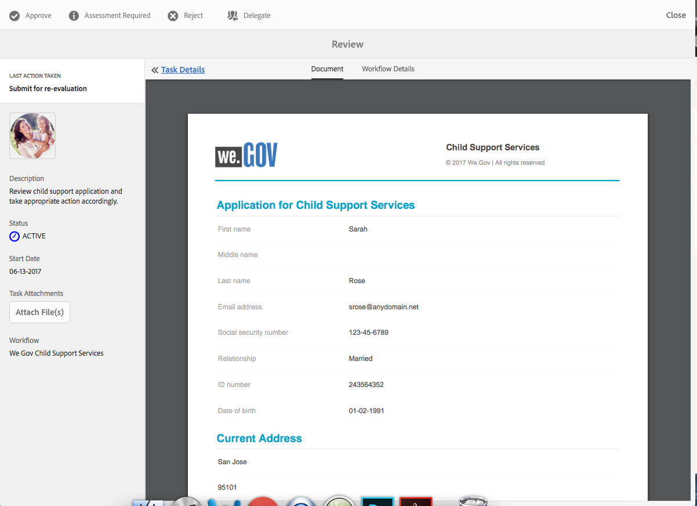

# Tutorial del sitio de referencia de We.Gov para el cumplimiento de la ley  {#we-gov-reference-site-walkthrough}

>[!CAUTION]
>
>AEM 6.4 ha llegado al final de la compatibilidad ampliada y esta documentación ya no se actualiza. Para obtener más información, consulte nuestra [períodos de asistencia técnica](https://helpx.adobe.com/es/support/programs/eol-matrix.html). Buscar las versiones compatibles [here](https://experienceleague.adobe.com/docs/).

## Requisitos previos {#pre-requisite}

Configure su sitio de referencia de We.Gov tal como se describe en la sección [Configuración de sitios de referencia de AEM Forms](/help/forms/using/setup-reference-sites.md).

## Situación del sitio de referencia {#reference-site-scenario}

We.Gov es un organismo público que permite a los padres adoptivos inscribirse para recibir una pensión alimenticia si adoptan a un niño. El sitio administra lo siguiente:

* Elegibilidad del solicitante, el padre adoptivo
* Datos personales y profesionales del solicitante (si el solicitante tiene derecho a la pensión alimenticia)
* Datos personales del niño adoptado

   El solicitante puede proporcionar detalles para más de un hijo
* Datos de la cuenta bancaria del solicitante en la que el solicitante puede recibir prestaciones de apoyo a los hijos
* Recuperación de la tasa de aplicación
* Evaluación de la solicitud
* Aprobación de la solicitud
* Comunicación automatizada al solicitante

Una vez presentada la solicitud y abonada la tasa, el solicitante recibe un correo electrónico de la organización con el acuse de recibo de la solicitud presentada.

La organización We.Gov recibe la aplicación. La organización evalúa la aplicación y aprueba las aplicaciones que son genuinas.

Una vez aprobada la solicitud, el solicitante recibe un correo electrónico del sitio de We.Gov. La variable **Ver documento** en el correo electrónico vincula a un documento con los detalles de inscripción del solicitante.

La siguiente infografía muestra el flujo de trabajo paso a paso del escenario del sitio de referencia de We.Gov.

El escenario incluye las siguientes personas:

* Sarah Rose, la madre adoptiva que solicita apoyo a los hijos
* Joe, el niño adoptado
* Gloria Rios, la jefa de la división de aprobación, We.Gov
* Conard Simms, el agente de campo que se encarga de la evaluación de las solicitudes

## Sarah inicia su comprobación de elegibilidad {#sarah-initiates-her-eligibility-check}

El solicitante puede comprobar si reúne los requisitos para solicitar prestaciones de apoyo a los hijos. El sitio permite a los usuarios responder preguntas para permitirles determinar si su aplicación es elegible para los beneficios. Sarah, una madre adoptiva, es una posible candidata para ello. El formulario de elegibilidad es parte de la Solicitud de Servicios de Apoyo Infantil del sitio We.Gov. Para comprobar su elegibilidad, Sarah hace clic **[!UICONTROL Asistencia secundaria]** en el sitio web de We.Gov. En la página Asistencia al menor, Sarah hace clic en **[!UICONTROL Comprobar su elegibilidad]**.

Además del enfoque anterior, Sarah puede hacer clic en **[!UICONTROL Introducción]** en la página de inicio. Sarah va a la página Todas las aplicaciones, donde puede hacer clic en Aplicar en **[!UICONTROL Solicitud de servicios de apoyo a la infancia]**. A Sarah se le lleva a la verificación de elegibilidad.

En la página Comprobar elegibilidad para la manutención de los hijos, a Sarah se le hace una serie de preguntas para determinar su elegibilidad para las prestaciones de apoyo a los hijos. A través del conjunto de preguntas, se le pregunta:

* Si es el progenitor de custodia del niño
* Si ella y el niño viven en el estado de GX
* El grupo de edad de la educación del niño y del niño.

Sarah responde a estas preguntas, y su elegibilidad está validada. Sus respuestas determinan si es elegible para la manutención de los hijos.

Sarah es informada de que es elegible para la manutención de sus hijos, y la cuota de la solicitud es de $25.

### Funcionamiento {#how-it-works}

La elegibilidad de Sarah se valida a través de una barrera de elegibilidad creada usando el editor de reglas. El editor de reglas permite especificar las condiciones que se cumplen antes de que un solicitante pueda rellenar el formulario de solicitud. Cuando Sarah, la solicitante, cumple todas las condiciones de elegibilidad, aterriza en el formulario de solicitud.

La comprobación de elegibilidad forma parte del formulario adaptable de la aplicación de soporte secundario. La regla valida la idoneidad cuando:

* El solicitante es un progenitor custodio
* El solicitante y el niño permanecen en el estado de GX
* El solicitante tiene el cuidado diario principal del niño
* La edad del niño que recibe servicios de apoyo es menor de 16 años.

### Puede verlo usted mismo {#see-it-yourself}

En el explorador, abra `https://<hostname>:<PublishPort>/content/we-gov/en.html`. En el sitio de We.Gov, haga clic en Asistencia a niños. En la página Asistencia para niños, haga clic en Comprobar su elegibilidad.

Para ver las reglas:

1. Abra el formulario en modo de edición en la instancia de autor. URL: `https://<hostname>:<AuthorPort>/editor.html/content/forms/af/we-gov/child-support/css.html`.
1. Seleccione un componente y haga clic en .

   El Editor de reglas abre un listado de todas las reglas aplicadas en el formulario.

1. En el panel de la izquierda, haga clic en reglas `passMsg` y `failMsg` para comprender cómo funciona la comprobación de elegibilidad.

## Sarah comienza su solicitud de ayuda para niños {#sarah-starts-her-application-for-child-support}

Sarah hace clic **[!UICONTROL Iniciar aplicación]** después de que se le informe de su elegibilidad para recibir la pensión alimenticia.\
En la página Solicitud de Servicios de Apoyo Infantil, Sarah proporciona detalles en las siguientes secciones:

* **[!UICONTROL Acerca del solicitante]**: Lleve a Sarah sus detalles en esta sección.

* **[!UICONTROL Información secundaria]**: Lleve a Sarah la información de los niños, que está cubierta por los servicios de apoyo.

* **[!UICONTROL Pago]**: Lleve a Sarah los detalles de su banco en los que We.Gov puede depositar una compensación mensual de apoyo.

* **[!UICONTROL Pago de comisiones]**: Le permite a Sarah proporcionar los datos de su tarjeta de crédito para pagar la cuota de solicitud.

De forma predeterminada, Sarah se lleva al **[!UICONTROL Acerca del solicitante]** para obtener más información.

En cualquier momento, Sarah puede hacer clic en **[!UICONTROL Vuelve más tarde]** y continúe con su solicitud. Cuando haga clic en **[!UICONTROL Vuelve más tarde]**, su progreso se guarda como borrador y tiene la opción de enviar el borrador por correo electrónico.

Cuando haga clic en **[!UICONTROL Enviar correo electrónico]**, recibe un correo electrónico con un vínculo al borrador de su formulario.

El formulario de asistencia secundaria en el sitio de We.Gov utiliza formularios adaptables. Puede usar el enlace en su correo electrónico y rellenar el formulario en su dispositivo móvil.

>[!NOTE]
>
>El flujo de trabajo de reanudación por correo electrónico funciona únicamente con usuarios que han iniciado sesión. Asegúrese de añadir el usuario Sarah Rose en el escenario del sitio de referencia. Las credenciales de inicio de sesión de Sarah son `srose/password`.

Sarah puede proporcionar detalles en cualquier sección, pero la tarifa de la solicitud se acepta solamente después de proporcionar la información requerida en todas las secciones. Una solicitud está incompleta sin pago de tarifa y se requieren campos marcados con un asterisco.

### <strong>Sarah da su información</strong> {#strong-sarah-provides-her-information-strong}

Después de que Sarah haga clic **[!UICONTROL Iniciar aplicación]**, se la lleva a la sección Información del Solicitante de la página Solicitud de Servicios de Apoyo Infantil. En Información del solicitante, Sarah navega por las pestañas y proporciona su información personal para la aplicación. Ella hace clic **[!UICONTROL Siguiente]** para desplazarse por las pestañas.

En Información del solicitante, se le pide que proporcione detalles en las siguientes pestañas:

* **[!UICONTROL Información básica]**

En Información básica, Sarah proporciona su documento de identidad y su información personal. La información personal de Sarah incluye su nombre, ID de correo electrónico y número de seguridad social.

* **[!UICONTROL Relación]**

   En Relación, Sarah introduce información sobre su estado civil.

* **[!UICONTROL Información adicional]**

   En Información adicional, Sarah introduce un número de identificación, su fecha de nacimiento, la dirección actual y el número de teléfono.

### Sarah proporciona información de los niños {#sarah-provides-child-information}

Después de que Sarah proporcione su información personal y clics **[!UICONTROL Siguiente]**, se la lleva a la sección Información sobre la Infancia .

En la sección Información sobre la Infancia, proporciona los siguientes detalles:

* Número de niños que solicitan servicios de apoyo a los niños
* Nombre del niño, número de la seguridad social, fecha de nacimiento y lugar de nacimiento

Si Sarah elige más de un hijo, obtiene formularios adicionales habilitados con los mismos detalles que se deben rellenar.\
Sarah elige a su hijo único, Joe, e introduce su nombre.

### Sarah proporciona información de pago {#sarah-provides-payment-information}

Después de que Sarah proporcione información del niño adoptado (o niños) y clics **[!UICONTROL Siguiente]**, se la lleva a la **[!UICONTROL Información de pago]** para obtener más información.

En la sección Información de Pago, proporciona los detalles de la cuenta bancaria en la que puede recibir las prestaciones por manutención de hijo.\
Ella ingresa su número de cuenta bancaria de 10 dígitos.

## Sarah paga la cuota de solicitud y firma el formulario {#sarah-pays-the-application-fee-and-signs-the-form}

Después de que Sarah acepte los términos y condiciones de la solicitud, paga la cuota de solicitud de $25. Para procesar su solicitud se requiere una tasa de solicitud.\
Sarah introduce sus datos y clics en su tarjeta de crédito **[!UICONTROL Pagar ahora]**. Después de pagar las tarifas, aparece una versión PDF de la aplicación con un campo de firma.

Sarah puede elegir entre escribir, dibujar a mano, insertar una imagen de su firma o usar la pantalla táctil de su móvil para firmar. Sarah escribe su nombre y hace clic en Haga clic para firmar.

Su solicitud se presenta al sitio de We.Gov.

### <strong>Sarah recibe un correo electrónico de confirmación</strong> {#strong-sarah-receives-an-acknowledgement-email-strong}

Después de que Sarah pague la cuota de solicitud, recibe un correo electrónico de reconocimiento del sitio de We.Gov.\
We.Gov procesa la solicitud, y Sarah está informada de que recibirá una compensación mensual después de que su solicitud sea aprobada.

### Funcionamiento {#how-it-works-1}

La aplicación de compatibilidad secundaria utiliza una combinación de diseños de panel como pestaña superior, asistente y acordeón para crear la experiencia. Utiliza una plantilla de formulario denominada Plantilla secundaria We.Gov.

El solicitante puede desplazarse por secciones para rellenar distintos componentes del formulario. Cuando el solicitante rellena el formulario, lo envía, acepta los términos y condiciones y paga la tarifa, se inicia un flujo de trabajo personalizado. El flujo de trabajo personalizado envía un correo electrónico automatizado al solicitante que acepta el envío de la solicitud. La solicitud se remite al departamento correspondiente de la organización para su verificación y aprobación.

La presentación del formulario se especifica en el tema del servicio de asistencia al niño del Gobierno. El estilo incluye estilo de componente, fondo de página, formato de estado de error de los componentes y estilos de fuente.

La comprobación de idoneidad utiliza las reglas especificadas en el formulario. Utiliza las comprobaciones de validez especificadas a continuación:

`SHOW passMsgWHEN (Does the child live in the state of GX? is equal to Yes) AND (Do you live in the state of GX? is equal to Yes) AND ( (Who has the main day-to-day care of the child? is equal to You) AND (Are you: is equal to The custodial parent) ) AND (Is the child you are applying for: is equal to Under 16 years) ELSE Hide`

`HIDE failMsg WHEN (Does the child lives in the state of GX? is equal to Yes) AND ( (Do you live in the state of GX? is equal to Yes) AND (Who has the main day-to-day care of the child? is equal to You) ) AND (Is the child you are applying for: is equal to Under 16 years) AND (Are you: is equal to The custodial parent) ELSE Show`

### Puede verlo usted mismo {#see-it-yourself-1}

En el explorador, abra `https://<hostname>:<PublishPort>/content/forms/af/we-gov/child-support/css.html` y rellene la información requerida. Cuando envíe la solicitud después de completar la información requerida, pague las tarifas y firme el documento, recibirá el correo electrónico de acuse de recibo.

Consulte la plantilla de niños de We.Gov aquí: `https://<hostname>:<AuthorPort>/editor.html/conf/we-gov/settings/wcm/templates/we-gov-child-template/structure.html`

Consulte el tema aquí: `https://<hostname>:<AuthorPort>/editor.html/content/dam/formsanddocuments-themes/we-gov/we-gov-theme-A/jcr:content`

Para ver todas las reglas, realice los pasos siguientes:

1. Abra el formulario en el modo de creación.

   URL: `https://<hostname>:<AuthorPort>/editor.html/content/forms/af/we-gov/child-support/css.html`

1. Seleccione un componente y pulse . Todas las reglas se enumeran en el editor de reglas, incluidas las reglas enumeradas arriba.

## Gloria recibe la aplicación {#gloria-receives-the-application}

Gloria, jefe de aprobaciones en We.Gov, puede ver, aprobar o rechazar las solicitudes enviadas. La Bandeja de entrada AEM le permite ver todas las solicitudes enviadas desde un mismo sitio.

### Funcionamiento {#how-it-works-2}

Cuando Sarah rellena y envía la solicitud de ayuda secundaria, se crea un PDF o documento de registro de la aplicación y se envía a la bandeja de entrada de Gloria Rios. Gloria puede ver la solicitud presentada y aceptarla o rechazarla.

### Puede verlo usted mismo {#see-it-yourself-2}

Abrir página `https://<hostname***>:<PublishPort>/content/we-gov/en.html`. En la página, pulse **[!UICONTROL Iniciar sesión]**, seleccione **[!UICONTROL Iniciar sesión como representante]** , inicie sesión en la bandeja de entrada AEM usando grios/contraseña como nombre de usuario/contraseña para Gloria Rios. Aparecerá la aplicación de soporte secundario. Para obtener información sobre el uso de la Bandeja de entrada AEM para tareas de flujo de trabajo centradas en Forms, consulte [Administrar aplicaciones y tareas de Forms en Bandeja de entrada AEM](/help/forms/using/manage-applications-inbox.md).

Gloria puede ver, aprobar o rechazar la aplicación desde el panel de aplicaciones.

### Funcionamiento {#how-it-works-3}

Gloria, jefe de aprobaciones en We.Gov, abre su AEM bandeja de entrada. Ella ve una tarea de revisión en su lista de tareas. Abre y ve la tarea de revisión.

Ve a un PDF del formulario lleno de detalles que Sarah ha introducido junto con los documentos que Sarah subió.\
Gloria puede aprobar o rechazar la solicitud. Sin embargo, Gloria hace clic **[!UICONTROL Evaluación requerida]** para evaluar la solicitud.

La aplicación de Sarah es un punto de partida en el flujo de trabajo AEM. Inicia el flujo de trabajo AEM cuando se envía el formulario de solicitud de compatibilidad secundaria. El flujo de trabajo AEM crea una tarea para Gloria, que se muestra en su bandeja de entrada AEM. Cuando Gloria solicita una evaluación in situ, se crea una nueva tarea para el agente de campo.

### Puede verlo usted mismo {#see-it-yourself-3}

Si se completa la configuración, el flujo de trabajo de AEM se inicia inmediatamente después de enviar el formulario. Inicie sesión en la bandeja de entrada con las credenciales de Gloria.

Acceda a la bandeja de entrada https://&lt;***hostname***>:&lt;***Puerto de publicación***>/content/we-gov/en.html. En la página, pulse **[!UICONTROL Iniciar sesión]**, seleccione **[!UICONTROL Iniciar sesión como representante]** utilice las credenciales predeterminadas de Gloria:

* Nombre de usuario: grios
* Contraseña: password

En su bandeja de entrada AEM, la aplicación de Sarah se agrega como tarea de revisión. Seleccione la tarea y haga clic en **Evaluación requerida** para continuar con el paso siguiente.

### Conard obtiene la tarea de Evaluación {#conard-assessment-task}

Cuando Gloria haga clic **[!UICONTROL Evaluación requerida]**, Conard obtiene la tarea de revisión en su Bandeja de entrada AEM. La tarea es el siguiente paso en el flujo de trabajo AEM definido en el modelo de flujo de trabajo. Ve la tarea de revisión y la abre.

Conard obtiene la tarea de evaluación del solicitante como se muestra a continuación.

La evaluación de compatibilidad secundaria es un formulario asociado a la tarea. Él obtiene los detalles de Sarah, junto con los documentos de apoyo (adjuntos en los detalles de la tarea). Conard rellena el formulario de evaluación en el campo en un dispositivo y lo envía para su reevaluación.

Conard verifica todos los detalles proporcionados por Sarah, y Sarah firma la evaluación. AEM Forms puede tomar la ubicación y la marca de tiempo y agregarlas a la firma.

Clics al mismo tiempo **[!UICONTROL Enviar para reevaluación]**, y el flujo de trabajo AEM envía la evaluación a la organización We.Gov.

### Funcionamiento {#how-it-works-4}

Cuando Gloria solicita una evaluación, se inicia el siguiente paso en AEM flujo de trabajo y la tarea de evaluación se añade en la bandeja de entrada de Conard. Conard es la persona que trabaja en el campo.

Conard visita el lugar de Sarah, verifica que la información que Sarah ha proporcionado es genuina, y rellena el formulario de evaluación. Conard puede acceder a un PDF del formulario completo que ha rellenado Sarah.

### Puede verlo usted mismo {#see-it-yourself-4}

Abra la bandeja de entrada de AEM en la tableta y utilice las credenciales de Conard para iniciar sesión.

Las credenciales predeterminadas de Conard son:

* Nombre de usuario: csimms
* Contraseña: password

Puede ver una nueva tarea de Solicitud de evaluación agregada en la bandeja de entrada. Envíe la evaluación finalizada y continúe con el paso siguiente.

### Gloria revisa la evaluación y aprueba la solicitud {#gloria-reviews-the-assessment-and-approves-the-application}

Después de que Conard envíe la evaluación, Gloria verá una tarea de revisión en su bandeja de entrada. Selecciona y abre **[!UICONTROL Consulte]**.

En Detalles de la tarea, Gloria ve la última acción realizada como &quot;Enviar para reevaluación&quot; (por Conard). Gloria ve que Conard Simms evaluó la solicitud.

### Funcionamiento {#how-it-works-5}

Después de que Conard envíe la evaluación, Gloria verá una tarea de revisión en su bandeja de entrada. Selecciona y abre Revisión. En Detalles de la tarea, Gloria ve el comentario de evaluación hecho por Conard, que es &quot;Todo encontrado en orden&quot;.

Gloria aprueba la solicitud.

### Puede verlo usted mismo {#see-it-yourself-5}

Abra la bandeja de entrada e inicie sesión con las credenciales de Gloria. En la bandeja de entrada aparece una nueva tarea denominada Revisión.

Abra la tarea para ver el estado de la última acción realizada. En función de la evaluación, apruebe la solicitud.

## Sarah recibe un correo electrónico de aprobación {#sarah-receives-an-approval-email}

Después de que Gloria apruebe la solicitud, Sarah recibe un correo electrónico de We.Gov en el que se aprueba su solicitud.

La variable **[!UICONTROL Ver documento]** en el correo electrónico vincula a los detalles de su inscripción. Sarah hace clic **[!UICONTROL Ver documento.]**

El documento de inscripción enumera detalles como el identificador de referencia, el número de hijo cubierto, la fecha de inicio, el número de cuenta bancaria, la frecuencia de pago y el importe del pago.

Sarah puede ver los documentos que cargó en la misma página.

### Funcionamiento {#how-it-works-6}

Cuando Gloria aprueba la aplicación, Sarah recibe un correo electrónico automatizado con un enlace al documento de inscripción.

El documento de inscripción es una comunicación interactiva y se puede ver en cualquier dispositivo. Contiene detalles del servicio de apoyo a la infancia, e información proporcionada por Sarah.

### Puede verlo usted mismo {#see-it-yourself-6}

Compruebe el cliente de correo electrónico configurado para el correo electrónico automatizado con un vínculo al documento de inscripción.

También puede abrir para ver el documento en el explorador: `https://<hostname>:<PublishPort>/content/aemforms-refsite/doclink.html?document=/content/forms/af/we-gov/child-support/enrollment-document&referenceId=[reference-id]&channel=web`

## We.Gov analiza el rendimiento de la aplicación {#we-gov-analyzes-the-performance-of-the-application}

We.Gov, de vez en cuando, revisa el rendimiento de su aplicación de servicios de soporte para niños para comprobar si hay algún problema que los clientes puedan estar enfrentando. Utilizan este análisis para tomar decisiones informadas sobre los cambios necesarios en la aplicación de servicios de apoyo a los niños para mejorar la experiencia del usuario, reducir la tasa de abandono de formularios y, por lo tanto, mejorar la conversión. Aprovechan la integración de AEM Forms con Adobe Analytics para su análisis. La siguiente imagen muestra su panel de análisis.

### Funcionamiento {#how-it-works-7}

Las métricas de rendimiento del formulario de aplicación de servicios de soporte secundarios se rastrean con Adobe Analytics. Para obtener más información sobre la configuración de Adobe Analytics y la visualización de informes, consulte [Configuración de analytics para formularios y documentos](/help/forms/using/configure-analytics-forms-documents.md).

### Puede verlo usted mismo {#see-it-yourself-7}

Para que pueda ver y explorar el informe de análisis, proporcionamos datos semilla para la aplicación de servicios de soporte secundarios en el sitio de referencia. Antes de utilizar los datos de origen, consulte [Configuración de Analytics](/help/forms/using/setup-reference-sites.md#configureanalytics). Realice los siguientes pasos en la instancia de autor para ver el informe con los datos semilla:

1. Vaya a **[!UICONTROL Forms y documentos]** IU en https://&lt;*hostname*>:&lt;*AuthorPort*>/aem/forms.html/content/dam/formsanddocuments.

1. Haga clic en para abrir el **We.Gov** Carpeta.
1. Select **[!UICONTROL Solicitud de servicios de apoyo a la infancia]** formulario adaptable y, a continuación, haga clic en **[!UICONTROL Habilitar Analytics]** en la barra de herramientas.

1. Seleccione de nuevo el formulario y haga clic en **[!UICONTROL Informe de Analytics]** en la barra de herramientas para generar el informe. Inicialmente, aparece un informe en blanco.

Para generar un informe de análisis con datos semilla:

1. En el navegador de direcciones de CRXDE lite, escriba: **/apps/we-gov/demo-artifact/analyticsTestData/Child support Servicio de soporte Datos de prueba de Analytics**
1. Los datos semilla se seleccionan en la estructura del directorio de la izquierda.
1. Haga doble clic en el archivo seleccionado para abrir su contenido en el panel de la derecha.
1. Copie todo el contenido del archivo de datos de prueba.
1. En CRXDE, vaya a: **/content/dam/formsanddocuments/we-gov/child-support/css/jcr:content/analyticsdatanode/lastsepdays**
1. En el campo analyticsdata de Properties , pegue el contenido copiado del archivo de datos de prueba.
1. Ahora vuelva a generar un informe de análisis para **[!UICONTROL Solicitud de servicios de apoyo a la infancia]**. Puede ver los datos semilla en el informe generado.
