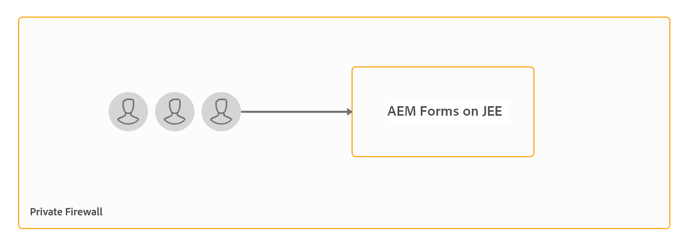

# Instalación y configuración del servidor de seguridad de documentos {#installing-and-configuring-the-document-security-server}

Utilice la seguridad de documentos para distribuir de forma segura cualquier información que haya guardado en un formato compatible. Solo los usuarios autorizados pueden acceder a los documentos protegidos.

La seguridad de documentos de Adobe Experience Manager Forms garantiza que solo los usuarios autorizados puedan utilizar sus documentos. Con la seguridad de los documentos, puede distribuir con seguridad cualquier información que haya guardado en un formato compatible. Los formatos de archivo admitidos son Adobe Portable Document Format (PDF) y Microsoft Word, Excel y PowerPoint.

Puede proteger documentos mediante políticas. La configuración de confidencialidad que especifique en una política determinará cómo puede un destinatario utilizar un documento al que aplique la política. Por ejemplo, puede especificar si los destinatarios pueden imprimir o copiar texto, editar texto o agregar firmas y comentarios a documentos protegidos.

Las directivas se almacenan en el servidor de Document Security; las políticas se aplican a los documentos a través de la aplicación cliente. Cuando se aplica una política a un documento, la configuración de confidencialidad especificada en la política protege la información que contiene el documento. Puede distribuir el documento protegido por una política a los destinatarios autorizados por la política.

Document Security también proporciona a los clientes, visores e indexadores para proteger documentos, ver documentos protegidos e indexar documentos protegidos. Para obtener información detallada sobre la seguridad de los documentos, consulte [sobre la seguridad](/help/forms/using/admin-help/document-security.md)de los documentos.

## Topología de implementación {#deployment-topology}

La capacidad de seguridad de documentos solo está disponible en AEM Forms en JEE. Se requiere una sola instancia de AEM Forms en JEE. También puede crear un clúster o conjunto de servidores de AEM Forms, si es necesario. La siguiente topología es una topología indicativa para ejecutar la capacidad de seguridad del documento. Para obtener información detallada sobre la topología, consulte [Arquitectura y topologías de implementación para AEM Forms](aem-forms-architecture-deployment.md).

<!--fix above link-->

En el diagrama siguiente se muestra la arquitectura típica de AEM Forms Document Security:

## Instalación de AEM Forms en JEE {#installing-aem-forms-on-jee}

Siga estos pasos para instalar y configurar AEM Forms en JEE:

1. Descargue el instalador de AEM 6.4 Forms en JEE del sitio web de licencias de [Adobe (LWS)](https://licensing.adobe.com/). Se requiere un contrato de mantenimiento y soporte válido para descargar el instalador.
1. Lea el documento [Formularios](/help/forms/using/aem-forms-jee-supported-platforms.md) AEM en plataformas compatibles con JEE y asegúrese de que el software, el hardware, los sistemas operativos, el servidor de aplicaciones, las bases de datos, los JDK y otras infraestructuras están listos para instalar AEM Forms en JEE.
1. (Solo las instalaciones no llave en mano) Lea [Preparación de la instalación de un solo servidor](https://www.adobe.com/go/learn_aemforms_prepareInstallsingle_64) de AEM Forms o [Preparación de la instalación del clúster](https://www.adobe.com/go/learn_aemforms_prepareInstallcluster_64) de servidores de AEM Forms y preparación del entorno para instalar y configurar AEM Forms en JEE.
1. Según el entorno y el servidor de aplicaciones, elija uno de los siguientes documentos y siga las instrucciones para completar la instalación

   * [Instalación e implementación de AEM Forms en JEE con JBoss llave en mano](https://www.adobe.com/go/learn_aemforms_installTurnkey_64)
   * [Instalación e implementación de AEM Forms en JEE para JBoss](https://www.adobe.com/go/learn_aemforms_installJBoss_64)
   * [Instalación e implementación de AEM Forms en JEE para WebLogic](https://www.adobe.com/go/learn_aemforms_installWebLogic_64)
   * [Instalación e implementación de AEM Forms en JEE para WebSphere](https://www.adobe.com/go/learn_aemforms_installWebSphere_64)
   * [Configuración de AEM Forms en JEE en el clúster de JBoss](https://www.adobe.com/go/learn_aemforms_clusterJBoss_64)
   * [Configuración de AEM Forms en JEE en el clúster de WebLogic](https://www.adobe.com/go/learn_aemforms_clusterWebLogic_64)
   * [Configuración de AEM Forms en JEE en el clúster de WebSphere](https://www.adobe.com/go/learn_aemforms_clusterWebSphere_64)
   >[!NOTE]
   >
   >En la pantalla de selección de módulos de AEM Forms en el administrador de configuración JEE, seleccione la opción Document Security. La opción Document Security no requiere que se seleccione ningún otro módulo.

## Próximos pasos {#next-steps}

* [Configuración de las opciones de cliente y servidor](/help/forms/using/admin-help/configuring-client-server-options.md)
* [Crear y administrar políticas](/help/forms/using/admin-help/creating-policies.md)
* [Crear y administrar conjuntos de políticas](/help/forms/using/admin-help/creating-policy-sets.md)
