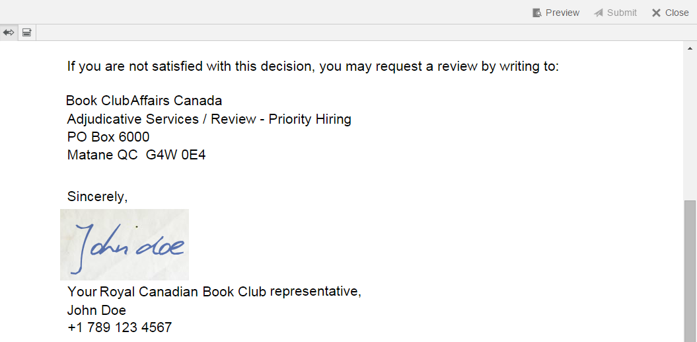

# Administrar imágenes de firma del agente {#manage-agent-signature-images}

## Información general {#overview}

En Gestión de Correspondencia, puede utilizar una imagen para representar la firma del agente en letras. Después de configurar la imagen de firma del agente, mientras crea una carta, puede procesar la imagen de firma del agente en la carta como la firma del agente remitente.

El DDE agentSignatureImage es un DDE calculado que representa la imagen de firma del agente. La expresión para este DDE calculado utiliza una nueva función personalizada expuesta por el bloque de creación del Administrador de expresiones. Esta función personalizada toma agentID y agentFolder como parámetros de entrada y obtiene el contenido de la imagen en función de estos parámetros. El diccionario de datos del sistema SystemContext proporciona a las letras de la Gestión de Correspondencia acceso a la información en el contexto actual del sistema. El contexto del sistema incluye información sobre los parámetros de configuración activa y del usuario que ha iniciado sesión en ese momento.

Puede añadir imágenes en la carpeta cmuserroot. En [Propiedades de configuración de la gestión de correspondencia](/help/forms/using/cm-configuration-properties.md), con la propiedad raíz de usuario de CM , puede cambiar la carpeta desde la que se toma la imagen de firma del agente.

El valor de agentFolder DDE se toma del parámetro de configuración CMUserRoot para las propiedades de configuración de Correspondence Management. De forma predeterminada, este parámetro de configuración apunta a/content/cmUserRoot en el repositorio CRX. Puede cambiar el valor de la configuración CMUserRoot en las Propiedades de configuración.\
También puede anular la función personalizada predeterminada para definir su propia lógica para recuperar la imagen de firma del usuario.

## Adición de la imagen de firma del agente {#adding-agent-signature-image}

1. Asegúrese de que la imagen de firma del agente tiene el mismo nombre que el nombre de usuario AEM del usuario. (No se necesita extensión para el nombre de archivo de imagen).
1. En CRX, cree una carpeta con el nombre `cmUserRoot` en la carpeta de contenido.

   1. Vaya a `https://[server]:[port]/crx/de`. Si es necesario, inicie sesión como Administrador.

   1. Haga clic con el botón derecho en el **contenido** carpeta y seleccione **Crear** > **Crear carpeta**.

      

   1. En el cuadro de diálogo Crear carpeta, introduzca el nombre de la carpeta como `cmUserRoot`. Haga clic en **Guardar todo**.

      >[!NOTE]
      >
      >cmUserRoot es la ubicación predeterminada donde AEM busca la imagen de firma del agente. Sin embargo, puede cambiarla editando la propiedad raíz del usuario de CM en el [Propiedades de configuración de la gestión de correspondencia](/help/forms/using/cm-configuration-properties.md).

1. En el Explorador de contenido, vaya a la carpeta cmUserRoot y añada la imagen de firma del agente en ella.

   1. Vaya a `https://[server]:[port]/crx/explorer/index.jsp`. Inicie sesión como administrador, si es necesario.
   1. Haga clic en **Explorador de contenido**. El Explorador de contenido se abre en una nueva ventana.
   1. En el Explorador de contenido, vaya a la carpeta cmUserRoot y selecciónela. Haga clic con el botón derecho en el **cmUserRoot** carpeta y seleccione **Nuevo nodo**.

      

      Realice las siguientes entradas en la fila para el nuevo nodo y, a continuación, haga clic en la marca de verificación verde.

      **Nombre:** JohnDoe (o el nombre del archivo de firma del agente)

      **Tipo:** nt:file

      En el `cmUserRoot` carpeta, una carpeta nueva denominada `JohnDoe` (o el nombre que ha dado en el paso anterior) se crea.

   1. Haga clic en la nueva carpeta que ha creado (aquí `JohnDoe`). El Explorador de contenido muestra el contenido de la carpeta como atenuado.

   1. Haga doble clic en el botón **jcr:content** propiedad, establezca su tipo como **nt:resource** y, a continuación, haga clic en la marca de verificación verde para guardar la entrada.

      Si la propiedad no está presente, cree primero una propiedad con el nombre jcr:content.

      

      Entre las subpropiedades de jcr:content está jcr:data, que está atenuado. Haga doble clic en jcr:data. La propiedad se puede editar y aparece el botón Elegir archivo en la entrada. Haga clic en **Elegir archivo** y seleccione el archivo de imagen que desee utilizar como logotipo. El archivo de imagen no necesita tener una extensión.

      
   Haga clic en **Guardar todo**.

1. Asegúrese de que el XDP\layout que utilice en la carta tenga un campo de imagen en la parte inferior izquierda (u otro lugar apropiado en la presentación donde desee representar la firma) para representar la imagen de firma.
1. Al crear la correspondencia, en la pestaña Data seleccione un campo de imagen para la imagen de firma mediante los siguientes pasos:

   1. Seleccione Sistema en el menú emergente Tipo de vínculo del panel derecho.

   1. Seleccione el DDE agentSignatureImage de la lista en el panel Elemento de datos para SystemContext DD.

   1. Guarde la carta.

1. Cuando se representa la carta, puede ver la firma en la vista previa de la carta en el campo de imagen según la presentación.

   
