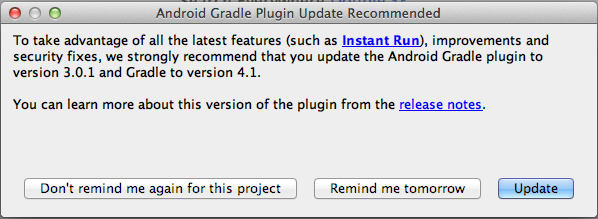

# Configure el proyecto de estudio de Android y cree la aplicación de Android {#set-up-the-android-studio-project-and-build-the-android-app}

Este artículo está destinado a la creación de la aplicación AEM Forms 6.3.1.1 y versiones posteriores. Para crear una aplicación a partir del código fuente del código fuente de AEM Forms App 6.3, consulte [Configuración del proyecto Eclipse y creación de la aplicación Android™](/help/forms/using/setup-eclipse-project-build-installer.md).

AEM Forms proporciona el código fuente completo de la aplicación de AEM Forms. El origen contiene todos los componentes para crear una aplicación de AEM Forms personalizada. El archivo de código fuente, `adobe-lc-mobileworkspace-src-<version>.zip` es parte del paquete `adobe-aemfd-forms-app-src-pkg-<version>.zip` de distribución de software.

Para obtener el origen de la aplicación de AEM Forms, realice los siguientes pasos:

1. Abra [Distribución de software](https://experience.adobe.com/downloads). Necesita un Adobe ID para iniciar sesión en la distribución de software.
1. Toque **[!UICONTROL Adobe Experience Manager]** disponible en el menú del encabezado.
1. En la sección **[!UICONTROL Filtros]**:
   1. Seleccione **[!UICONTROL Forms]** en la lista desplegable **[!UICONTROL Solución]**.
   2. Seleccione la versión y escriba el paquete. También puede utilizar la opción **[!UICONTROL Buscar descargas]** para filtrar los resultados.
1. Toque el nombre del paquete aplicable a su sistema operativo, seleccione **[!UICONTROL Aceptar los términos del EULA]** y toque **[!UICONTROL Descargar]**.
1. Abra [Administrador de paquetes](https://docs.adobe.com/content/help/en/experience-manager-65/administering/contentmanagement/package-manager.html) y haga clic en **[!UICONTROL Cargar paquete]** para cargar el paquete.
1. Seleccione el paquete y haga clic en **[!UICONTROL Instalar]**.

La siguiente imagen muestra el contenido extraído del `adobe-lc-mobileworkspace-src-<version>.zip`.

La siguiente imagen muestra la estructura de directorio de la carpeta `android`en la carpeta `src`.

## Compilación de la aplicación estándar de AEM Forms {#set-up-the-xcode-project}

1. Realice los siguientes pasos para configurar un proyecto en Android™ Studio y proporcionar una identidad de firma:

   Inicie sesión en un equipo que tenga Android™ Studio instalado y configurado.

1. Copie el archivo `adobe-lc-mobileworkspace-src-<version>.zip` descargado en:

   **Para usuarios** de MAC:  `[User_Home]/Projects`

   **Para usuarios** de Windows®:  `%HOMEPATH%\Projects`

   >[!NOTE]
   >
   >Para Windows®, se recomienda mantener el proyecto androide en la unidad del sistema.

1. Extraiga el archivo en el siguiente directorio:

   **Para usuarios** de MAC:  `[User_Home]/Projects/[your-project]`

   **Para usuarios** de Windows®:  `%HOMEPATH%\Projects\[your-project]`

   >[!NOTE]
   >
   >Se recomienda mantener el proyecto de androides extraído en la unidad del sistema antes de importar el proyecto en Android Studio.

1. Inicie Android™ Studio.

   **Para usuarios** de MAC: Actualice el  `local.properties` archivo presente en la  `[User_Home]/Projects/[your-project]/android` carpeta y señale la  `sdk.dir` variable a la  `SDK` ubicación en el escritorio.

   **Para usuarios** de Windows®: Actualice el  `local.properties` archivo presente en la  `%HOMEPATH%\Projects\[your-project]\android` carpeta y señale la  `sdk.dir` variable a la  `SDK` ubicación en el escritorio.

1. Haga clic en **[!UICONTROL Finalizar]**para crear el proyecto.

   El proyecto está disponible en el Explorador de proyectos de ADT.

   

1. En Android™ Studio, seleccione **[!UICONTROL Importar proyecto (Eclipse ADT, Gradle, Etc.)]**.
1. En el explorador de proyectos, seleccione el directorio raíz del proyecto que desea generar en el cuadro de texto **Directorio raíz**:

   **Para usuarios de Mac:** [User_Home]/Projects/MobileWorkspace/src/android

   **Para usuarios de Windows®:** %HOMEPATH%\Projects\MobileWorkspace\src\android

1. Después de importar el proyecto, aparece una ventana emergente con la opción de actualizar el complemento Android™ Gradle. Haga clic en el botón correspondiente según sus necesidades.

   

1. Después de crear correctamente el gradle, aparece la siguiente pantalla. Conecte el dispositivo o emulador apropiado con el sistema y haga clic en **[!UICONTROL Ejecutar Android™]**.

   

1. Android™ Studio muestra los dispositivos conectados y los emuladores disponibles. Seleccione el dispositivo en el que desea ejecutar la aplicación y haga clic en **Aceptar**.

   

Después de crear el proyecto, puede optar por instalar la aplicación mediante Android™ Debug Bridge o Android™ Studio.

### Uso de Android™ Debug Bridge {#andriod-debug-bridge}

Puede instalar la aplicación en un dispositivo Android™ mediante el [puente de depuración de Android™](https://developer.android.com/tools/help/adb.html) con el siguiente comando:

**Para usuarios** de MAC:  `adb install [User_Home]/Projects/[your-project]/adobe-lc-mobileworkspace-src-[version]/android/build/outputs/apk/android-debug.apk`

**Para usuarios** de Windows®:  `adb install %HOMEPATH%\Projects\[your-project]\adobe-lc-mobileworkspace-src-[version]\android\build\outputs\apk\android-debug.apk`

