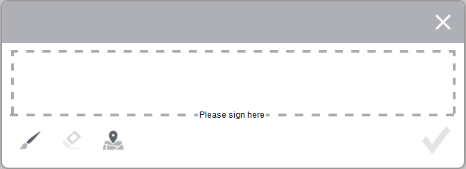

# Aplicar firmas electrónicas a un formulario utilizando firmas manuscritas {#apply-electronic-signatures-to-a-form-using-scribble-signatures}

>[!CAUTION]
>
>AEM 6.4 ha llegado al final de la compatibilidad ampliada y esta documentación ya no se actualiza. Para obtener más información, consulte nuestra [períodos de asistencia técnica](https://helpx.adobe.com/es/support/programs/eol-matrix.html). Buscar las versiones compatibles [here](https://experienceleague.adobe.com/docs/).

Puede usar los componentes **Firma manuscrita** y **Paso de firma** para dibujar la firma (manuscrita) en un formulario adaptable. El componente Paso de firma muestra una versión PDF del formulario adaptable. Para utilizar el componente Paso de firma, necesita activar la opción Documento de registro o un formulario adaptable basado en una plantilla de formulario.

Ambos componentes proporcionan una ventana, como se muestra a continuación, para firmar un formulario. También puede hacer clic en el icono de geolocalización  para agregar geolocalización a la firma.

## Configurar un formulario adaptable para utilizar una firma manuscrita {#configure-an-adaptive-form-to-use-scribble-signature}

1. Active la opción Documento de registro o utilice un formulario adaptable basado en una plantilla de formulario. Para obtener información paso a paso, consulte [Crear un formulario adaptable](/help/forms/using/creating-adaptive-form.md).
1. Arrastre y suelte el componente **Firma manuscrita** desde el explorador de componentes al formulario adaptable.
1. Pulse el icono **Configurar** . Se abrirá el explorador de propiedades, donde verá las propiedades del componente Firma manuscrita. Configure las propiedades del componente Firma manuscrita.
1. Arrastre y suelte el componente Paso de firma desde el explorador de componentes al formulario adaptable.

   >[!NOTE]
   >
   >El componente Paso de firma ocupa el ancho completo disponible en el formulario. Se recomienda no colocar ningún otro componente en la sección que contiene el componente Paso de firma.

1. En el navegador de contenido, pulse **Contenedor de formulario** y haga clic en el icono **Configurar** . Se abrirá el explorador de propiedades, donde verá las propiedades del contenedor de formularios adaptables. Vaya a **Contenedor de formulario adaptable** > **Firma electrónica** y desmarque **Habilitar Acrobat Sign** . Pulse el icono Listo  para guardar los cambios.

   >[!NOTE]
   >
   >Cuando se añade un componente Paso de firma a un formulario adaptable, la opción Habilitar Acrobat Sign se selecciona automáticamente.

1. Pulse el icono **Configurar** . Se abrirá el explorador de propiedades, donde verá las propiedades del Paso de firma. Configure las siguientes propiedades:

   * **Nombre del elemento**: especifique el nombre del componente.
   * **Título:** especifique un título único para el componente.
   * **Mensaje de plantilla:** especifique el mensaje que se mostrará mientras se carga el PDF de firma. Los servicios de Acrobat Sign tardan algún tiempo en preparar y cargar el PDF de firma.
   * **Servicio de firma:** seleccione la opción **Firma manuscrita**.
   * **Clase CSS**: especifique la clase CSS de la biblioteca de cliente, si la hay. Se recomienda utilizar [temáticas](/help/forms/using/themes.md) y [estilos en línea](/help/forms/using/inline-style-adaptive-forms.md) en lugar de la clase CSS.

   Pulse el icono Listo  para guardar los cambios. La firma se ha configurado correctamente.

   Ahora, al rellenar un formulario, se muestra una versión PDF del formulario adaptable y se proporcionan las opciones para firmar el documento PDF. Para obtener información detallada, consulte [Firmar un formulario adaptable con una firma manuscrita](/help/forms/using/signing-forms-using-scribble.md#p-sign-an-adaptive-form-using-scribble-signature-p).

## Firmar un formulario adaptable con una firma manuscrita {#sign-an-adaptive-form-using-scribble-signature}

1. Después de rellenar un formulario adaptable y llegar a la página Paso de firma, se muestra la pantalla de firma.

   

1. Haga clic en **[!UICONTROL Firmar]**. Aparecerá el cuadro de diálogo Firma manuscrita. Firme el formulario y haga clic en el icono Listo  para guardar la firma.

   

1. Haga clic en Completar para finalizar el proceso de firma.

   

Las firmas se agregan al formulario y el control de formulario pasa al siguiente panel.
