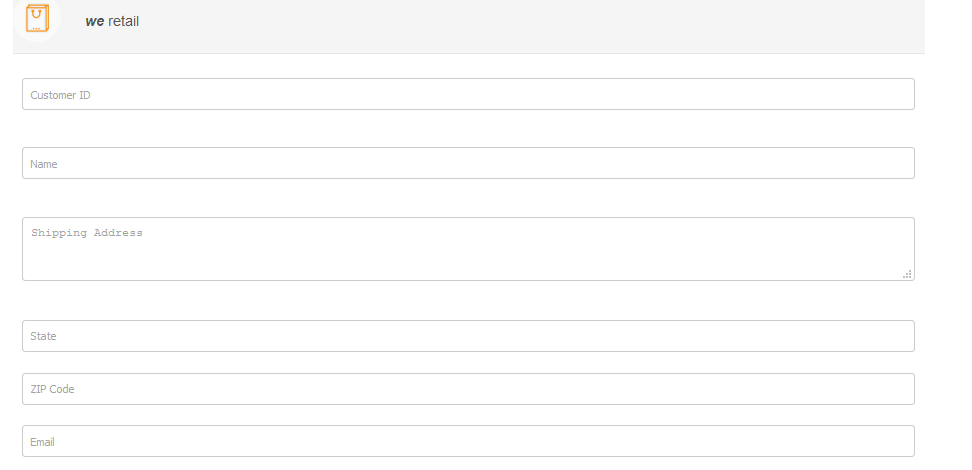
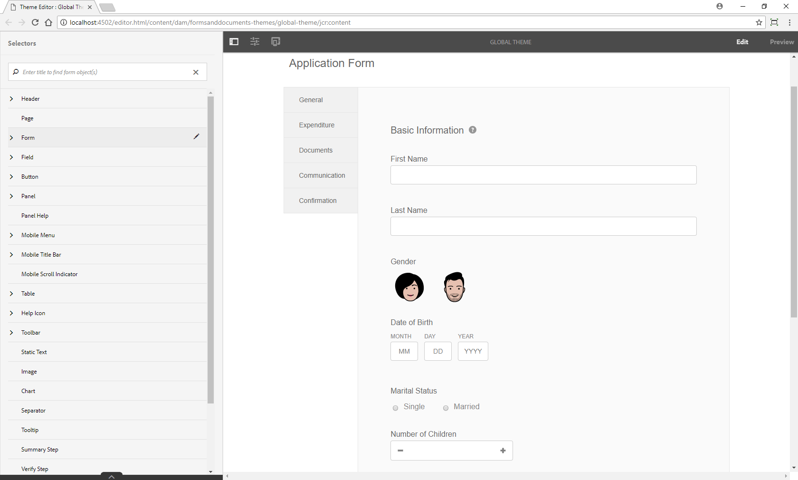
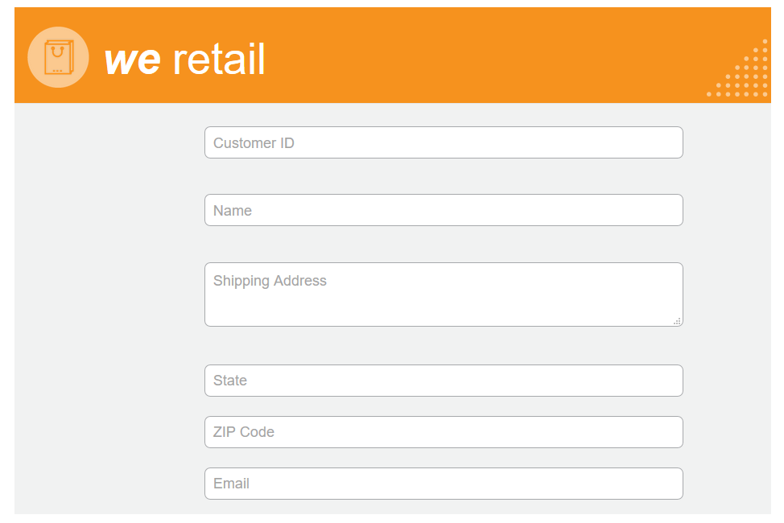

# Estile el formulario adaptable {#do-not-publish-style-your-adaptive-form}

Aprenda a crear un tema personalizado, aplicar estilo a componentes individuales y utilizar fuentes web en un tema

Este tutorial es un paso de la serie [Create Your First Adaptive Form](create-your-first-adaptive-form.md). Se recomienda seguir la serie en secuencia cronológica para comprender, realizar y demostrar el caso de uso completo del tutorial.

## Acerca del tutorial {#about-the-tutorial}

Puede utilizar temas para proporcionar un aspecto y un estilo únicos a un formulario adaptable. Puede aplicar temas predeterminados con el editor de formularios adaptables o crear temas personalizados propios. AEM Forms proporciona un [editor de temas](themes.md) para crear temas personalizados. Un solo tema puede proporcionar un aspecto diferente al mismo formulario adaptable abierto en dispositivos móviles, tabletas o de escritorio. No es necesario tener conocimientos previos de CSS o LESS para utilizar el editor de temas, pero se desea.

Al final del tutorial, aprenderá a:

* Aplicar un tema preestablecido a un formulario adaptable
* Creación de un tema para un formulario adaptable mediante el editor de temas
* Estilo de los componentes individuales
* Sección Bonos: Usar fuentes web en un tema personalizado

El formulario será similar al siguiente después de completar el tutorial:

## Antes de comenzar {#before-you-start}

Descargue las imágenes de estilo de encabezado y logotipo, a continuación, en su equipo local. El encabezado del formulario adaptable `shipping-address-add-update-form` utiliza el estilo del encabezado y las imágenes de logotipo. La imagen de estilo de encabezado aparece a la derecha del encabezado.

[Obtener archivo](assets/header-style.png)

[Obtener archivo](assets/logo-1.png)

## Paso 1: Aplique un tema a su formulario adaptable {#step-apply-a-theme-to-your-adaptive-form}

El editor de formularios adaptables proporciona varios temas predeterminados. Si planea no utilizar un estilo personalizado para el formulario adaptable, también puede publicar los formularios adaptables con un tema incorporado. Los temas son independientes de las formas adaptables. Puede aplicar el mismo tema a varios formularios adaptables. Para aplicar un tema a un formulario adaptable:

1. Abra el formulario adaptable para editarlo.

   [http://localhost:4502/editor.html/content/forms/af/shipping-address-add-update-form.html](http://localhost:4502/editor.html/content/forms/af/shipping-address-add-update-form.html)

1. Abra las propiedades del **contenedor del formulario adaptable**. En el navegador de propiedades, vaya a **Básico** > **Tema del formulario adaptable**. El campo **Tema del formulario adaptable** enumera todos los temas predeterminados y personalizados. De forma predeterminada, se aplica el tema Lienzo .
1. Seleccione un tema en el campo **Tema del formulario adaptable**. Por ejemplo, **Tema de encuesta**. Toque  para aplicar el tema seleccionado.

**Figura:** *Formulario adaptable con el tema predeterminado*

**Figura:** *Formulario adaptable con el tema Encuesta*

## Paso 2: Actualice el formulario adaptable {#step-update-your-adaptive-form}

El diseño mostrado arriba requiere cambios en el texto del marcador de posición y en el logotipo de su formulario adaptable existente. Realice los siguientes pasos para realizar los cambios necesarios:

1. Cambie el logotipo y el texto existentes del encabezado. Para eliminar el logotipo:

   1. Abra el formulario en el editor de formularios.

      [http://localhost:4502/editor.html/content/forms/af/shipping-address-add-update-form.html](http://localhost:4502/editor.html/content/forms/af/shipping-address-add-update-form.html)

   1. Pulse la imagen del logotipo en el componente del encabezado y pulse  propiedades. En la propiedad de imagen, pulse X para eliminar la imagen del logotipo existente.
   1. Pulse cargar, seleccione el logo.png y pulse  para guardar los cambios. La imagen se descargó en la sección [Antes de comenzar](/help/forms/using/style-your-adaptive-form.md#before-you-start).
   1. Pulse texto del encabezado, `We.Retail` y pulse  **editar**. Cambie el texto del encabezado a `we retail`. Aplicar formato de negrita solo a `we`en `we retail`.

   

1. Elimine el título y añada texto de marcador de posición:

   1. Pulse el campo ID de cliente y pulse  propiedades.
   1. Copie el contenido del campo **Title** en el campo **Texto del marcador de posición**.
   1. Elimine el contenido del campo **Title** y pulse .
   1. Repita los tres pasos anteriores para todos los cuadros de texto, cuadros numéricos y campos de correo electrónico del formulario.

   

## Paso 3: Cree un tema personalizado para su formulario adaptable {#step-create-a-custom-theme-for-your-adaptive-form}

Puede utilizar [editor de temas](/help/forms/using/themes.md) para crear temas personalizados. El editor de temas es un poderoso editor WYSIWYG. Es un método visual aplicar CSS a varios componentes de un formulario adaptable. Proporciona controles más precisos para aplicar estilo a los componentes y paneles de un formulario adaptable.

Un tema es una entidad independiente como los formularios adaptables. Contiene estilos (CSS) para los componentes y paneles de un formulario adaptable. Los estilos incluyen propiedades CSS como colores de fondo, colores de estado, transparencia, alineación y tamaño. Al aplicar un tema, el estilo especificado se aplica a los componentes correspondientes de un formulario adaptable.

En este tutorial, aplicará estilo al encabezado y al pie de página, a los componentes numéricos y de texto, al componente de datos adjuntos y a los botones. Empecemos por crear un tema:

### Crear un tema {#create-a-theme}

1. Inicie sesión en la instancia de autor de AEM y vaya a **Adobe Experience Manager** > **Forms** > **Temas**. La dirección URL predeterminada es [http://localhost:4502/aem/forms.html/content/dam/formsanddocuments-themes](http://localhost:4502/aem/forms.html/content/dam/formsanddocuments-themes).
1. Pulse **[!UICONTROL Crear]** y seleccione **[!UICONTROL Tema]**. Aparece la página Crear tema con los campos necesarios para crear un tema. Los campos Título y Nombre son obligatorios:

   * **Título:** especifique un título para el tema. Por ejemplo, **Tema global.** El título le ayuda a identificar el tema en la lista de temas.
   * **Nombre:** especifique el nombre del tema. Por ejemplo, **Tema global.** Se crea un nodo con el nombre especificado en el repositorio. A medida que empieza a escribir un título, el valor del campo de nombre se genera automáticamente. Puede cambiar el valor sugerido. El campo de nombre solo puede incluir caracteres alfanuméricos, guiones y guiones bajos. Todas las entradas no válidas se sustituyen por guiones.

1. Toque **Crear**. Se crea un tema y aparece un cuadro de diálogo para abrir el formulario y editarlo. Toque **Abrir** para abrir el tema recién creado en una nueva pestaña. El tema se abre en el editor de temas. Para el estilo, el editor de temas utiliza un formulario adaptable incorporado que se incluye con AEM Forms.

   Para obtener información sobre el uso de la IU del editor de temas, consulte [Acerca del editor de temas](/help/forms/using/themes.md#aboutthethemeeditor).

1. Toque **Opciones de tema**  > **Configurar**. En el campo **Vista previa del formulario**, seleccione el formulario adaptable **Shipping-address-add-update-form**, pulse  y pulse **Guardar**. Ahora, el editor de temas está configurado para usar su propio formulario adaptable en lugar del formulario adaptable predeterminado. Toque **Cancelar** para volver al editor de temas.

   

   **Figura:** *Editor de temas con el formulario adaptable Shipping-address-add-update-form*

   

   **Figura:** *Formulario adaptable con el formulario predeterminado*

### Encabezado y pie de página de estilo {#style-header-and-footer}

El encabezado y el pie de página proporcionan un aspecto coherente y distintivo a un formulario adaptable. Por lo general, el encabezado contiene el logotipo y el nombre de la organización, el pie de página contiene información sobre los derechos de autor y estos datos siguen siendo idénticos en varias formas de organización. Para aplicar estilo al encabezado y al pie de página del formulario adaptable Shipping-address-add-update-form:

1. Vaya a la opción **Header** > **Text** en el panel Selectores. El panel Selectores se encuentra a la izquierda del editor de temas. Si el panel no está visible, pulse  Alternar panel lateral.

1. Defina las siguientes propiedades en el acordeón **Text** y pulse .

   | Propiedad | Value |
   |---|---|
   | Familia de fuentes | Arial |
   | Color de fuente | FFFFFF |
   | Tamaño de fuente | 54px |

1. Pulse el widget de encabezado y pulse **Encabezado**. Las opciones para aplicar estilo al widget de encabezado aparecen a la izquierda. Expanda el acordeón **Dimension y posición**, establezca la **altura** en `120px` y pulse .
1. Expanda el acordeón Fondo del widget de encabezado, establezca **Color de fondo** en `F6921E.`

   Pase el ratón sobre **Imagen y degradado** > **+ Agregar**, pulse **Imagen**. Establezca las siguientes propiedades y pulse .

   | Propiedad | Valor |
   |---|---|
   | image | Cargue header-style.png. La imagen se descargó en la sección [Antes de comenzar](/help/forms/using/style-your-adaptive-form.md#before-you-start). |
   | Posición | Inferior Derecha |
   | Mosaico | No repetir |

1. En el editor de temas, pulse el logotipo en el encabezado y pulse **Logotipo de encabezado**. Expanda el acordeón Dimension y posición , defina las siguientes propiedades y pulse .

<table> 
 <tbody> 
  <tr> 
   <td>imagen</td> 
   <td>Valor</td> 
  </tr> 
  <tr> 
   <td>imagen</td> 
   <td> 
    <ul> 
     <li>Superior: 1,5 rem</li> 
     <li>Abajo: -35 px</li> 
     <li>Izquierda: 1rem<strong>  </strong></li> 
    </ul> 
<strong>Sugerencia:</strong> Pulse el icono del   vínculo para proporcionar un valor diferente a cada campo.  
 </td> 
  </tr> 
  <tr> 
   <td>Altura</td> 
   <td>4,75 rem</td> 
  </tr> 
 </tbody> 
</table>

1. Pulse el widget de pie de página y pulse **Pie de página**. Expanda el acordeón **Fondo**, establezca **Color de fondo** en `F6921E` y pulse .

### Estile el componente de captura de datos y aplique un fondo al formulario adaptable {#style-the-data-capture-component-and-apply-a-background-to-the-adaptive-form}

Puede utilizar varios componentes en un formulario adaptable para capturar datos. Por ejemplo, cuadro de texto y cuadro numérico. Puede proporcionar un estilo idéntico a todos los componentes de captura de datos o a todos los estilos independientes para cada componente. En este tutorial, se aplica un estilo idéntico a los cuadros numéricos (ID de cliente, código postal) y los cuadros de texto (ID de cliente, nombre, dirección de envío, estado, correo electrónico). Para aplicar estilo a los componentes de captura de datos:

1. Pulse el campo ID de cliente y pulse la opción **Utilidad de campo**. Establezca las siguientes propiedades y pulse .

<table> 
 <tbody> 
  <tr> 
   <td>Acordeón</td> 
   <td>Propiedad</td> 
   <td>Valor</td> 
  </tr> 
  <tr> 
   <td>Borde</td> 
   <td>Color del borde</td> 
   <td>A7A9AC</td> 
  </tr> 
  <tr> 
   <td>Borde</td> 
   <td>Radio de borde </td> 
   <td> 
    <ul> 
     <li>Superior: 7px  </li> 
     <li>Derecha: 7px  </li> 
     <li>Abajo: 7px  </li> 
     <li>Izquierda: 7px  </li> 
    </ul> </td> 
  </tr> 
  <tr> 
   <td>Texto</td> 
   <td>Familia de fuentes</td> 
   <td>Arial</td> 
  </tr> 
  <tr> 
   <td>Texto</td> 
   <td>Color de fuente</td> 
   <td>939598  </td> 
  </tr> 
  <tr> 
   <td>Texto</td> 
   <td>Tamaño de fuente</td> 
   <td>18px</td> 
  </tr> 
  <tr> 
   <td>Dimension y posición</td> 
   <td>Anchura</td> 
   <td>60%</td> 
  </tr> 
  <tr> 
   <td>Dimension y posición</td> 
   <td>imagen</td> 
   <td> 
    <ul> 
     <li>Izquierda: 10 rem</li> 
    </ul> </td> 
  </tr> 
 </tbody> 
</table>

1. Pulse en el área vacía encima del campo ID de cliente y pulse **Contenedor de panel interactivo**. Defina el **Background** > **Background Color** en F1F2F2. Pulse .

   

### Estilos de los botones {#style-the-buttons}

Puede utilizar un tema personalizado para aplicar un estilo idéntico a todos los botones del formulario adaptable y [estilo en línea](/help/forms/using/inline-style-adaptive-forms.md) para aplicar un estilo a un botón específico. Para aplicar estilo a los botones:

1. Pulse el botón **Submit** y pulse la opción **Button**. Establezca las siguientes propiedades y pulse .

<table> 
 <tbody> 
  <tr> 
   <td>Acordeón</td> 
   <td>Propiedad</td> 
   <td>Valor</td> 
  </tr> 
  <tr> 
   <td>Fondo</td> 
   <td>Color de fondo</td> 
   <td>F6921E</td> 
  </tr> 
  <tr> 
   <td>Borde  </td> 
   <td>Color del borde</td> 
   <td>F6921E</td> 
  </tr> 
  <tr> 
   <td>Borde</td> 
   <td>Radio de borde </td> 
   <td> 
    <ul> 
     <li>Superior: 7px  </li> 
     <li>Derecha: 7px  </li> 
     <li>Abajo: 7px  </li> 
     <li>Izquierda: 7px</li> 
    </ul> </td> 
  </tr> 
  <tr> 
   <td>Texto  </td> 
   <td>Familia de fuentes</td> 
   <td>Arial</td> 
  </tr> 
  <tr> 
   <td>Texto</td> 
   <td>Color de fuente</td> 
   <td>FFFFFF</td> 
  </tr> 
  <tr> 
   <td>Texto</td> 
   <td>Tamaño de fuente</td> 
   <td>18px</td> 
  </tr> 
 </tbody> 
</table>

1. [Aplique el tema](/help/forms/using/style-your-adaptive-form.md#step-apply-a-theme-to-your-adaptive-form) personalizado, Tema global, a su formulario adaptable. Si el estilo no se refleja en el formulario adaptable, limpie la caché del explorador y vuelva a intentarlo.

   

## Paso 4: Estilos de componentes individuales {#step-style-individual-components}

Algunos estilos solo se aplican a un componente específico. Estos componentes están diseñados en el editor de formularios adaptables.

1. Abra el formulario adaptable para editarlo. [http://localhost:4502/editor.html/content/forms/af/shipping-address-add-update-form.html](http://localhost:4502/editor.html/content/forms/af/change-billing-shipping-address.html)
1. En la barra superior, seleccione la opción **Estilo**.

   

1. Pulse el botón **Attach** y pulse el icono . Establezca las siguientes propiedades en el acordeón **Dimension y Posición**:

   | Propiedad | Valor |
   |---|---|
   | Flotante | Izquierda |
   | Anchura | 10% |

1. Pulse la opción **Government approved address proof** y pulse el icono . Establezca las siguientes propiedades:

<table> 
 <tbody> 
  <tr> 
   <td>Acordeón</td> 
   <td>Propiedad</td> 
   <td>Valor</td> 
  </tr> 
  <tr> 
   <td>Dimensiones y posición</td> 
   <td>Flotante</td> 
   <td>Izquierda</td> 
  </tr> 
  <tr> 
   <td>Dimensiones y posición</td> 
   <td>Anchura</td> 
   <td>73 %</td> 
  </tr> 
  <tr> 
   <td>Dimensiones y posición</td> 
   <td>Espacio</td> 
   <td> 
    <ul> 
     <li>Izquierda: 10px</li> 
    </ul> </td> 
  </tr> 
  <tr> 
   <td>Dimensiones y posición</td> 
   <td>Altura</td> 
   <td>40px</td> 
  </tr> 
  <tr> 
   <td>Dimensiones y posición  </td> 
   <td>imagen</td> 
   <td>  
    <ul> 
     <li>Derecha: 2 rem</li> 
     <li>Izquierda: 10 rem </li> 
    </ul> </td> 
  </tr> 
  <tr> 
   <td>Fondo</td> 
   <td>Color de fondo</td> 
   <td>FFFFFF</td> 
  </tr> 
  <tr> 
   <td>Borde</td> 
   <td>Anchura de borde</td> 
   <td>1px</td> 
  </tr> 
  <tr> 
   <td>Borde</td> 
   <td>Estilo de borde</td> 
   <td>Sólido</td> 
  </tr> 
  <tr> 
   <td>Borde</td> 
   <td>Color del borde</td> 
   <td>A7A9AC</td> 
  </tr> 
  <tr> 
   <td>Borde</td> 
   <td>Radio de borde</td> 
   <td>7px</td> 
  </tr> 
  <tr> 
   <td>Texto</td> 
   <td>Familia de fuentes</td> 
   <td>Arial</td> 
  </tr> 
  <tr> 
   <td>Texto</td> 
   <td>Color de fuente</td> 
   <td>BCBEC0</td> 
  </tr> 
  <tr> 
   <td>Texto</td> 
   <td>Tamaño de fuente</td> 
   <td>18px</td> 
  </tr> 
  <tr> 
   <td>Texto</td> 
   <td>Altura de la línea</td> 
   <td>2</td> 
  </tr> 
 </tbody> 
</table>

1. Pulse el botón **Submit** y pulse el icono . Establezca las siguientes propiedades:

<table> 
 <tbody> 
  <tr> 
   <td>Acordeón</td> 
   <td>Propiedad</td> 
   <td>Valor</td> 
  </tr> 
  <tr> 
   <td>Dimension y posición</td> 
   <td>Flotante</td> 
   <td>Derecha</td> 
  </tr> 
  <tr> 
   <td>Dimension y posición</td> 
   <td>imagen</td> 
   <td> 
    <ul> 
     <li>Superior: 5 rem</li> 
     <li>Derecha: 14 rem</li> 
     <li>Abajo: 20px</li> 
     <li>Izquierda: 20px  </li> 
    </ul> </td> 
  </tr> 
  <tr> 
   <td>Fondo</td> 
   <td>Color de fondo</td> 
   <td>F6921E</td> 
  </tr> 
  <tr> 
   <td>Borde</td> 
   <td>Color del borde</td> 
   <td>F6921E</td> 
  </tr> 
 </tbody> 
</table>

## Paso 5: Sección Bonos: Uso de fuentes web en un tema personalizado {#step-bonus-section-using-web-fonts-in-a-custom-theme}

Puede utilizar varias fuentes para diseñar un formulario adaptable. Es posible que todos los dispositivos en los que se visualiza el formulario adaptable no tengan las fuentes utilizadas para diseñar el formulario adaptable. Puede utilizar un servicio de fuentes web para enviar las fuentes necesarias al dispositivo de destino.

Adobe Typekit es un servicio de fuentes web. Puede configurar y utilizar el servicio con formularios adaptables. Para utilizar Adobe Typekit en un formulario adaptable:

>[!NOTE]
>
> fontsTypekit ahora se denomina Adobe Fonts y se incluye con el Creative Cloud y otras suscripciones. [Más información](https://fonts.adobe.com/).

1. Cree una cuenta [Adobe Typekit](https://typekit.com/), cree un kit, añada la fuente Myriad Pro al kit, publique el kit y obtenga el ID del kit. Es necesario utilizar fuentes Adobe Typekit (fuentes web) en un formulario adaptable.
1. En el servidor de AEM Forms, vaya a  **Adobe Experience Manager** > **Herramientas**  > **Implementación** > **Cloud Services**. En la página Cloud Services, vaya a **Servicios de terceros** > **Typekit** y haga clic en **Configurar** ahora en Typekit. Si una configuración ya está disponible, haga clic en el botón + para crear una nueva instancia.

   En el cuadro de diálogo Crear configuración, especifique un **Título** para la configuración y haga clic en **Crear**. Se le redirige a la página de configuración. En el cuadro de diálogo Editar componente que aparece, proporcione su **ID del Kit** y haga clic en **Aceptar**.

1. Configure el tema para utilizar la configuración TypeKit. En la instancia de autor, abra **Tema global** en el editor de temas. En el editor de temas, vaya a Opciones de tema  > Configurar. En el campo **Typekit Configuration**, seleccione el kit y haga clic en **Save**.

   Las fuentes agregadas a Typekit están disponibles para su selección en el acordeón **Text** de todos los componentes.

