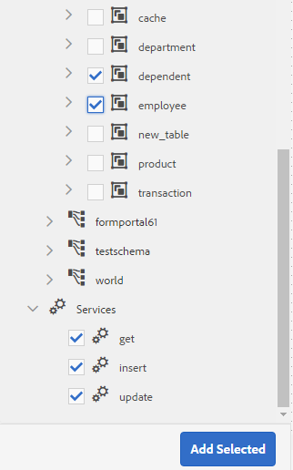
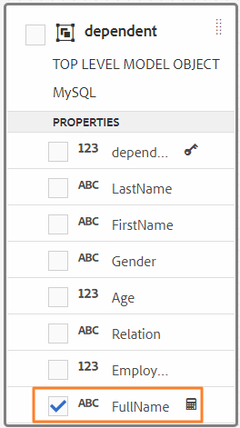

# Trabajar con el modelo de datos de formulario {#work-with-form-data-model}

La integración de datos proporciona un editor de modelos de datos de formulario para configurar y trabajar con modelos de datos de formulario.


El editor del modelo de datos de formulario proporciona una interfaz de usuario intuitiva y herramientas para editar y configurar un modelo de datos de formulario. Con el editor, se pueden agregar y configurar objetos, propiedades y servicios del modelo de datos desde fuentes de datos asociadas en el modelo de datos de formulario. Además, permite crear objetos y propiedades de modelos de datos sin fuentes de datos y enlazarlos posteriormente con objetos y propiedades de modelos de datos respectivos. También puede generar y editar datos de ejemplo para propiedades de objetos del modelo de datos que puede utilizar para rellenar previamente formularios adaptables y comunicaciones interactivas al obtener una vista previa. Puede probar los objetos y servicios del modelo de datos configurados en un modelo de datos de formulario para asegurarse de que está correctamente integrado con los orígenes de datos.

Si acaba de empezar con la integración de datos de Forms y no ha configurado una fuente de datos o creado un modelo de datos de formulario, consulte los temas siguientes:

* [Integración de datos de AEM Forms](/help/forms/using/data-integration.md)
* [Configurar fuentes de datos](/help/forms/using/configure-data-sources.md)
* [Crear modelo de datos de formulario](/help/forms/using/create-form-data-models.md)

Continúe leyendo para obtener más información sobre las diversas tareas y configuraciones que puede realizar con el editor del modelo de datos de formulario.

>[!NOTE]
>
>Debe ser miembro de los grupos **fdm-author** y **forms-user** para poder crear y trabajar con el modelo de datos de formulario. Póngase en contacto con el administrador de AEM para convertirse en miembro de los grupos.

## Agregar objetos y servicios del modelo de datos {#add-data-model-objects-and-services}

Si ha creado un modelo de datos de formulario con orígenes de datos, puede utilizar el editor del modelo de datos de formulario para agregar objetos y servicios del modelo de datos, configurar sus propiedades, crear asociaciones entre objetos del modelo de datos y probar el modelo y los servicios de datos de formulario.

Puede agregar objetos y servicios del modelo de datos desde fuentes de datos disponibles en el modelo de datos de formulario. Cuando los objetos del modelo de datos agregados aparecen en la pestaña Modelo, los servicios que se hayan añadido aparecen en la pestaña Servicios.

Para agregar objetos y servicios del modelo de datos:

1. Inicie sesión en la instancia de autor de AEM, vaya a **[!UICONTROL Forms > Integraciones de datos]** y abra el modelo de datos de formulario en el que desea agregar objetos del modelo de datos.
1. En el panel Fuentes de datos, amplíe las opciones para ver los objetos y servicios disponibles del modelo de datos.
1. Seleccione los objetos y servicios del modelo de datos que desea agregar al modelo de datos de formulario y pulse **[!UICONTROL Agregar selección]**.

   

   La pestaña Modelo muestra una representación gráfica de todos los objetos del modelo de datos y sus propiedades agregadas al modelo de datos de formulario. Cada objeto del modelo de datos se representa mediante un cuadro en el modelo de datos de formulario.

   

   >[!NOTE]
   >
   >Puede mantener y arrastrar cuadros de objetos del modelo de datos alrededor para organizarlos en el área de contenido. Todos los objetos del modelo de datos agregados al modelo de datos de formulario aparecen atenuados en el panel Fuentes de datos.

   La pestaña Servicios enumera los servicios añadidos.

   

   >[!NOTE]
   >
   >Además de los objetos y servicios del modelo de datos, el documento de metadatos del servicio OData incluye propiedades de navegación que definen la asociación entre dos objetos del modelo de datos. Para obtener más información, consulte [Uso de las propiedades de navegación de los servicios de OData](#work-with-navigation-properties-of-odata-services).

1. Pulse **[!UICONTROL Guardar]** para guardar el objeto del modelo de formulario.

   >[!NOTE]
   >
   >Puede invocar los servicios que configuró en la ficha Servicios de un modelo de datos de formulario mediante las reglas de formulario adaptables. Los servicios configurados están disponibles en la acción Invocar servicios del editor de reglas Para obtener más información sobre el uso de estos servicios en las reglas de formularios adaptables, consulte Invocar servicios y establecer el valor de las reglas en [editor de reglas](/help/forms/using/rule-editor.md).

## Crear objetos del modelo de datos y propiedades secundarias {#create-data-model-objects-and-child-properties}

### Crear objetos del modelo de datos {#create-data-model-objects}

Aunque puede agregar objetos de modelo de datos desde fuentes de datos configuradas, también puede crear objetos o entidades de modelo de datos sin fuentes de datos. Resulta útil, especialmente si no se han configurado fuentes de datos en el modelo de datos de formulario.

Para crear un objeto de modelo de datos sin fuentes de datos:

1. Inicie sesión en la instancia de autor de AEM, vaya a **[!UICONTROL Forms > Integraciones de datos]** y abra el modelo de datos de formulario en el que desea crear una entidad u objeto del modelo de datos.
1. Pulse **[!UICONTROL Crear entidad]**.
1. En el cuadro de diálogo Crear modelo de datos, especifique un nombre para el objeto del modelo de datos y haga clic en **[!UICONTROL Agregar]**. Se agrega un objeto de modelo de datos al modelo de datos del formulario. Tenga en cuenta que el objeto del modelo de datos recién agregado no está enlazado a un origen de datos y no tiene propiedades como se muestra en la siguiente imagen.

   

A continuación, puede agregar propiedades secundarias en objetos del modelo de datos no enlazados.

### Agregar propiedades secundarias {#child-properties}

El editor del modelo de datos de formulario permite crear propiedades secundarias en un objeto del modelo de datos. La propiedad cuando se crea no está enlazada a ninguna propiedad de una fuente de datos. Posteriormente, puede enlazar la propiedad secundaria con otra propiedad del objeto del modelo de datos que la contiene.

Para crear una propiedad secundaria:

1. En un modelo de datos de formulario, seleccione un objeto de modelo de datos y pulse **[!UICONTROL Crear propiedad secundaria]**.
1. En el cuadro de diálogo **[!UICONTROL Crear propiedad secundaria]**, especifique un nombre y un tipo de datos para la propiedad en los campos **[!UICONTROL Nombre]** y **[!UICONTROL Tipo]**, respectivamente. Si lo desea, puede especificar un título y una descripción para la propiedad.
1. Habilite la opción Calculada si la propiedad es una propiedad calculada. El valor de una propiedad calculada se evalúa en función de una regla o una expresión. Para obtener más información, consulte [Editar propiedades](#edit-properties).
1. Si el objeto del modelo de datos está enlazado a una fuente de datos, la propiedad secundaria añadida se enlazará automáticamente a la propiedad del objeto del modelo de datos principal con el mismo nombre y tipo de datos.

   Para enlazar manualmente una propiedad secundaria con una propiedad de objeto del modelo de datos, pulse el icono de examinar situado junto al campo **[!UICONTROL Referencia de enlace]**. El cuadro de diálogo **[!UICONTROL Seleccionar objeto]** enumera todas las propiedades del objeto del modelo de datos principal. Seleccione una propiedad con la que enlazar el objeto y pulse el icono del tic. Tenga en cuenta que solo puede seleccionar una propiedad del mismo tipo de datos que la propiedad secundaria.

1. Pulse **[!UICONTROL Listo]** para guardar la propiedad secundaria y pulse **[!UICONTROL Guardar]** para guardar el modelo de datos del formulario. La propiedad secundaria se agrega ahora al objeto del modelo de datos.

Después de crear objetos y propiedades del modelo de datos, puede seguir creando formularios adaptables y comunicaciones interactivas basadas en el modelo de datos del formulario. Posteriormente, cuando haya orígenes de datos disponibles y configurados, puede enlazar el modelo de datos de formulario con orígenes de datos. El enlace se actualizará automáticamente en los formularios adaptables y comunicaciones interactivas asociados. Para obtener más información sobre la creación de formularios adaptables y comunicaciones interactivas mediante el modelo de datos de formulario, consulte [Uso del modelo de datos de formulario](/help/forms/using/using-form-data-model.md).

### Enlazar objetos y propiedades del modelo de datos {#bind-data-model-objects-and-properties}

Cuando los orígenes de datos que desea integrar con el modelo de datos de formulario están disponibles, puede agregarlos al modelo de datos de formulario como se describe en [Actualización de fuentes de datos](/help/forms/using/create-form-data-models.md#update). A continuación, haga lo siguiente para enlazar los objetos y propiedades del modelo de datos independiente:

1. En el modelo de datos de formulario, seleccione la fuente de datos independiente que desea enlazar con una fuente de datos.
1. Pulse **[!UICONTROL Editar propiedades]**.
1. En el panel **[!UICONTROL Editar propiedades]**, pulse el icono de examinar situado junto al campo **[!UICONTROL Enlace]**. Abre el cuadro de diálogo **[!UICONTROL Seleccionar objeto]** que enumera las fuentes de datos agregadas en el modelo de datos de formulario.

   

1. Despliegue el árbol de fuentes de datos y seleccione un objeto del modelo de datos con el que enlazar y pulse el icono del tic.
1. Pulse **[!UICONTROL Listo]** para guardar las propiedades y, a continuación, pulse **[!UICONTROL Guardar]** para guardar el modelo de datos de formulario. El objeto del modelo de datos ahora está enlazado con una fuente de datos. Observe que el objeto del modelo de datos ya no está marcado como No enlazado.

   

## Configurar servicios {#configure-services}

Para leer y escribir para un objeto de modelo de datos, haga lo siguiente para configurar los servicios de lectura y escritura:

1. Seleccione la casilla de verificación situada en la parte superior de un objeto del modelo de datos para seleccionarlo y pulse **[!UICONTROL Editar propiedades]**.

   

   Editar propiedades para configurar los servicios de lectura y escritura de un objeto de modelo de datos

   Se abre el cuadro de diálogo Editar propiedades.

   

   Cuadro de diálogo Editar propiedades

   >[!NOTE]
   >
   >Además de los objetos y servicios del modelo de datos, el documento de metadatos del servicio OData incluye propiedades de navegación que definen la asociación entre dos objetos del modelo de datos. Cuando se agrega un origen de datos del servicio OData a un Modelo de datos de formulario, hay un servicio disponible en el Modelo de datos de formulario para todas las propiedades de navegación de un objeto del modelo de datos. Puede utilizar este servicio para leer las propiedades de navegación del objeto del modelo de datos correspondiente.
   >
   >Para obtener más información sobre el uso del servicio, consulte [Uso de las propiedades de navegación de los servicios de OData](#work-with-navigation-properties-of-odata-services).

1. Cambie a **[!UICONTROL Objeto de nivel superior]** para especificar si el objeto del modelo de datos es de nivel superior.

   Los objetos del modelo de datos configurados en un modelo de datos de formulario están disponibles para su uso en la ficha Objetos del modelo de datos del explorador de contenido de un formulario adaptable basado en el modelo de datos del formulario. Cuando se agrega una asociación entre dos objetos del modelo de datos, el objeto del modelo de datos con el que se asocia se anida en el objeto del modelo de datos que se asocia en la pestaña Objetos del modelo de datos. Si el modelo de datos anidado es un objeto de nivel superior, también aparecerá por separado en la ficha Objetos del modelo de datos. Por lo tanto, verá dos entradas de la misma, una dentro y otra fuera de la jerarquía anidada, lo que podría confundir a los autores del formulario. Para que el objeto del modelo de datos asociado aparezca solo en la jerarquía anidada, desactive la propiedad Objeto de nivel superior.

1. Seleccione los servicios de lectura y escritura para los objetos del modelo de datos seleccionado. Aparecen los argumentos de los servicios.

   

   Servicios de lectura y escritura configurados para la fuente de datos de los empleados

1. Pulse  en el argumento de servicio de lectura para enlazar el argumento a un atributo de perfil de usuario, atributo de solicitud o valor literal y especifique el valor de enlace. Vincula el argumento service al atributo de enlace o valor literal especificado, que se pasa al servicio como argumento para recuperar detalles asociados con el valor especificado de la fuente de datos.

   En este ejemplo, la variable `id` tomará el valor de la variable `empid` del perfil de usuario y pasarlo como argumento al servicio de lectura. Leerá y devolverá valores de propiedades asociadas desde la variable `employee` objeto del modelo de datos para el objeto especificado `empid`. Por lo tanto, si especifica 00250 en la variable `empid` en el formulario, el servicio de lectura leerá los detalles del empleado con el id de empleado 00250.

   Además, puede hacer que un argumento sea obligatorio u opcional.

   

   Enlace del argumento id al atributo empid de AEM perfil de usuario

1. Pulse **[!UICONTROL Listo]** para guardar el argumento, **[!UICONTROL Listo]** para guardar las propiedades y, a continuación, **[!UICONTROL Guardar]** para guardar el modelo de datos de formulario.

## Agregar asociaciones {#add-associations}

Normalmente, hay asociaciones creadas entre objetos del modelo de datos en una fuente de datos. La asociación puede ser de uno a uno o de uno a varios. Por ejemplo, puede haber varios dependientes asociados a un empleado. Se denomina asociación de uno a varios y se representa mediante `1:n` en la línea que conecta los objetos del modelo de datos asociados. Sin embargo, si una asociación devuelve un nombre de empleado único para un ID de empleado determinado, se denomina asociación uno a uno.

Cuando se agregan objetos del modelo de datos asociados en una fuente de datos a un modelo de datos de formulario, sus asociaciones se retienen y se muestran como conectadas mediante líneas de flecha. Puede agregar asociaciones entre objetos del modelo de datos en distintas fuentes de datos en un modelo de datos de formulario.

>[!NOTE]
>
>Las asociaciones predefinidas en una fuente de datos JDBC no se conservan en el modelo de datos de formulario. Debe crearlas manualmente.

Para agregar una asociación:

1. Seleccione la casilla de verificación situada en la parte superior de un objeto del modelo de datos para seleccionarlo y pulse **[!UICONTROL Agregar asociación]**. Se abre el cuadro de diálogo Agregar asociación.

   

   >[!NOTE]
   >
   >Además de los objetos y servicios del modelo de datos, el documento de metadatos del servicio OData incluye propiedades de navegación que definen la asociación entre dos objetos del modelo de datos. Puede utilizar estas propiedades de navegación cuando agregue asociaciones en el modelo de datos de formulario. Para obtener más información, consulte [Uso de las propiedades de navegación de los servicios de OData](#work-with-navigation-properties-of-odata-services).

   Se abre el cuadro de diálogo Agregar asociación.

   

   Cuadro de diálogo Agregar asociación

1. En el panel Agregar asociación:

   * Especifique un título para la asociación.
   * Seleccione el tipo de asociación — Uno a uno o Uno a varios.
   * Seleccione el objeto del modelo de datos que desea asociar.
   * Seleccione el servicio de lectura para leer los datos del objeto de modelo seleccionado. Aparece el argumento de servicio de lectura. Edite para cambiar el argumento, si es necesario, y enlácelo a la propiedad del objeto del modelo de datos que desea asociar.

   En el siguiente ejemplo, el argumento predeterminado para el servicio de lectura del objeto del modelo de datos de Dependents (dependientes) es `dependentid`.

   

   El argumento predeterminado para el servicio de lectura de dependientes es dependentid.

   Sin embargo, el argumento debe ser una propiedad común entre el objeto del modelo de datos asociado, que en este ejemplo es `Employeeid`. Por lo tanto, el argumento `Employeeid` debe enlazarse a la propiedad `id` del objeto del modelo de datos Employee (empleado) para recuperar los detalles de dependientes asociados del objeto del modelo de datos Dependents.

   

   Argumento y enlace actualizados

   Pulse **[!UICONTROL Listo]** para guardar el argumento.

1. Pulse **[!UICONTROL Listo]** para guardar la asociación y, a continuación, **[!UICONTROL Guardar]** para guardar el modelo de datos de formulario.
1. Repita los pasos para crear más asociaciones según sea necesario.

>[!NOTE]
>
>La asociación agregada aparece en el cuadro de objetos del modelo de datos con el título especificado y una línea que conecta los objetos del modelo de datos asociados.
>
>Para editar una asociación, seleccione la casilla de verificación correspondiente y pulse **[!UICONTROL Editar asociación]**.


## Editar propiedades {#properties}

Puede editar las propiedades de los objetos del modelo de datos, sus propiedades y los servicios que se agreguen en el modelo de datos de formulario.

Para editar propiedades:

1. Active la casilla de verificación situada junto a un objeto de modelo de datos, una propiedad o un servicio del modelo de datos de formulario.
1. Pulse **[!UICONTROL Editar propiedades]**. Se abre el panel **[!UICONTROL Editar propiedades]** del objeto, de la propiedad o del servicio del modelo seleccionado.

   * **Objeto del modelo de datos**: especifique los servicios de lectura y escritura y edite los argumentos.
   * **Propiedad**: especifique el tipo, subtipo y formato de la propiedad. También puede especificar si la propiedad seleccionada es la clave principal del objeto del modelo de datos.
   * **Servicio**: especifique el objeto del modelo de entrada, el tipo de salida y los argumentos del servicio. Para un servicio Get-Service, puede especificar si se espera que devuelva una matriz.

   

   Cuadro de diálogo Editar propiedades para Get-Service

1. Pulse **[!UICONTROL Listo]** para guardar las propiedades y, a continuación, **[!UICONTROL Guardar]** para guardar el modelo de datos de formulario.

### Crear propiedades calculadas {#computed}

Una propiedad calculada es aquella cuyo valor se calcula en función de una regla o una expresión. Con una regla, puede establecer el valor de una propiedad calculada en una cadena literal, un número, el resultado de una expresión matemática o el valor de otra propiedad en el modelo de datos del formulario.

Por ejemplo, puede crear una propiedad calculada **FullName** cuyo valor es resultado de la concatenación de las propiedades **FirstName** y **LastName**. Para ello:

1. Cree una nueva propiedad con el nombre `FullName` cuyo tipo de datos es Cadena.
1. Habilite la opción **[!UICONTROL Calculada]** y pulse **[!UICONTROL Listo]** para crear la propiedad.

   

   Se crea la propiedad calculada FullName. Fíjese en el icono que aparece junto a la propiedad para mostrar una propiedad calculada.

   

1. Seleccione la propiedad FullName y pulse **[!UICONTROL Editar regla]**. Se abre una ventana del editor de reglas.
1. En la ventana del editor de reglas, pulse **[!UICONTROL Crear]**. Se abre una ventana de la regla **[!UICONTROL Set Value]**.

   En la lista desplegable Seleccionar opción, elija **[!UICONTROL Expresión matemática]**. Otras opciones disponibles son **[!UICONTROL Objeto Modelo de datos de formulario]** y **[!UICONTROL Cadena]**.

1. En la expresión matemática, seleccione **[!UICONTROL FirstName]** y **[!UICONTROL LastName]** en los objetos primero y segundo, respectivamente. Seleccione **[!UICONTROL más]** como operador.

   Pulse **[!UICONTROL Listo]** y, a continuación, pulse **[!UICONTROL Cerrar]** para cerrar la ventana del editor de reglas. La regla presenta un aspecto similar al siguiente.

   

1. En el modelo de datos de formulario, pulse **[!UICONTROL Guardar]**. La propiedad calculada está configurada.

## Trabajar con propiedades de navegación de los servicios OData {#work-with-navigation-properties-of-odata-services}

En los servicios OData, las propiedades de navegación se utilizan para definir asociaciones entre dos objetos del modelo de datos. Estas propiedades se definen en un tipo de entidad o un tipo complejo. Por ejemplo, en el siguiente extracto del archivo de metadatos de los servicios de muestra OData de [TripPin](https://www.odata.org/blog/trippin-new-odata-v4-sample-service/), la entidad de la persona contiene tres propiedades de navegación: Friends (amigos), BestFriend (mejores amigos) y Trips (viajes).

Para obtener más información sobre las propiedades de navegación, consulte [Documentación de OData](https://docs.oasis-open.org/odata/odata/v4.0/errata03/os/complete/part3-csdl/odata-v4.0-errata03-os-part3-csdl-complete.html#_Toc453752536).

```xml
<edmx:Edmx xmlns:edmx="https://docs.oasis-open.org/odata/ns/edmx" Version="4.0">
<script/>
<edmx:DataServices>
<Schema xmlns="https://docs.oasis-open.org/odata/ns/edm" Namespace="Microsoft.OData.Service.Sample.TrippinInMemory.Models">
<EntityType Name="Person">
<Key>
<PropertyRef Name="UserName"/>
</Key>
<Property Name="UserName" Type="Edm.String" Nullable="false"/>
<Property Name="FirstName" Type="Edm.String" Nullable="false"/>
<Property Name="LastName" Type="Edm.String"/>
<Property Name="MiddleName" Type="Edm.String"/>
<Property Name="Gender" Type="Microsoft.OData.Service.Sample.TrippinInMemory.Models.PersonGender" Nullable="false"/>
<Property Name="Age" Type="Edm.Int64"/>
<Property Name="Emails" Type="Collection(Edm.String)"/>
<Property Name="AddressInfo" Type="Collection(Microsoft.OData.Service.Sample.TrippinInMemory.Models.Location)"/>
<Property Name="HomeAddress" Type="Microsoft.OData.Service.Sample.TrippinInMemory.Models.Location"/>
<Property Name="FavoriteFeature" Type="Microsoft.OData.Service.Sample.TrippinInMemory.Models.Feature" Nullable="false"/>
<Property Name="Features" Type="Collection(Microsoft.OData.Service.Sample.TrippinInMemory.Models.Feature)" Nullable="false"/>
<NavigationProperty Name="Friends" Type="Collection(Microsoft.OData.Service.Sample.TrippinInMemory.Models.Person)"/>
<NavigationProperty Name="BestFriend" Type="Microsoft.OData.Service.Sample.TrippinInMemory.Models.Person"/>
<NavigationProperty Name="Trips" Type="Collection(Microsoft.OData.Service.Sample.TrippinInMemory.Models.Trip)"/>
</EntityType>
```

Al configurar un servicio OData en un modelo de datos de formulario, todas las propiedades de navegación de un contenedor de entidades están disponibles a través de un servicio del modelo. En este ejemplo de servicio OData de TripPin, las tres propiedades de navegación en el contenedor de la entidad `Person` pueden leerse mediante un servicio `GET LINK` en el modelo de datos de formulario.

A continuación se destaca el servicio `GET LINK of Person /People` en el modelo de datos de formulario, que es un servicio combinado para las tres propiedades de navegación en la entidad `Person` del servicio OData de TripPin.


Una vez que agregue el servicio `GET LINK` a la pestaña Servicios del modelo de datos de formulario, puede editar las propiedades para elegir el objeto del modelo de salida y la propiedad de navegación a utilizar en el servicio. Por ejemplo, el servicio `GET LINK of Person /People` del siguiente ejemplo utiliza Trip (viaje) como objeto de modelo de salida y la propiedad de navegación como Trips.


>[!NOTE]
>
>Los valores disponibles en el campo **[!UICONTROL Valor predeterminado]** del argumento **NavigationPropertyName** dependen del estado botón de opción **[!UICONTROL ¿Devolver matriz?]**. Cuando se activa la opción, se muestran las propiedades de navegación del tipo Colección.

En este ejemplo, también puede elegir el objeto del modelo de salida como argumento de propiedad Person (persona) y navegación como Friends o BestFriend (en función de si **[!UICONTROL ¿Devolver matriz?]** está activada o desactivada).


Del mismo modo, puede elegir un servicio de `GET LINK` y configurar sus propiedades de navegación al agregar asociaciones en el modelo de datos de formulario. Sin embargo, para poder seleccionar una propiedad de navegación, asegúrese de que el campo **[!UICONTROL Enlace a]** está configurado como **[!UICONTROL Literal]**.


## Generar y editar datos de ejemplo {#sample}

El editor del modelo de datos de formulario permite generar datos de ejemplo para todas las propiedades de objetos del modelo de datos, incluidas las propiedades calculadas, en un modelo de datos de formulario. Es un conjunto de valores aleatorios que cumplen con el tipo de datos configurado para cada propiedad. También puede editar y guardar datos, que se conservan incluso si se regeneran los datos de ejemplo.

Para generar y editar datos de ejemplo, haga lo siguiente:

1. Abra un modelo de datos de formulario y pulse **[!UICONTROL Editar datos de ejemplo]**. Genera y muestra los datos de ejemplo en la ventana Editar datos de ejemplo.

   

1. En la ventana **[!UICONTROL Editar datos de ejemplo]**, edite los datos, según sea necesario, y pulse **[!UICONTROL Guardar]**.

A continuación, puede utilizar los datos de ejemplo para rellenar previamente y probar comunicaciones interactivas basadas en el modelo de datos de formulario. Para obtener más información, consulte [Uso del modelo de datos de formulario](/help/forms/using/using-form-data-model.md).

## Probar objetos y servicios del modelo de datos {#test-data-model-objects-and-services}

El modelo de datos de formulario está configurado, pero antes de ponerlo en uso, es posible que desee comprobar si los objetos y servicios configurados del modelo de datos funcionan según lo esperado. Para probar los objetos y servicios del modelo de datos:

1. Seleccione un objeto de modelo de datos o un servicio en el modelo de datos de formulario y pulse **[!UICONTROL Objeto de modelo de prueba]** o **[!UICONTROL Servicio de prueba]**, respectivamente.

   Se abre la ventana Modelo de datos de formulario de prueba.

   

1. En la ventana Modelo de datos de formulario de prueba, seleccione el objeto o servicio del modelo de datos que desea probar en el panel Entrada.

1. Especifique un valor de argumento en el código de prueba y pulse **[!UICONTROL Prueba]**. Una prueba que funciene correctamente devuelve el resultado en el panel Salida.

   

Del mismo modo, se pueden probar otros objetos y servicios del modelo de datos de formulario.

## Pasos siguientes {#next-steps}

Tiene un modelo de datos de formulario de trabajo que ya está listo para su uso en formularios adaptables y flujos de trabajo de comunicaciones interactivos. Para obtener más información, consulte [Uso del modelo de datos de formulario](/help/forms/using/using-form-data-model.md).
