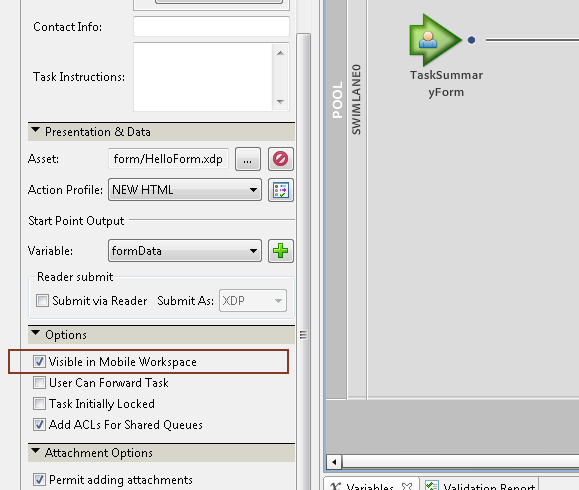

# Uso de puntos de inicio {#working-with-startpoints}

Un punto de partida invoca un proceso creado en Workbench. Se asocia a un formulario que invoca el proceso cuando se envía. Consulte [Tutorial del sitio de referencia de finanzas de Geometrixx](/help/forms/using/finance-reference-site-walkthrough.md) para comprender los procesos.

>[!NOTE]
>
>Los términos puntos de inicio, proceso de inicio y formulario se utilizan de forma intercambiable al hacer referencia a este concepto.

Para iniciar un proceso desde la aplicación de AEM Forms, debe tener un punto de partida de tipo **Workspace** en el proceso. Además, debe seleccionar la opción **[!UICONTROL Visibilidad en Mobile Workspace]** para el punto de inicio.

**Inicio de un proceso definido en Workbench**

1. Para realizar la vista de los puntos de inicio disponibles en la aplicación de AEM Forms, vaya a [Pantalla principal](/help/forms/using/home-screen.md).
1. En la pantalla **[!UICONTROL Inicio]**, de forma predeterminada, se muestra la lista **[!UICONTROL Todo Forms]**.

   El punto de inicio se asocia a un formulario. Toque el formulario asociado de punto de inicio en la lista para abrirlo.

   Se abre el formulario asociado al punto de inicio.

1. Introduzca los detalles en el formulario **[!UICONTROL Punto de inicio]**.

   Puede agregar anotaciones a esta tarea mediante el botón [datos adjuntos](/help/forms/using/add-attachments.md).

1. Después de rellenar el formulario, toque el botón **Enviar**.

Si la aplicación está sin conexión, el formulario y sus datos se guardan en la carpeta Bandeja de salida.

Si la aplicación está en línea, la tarea se sincroniza con el servidor de AEM Forms y se asigna al usuario especificado en el proceso.

Para trabajar con la tarea en su lista de tarea, consulte [Apertura de una tarea](/help/forms/using/open-task.md).
