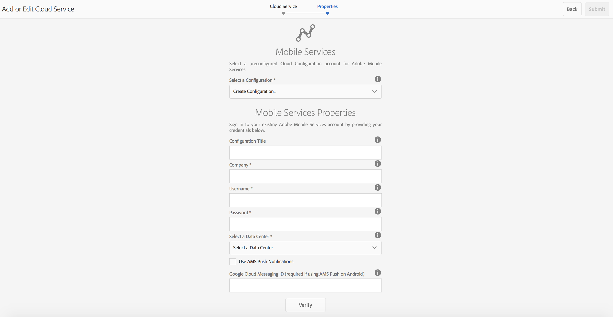

# Configurar el Cloud Service de Adobe Mobile Services {#configure-your-adobe-mobile-services-cloud-service}

>[!CAUTION]
>
>AEM 6.4 ha llegado al final de la compatibilidad ampliada y esta documentación ya no se actualiza. Para obtener más información, consulte nuestra [períodos de asistencia técnica](https://helpx.adobe.com/es/support/programs/eol-matrix.html). Buscar las versiones compatibles [here](https://experienceleague.adobe.com/docs/).

>[!NOTE]
>
>Adobe recomienda utilizar el Editor de SPA para proyectos que requieren una representación del lado del cliente basada en el marco de aplicaciones de una sola página (por ejemplo, React). [Más información](/help/sites-developing/spa-overview.md).

La variable **Mosaico de métricas móviles** en el centro de comandos proporciona análisis en tiempo real para su aplicación móvil.

La variable [Adobe Mobile Analytics](https://www.adobe.com/ca/solutions/digital-analytics/mobile-web-apps-analytics.html) El SDK está disponible a través de un complemento PhoneGap. Las métricas se recopilan y almacenan en caché en el dispositivo hasta que se conecta el dispositivo. En este momento, los datos se envían a Adobe Mobile Services Cloud para su sistema de informes y análisis.

El SDK de Adobe Mobile Analytics proporciona lo siguiente:

1. **Recopilación de datos para canales móviles** : recopile datos completos para sus sitios web y aplicaciones móviles en todos los sistemas operativos principales.
1. **Análisis de participación móvil** : Comprenda la participación del usuario en su aplicación móvil, sitio web o vídeo, incluida la frecuencia con la que los consumidores inician el canal, si realizan compras en él y mucho más.
1. **Tableros e informes de aplicaciones móviles** : obtenga informes de uso que incluyan métricas del ciclo vital para sus aplicaciones y métricas del almacén de aplicaciones; consulte tendencias para usuarios, lanzamientos, longitud promedio de sesión, duración de retención y bloqueos.
1. **Análisis de campañas móviles** : Cuantifique la eficacia de campañas específicas para móviles como SMS, anuncios de búsqueda móvil, anuncios en pantalla para móviles y códigos QR.
1. **Análisis de geolocalización** : Descubra dónde se inician los usuarios de la aplicación e interactúan con sus experiencias móviles mediante la ubicación GPS o los puntos de interés.
1. **Análisis de rutas** : Vea cómo navegan los usuarios a través de la aplicación para determinar qué pantallas y elementos de la interfaz de usuario atraen a los usuarios y qué causan que abandonen la aplicación.

>[!CAUTION]
>
>La variable **Analizar métricas** El mosaico se muestra en el tablero, solo si ha configurado los servicios de nube.

Mosaico de métricas del centro de comandos de AEM

## Configuración del Cloud Service {#configuring-the-cloud-service}

Para aprovechar las ventajas de Adobe Mobile Services Analytics, debe configurar AEM Mobile Analytics Cloud Service con la información de cuenta de Adobe Analytics.

1. Haga clic en el icono del lado superior derecho para añadir o editar los Cloud Services desde el **Administrar Cloud Services** desde el panel de la aplicación.

   

1. La variable **Agregar o editar Cloud Services** se abre. Select **Adobe Mobile Services** y haga clic en **Siguiente**.

   

1. Elija una configuración existente en la **Mobile Services** o elija **Crear configuración** para crear uno nuevo.

   Para una configuración nueva, introduzca la variable **Propiedades de Mobile Services** y haga clic en **Verificar.**

   

   Si se verifican las credenciales, la variable **Verificar** cambia a **Verificado**. Puede elegir una aplicación de servicio móvil de **Seleccionar un servicio de aplicaciones móviles**.

   Haga clic en **Submit** para configurar la configuración.

   

1. Una vez configurada la configuración de nube, puede ver lo mismo en el tablero.

   

   >[!NOTE]
   >
   >Una vez configurada la configuración de nube, puede ver la **Analizar métricas** Mosaico en el tablero de la aplicación.

   
