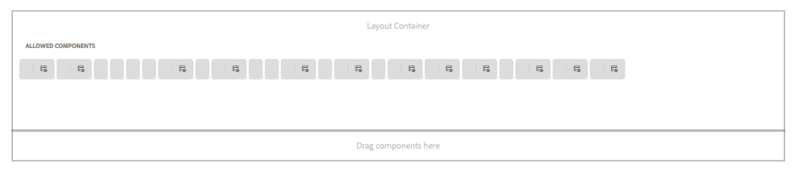

# Notas de la versión de AEM 6.4 Cumulative Fix Pack {#aem-cumulative-fix-pack-release-notes}

## Información de la versión {#release-information}

<!-- TBD: Update the SD URL. -->

| Productos | **Adobe Experience Manager (AEM) 6.4** |
|---|---|
| Versión | 6.4.8.3 |
| Tipo | Paquete de correcciones acumulativas |
| Fecha | 26 de noviembre de 2020 |
| Requisitos previos | [Paquete de servicio 8 de AEM 6.4 (6.4.8.0)](sp-release-notes.md) |
| Descargar URL | AEM 6.4.8.3 en [Distribución de software](https://experience.adobe.com/#/downloads/content/software-distribution/en/aem.html?package=/content/software-distribution/en/details.html/content/dam/aem/public/adobe/packages/cq640/cumulativefixpack/aem-6.4.8-cfp-3.0.zip) |

## Novedades de AEM 6.4.8.3 {#what-s-included-in-aem}

AEM Cumulative Fix Pack 6.4.8.3 es una actualización importante que incluye varias correcciones internas y de cliente desde la disponibilidad general de AEM 6.4 Service Pack 8 (6.4.8.0) en marzo de 2020.

AEM 6.4.8.3 es un paquete de correcciones acumulativas (CFP) que depende de AEM 6.4 Service Pack 8. Instale CFP después de instalar AEM Service Pack 8.

En AEM 6.4.8.3, el repositorio integrado (Apache Jackrabbit Oak) se actualiza a la versión 1.8.23.

Para obtener información sobre CFP y otros tipos de versiones, consulte [AEM Actualización de definiciones de vehículos de lanzamiento](https://docs.adobe.com/content/help/en/experience-manager-65/deploying/deploying/update-release-vehicle-definitions.html)

Adobe Experience Manager 6.4.8.3 proporciona correcciones para los siguientes problemas.

### Sites {#sites-6483}

* Al actualizar el texto de una variación de un fragmento de contenido, se actualiza el contenido del fragmento de contenido principal en lugar de la variación (NPR-35080).

* Cuando se establece un valor numérico para la propiedad de etiqueta de tipo String de un componente, se elimina el componente y se utiliza la opción deshacer para devolverlo, el tipo de propiedad label cambia automáticamente de String a Long (NPR-34738).

* Cuando se agrega un componente Carga de archivo a varios campos, la ruta de la imagen se almacena en el nodo del componente en lugar del nodo de varios campos (NPR-34423).

* En el asistente Mover página, aunque no haya ningún destino seleccionado, el siguiente botón permanece habilitado (NPR-34460).

* Cuando el componente principal incluye la propiedad `cq:isContainer`, el componente heredado no incluye automáticamente la propiedad (CQ-4308409).

* Al utilizar la minimización de CSS mediante la función `calc()`, se eliminan los espacios en blanco alrededor del signo `+` (NPR-34991).

* Cuando se inicio una instancia de AEM, los componentes `com.adobe.granite.maintenance.impl.MaintenanceTaskManagerImpl` y `com.adobe.granite.maintenance.impl.TaskScheduler` no se muestran en el estado `Active` (NPR-34952).

### [!DNL Assets] {#assets-6483}

* Al crear una versión de un recurso existente, las actualizaciones de metadatos del usuario no persisten si se aplica un perfil de metadatos a la carpeta (NPR-34833).
* Al utilizar [!DNL Adobe Asset Link] con [!DNL Adobe InDesign], los resultados de búsqueda no contienen carpetas y colecciones, sino que sólo contienen recursos (NPR-34700).
* Al arrastrar un recurso a una carpeta para moverlo, la interfaz de usuario también muestra la opción [!UICONTROL Colocar en Lightbox] y [!UICONTROL Colocar en colección]. Incluso si se cancela la operación de movimiento, la interfaz de usuario sigue mostrando las dos últimas opciones (NPR-34525).
* Cuando se abre la interfaz Administrar publicación, la opción de publicación no está disponible y, al seleccionar la opción Cancelar publicación, la página de ámbito está en blanco (CQ-4302509).

#### [!DNL Dynamic Media] {#dynamic-media}

* En la configuración de ajustes preestablecidos de imagen, cuando la opción [!UICONTROL Activar disminución de resolución de crominancia JPG] no está seleccionada en [!DNL Experience Manager], el cambio no se sincroniza con [!DNL Dynamic Media] (NPR-34284).
* En el [!UICONTROL Editor de ajustes preestablecidos de visor], al editar el ajuste preestablecido [!UICONTROL PanoramicImage/PanoramicImage_VR], en el componente `PanoramicView`, la etiqueta del modificador `PANORAMICVIEW_AUTOROTATE` no está disponible (CQ-4302043).
* Al cancelar la publicación de un vídeo de [!DNL Experience Manager] no se cancela la publicación del conjunto de vídeos adaptable en el Scene7 configurado. (CQ-4304405).

### Plataforma {#platform-6483}

* El indicador `emitUseStrict` se agrega a la función de procesador del compilador de cierre de Google (GCC) `com.adobe.granite.ui.clientlibs.impl.HtmlLibraryManagerImpl`. El indicador suprime el resultado de la instrucción `use strict` (NPR-34830).
* Se devuelve un `NullPointerException` al iniciar tareas de mantenimiento diarias o semanales (NPR-34702).
* La herramienta [!DNL Apache Sling Health Check] está en desuso. En su lugar, utilice [Detector de patrones](https://experienceleague.adobe.com/docs/experience-manager-64/deploying/upgrading/pattern-detector.html) para detectar infracciones de contenido (NPR-33929).

### Integraciones {#integrations-6483}

* El botón [!UICONTROL Crear] aparece en la página [!UICONTROL Audiencias] al navegar de una carpeta a la página [!UICONTROL Audiencias] (NPR-35152).

### Interfaz de usuario {#ui-6483}

* El panel de búsqueda [!UICONTROL Filtros] de la interfaz de usuario [!UICONTROL Omnisearch] también devuelve resultados de ubicaciones distintas de la de donde se ejecuta la búsqueda (NPR-34877).
* Al cerrar el panel [!UICONTROL Filtros] en la [!UICONTROL interfaz de usuario de Omnisearch], el carril izquierdo no se restablece a la selección [!UICONTROL Contenido], lo que impide volver a abrir el panel [!UICONTROL Filtros] (NPR-34483).
* Se devuelve un `NullPointerException` al acceder a las propiedades de la página (NPR-34509).

### Communities {#communities-6483}

<!-- Following fixes of 6483 are documented on Nov 11 20202 by Vishabh. 
-->

* Todos los casos de terminología no equitativa en el producto se sustituyen por equivalentes aceptados (NPR-34506).

### Comercio {#commerce-6483}

* Cuando hay más de 15 productos en una colección, la colección solo muestra los primeros 15 productos (NPR-34494).

### Forms {#forms-6483}

>[!NOTE]
>
>[!DNL Experience Manager Forms] lanza los paquetes de complementos una semana después de la fecha de lanzamiento programada del  [!DNL Experience Manager] paquete de correcciones acumulativas.

>[!NOTE]
>
>[!DNL Experience Manager] El paquete de correcciones acumulativas no incluye correcciones para  [!DNL Experience Manager Forms]. Se entregan mediante un paquete de complemento [!DNL Forms] independiente. Además, se ha publicado un instalador acumulativo que incluye correcciones para [!DNL Experience Manager Forms] en JEE. Para obtener más información, consulte [Instalación del paquete del complemento de AEM Forms](#install-aem-forms-add-on-package) y [Instalación del instalador de AEM Forms JEE](#install-aem-forms-jee-installer).

**Formularios adaptables**

* No se puede editar un formulario adaptable mediante la IU clásica después de aplicar el paquete de correcciones acumulativas [!DNL Experience Manager] (NPR-35127).

* Los fragmentos tardan más tiempo en cargarse en un formulario adaptable debido a la invalidación de caché (NPR-34655).

* Accesibilidad: La navegación por tabuladores no funciona correctamente para lectores de pantalla en un formulario adaptable (NPR-34550).

**Administración de correspondencia**

* Al migrar los recursos desde ES3, estos incluyen dos condiciones predeterminadas no editables (NPR-34971).

**Base JEE**

* Migrar usuarios [!DNL AEM Forms] de Flash a HTML (CQ-4304075).

Para obtener información sobre las actualizaciones de seguridad, consulte [página de boletines de seguridad de Experience Manager](https://helpx.adobe.com/security/products/experience-manager.html).

## Revisiones y paquetes de funciones incluidos en los paquetes de correcciones acumulativas anteriores {#hotfixes-and-feature-packs-included-in-previous-cumulative-fix-packs}

### Adobe Experience Manager 6.4.8.2 {#experience-manager-6482}

AEM Cumulative Fix Pack 6.4.8.2 es una actualización importante que incluye varias correcciones internas y de cliente desde la disponibilidad general de AEM 6.4 Service Pack 8 (6.4.8.0) en marzo de 2020.

AEM 6.4.8.2 es un paquete de correcciones acumulativas (CFP) que depende de AEM 6.4 Service Pack 8. Instale CFP después de instalar AEM Service Pack 8.

En AEM 6.4.8.2, el repositorio integrado (Apache Jackrabbit Oak) se actualiza a la versión 1.8.22.

Para obtener información sobre CFP y otros tipos de versiones, consulte [AEM Actualización de definiciones de vehículos de lanzamiento](https://docs.adobe.com/content/help/en/experience-manager-65/deploying/deploying/update-release-vehicle-definitions.html)

Adobe Experience Manager 6.4.8.2 proporciona correcciones para los siguientes problemas.

#### Sitios {#sites-6482}

* Si el `RolloutConfigManagerFactoryImpl` no puede cargar una configuración de implementación, no intenta cargar las configuraciones que faltan. Devuelve las configuraciones almacenadas en caché (NPR-34091).
* En el componente de núcleo de texto, después de utilizar la opción de edición HTML de origen, se elimina la clase de la etiqueta `em` (NPR-34080).
* Al actualizar de Experience Manager 6.2 a Experience Manager 6.5, el componente Parsys de las plantillas estáticas no se muestra correctamente. La altura del componente Parsys se establece en 0 y los componentes que contiene no son visibles (NPR-34044).
* No se muestra la información de la etiqueta de los componentes permitidos dentro del Editor de plantillas (NPR-33908).

   

* Los usuarios no pueden agregar o editar componentes al parsys después del cuarto nivel de componentes anidados (NPR-33873).
* Si se cambia el contenido inicial de una plantilla editable y luego se publica la plantilla, cualquier página nueva creada con esta plantilla mostrará la fecha de publicación de la plantilla aunque las páginas no se hayan publicado (NPR-33822).
* Las propiedades `cq:acLinks` y `cq:acUUID` de [!DNL Adobe Campaign] de la copia se eliminan durante la operación de copiar y pegar (NPR-33793).
* En la ficha [!UICONTROL Uso en directo], solo se muestran 49 resultados. No muestra todo el uso del componente (NPR-33710).
* Una página web con el carácter `/` en la dirección URL deja de responder durante la creación. Cuando se agrega un componente durante la creación, aumenta el uso de la CPU y el explorador deja de responder (NPR-33625).
* En el modo de edición en línea de [!DNL RTE], arrastrar una imagen no funciona para el componente Texto (NPR-33579).
* Es posible crear un componente en una página de modelo con el mismo nombre que el nombre de la página. Durante la implementación, el nombre de un componente de este tipo cambia por el sufijo `_msm_moved`. Sin embargo, el componente se mueve al final del [!UICONTROL Sistema de párrafos] (NPR-33534).
* La promoción de inicio no publica páginas cuando la propiedad [!UICONTROL include subpages] no está marcada en la primera raíz de contenido (NPR-33533).
* La redirección a [!DNL Experience Manager] página con anclaje no funciona en la instancia de Autor, ya que `PageRedirectServlets` coloca la cadena de consulta después de un fragmento de URL o un anclaje (NPR-34287).
* `PageRedirectServlet` se anexa  `.html` después de la asignación de Sling que provoca errores de vínculo (NPR-34271).
* Puede suspender el [!DNL Live Copy] de una página y la herencia se interrumpe como se ve en el modo Editor. Sin embargo, en las propiedades Página, el icono que representa la herencia indica incorrectamente que la herencia existe y no está dañada (NPR-34096).
* Problema con la visualización de componentes permitidos en la página Editar plantilla (CQ-4297295).
* Después de actualizar Chrome y Firefox, los menús emergentes no funcionan del modo esperado. Al cargar las propiedades de página, no muestra el panel cuando hay datos en él (CQ-4292995).
* Varias instancias de secuencias de comandos entre sitios en [!DNL Experience Manager Sites] componentes (NPR-33926).
* Las entradas de usuario no se codifican correctamente para varios componentes al enviar información al cliente (NPR-33696).
* Una dirección URL que termina con `childrenlist.html` muestra una página HTML en lugar de una respuesta 404. Estas direcciones URL son vulnerables a los scripts entre sitios (NPR-33441).

#### Assets {#assets-6482}

* La extracción de texto de los archivos PDF cargados no funciona y la búsqueda de texto completo de algunas palabras en un archivo PDF no logra recuperar ese archivo PDF (NPR-34165).

   >[!NOTE]
   >Para que esta corrección funcione, reinicie la instancia de Adobe Experience Manager después de instalar Service Pack 6.4.8.2.

* Las barras invertidas se agregan antes que los caracteres especiales en las sugerencias de búsqueda de recursos, que tienen caracteres especiales en su nombre (NPR-33833).

* Los filtros personalizados que se guardan como colecciones inteligentes no se aplican correctamente a los recursos, por lo que los resultados de la búsqueda no son precisos   (NPR-33725).

* La línea de tiempo de un recurso dentro de una carpeta reordenada muestra que se movió el recurso (NPR-33580).

* La cancelación de la publicación masiva de [!DNL Brand Portal] genera `Request-URI Too Long` error (NPR-34158).

* En la vista de columnas, si el usuario selecciona la opción [!UICONTROL Filtrar] después de seleccionar un conjunto de recursos (los recursos se desactivan) y, a continuación, selecciona un conjunto diferente de recursos para moverlos, los recursos seleccionados anteriormente también se mueven a la nueva ubicación (NPR-34018).

* La barra de desplazamiento no está visible en la vista de lista, aunque haya numerosos recursos para ajustar a la página (NPR-34156).

* La [!UICONTROL página Administrar publicación] para recursos está dañada y las opciones que contiene no funcionan (CQ-4302509).

**Dynamic Media**

* La funcionalidad de recorte inteligente falla cuando se agrega perfil de imagen a una carpeta con varias proporciones de aspecto (por ejemplo, 11) (NPR-34083).

* Los cambios en los ajustes preestablecidos de imagen en [!UICONTROL Adobe Experience Manager] no se sincronizan con Scene7 Publishing System (NPR-34284, CQ-4299713).

* Falta la etiqueta del modificador [!UICONTROL PANORAMICVIEW_AUTOROTATE] en la ficha [!UICONTROL Behavior] de la página [!UICONTROL Editor de ajustes preestablecidos de visor] (CQ-4302043).

#### Plataforma {#platform-6482}

* No se especifican los valores predeterminados para las opciones **[!UICONTROL Tiempo de espera de conexión]** y **[!UICONTROL Tiempo de espera de socket]** para la configuración del agente predeterminado (publicación) (NPR-33708).
* El Planificador de tarea de mantenimiento realiza inicios y detiene las tareas de mantenimiento con demasiada frecuencia de la configurada (NPR-33520).
* No se pueden descargar registros con la herramienta Diagnóstico en una instancia de Experience Manager actualizada (NPR-34419).

#### Integraciones {#integrations-6482}

* El valor de `library_path` no se tiene en cuenta al generar la dirección URL de la biblioteca [!DNL Adobe Launch] para las bibliotecas migradas desde [!DNL Adobe Dynamic Tag Management]. Además, las bibliotecas migradas utilizan un prefijo distinto al de las bibliotecas [!DNL Adobe Launch]. (NPR-34238).
* Las propiedades heredadas de un servicio en la nube no persisten en la actualización de las propiedades de página (NPR-33865).

#### Interfaz de usuario {#ui-6482}

* La visualización del recuento de recursos seleccionados en una página de búsqueda es incorrecta (NPR-33540).

#### Comunidades {#communities-6482}

* Los usuarios existentes de un grupo de comunidad agregados a través de la consola de administración se eliminan de la lista de usuario en cualquier modificación en la consola de grupo de comunidad (NPR-34312).

#### Forms {#forms-6482}

>[!NOTE]
>
>[!DNL Experience Manager] El paquete de correcciones acumulativas no incluye correcciones para  [!DNL Experience Manager Forms]. Se entregan mediante un paquete de complemento [!DNL Forms] independiente. Además, se ha publicado un instalador acumulativo que incluye correcciones para [!DNL Experience Manager Forms] en JEE. Para obtener más información, consulte [Instalación del paquete del complemento de AEM Forms](#install-aem-forms-add-on-package) y [Instalación del instalador de AEM Forms JEE](#install-aem-forms-jee-installer).

**Formularios adaptables**

* Cuando falta un fragmento de formulario adaptable, el formulario adaptable no se procesa (NPR-34303).

* La descripción del contenido de la ayuda de los campos de formulario adaptables muestra una etiqueta HTML de párrafo (NPR-34117).

* Al agregar un contenedor de Forms en una página [!DNL Experience Manager Sites], la página muestra el siguiente mensaje de error y no le permite agregar ningún componente nuevo (NPR-33858):

   `DevTools failed to load SourceMap: Could not load content for <Link>. HTTP error: status code 404, net::ERR_HTTP_RESPONSE_CODE_FAILURE`

* Al seleccionar la propiedad **[!UICONTROL Revalidate en el servidor]** y cargar varios archivos adjuntos, el formulario adaptable no se puede enviar (NPR-33701).

* Cuando selecciona las opciones **[!UICONTROL Utilizar idioma de página]** y **[!UICONTROL Formulario abarca todo el ancho de las opciones de Página]** en el componente [!DNL Experience Manager Forms] de una página [!DNL Experience Manager Sites], la página no se traduce (NPR-33641).

* Al enviar un formulario adaptable habilitado para análisis incrustado en una página [!DNL Experience Manager Sites], Analytics no funciona correctamente (NPR-31359).

* Se han eliminado las dependencias de las bibliotecas [!DNL Lodash] y [!DNL backbone] (NPR-33458).

* La acción de envío **[!UICONTROL Enviar a extremo REST]** no funciona para un formulario adaptable (NPR-34513).

* Accesibilidad: Al intentar enviar un formulario adaptable sin cargar un archivo adjunto para un campo obligatorio, el enfoque no se desplaza automáticamente al campo adjunto (NPR-34511).

* Las entradas de usuario no se codifican correctamente para los componentes [!DNL Forms] al enviar información al cliente (NPR-33611).

**Flujo de trabajo**

* [!DNL Experience Manager] Error en la operación de depuración de flujo de trabajo y muestra el siguiente mensaje de error (NPR-33576):

   `java.lang.UnsupportedOperationException: The query read more than 500000 nodes in memory`

* Al instalar [!DNL Experience Manager] 6.4.8.1, la lista [!UICONTROL Tareas pendientes] de elementos no se muestra como vínculos. El texto de los elementos [!UICONTROL Por hacer] incluye etiquetas HTML (NPR-34318).

**BackendIntegration**

* No se puede configurar un modelo de datos de formulario en un entorno alojado por AWS [!DNL Experience Manager Forms Linux] (NPR-33617).

**Diseñador**

* Cuando [!DNL Acrobat DC] está instalado en un servidor de Forms [!DNL Experience Manager], la opción **[!UICONTROL Distribuir formulario]** no está disponible en [!DNL Experience Manager Designer] versión 6.x (NPR-34325).

**:Seguridad de los documentos**

* No se puede ejecutar la operación de firma con certificados basados en HSM en un archivo PDF después de instalar [!DNL Experience Manager] 6.4.8.0 (NPR-34309).

**Actualización**

* Al actualizar la versión [!DNL JBoss] a 7.0.9 para [!DNL Experience Manager Forms] con Documento Security en un entorno [!DNL Linux], se produce un error (CQ-4300546).

Para obtener información sobre las actualizaciones de seguridad, consulte [página de boletines de seguridad de Experience Manager](https://helpx.adobe.com/security/products/experience-manager.html).

### Adobe Experience Manager 6.4.8.1 {#experience-manager-6481}

AEM Cumulative Fix Pack 6.4.8.1 es una actualización importante que incluye varias correcciones internas y de cliente desde la disponibilidad general de AEM 6.4 Service Pack 8 (6.4.8.0) en marzo de 2020.

AEM Cumulative Fix Pack 6.4.8.1 depende de AEM 6.4 Service Pack 8. Por lo tanto, debe instalar el paquete AEM Cumulative Fix Pack 6.4.8.1 después de instalar AEM 6.4 Service Pack 8.

Algunos de los aspectos destacados de la AEM 6.4.8.1 son:

* No se permite el acceso anónimo al CRXDE Lite para aumentar la seguridad. En su lugar, se dirige a los usuarios a la pantalla de inicio de sesión. Consulte [desarrollo con CRXDE Lite](/help/sites-developing/developing-with-crxde-lite.md).
* Se ha eliminado la integración de Package Share con Adobe Experience Manager.
* El repositorio integrado (Apache Jackrabbit Oak) se ha actualizado a la versión 1.8.21.

Para obtener información sobre CFP y otros tipos de versiones, consulte [AEM Actualización de definiciones de vehículos de lanzamiento](https://docs.adobe.com/content/help/en/experience-manager-65/deploying/deploying/update-release-vehicle-definitions.html)

Adobe Experience Manager 6.4.8.1 proporciona correcciones a los siguientes problemas.

#### Sitios {#sites-6481}

* Los usuarios anónimos pueden acceder a las funciones de CRX DE Lite (NPR-33522).
* Cuando el nombre de un componente local de una LiveCopy es idéntico al nombre de un componente del modelo y el componente se despliega desde el plano, el término _msm_move no se agrega al nombre del componente local (NPR-33207).
* Los parámetros anexados a la solicitud original no se incluyen en la dirección URL de redireccionamiento (NPR-33174).
* Cuando la opción Coral.Select establece emptyOption=true o contiene un elemento predeterminado con valor = &quot;&quot;, el archivo dropdownshowhide.js encuentra un error: Error TypeError no capturado: component.getValue no es una función (NPR-33163).
* Cuando un componente incluye otro componente como recurso de suavizado de datos, el marcador de posición del componente de contenedor principal se reemplaza por el marcador de posición de componentes internos (NPR-33119).
* Cuando se basa un fragmento de contenido en un esquema y contiene un área de texto obligatoria o un campo de ruta, el fragmento de contenido no se guarda (NPR-33007)
* Cuando se crea un componente personalizado con el componente de fragmento de experiencia lista para usar y se utiliza en páginas de AEM Sites, AEM no muestra referencias (uso) para el componente personalizado (NPR-32852).
* Cuando una página de AEM Sites forma parte de un conjunto de contenido grande con varias Live Copy, la previsualización del historial de versiones de la página no se carga (NPR-32772).
* Cuando promociona un lanzamiento, agrega la combinación &quot;cq:LiveRelationship&quot; a todos los componentes agregados en el lanzamiento. Afecta a todos los lanzamientos independientemente de si se crea un lanzamiento con o sin seleccionar el —  Heredar datos activos de la página de origen —  (NPR-32664).
* Cuando se producen inicios de paginación, el selector de fragmentos de experiencia no carga todos los elementos (NPR-32605).
* No se puede crear un inicio para una página de AEM Sites. La creación de inicios produce un error (NPR-32544).
* Administrar publicación no incluye los recursos a los que se hace referencia en la solicitud de flujo de trabajo de activación (NPR-32463).
* La comprobación de estado del despachante muestra `Invalid cookie header` un mensaje de advertencia en los archivos de registro (NPR-33630).
* La integración de Salesforce es vulnerable al SSRF (NPR-32671).
* Se refleja XSS en PreferencesServlet (NPR-33439).

#### Recursos {#assets-6481}

* El recuento de recursos no cambia según el cambio en la selección en la Vista de Listas (NPR-33285).

* El botón siguiente no está activado al seleccionar el nodo principal (donde se puede ver una sola carpeta secundaria) y, a continuación, seleccionar la carpeta secundaria (NPR-33284).

* La IU táctil no se procesa (con error) para los usuarios que no tienen acceso de lectura en la raíz del repositorio, cuando el modo DMS7 o Híbrido está activado (NPR-33175).

* Los caracteres GB18030 que aparecen en los nombres de carpetas y recursos cambian a blanco en los archivos zip descargados (NPR-33150).

* La carpeta adicional se crea al recortar de forma inteligente un recurso que se encuentra dentro de una carpeta principal con un carácter de punto `.` en su nombre (NPR-32755).

* La carga diferida no se activa y no se muestran más de 100 recursos al seleccionar para revisar las tareas de la bandeja de entrada de notificaciones (NPR-32749).

* La página de vínculos para compartir la colección se ha interrumpido debido al cambio en coral-info (NPR-32510).

* Procesamiento de recursos mientras la carga masiva se queda atascada (CQ-4293916).

* Vulnerabilidad del SSRF en Experience Manager (NPR-33437).

#### Plataforma {#platform-6481}

* No se llama al filtro [!DNL Sling] si la entrada de mapa `sling:match` se crea en `/etc/maps` (NPR-33308).
* Todos los agentes de vaciado se activan al desactivar una página (NPR-32941).
* Cuando se utiliza la API `ScriptProcessor` para reducir una biblioteca JavaScript, el archivo de registro muestra un mensaje de error que indica que el código JavaScript no es compatible con el modo estricto. La API no proporciona una opción para habilitar o deshabilitar el modo estricto. (NPR-32746).
* Cuando una consulta SQL se ejecuta durante más tiempo, por ejemplo 7 horas, AEM deja de responder (NPR-33043).

#### Interfaz de usuario {#ui-6481}

* Al buscar o examinar una ruta mediante un cuadro de diálogo de selección, el cuadro de diálogo de selección muestra todo el contenido del nodo JCR seleccionado en lugar de mostrar únicamente las imágenes (NPR-32712).

#### Proyectos de traducción {#tranlation-6481}

* Se muestra un error `NullPointerException` en los registros de ejecución de un trabajo de traducción (NPR-32220).

#### Integraciones {#integrations-6481}

* Secuencias de comandos entre sitios para JSON (NPR-32745).

#### Comunidades {#communities-6481}

* Después de crear un nuevo grupo, los autores no se redirigen a la sección [!UICONTROL Grupo de la comunidad] de [!DNL Internet Explorer] 11 (NPR-33202).
* Se produce un error al acceder a la página [!UICONTROL Flujo de Actividad] (NPR-33152).
* Editar un grupo [!DNL Communities] y cambiar la imagen en miniatura no actualiza la imagen en miniatura del grupo (NPR-32603).
* Al crear una versión de las notificaciones y suscripciones de contenido generado por el usuario (UGC), se almacena un ID incorrecto de la página de origen (CQ-4289703).
* Problema de secuencia de comandos entre sitios (NPR-33212).

#### Flujo de trabajo {#workflow-6481}

* Algunos componentes no se muestran en el cuadro de diálogo que aparece cuando un usuario completa un flujo de trabajo que incluye un [!UICONTROL paso del participante en el cuadro de diálogo] (NPR-32989).

* La opción [!UICONTROL Línea de tiempo] en el carril izquierdo tarda más tiempo en cargarse de lo esperado (NPR-32850).

#### Forms {#forms-6481}

>[!NOTE]
>
>AEM paquete de correcciones acumulativas no incluye correcciones para AEM Forms. Estas se entregan mediante un paquete independiente de complementos de Forms. Asimismo, se ha publicado un instalador acumulativo que incluye correcciones para AEM Forms en JEE. Para obtener más información, consulte [Instalación del paquete del complemento de AEM Forms](#install-aem-forms-add-on-package) y [Instalación del instalador de AEM Forms JEE](#install-aem-forms-jee-installer).

* Administración de correspondencia: Cuando un usuario pega contenido de un documento [!DNL Word], el fragmento de documento de texto no conserva el formato (NPR-33213).
* Forms adaptable: Una nueva línea a una cadena en un diccionario de formularios adaptables agrega `&#xa;` caracteres al diccionario (NPR-33265).
* Forms adaptable: El usuario no puede guardar un formulario adaptable con más de un archivo adjunto (NPR-33214).
* Forms adaptable: Los métodos `AddInstance` y `RemoveInstance` de la clase Instance Manager no agregan un número dinámico de instancias para fragmentos de carga diferida en [!DNL Internet Explorer 11] (NPR-33201).
* Forms adaptable: Analytics habilitado en un formulario adaptable incrustado en una página [!DNL Sites] no registra datos para eventos de envío y abandono (NPR-31359).
* Forms adaptable: Cuando un usuario pega el contenido de un documento [!DNL Word] en un formulario adaptable y lo envía, el formulario adaptable enviado incluye caracteres Unicode. Además, la conversión de PDF a PDF/A falla debido a caracteres Unicode (NPR-33348).
* BackendIntegration: Las solicitudes del modelo de datos de formulario fallan al caducar el token de actualización debido a un estado inactivo incorrecto (NPR-33168).
* Servicios de documento: El servicio de conversión de PDF no puede convertir documentos PDF a PostScript debido a que faltan tarros Gibson para [!DNL WebLogic] en el servidor [!DNL Linux] (NPR-33515, CQ-4292239).
* Servicios de documento: Cuando un usuario convierte un archivo de texto a un PDF, los caracteres japoneses no se representan correctamente (NPR-33239).
* XSS almacenado con GuideSOMProviderServlet (NPR-32701).

## Instalar 6.4.8.3 {#install}

### Requisitos de configuración {#setup-requirements}

<!--

>[!NOTE]
>
>For successful installation of AEM 6.4.6.0 on the instance, it is strongly recommended to upgrade the version of com.adobe.granite.oak.s3connector to 1.8.4 for the customers who are on the older version of s3 connector.
>The process of upgrading the com.adobe.granite.oak.s3connector is available at [https://helpx.adobe.com/in/experience-manager/6-4/sites/deploying/using/data-store-config.html](https://helpx.adobe.com/in/experience-manager/6-4/sites/deploying/using/data-store-config.html).
>Download the latest version of com.adobe.granite.oak.s3connector from: [https://repo.adobe.com/nexus/content/groups/public/com/adobe/granite/com.adobe.granite.oak.s3connector/](https://repo.adobe.com/nexus/content/groups/public/com/adobe/granite/com.adobe.granite.oak.s3connector/)

-->

>[!CAUTION]
>
>Para clientes con Feature Packs instalados en AEM 6.4. Los paquetes de funciones opcionales proporcionados por Adobe dependen de la versión de lanzamiento y de los Service Packs. Si tiene instalado algún Feature Pack, póngase en contacto con el equipo AEM de atención al cliente para validar la compatibilidad de dichos paquetes de funciones con este paquete de correcciones acumulativas para AEM 6.4.

* AEM 6.4.8.3 requiere AEM 6.4.8.0. Visite [documentación de actualización](../sites-deploying/upgrade.md) para obtener instrucciones detalladas.
* En una implementación con MongoDB y varias instancias, instale AEM 6.4.8.3 en una de las instancias de creación mediante el Administrador de paquetes.
* Antes de instalar el paquete de correcciones acumulativas, asegúrese de tener una instantánea o una copia de seguridad nueva de la instancia de AEM.
* Reinicie la instancia antes de la instalación. Aunque esto solo es necesario cuando la instancia sigue en modo de actualización (y este es el caso cuando la instancia se acaba de actualizar desde una versión anterior), generalmente se recomienda si la instancia se ejecutó durante un período de tiempo más largo.

>[!NOTE]
>
>Adobe no recomienda quitar o desinstalar el paquete AEM 6.4.8.3.

### Instale el paquete de correcciones acumulativas {#install-cumulative-fix-pack}

Siga estos pasos para instalar el paquete de correcciones acumulativas en una instancia de AEM 6.4.8.0 existente:

1. Haga clic en el vínculo [Distribución de software](https://experience.adobe.com/#/downloads/content/software-distribution/en/aem.html?package=/content/software-distribution/en/details.html/content/dam/aem/public/adobe/packages/cq640/cumulativefixpack/aem-6.4.8-cfp-3.0.zip) para descargar el paquete.

1. Abra [Administrador de paquetes](http://localhost:4502/crx/packmgr/index.jsp) y haga clic en **[!UICONTROL Cargar paquete]** para cargar el paquete.

1. Seleccione el nombre del paquete y haga clic en **[!UICONTROL Instalar]**.

>[!NOTE]
>
>**El cuadro de diálogo en la IU del administrador de paquetes a veces se cierra de forma precipitada durante la instalación de 6.4.8.3**
>
>Por lo tanto, se recomienda esperar a que los registros de errores se estabilicen antes de acceder a la instancia. El usuario tiene que esperar a que se produzcan registros específicos relacionados con la desinstalación del paquete de actualización antes de asegurarse de que la instalación se realiza correctamente. Suele suceder en Safari, pero puede suceder de forma intermitente en cualquier navegador.

### Instalación automática {#auto-installation}

Existen dos formas de instalar automáticamente AEM 6.4.8.3 en una instancia en ejecución:

A. Coloque el paquete en ..Carpeta */crx-quickstart/install* mientras se ejecuta el servidor. El paquete se instala automáticamente.

B. Utilice la [API HTTP del Administrador de paquetes](https://docs.adobe.com/content/docs/en/crx/2-3/how_to/package_manager.html) - asegúrese de utilizar `cmd=install&recursive=true` - para instalar el paquete anidado.

>[!NOTE]
>
>AEM 6.4.8.3 no admite la instalación de Bootstrap.

### Validar la instalación {#validate-install}

1. La página Información del producto (*/system/console/productinfo*) ahora debe mostrar la cadena de versión actualizada &quot;Adobe Experience Manager, versión 6.4.8.3&quot; en Productos instalados.
1. Todos los paquetes OSGI tienen el valor ACTIVO o FRAGMENTO en la consola OSGI (utilice la consola web:/system/console/bundles).
1. El paquete OSGI org.apache.jackrabbit.oak-core está en la versión 1.8.17 o superior (utilice la consola web: /system/console/buncles).

Para determinar la plataforma certificada para ejecutarse con esta versión de AEM Sites y Assets, consulte [Requisitos técnicos](../sites-deploying/technical-requirements.md).

>[!NOTE]
>Al instalar correctamente el paquete, aparece un mensaje informativo que indica que el paquete de contenido se ha instalado correctamente, como **&quot;Content Package AEM-6.4-Service-Pack-8 instalado correctamente.&quot;**

### Actualizar visores de Dynamic Media (5.10.1) {#update-dynamic-media-viewers}

AEM 6.4.8.3 contiene una nueva versión de los visores de Dynamic Media (5.10.1) que permite comprobar los nombres de los duplicados en la página Ajustes preestablecidos de imagen. Se recomienda a los clientes de Dynamic Media que ejecuten el siguiente comando para actualizar los ajustes preestablecidos del visor de la caja.

`curl -u admin:admin http://localhost:4502/libs/settings/dam/dm/presets/viewer.pushviewerpresets`

que copiará los nuevos ajustes preestablecidos de visor en la ubicación /conf.

### Instalación del paquete de complementos para AEM Forms {#install-aem-forms-add-on-package}

>[!NOTE]
>
>[!DNL Experience Manager Forms] lanza los paquetes de complementos una semana después de la fecha de lanzamiento programada del  [!DNL Experience Manager] paquete de correcciones acumulativas.

>[!NOTE]
>
>Omita este paso si no utiliza AEM Forms. Las correcciones en AEM Forms se entregan mediante un paquete de complementos independiente.

1. Asegúrese de que ha instalado el AEM paquete de correcciones acumulativas.
1. Descargue el paquete de complementos de formularios correspondiente en [Versiones de AEM Forms](https://helpx.adobe.com/es/aem-forms/kb/aem-forms-releases.html) para su sistema operativo.
1. Instale el paquete del complemento de formularios como se describe en [Instalación de paquetes del complemento de formularios AEM](https://docs.adobe.com/content/help/en/experience-manager-64/forms/install-aem-forms/osgi-installation/installing-configuring-aem-forms-osgi.html#install-aem-forms-add-on-package).

### Instalación del instalador de AEM Forms JEE {#install-aem-forms-jee-installer}

>[!NOTE]
>
>Omita este paso si no utiliza AEM Forms en JEE. Las correcciones en el instalador JEE de AEM Forms se entregan mediante un instalador independiente.

Para obtener información sobre la instalación del instalador acumulativo para AEM Forms JEE y la configuración posterior a la implementación, consulte [AEM Forms JEE Patch Installer](jee-patch-installer-64.md).

### Uber Jar {#uber-jar}

El Uber Jar para AEM 6.4.8.3 está disponible en el [repositorio de Maven Central](https://repo.maven.apache.org/maven2/com/adobe/aem/uber-jar/6.4.8.3/).

Para usar Uber Jar en un proyecto de Maven, consulte el artículo, [Cómo usar Uber jar](../sites-developing/ht-projects-maven.md) e incluya la siguiente dependencia en el POM del proyecto:

```shell
<dependency>
      <groupId>com.adobe.aem</groupId>
      <artifactId>uber-jar</artifactId>
      <version>6.4.8.3</version>
      <scope>provided</scope>  
</dependency>
```

>[!NOTE]
>
>UberJar y otros artefactos relacionados están disponibles en el repositorio de Maven Central en lugar del repositorio de Maven Público de Adobe (repo.adobe.com). Se cambia el nombre del archivo principal de UberJar a `uber-jar-<version>.jar`. Como resultado, no existe `classifier`, con `apis` como valor, para la etiqueta `dependency`.

## Funciones eliminadas u obsoletas {#removed-deprecated-features}

Esta sección enumera las funciones y capacidades que se han eliminado o dejado de utilizar en AEM 6.4.

| Área | Función | Reemplazo | Versión |
|---|---|---|---|
| Assets | Administrar acción de etiqueta para subrecursos | Sin reemplazo | AEM 6.4.2.0   |
| Integración de Assets y Adobe Creative Cloud | [AEM en el ](https://docs.adobe.com/content/help/en/experience-manager-64/assets/administer/aem-cc-folder-sharing-best-practices.html) uso compartido de carpetas de Creative Cloud se introdujo en AEM 6.2 como una forma de proporcionar a los usuarios creativos acceso a los recursos de AEM. Adobe Asset Link, la nueva capacidad de la aplicación Creative Cloud, proporciona experiencia de usuario mejorada y un acceso más eficaz a los recursos de AEM directamente desde Photoshop, InDesign e Illustrator. Adobe no realizará más mejoras en la funcionalidad de uso compartido de carpetas. Aunque la función está incluida en AEM, se recomienda encarecidamente a los clientes que utilicen la sustitución. | Vínculo de recurso de Adobe o aplicación de escritorio. Para obtener más información, consulte el artículo sobre la [integración de AEM Creative Cloud](/help/assets/aem-cc-integration-best-practices.md). | AEM 6.4.4.0   |

## Problemas conocidos {#known-issues}

* Si actualiza de [!DNL Experience Manager] 6.4 a [!DNL Experience Manager] 6.5, es posible que algunos de los paquetes no muestren su estado como `Active`. Instale el último Service Pack [!DNL Experience Manager] 6.5 para resolver el problema.

Para obtener información sobre los problemas conocidos de AEM 6.4.8.0 Service Pack, consulte [AEM 6.4.8.0 Service Pack Release Notes](sp-release-notes.md).

## Paquetes de contenido y paquetes OSGi incluidos {#osgi-bundles-and-content-packages-included}

Los siguientes documentos de texto enumeran los paquetes OSGi y los paquetes de contenido incluidos en AEM 6.4.8.3.

Lista de paquetes OSGi incluidos en AEM 6.4.8.3

[Obtener archivo](assets/6.4.8.3_osgi_bundles.txt)

Lista de paquetes de contenido incluidos en AEM 6.4.8.3

[Obtener archivo](assets/6.4.8.3_content_packages.txt)

## Recursos útiles {#helpful-resources}

* [Notas de la versión de AEM 6.4](../release-notes/release-notes.md)
* [Página de productos AEM](https://www.adobe.com/solutions/web-experience-management.html)
* [Documentación de AEM 6.4](https://helpx.adobe.com/support/experience-manager/6-4.html)
* Suscríbase a [actualizaciones de productos con prioridad de Adobe](https://www.adobe.com/subscription/priority-product-update.html)

## Sitios restringidos {#restricted-sites-new}

Estos sitios solo están disponibles para los clientes. Si es un cliente y requiere acceso, póngase en contacto con su administrador de cuentas de Adobe.

* [Descarga de productos en licensing.adobe.com](https://licensing.adobe.com/)
* [Póngase en contacto con atención al cliente](https://docs.adobe.com/content/help/en/customer-one/using/home.html)
