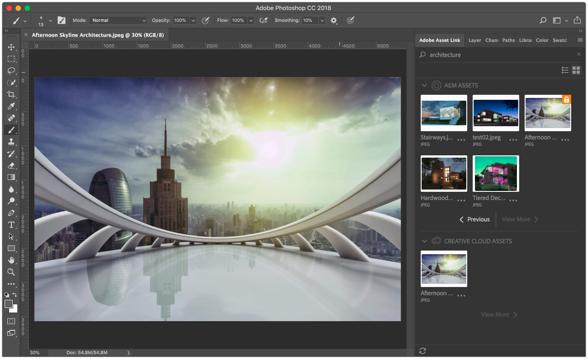

# Notas de versión específicas de Adobe Experience Manager 6.4 {#general-release-notes-for-adobe-experience-manager}

## Información de la versión {#release-information}

| Producto | Adobe Experience Manager |
|---|---|
| Versión | 6.4 |
| Tipo | Versión principal |
| Fecha de disponibilidad general | 4 de abril de 2018 |
| Actualizaciones recomendadas | Consulte las [versiones y actualizaciones de AEM](https://helpx.adobe.com/es/experience-manager/aem-releases-updates.html) |

### Trivia {#trivia}

El ciclo de publicación de esta versión de Adobe Experience Manager comenzó el 27 de abril de 2017, pasó por 22 iteraciones de control de calidad y corrección de errores, y finalizó el 22 de marzo de 2018. La cantidad total de problemas relacionados con los clientes, incluidas las mejoras y nuevas características corregidas en esta versión, es de 704. 

Adobe Experience Manager 6.4 está disponible desde el 4 de abril de 2018.

>[!NOTE]
>
>Adobe recomienda instalar el Service Pack más reciente, ya que todos los paquetes de funciones nuevas solo se entregan a través de [Service Packs](https://helpx.adobe.com/experience-manager/maintenance-releases-roadmap.html).

## Novedades {#what-s-new}

Adobe Experience Manager 6.4 es una actualización de la base de código de Adobe Experience Manager 6.3. Proporciona funciones nuevas y mejoradas, correcciones importantes para los clientes, mejoras de alta prioridad y correcciones generales de errores orientadas a la estabilidad del producto. También incluye la mayoría de todos los paquetes de funciones, correcciones y versiones de Service Pack de Adobe Experience Manager 6.3.

La lista siguiente proporciona información general, mientras que en las páginas siguientes se incluyen todos los detalles.

### Experience Manager Foundation {#experience-manager-foundation}

Lista completa de cambios en [AEM Foundation](wcm-platform.md).

La plataforma de Adobe Experience Manager 6.4 se basa en versiones actualizadas de la arquitectura basada en OSGi (Apache Sling y Apache Felix) y el repositorio de contenido Java: Apache Jackrabbit Oak 1.8.2.

Quickstart utiliza Eclipse Jetty 9.3.22 como motor de servlet.

#### Interfaz de usuario {#user-interface}

Se han realizado varias mejoras en la interfaz de usuario para que sea más productiva y fácil de usar.

* [Nuevo carril del árbol de contenido](/help/sites-authoring/basic-handling.md#content-tree) para navegar rápidamente por una jerarquía. En combinación con la vista de lista, esto restaura el modelo de interacción de la IU clásica.
* Se ha mejorado la experiencia de desplazamiento en la vista de tarjeta y lista de carpetas grandes.
* [Mejora de la interacción con los resultados de búsqueda](/help/sites-authoring/search.md) - el botón de retroceso restaura el resultado de búsqueda anterior.
* [Métodos abreviados de teclado adicionales](/help/sites-authoring/keyboard-shortcuts.md), para las acciones más comunes, como abrir un carril concreto, editar, mover y eliminar elementos o abrir propiedades.
* [Capacidad para desactivar los métodos abreviados del teclado](/help/sites-authoring/user-properties.md) (habilitar/deshabilitar en Preferencias).
* [Dejar de mostrar marcas de hora en toda la interfaz de usuario](/help/sites-authoring/user-properties.md) relativo después de 7 días (se establece de forma predeterminada en Preferencias).

Consulte la [Documentación de creación](/help/sites-authoring/home.md) para obtener más información sobre estas funciones.

>[!CAUTION]
>
>Adobe no tiene previsto realizar más mejoras en la interfaz de usuario clásica. AEM 6.4 tiene la interfaz de usuario clásica incluida y los clientes que actualicen desde versiones anteriores pueden seguir utilizándola. Tenga en cuenta que la interfaz de usuario clásica será totalmente compatible mientras esté en desuso. [Obtener más información](/help/sites-deploying/ui-recommendations.md).

#### Repositorio de contenido {#content-repository}

* Compactación más rápida y eficiente por limpieza de revisión en línea. Las pruebas internas muestran que la nueva compactación de cola es hasta 10 veces más rápida y puede recuperar más espacio en disco con menos IOPS en comparación con AEM 6.3. Esto supone un menor impacto en el rendimiento mientras se ejecuta la Limpieza de revisión en línea. Para obtener más información, consulte [la página de documentación](/help/sites-deploying/revision-cleanup.md#full-and-tail-compaction-modes).

* La limpieza continua de revisión para MongoMK reemplaza el mantenimiento de limpieza programado
* Mayor eficiencia para la limpieza de revisión en nodos de documento

#### Búsqueda e indexación {#search-indexing}

* Soporte mejorado para operaciones de indexación mediante oak-run (CLI):

   * Comprobación de coherencia del índice
   * Estadísticas de indexación
   * Importación o exportación de la configuración de índice
   * Reindexación

* Reducción del crecimiento de repositorios relacionados con Lucene para un rendimiento general del sistema mejorado

Para obtener más información, visite [esta página de documentación](/help/sites-deploying/indexing-via-the-oak-run-jar.md).

#### Monitoreo {#monitoring}

* Un nuevo [Información general del sistema](/help/sites-administering/operations-dashboard.md#system-overview) proporciona una vista instantánea de todas las actividades y estados del sistema relacionados con el rendimiento.
* Un nuevo conjunto de [Comprobaciones de coherencia](/help/sites-administering/operations-dashboard.md#health-checks) acerca de la indexación, consultas y mantenimiento

#### Proyectos y flujos de trabajo {#projects-and-workflows}

* Todo nuevo [Editor de flujo de trabajo para crear y editar modelos de flujo de trabajo](/help/sites-developing/workflows-models.md).

#### Actualizar desde la versión anterior {#upgrade-from-earlier-version}

* [Compatibilidad con versiones anteriores](/help/sites-deploying/backward-compatibility.md): Las funciones compatibles con versiones anteriores de la versión 6.4 ayudan a que el código personalizado siga siendo compatible en la mayoría de los casos y reducen los esfuerzos de actualización.
* [Evaluación de la complejidad de la actualización](/help/sites-deploying/pattern-detector.md): Nueva herramienta Pattern Detector para evaluar la complejidad de las actualizaciones antes de realizar la actualización.
* [Reestructuración de repositorios](/help/sites-deploying/repository-restructuring.md): reestructuración significativa (principalmente /etc.) para facilitar las actualizaciones y promover las prácticas recomendadas de implementación
* Para obtener información más general sobre las actualizaciones, consulte la [esta página](/help/sites-deploying/upgrade.md) para obtener más información.

### Experience Manager Sites {#experience-manager-sites}

Lista completa de cambios en [AEM Sites y complementos](sites.md).

#### Experiencias fluidas {#fluid-experiences}

La introducción de Experiencias fluidas a principios de 2017, respaldada por fragmentos de contenido, fragmentos de experiencias y servicios de contenido, fue el comienzo para evolucionar hacia una administración de contenido con varios canales y prioridad. AEM 6.4 extiende cada una de las áreas de manera significativa:

**[Fragmentos de contenido](/help/assets/content-fragments.md)**

Las novedades de la versión 6.4 son visuales [modelo de contenido](/help/assets/content-fragments-models.md) editor y un [componente configurable](https://experienceleague.adobe.com/docs/experience-manager-core-components/using/components/content-fragment-component.html?lang=es) para proporcionar una salida de HTML flexible y JSON que se incluirán en los servicios de contenido.

**Fragmentos de experiencias**

La creación de variaciones en un fragmento con el mismo contenido pero con un diseño diferente es ahora más eficaz, gracias a la capacidad Bloques de creación . Además de enviar fragmentos de experiencias a Facebook y Pinterest, ahora es posible enviarlos a Adobe Target como oferta.

**Content Services**

Se incluyen varias mejoras en Sling Model Exporter y los componentes principales para proporcionar una salida JSON sólida para incrustar contenido en aplicaciones móviles y experiencias creadas con aplicaciones de una sola página.

#### Obtención de sitios creados más rápido {#gettings-sites-built-quicker}

AEM 6.4 completa la transformación al modelo de componentes de próxima generación. El concepto de componentes principales introducido en AEM 6.3 y ahora unido por el sistema de estilos, ofrece una forma eficaz de crear sitios nuevos y ampliar los existentes.

Tutorial recomendado para aprender a aprovechar mejor el nuevo modelo de componentes: [Introducción a AEM Sites: Tutorial de WKND](https://experienceleague.adobe.com/docs/experience-manager-learn/getting-started-wknd-tutorial-develop/overview.html?lang=es)

#### Complemento de pantallas {#screens-add-on}

El envío de un mensaje coherente en todos los canales de marketing, incluidas las redes de señalización digital y quiosco, es lo que AEM Screens representa. AEM 6.4 añade soporte para ejecutar el Reproductor de señalización en el hardware Microsoft Windows y Google Chrome OS. Además, hay disponibles mejoras en la administración y las programaciones de dispositivos remotos (grupos de canales).

Para obtener más información sobre las actualizaciones de Screens, consulte [Guía del usuario de AEM Screens](https://experienceleague.adobe.com/docs/experience-manager-screens/user-guide/aem-screens-introduction.html?lang=es).

### Experience Manager Communities {#experience-manager-communities}

AEM 6.4 incorpora muchas nuevas funciones y mejoras a Comunidades. La lista completa de cambios está disponible en [AEM Communities](communities-release-notes.md). Los aspectos destacados de esta versión son:

#### Mejoras en la moderación {#enhancements-to-moderation}

**Detección automática de correo no deseado**

Se ha proporcionado un nuevo motor de detección de correo no deseado para filtrar el contenido generado por el usuario en los sitios y grupos de la comunidad. Una vez habilitado desde system/console/configMgr, marca un fragmento de contenido generado por el usuario como correo no deseado basado en un conjunto predefinido de palabras como correo no deseado. Para obtener más información sobre el motor de detección de correo no deseado, consulte [automatización de la generación de contenido por parte de los usuarios de la comunidad](/help/communities/moderate-ugc.md#spam-detection).

**Nuevos filtros para QnA**

Se han añadido nuevos filtros, llamados Respondido y No Respondido, a la consola de moderación masiva para filtrar las preguntas de control de calidad. Para saber cómo funcionan los filtros de estado Respondido y Sin respuesta, consulte [moderación masiva del contenido generado por el usuario](/help/communities/moderation.md#main-pars-note-521961797).

**Filtros de moderación de marcadores**

Se ha proporcionado la capacidad de marcar los filtros de moderación predefinidos en la consola de moderación. Estos filtros se anexan hacia el final de la cadena URL, por lo que se pueden compartir, reutilizar y volver a visitar más adelante. Obtenga información sobre cómo marcar filtros en [consola de moderación masiva](/help/communities/moderation.md#main-pars-note-429176623).

#### Eliminación de UGC y perfiles de usuario {#delete-ugc-and-user-profiles}

AEM 6.4 Comunidades expone [API integradas](/help/communities/user-ugc-management-service.md) y muestra [servlet](https://github.com/Adobe-Marketing-Cloud/aem-communities-ugc-migration/tree/master/bundles/communities-ugc-management-servlet) para permitir que los usuarios finales tengan control sobre sus datos. Estas API también permiten que el procesamiento de datos y las organizaciones que controlan los datos cumplan con las solicitudes del RGPD de la UE.

#### Mejoras en la administración del sitio y del grupo {#enhancements-to-site-and-group-management}

**Crear grupos de varias configuraciones regionales en un solo paso**

Se ha proporcionado la capacidad de crear grupos multilingües en una sola operación. Para crear estos grupos, los usuarios pueden navegar a la colección de grupos del sitio de comunidades deseado desde la consola Sitios . Cree un grupo y especifique los idiomas deseados en la página Plantilla de grupo de la comunidad . Para obtener más información sobre esta funcionalidad, consulte [consola de grupos de comunidades](/help/communities/groups.md).

**[Eliminar sitios y grupos de la comunidad en un clic](/help/communities/groups.md)**

El icono Eliminar ya está disponible en los sitios y grupos respectivos, mientras se navega desde la navegación global. El uso de este icono elimina todos los elementos y el contenido asociados con el sitio o grupo, y elimina todas las asociaciones de usuarios. Para obtener más información sobre esta funcionalidad, consulte [administración de sitios de la comunidad](/help/communities/create-site.md#main-pars-text-fe17) y [administración de grupos de la comunidad](/help/communities/groups.md#main-pars-text-5e8c).

#### Mejoras en la habilitación {#enhancements-to-enablement}

Las funciones Asignación y Catálogo ahora están disponibles dentro de los grupos. Esto permite crear, administrar y publicar contenido de aprendizaje para un conjunto específico de miembros de la comunidad objetivo. Para obtener más información sobre la activación de grupos de comunidades, consulte [administración de recursos de habilitación](/help/communities/resource.md).

### Recursos de Experience Manager {#experience-manager-assets}

AEM 6.4 incorpora varias funciones y mejoras nuevas en Assets, incluida la integración de Creative Cloud mejorada, innovaciones clave en Inteligencia artificial, administración mejorada de metadatos, mejoras en los informes y mejoras generales en la experiencia del usuario. La lista completa de cambios disponibles en [AEM Assets](assets.md). Los aspectos destacados de la versión son:

**Adobe Asset Link**

Adobe Asset Link en Creative Cloud para empresas optimiza la colaboración entre creativos y especialistas en marketing en el proceso de creación de contenido. Es una nueva capacidad nativa en Creative Cloud para empresas que conecta Photoshop, Illustrator y el InDesign con AEM, sin que los creativos tengan que dejar sus herramientas de elección.

Para obtener más información sobre esta capacidad, los requisitos previos y cómo acceder a ella, consulte [Vínculo de recurso de Adobe](https://www.adobe.com/es/creativecloud/business/enterprise/adobe-asset-link.html).

**Aplicación de escritorio de AEM**

AEM aplicación de escritorio se ha actualizado a la versión 1.8, que es compatible con la AEM 6.4. La lista completa de cambios para AEM aplicación de escritorio se proporciona en una [Notas de la versión de la aplicación de escritorio de AEM](https://experienceleague.adobe.com/docs/experience-manager-desktop-app/using/release-notes.html) documento.

Las mejoras introducidas desde la versión AEM 6.3 incluyen la capacidad de cargar carpetas jerárquicas en segundo plano, una nueva interfaz de usuario para supervisar las operaciones en segundo plano de los recursos, el almacenamiento en caché mejorado, la creación de redes y el inicio de sesión, así como mejoras generales de estabilidad. La documentación también incluye un [guía de prácticas recomendadas](https://experienceleague.adobe.com/docs/experience-manager-desktop-app/using/using.html).

**Servicios de Adobe Sensei**

Las nuevas funciones incluyen etiquetas inteligentes mejoradas, con la capacidad de aprender taxonomía empresarial del cliente, etiquetar automáticamente recursos digitales con etiquetas específicas del cliente y la búsqueda de traducción inteligente, que mejora la capacidad de detección en varios idiomas al traducir términos de búsqueda sobre la marcha. Para obtener más información sobre esta función, consulte [Etiquetas inteligentes mejoradas](/help/assets/enhanced-smart-tags.md).

**Metadatos**

Algunas mejoras incluyen la posibilidad de importar y exportar metadatos simultáneamente para una gran cantidad de recursos y para construcciones de metadatos avanzadas, como [Metadatos en cascada](/help/assets/cascading-metadata.md).

**Informes**

Los informes de activos se han revisado en gran medida en AEM 6.4 con el nuevo marco de informes, la experiencia del usuario y más informes de OOTB para casos de uso de clientes. Para obtener información sobre cómo generar varios informes, consulte [Informes de recursos](/help/assets/asset-reports.md).

**Experiencia del usuario**

Varias mejoras para mejorar la navegación, la búsqueda y la experiencia de administración de los usuarios de Assets, como la experiencia de desplazamiento, el botón de retrospectiva, los filtros de búsqueda mejorados y muchas más. La lista completa disponible en [AEM Assets](assets.md).

**Brand Portal**

Varias mejoras en áreas de metadatos, informes, derechos digitales, experiencia de inicio de sesión y rendimiento de publicación para la distribución de recursos. Para obtener más información sobre las nuevas mejoras y funciones, consulte [Novedades de AEM Assets Brand Portal](https://experienceleague.adobe.com/docs/experience-manager-brand-portal/using/introduction/whats-new.html?lang=es).

#### Complemento de Dynamic Media {#dynamic-media-add-on}

AEM 6.4 incluye muchas nuevas funciones y mejoras en Dynamic Media. La lista completa está disponible en [AEM Assets](assets.md). Entre los aspectos destacados se incluyen los siguientes:

**Recorte inteligente**

El recorte inteligente, con tecnología de Adobe Sensei, proporciona automáticamente un recorte no destructivo de imágenes, preservando el punto de interés para el diseño interactivo. Puede previsualizar las sugerencias de imágenes recortadas y ajustarlas manualmente, si es necesario. Esta función también permite la generación automatizada de muestras para imágenes de productos.

Consulte [Perfiles de imagen](/help/assets/image-profiles.md) documentación para obtener más información sobre el uso de Recorte inteligente.

Consulte [Adición de recursos de Dynamic Media a las páginas](/help/assets/adding-dynamic-media-assets-to-pages.md) para obtener más información sobre el trabajo con Recorte inteligente en el componente Dynamic Media.

**Imágenes inteligentes**

Las imágenes inteligentes aprovechan las características de visualización únicas de cada usuario para ofrecer automáticamente imágenes optimizadas para su experiencia, lo que resulta en un mejor rendimiento y participación.

Consulte [Imágenes inteligentes](/help/assets/imaging-faq.md) documentación para obtener más información.

**Mejoras emergentes en los medios y visores**

Los nuevos visores, incluidos Panoramic y VR, le permiten ofrecer experiencias más envolventes.

Consulte [Imágenes panorámicas](/help/assets/panoramic-images.md) documentación para obtener más información.

### Experience Manager Forms {#experience-manager-forms}

AEM 6.4 Forms incorpora varias funciones y mejoras nuevas. Los aspectos más destacados incluyen:

* Comunicaciones interactivas multicanal
* Precargar las comunicaciones interactivas desde aplicaciones empresariales
* Modernización del flujo de trabajo y compatibilidad con trabajadores móviles
* Carga diferida de fragmentos
* Actualización de un solo salto del LiveCycle a Experience Manager Forms 6.4

Más detalles sobre [AEM Forms](forms.md) notas de la versión . Consulte también la [Resumen de las nuevas funciones y mejoras de AEM 6.4 Forms](/help/forms/using/whats-new.md) para obtener información sobre las funciones nuevas y mejoradas y los recursos de documentación.

### Experience Manager Livefyre {#experience-manager-livefyre}

Puede integrar Livefyre con su instancia de AEM 6.4. En esta página encontrará más información sobre cómo integrar Livefyre con AEM:

* [Integración de Livefyre](https://experienceleague.adobe.com/docs/experience-manager-64/administering/integration/livefyre.html)

### Aprovechar el desarrollo centrado en el cliente {#leverage-customer-focused-development}

Adobe utiliza un modelo de desarrollo centrado en el cliente que le permite contribuir en todas las etapas del proceso de desarrollo, la especificación, el desarrollo y las pruebas. Agradecemos a todos los clientes y socios que hayan contribuido en este proceso.

Adobe cuenta con los procedimientos y procesos necesarios para permitir la recopilación, priorización y seguimiento de la resolución de errores centrada en el cliente y el desarrollo de solicitudes de mejora. La variable [Portal de asistencia de Adobe Marketing Cloud](https://helpx.adobe.com/es/contact/enterprise-support.ec.html) está integrado con el sistema de seguimiento de defectos y mejora del Adobe. Las preguntas de los clientes se identifican y resuelven con el Servicio de atención al cliente siempre que es posible. Cuando estas preguntas se envían al departamento de I+D, se recopila toda la información de los clientes y se utiliza para establecer prioridades y elaborar informes. Asimismo, se otorga prioridad en cuanto al desarrollo de los problemas de compatibilidad y garantías pagadas y a las mejoras pagadas de los clientes.

Este proceso de establecimiento de prioridades creó más de 500 cambios orientados al cliente que se solucionaron en AEM 6.4.

## Lista de archivos que forman parte de la versión {#list-of-files-that-are-part-of-the-release}

**Foundation**

* Quickstart independiente: cq-quickstart-6.4.0.jar
* Inicio rápido del servidor de aplicaciones: cq-quickstart-6.4.0.war
* Dispatcher 4.3.1 o posterior para varios servidores web y plataformas. Consulte [vínculo de descarga](https://experienceleague.adobe.com/docs/experience-manager-dispatcher/using/getting-started/release-notes.html).
* Complemento para Eclipse IDE. [Más información y descargar](/help/sites-developing/aem-eclipse.md).

* Extensión para el editor de código Brackets. [Más información y descargar](/help/sites-developing/aem-brackets.md).
* Dependencias de Maven/Gradle. Consulte [vínculo de descarga](https://repo.adobe.com/nexus/content/repositories/releases/com/adobe/aem/uber-jar/6.1.0/).

**Sites**

* Componentes principales ([Proyecto de GitHub](https://github.com/Adobe-Marketing-Cloud/aem-core-wcm-components))
* Implementación de referencia We.Retail ([más información](/help/sites-developing/we-retail.md))
* Tipo de archivo del modelo del proyecto ([Proyecto de GitHub](https://github.com/Adobe-Marketing-Cloud/aem-project-archetype))
* Reproductores de AEM Screens para varias plataformas de destino ([descargar](https://download.macromedia.com/screens/))
* Modelos de idioma de contenido inteligente. El idioma inglés está preinstalado, pero se pueden descargar más idiomas

   * [Alemán](https://experience.adobe.com/#/downloads/content/software-distribution/en/aem.html?package=/content/software-distribution/en/details.html/content/dam/aem/public/adobe/packages/cq630/product/smartcontent-model-de)
   * [Español](https://experience.adobe.com/#/downloads/content/software-distribution/en/aem.html?package=/content/software-distribution/en/details.html/content/dam/aem/public/adobe/packages/cq630/product/smartcontent-model-es)
   * [Italiano](https://experience.adobe.com/#/downloads/content/software-distribution/en/aem.html?package=/content/software-distribution/en/details.html/content/dam/aem/public/adobe/packages/cq630/product/smartcontent-model-it)
   * [Francés](https://experience.adobe.com/#/downloads/content/software-distribution/en/aem.html?package=/content/software-distribution/en/details.html/content/dam/aem/public/adobe/packages/cq630/product/smartcontent-model-fr)

* [Herramientas de modernización AEM](/help/sites-developing/modernization-tools.md) para migrar componentes de IU clásica a Coral 3

**Assets**

* Aplicación de escritorio de Adobe Experience Manager ([leer más](https://experienceleague.adobe.com/docs/experience-manager-desktop-app/using/using.html) y [descargar](https://experienceleague.adobe.com/docs/experience-manager-desktop-app/using/release-notes.html))

* Paquete para agregar un rasterizador de PDF mejorado ([leer más](/help/assets/aem-pdf-rasterizer.md) y [descargar](https://experience.adobe.com/#/downloads/content/software-distribution/en/aem.html?package=/content/software-distribution/en/details.html/content/dam/aem/public/adobe/packages/cq640/product/assets/aem-assets-pdf-rasterizer-pkg))

* Paquete para agregar compatibilidad ampliada con imágenes RAW ([más información](/help/assets/camera-raw.md))

**Forms**

* Paquetes para las funciones de AEM Forms:

   * [adobe-aemfd-aix-pkg](https://experienceleague.adobe.com/docs/experience-manager-release-information/aem-release-updates/forms-updates/aem-forms-releases.html?lang=es)
   * [adobe-aemfd-linux-pkg](https://experienceleague.adobe.com/docs/experience-manager-release-information/aem-release-updates/forms-updates/aem-forms-releases.html)
   * [adobe-aemfd-solaris-pkg](https://experienceleague.adobe.com/docs/experience-manager-release-information/aem-release-updates/forms-updates/aem-forms-releases.html)
   * [adobe-aemfd-win-pkg](https://experienceleague.adobe.com/docs/experience-manager-release-information/aem-release-updates/forms-updates/aem-forms-releases.html)
   * [adobe-aemfd-osx-pkg](https://experienceleague.adobe.com/docs/experience-manager-release-information/aem-release-updates/forms-updates/aem-forms-releases.html)

## Idiomas {#languages}

La interfaz de usuario está disponible en los idiomas siguientes:

* Inglés
* Alemán
* Francés
* Español
* Italiano
* Portugués de Brasil
* Japonés
* Chino simplificado
* Chino tradicional (compatibilidad limitada)
* Coreano

Experience Manager 6.4 se ha certificado para GB18030-2005 CITS para que pueda utilizar el estándar de codificación de caracteres chinos.

## Instalar y actualizar {#install-update}

Consulte las [instrucciones de instalación](/help/sites-deploying/custom-standalone-install.md) para ver los requisitos de configuración.

Consulte la [documentación de actualización](/help/sites-deploying/upgrade.md) para obtener instrucciones detalladas.

## Plataformas compatibles {#supported-platforms}

Encontrará la matriz completa de plataformas admitidas, incluido el nivel de compatibilidad en los [requisitos técnicos de AEM 6.4](/help/sites-deploying/technical-requirements.md).

>[!NOTE]
>
>Oracle ha adoptado un modelo de soporte a largo plazo (LTS) para los productos Oracle Java SE. Java 9 y 10 son versiones no LTS por Oracle (consulte [Plan de soporte de Oracle Java SE](https://www.oracle.com/technetwork/java/eol-135779.html)). Adobe solo proporcionará soporte a las versiones LTS de Java para ejecutar AEM en producción. Por lo tanto, Java 8 es la versión que se recomienda para AEM 6.4.

## Funciones en desuso y eliminadas {#deprecated-and-removed-features}

Adobe evalúa constantemente las capacidades del producto y, con el tiempo, planea sustituir las capacidades con versiones más potentes o decide volver a implementar los elementos seleccionados y así poder estar mejor preparado para futuras expectativas o extensiones.

En cuanto a Adobe Experience Manager 6.4, [consulte la lista de funciones en desuso y eliminadas](deprecated-removed-features.md). La página también contiene un anuncio previo de los cambios de 2019 y un aviso importante para los clientes que actualizan desde versiones anteriores.

## Listas de cambios detalladas {#detailed-changes-lists}

[AEM Sites](sites.md)

[AEM Assets](assets.md)

[AEM Communities](communities-release-notes.md)

[AEM Forms](forms.md)

[AEM Foundation](wcm-platform.md)

## Problemas conocidos {#known-issues}

[Lista de problemas conocidos](known-issues.md)

### Descarga de productos y asistencia (sitios restringidos) {#product-download-and-support-restricted-sites}

Estos sitios solo están disponibles para los clientes. Si es un cliente y requiere acceso, póngase en contacto con su administrador de cuentas de Adobe.

* [Descarga de productos en licensing.adobe.com](https://licensing.adobe.com/).
* Actualizaciones, parches y paquetes de productos para obtener funcionalidad adicional en [Distribución de software](https://experience.adobe.com/#/downloads/content/software-distribution/es/aem.html).
* [Asistencia al cliente mediante Admin Console](https://adminconsole.adobe.com/). Para obtener más información, consulte [Nueva experiencia de asistencia al cliente de Adobe](https://experienceleague.adobe.com/docs/customer-one/using/home.html).
