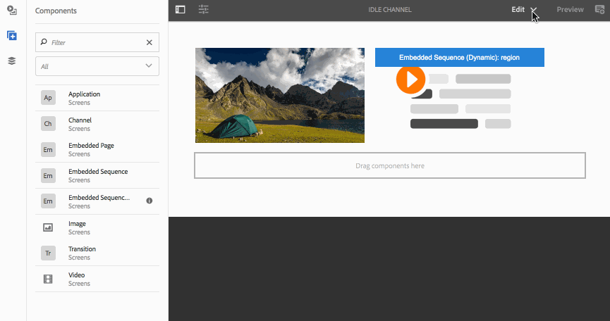

# Añadir componentes a un canal{#adding-components-to-a-channel}

Los componentes son elementos fundamentales de la experiencia AEM (Adobe Experience Manager). Puede utilizar varios componentes y añadirlos al canal de un proyecto de AEM Screens.

## Componentes en AEM Screens {#components-in-aem-screens}

AEM Screens proporciona distintos componentes de AEM que se pueden utilizar en un proyecto de Screens.

### Visualizar componentes de AEM Screens {#viewing-aem-screens-components}

Cuando cree un proyecto de AEM Screens, verá una lista de componentes predeterminados que se pueden añadir al proyecto.

Para ver los componentes predeterminados del proyecto de Screens, siga los pasos que se describen a continuación:

1. Seleccione el canal. Por ejemplo,**We.Retail In Store** --> **Canales** --> **Canal inactivo**.

1. Haga clic en **Editar** en la barra de acciones para abrir el editor de AEM.
1. Haga clic en el icono **+** en la barra lateral para abrir los componentes.
1. Todos los componentes que se incluyen de forma predeterminada en un proyecto de AEM Screens se visualizan tal y como se muestra en la figura siguiente.

### Añadir un nuevo componente {#adding-a-new-component}

AEM proporciona otros componentes. También puede añadir otros componentes (no incluidos de forma predeterminada) al proyecto, dado que son compatibles con AEM Screens.

En el siguiente ejemplo se muestra la forma de añadir el componente Livefyre a un proyecto de AEM Screens:

1. Seleccione el canal en el que desee añadir un componente nuevo. Por ejemplo,**We.Retail In Store** --> **Canales** --> **Canal inactivo**.

1. Haga clic en **Editar** en la barra de acciones para abrir el editor.
1. Seleccione el modo **Diseño**.
1. Seleccione todo el editor de diseño que está a la derecha y haga clic en el símbolo de configuración para abrir el cuadro de diálogo **Diseño de ParSys**.
1. Puede seleccionar los componentes que desee importar al proyecto AEM Screens. The following example shows the addition of **Livefyre** component to an AEM Screens project.

>[!NOTE]
>
>Del mismo modo, se puede añadir al proyecto cualquier nuevo componente que sea compatible con AEM Screens.

## Información acerca de los componentes AEM Screens {#understanding-aem-screen-components}

En la sección siguiente se explican los componentes de AEM Screens que se pueden utilizar en el proyecto.

>[!NOTE]
>
>Para ver las propiedades de los componentes, seleccione un componente y haga clic en el icono con forma de martillo para abrir o ver las propiedades.

### Aplicación {#application}

El componente **Aplicación** le permite añadir una aplicación al canal.

El componente de la aplicación tiene las siguientes propiedades:

| **Propiedad** | **Descripción** |
|---|---|
| ***Ruta de acceso de la aplicación*** | Seleccione la ruta de acceso absoluta donde está la aplicación. |
| ***Duración (ms)*** | Seleccione la duración de la aplicación. De forma predeterminada, la duración se establece en -1, lo que significa que el elemento se ejecuta para siempre (es decir, una aplicación de una sola página). Si establece el valor de la duración como >0, se mostrará el elemento de una duración específica y, a continuación, pasará al siguiente. |

En el siguiente ejemplo se muestra cómo integrar un componente de aplicación con la vista previa de sus propiedades.

>[!NOTE]
>
>Consulte el ejemplo anterior para ver las propiedades de cada uno de los componentes que se describen a continuación.

### Canal {#channel}

El componente **Canal** le permite añadir todo un canal al proyecto.

El componente Canal tiene las siguientes propiedades:

<table> 
 <tbody> 
  <tr> 
   <td><strong>Propiedad</strong></td> 
   <td><strong>Descripción</strong></td> 
  </tr> 
  <tr> 
   <td><strong><em>Ruta de acceso del canal</em></strong></td> 
   <td>Seleccione esta ruta de acceso absoluta donde existe la aplicación.  </td> 
  </tr> 
  <tr> 
   <td><strong><em>Duración (ms)</em></strong></td> 
   <td>Seleccione toda la duración del canal. Si establece la duración como -1, indica que el canal incrustado ejecutará toda su longitud en un canal determinado.</td> 
  </tr> 
 </tbody> 
</table>

### Página integrada {#embedded-page}

La opción **Página integrada** le permite añadir una página integrada al proyecto. Por ejemplo, puede ser una aplicación web o un catálogo de productos.

La página integrada tiene las siguientes propiedades:

<table> 
 <tbody> 
  <tr> 
   <td><strong>Propiedad</strong></td> 
   <td><strong>Descripción</strong></td> 
  </tr> 
  <tr> 
   <td><strong><em>página Ruta  </em></strong></td> 
   <td>Seleccione esta ruta de acceso absoluta que existe el canal.  </td> 
  </tr> 
  <tr> 
   <td><strong><em>Duración (ms)</em></strong></td> 
   <td>Seleccione toda la duración del canal. Si establece la duración como -1, indica que el canal incrustado ejecutará toda su longitud en un canal determinado.</td> 
  </tr> 
 </tbody> 
</table>

### Secuencia integrada {#embedded-sequence}

>[!NOTE]
>
>Refer to [Embedded Sequences](embedded-sequences.md) under Authoring Screens section, to learn in detail about embedded sequences.

Una secuencia integrada le permite añadir un canal de secuencia integrada en el canal existente (con otros recursos).

La secuencia integrada tiene las propiedades de página siguientes:

<table> 
 <tbody> 
  <tr> 
   <td><strong>Propiedad</strong></td> 
   <td><strong>Descripción</strong></td> 
  </tr> 
  <tr> 
   <td>Ruta de acceso del canal</td> 
   <td>Seleccione la ruta de acceso absoluta de la secuencia que desee incluir en el canal.  </td> 
  </tr> 
  <tr> 
   <td><strong><em>Duración (ms)</em></strong></td> 
   <td>Seleccione toda la duración del canal. Si establece la duración como -1, indica que el canal incrustado ejecutará toda su longitud en un canal determinado.</td> 
  </tr> 
  <tr> 
   <td><strong><em>Estrategia</em></strong></td> 
   <td>Set it to <strong>original</strong> or <strong>single</strong>. Setting the value to <strong>original</strong> means that the subsequence will run fully on each cycle of the parent sequence. The other possible value is <strong>single</strong> and that would only show one item of the subsequence on each run (for instance, the 1st item on the first loop, 2nd item on the second loop, and so on.)</td> 
  </tr> 
 </tbody> 
</table>

### Secuencia integrada dinámica {#dynamic-embedded-sequence}

Una secuencia integrada de forma dinámica permite añadir una secuencia similar al que se mencionó anteriormente, excepto en el rol del canal.

Refer to [Embedded Sequences](embedded-sequences.md) under Authoring Screens section, to learn in detail about embedded sequences.

La secuencia integrada dinámica tiene las siguientes propiedades:

<table> 
 <tbody> 
  <tr> 
   <td><strong>Propiedad</strong></td> 
   <td><strong>Descripción</strong></td> 
  </tr> 
  <tr> 
   <td><strong><em>Rol de asignación de canales</em></strong>  </td> 
   <td>Especifique el rol del canal.  </td> 
  </tr> 
  <tr> 
   <td><strong><em>Duración (ms)</em></strong></td> 
   <td>Seleccione toda la duración del canal. Si establece la duración como -1, indica que el canal incrustado ejecutará toda su longitud en un canal determinado.</td> 
  </tr> 
  <tr> 
   <td><strong><em>Estrategia</em></strong></td> 
   <td>Set it to <strong>original</strong> or <strong>single</strong>. Setting the value to <strong>original</strong> means that the subsequence will run fully on each cycle of the parent sequence. The other possible value is <strong>single</strong> and that would only show one item of the subsequence on each run (for instance, the 1st item on the first loop, 2nd item on the second loop, and so on.)</td> 
  </tr> 
 </tbody> 
</table>

### Imagen {#image}

Una imagen permite añadir una imagen al canal.

El recurso de imagen tiene tres fichas denominadas **Imagen**, **Accesibilidad** y **Secuencia**:

| **Propiedad** | **Descripción** |
|---|---|
| **Imagen** |
| ***Recurso de imagen*** | Seleccione el recurso de imagen. |
| ***Título*** | Título de la imagen. |
| ***Vínculos*** | Añada un vínculo a la imagen. |
| ***Descripción*** | Descripción breve de la imagen. |
| ***Tamaño*** | Tamaño de la imagen. |
| **Accesibilidad** |
| ***Texto alternativo*** | Texto alternativo a la imagen. |
| **Secuencia** |
| ***Duración*** | Seleccione toda la duración de la imagen. Si establece la duración como -1, indica que la imagen incrustada se ejecutará a toda su longitud en un canal determinado. |

### Transición {#transition}

El componente Transición permite añadir una transición al proyecto de Screens.

El componente Transición tiene las siguientes propiedades:

| **Propiedad** | **Descripción** |
|---|---|
| ***Tipo*** | El tipo de transición entre el elemento anterior y el siguiente. Puede ser un efecto de fundido o un efecto de deslizamiento de las cuatro diapositivas de la pantalla. |
| ***Duración (ms)*** | Seleccione toda la duración de la transición. Si establece la duración como -1, indica que la transición incrustada ejecutará toda su duración en un canal determinado. |

### Vídeo {#video}

El componente Vídeo le permite añadir un vídeo al proyecto de Screens.

El componente Vídeo tiene las siguientes propiedades:

<table> 
 <tbody> 
  <tr> 
   <td><strong>Propiedad</strong></td> 
   <td><strong>Descripción</strong></td> 
  </tr> 
  <tr> 
   <td><em><strong>Recurso de vídeo</strong></em></td> 
   <td>Seleccione el vínculo al vídeo.</td> 
  </tr> 
  <tr> 
   <td><em><strong>Duración</strong></em></td> 
   <td>Seleccione la duración del vídeo. De forma predeterminada, la duración se establece en -1, lo que significa que el elemento se ejecuta para siempre. Si establece el valor de la duración como &gt;0, se mostrará el elemento de una duración específica y, a continuación, pasará al siguiente.   </td> 
  </tr> 
  <tr> 
   <td><em><strong>Procesamiento</strong></em></td> 
   <td>
Si la proporción de aspecto del vídeo no se adapta a la pantalla, puede ajustar el procesamiento a <strong>contiene</strong> o<strong> cubierta</strong>.
 
<em>Contiene</em> significa que el vídeo completo se muestra y las áreas que faltan indicadas con un borde negro.
 
<em>Cubierta</em> significa que el vídeo cubre la ventana completa, pero si alguna parte superan el espacio permitido en los lados estará oculta.
 </td> 
  </tr> 
  <tr> 
   <td><em><strong>Tamaño</strong></em></td> 
   <td>Tamaño del vídeo.</td> 
  </tr> 
 </tbody> 
</table>

