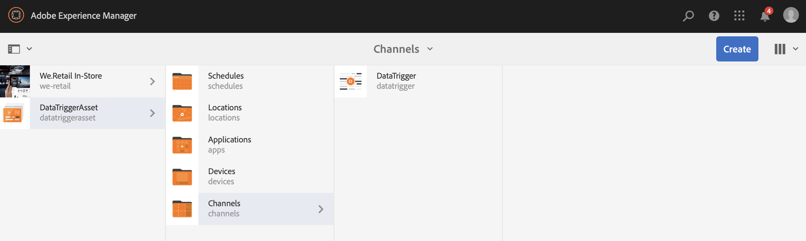

# Cambio de recurso activado por datos{#data-triggered-asset-change}

## Descripción de caso de uso {#use-case-description}

Este ejemplo de caso de uso describe cómo lograr contenido personalizado según el tiempo de su ubicación.

El siguiente proyecto de AEM Screens aprovecha la personalización de AEM, que incluye ContextHub, el motor de segmentación y la interfaz de usuario de Content Targeting.

Este caso de uso ofrece contenido personalizado según el clima actual en cada ubicación, si el tiempo es:

* *soleado, muestra ropa de verano*
* *frío, muestra ropa de invierno*

>[!NOTE]
>
>Con fines de demostración, este caso de uso captura la ubicación geográfica para mostrar la actualización de contenido. Puede actualizar manualmente la vista Ubicación geográfica de la salida en diferentes escenarios.

### Condiciones previas {#preconditions}

Antes de comenzar este caso de uso, asegúrese de comprender:

* [Personalización](/help/sites-administering/personalization.md)
* [Configuración de ContextHub](/help/sites-administering/contexthub-config.md)
* [Configuración de la segmentación con ContextHub](/help/sites-administering/segmentation.md)
* [Creación de contenido de destino con el modo Targeting](/help/sites-authoring/content-targeting-touch.md) 

### Actores principales {#primary-actors}

Autores de contenido

## Flujo básico:Configuración del proyecto {#basic-flow-setting-up-the-project}

Siga los pasos a continuación para configurar un proyecto que muestre los datos activados por el cambio de recursos:

1. Cree un proyecto de AEM Screens denominado **DataTriggerAsset**, como se muestra a continuación.

   

1. **Creación de un canal de secuencia**

   1. Seleccione la carpeta **Canales** y haga clic en **Crear** para abrir el asistente y crear un canal.
   1. Seleccione Canal **de secuencia** en el asistente y cree el canal denominado **DataTrigger**.
   

1. **Adición de contenido al canal de secuencia**

   1. Seleccione el canal **DataTrigger**.
   1. Haga clic en **Editar** en la barra de acciones para abrir el editor. Arrastre y suelte algunos recursos en el canal.
   

   >[!NOTE]
   >
   >Solo debe agregar las imágenes predeterminadas al editor. Las imágenes que desea reemplazar deben agregarse al editor cuando cambie al modo de objetivo en el paso (6).

1. **Configuración de ContextHub y objetivos**

   1. Vaya a **DataTriggerAsset** —> **Canales** —> **DataTrigger** y haga clic en **Propiedades** en la barra de acciones.
   1. Haga clic en la ficha **Personalización** .
   

1. **Adición de configuraciones de ContextHub y objetivo**

   1. Para fines de demostración, descargue el paquete de contenido siguiente.
   1. Una vez que haya descargado el paquete en la instancia de AEM, deberá establecer ContextHub y la ruta de segmentos:
   * Para **ContextHub**, establezca la ruta en: ***/libs/settings/cloudsettings/heredado/contexthub***
   * Para Ruta **de** segmentos, establezca la ruta en: ***/conf/data-triggers/settings/wcm/segments***
   Activadores de datos

   [Obtener archivo](assets/data-triggers-1_00.zip)

   >[!NOTE]
   >
   >Para obtener más información sobre la configuración de ContextHub y la segmentación, consulte:
   >
   >* [Configuración de ContextHub](/help/sites-administering/contexthub-config.md)
   >* [Configuración de la segmentación con ContextHub](/help/sites-administering/segmentation.md)

   

   Haga clic en **Guardar y cerrar**.

1. **Cambiar al modo de Orientación**

   1. Vaya a **DataTriggerAsset** > **Canales** > **DataTrigger** y haga clic en **Editar** en la barra de acciones.
   1. Seleccione **Objetivo** en la barra de menús en **Editar**.
   

1. **Adición del contenido objetivo**

   1. Seleccione **Desencadenadores** de datos en **MARCA** y **Activador de datos estacional **en **ACTIVIDAD**.
   1. Click the **Start Targeting**
   

1. **Definición del componente de objetivo**

   1. Seleccione el componente para el que desea tener contenido de destino.
   1. Haga clic en el botón **Target** para habilitar la segmentación para ese componente.
   1. Para definir el contenido de cada variación, seleccione la variación en las **audiencias** en el carril lateral y ajuste el contenido según sea necesario.
   >[!NOTE]
   >
   >Para ocultar el panel **Recursos** en el editor, deberá hacer clic en la flecha izquierda del panel derecho, como se muestra en la figura siguiente.

   

## Visualización de los resultados {#viewing-the-results}

Una vez que haya completado los pasos anteriores, siga los pasos para obtener una vista previa y ver los resultados:

1. Haga clic en **Vista previa** desde el editor.

   

1. Para mostrar, cómo cambiará la imagen, dependiendo de la ubicación y de la temperatura de su área, puede hacer clic manualmente en el icono de ContextHub, como se muestra a continuación.

   Tan pronto como actualice la ubicación, se capturará la temperatura de esa área y la imagen se actualizará con la selección de invierno y reemplazará la imagen de selección de verano.

   

