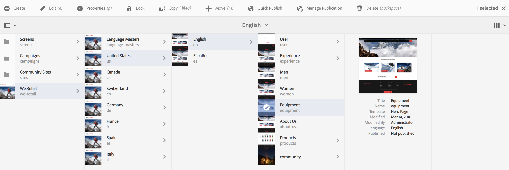
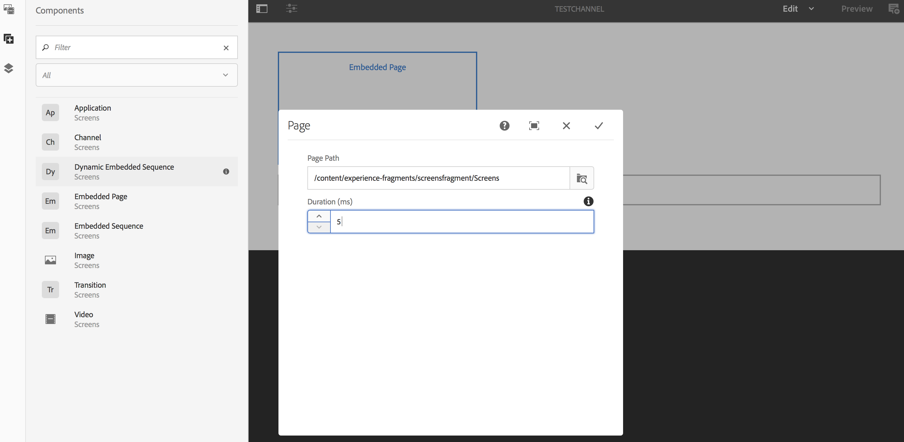

# Uso de fragmentos de experiencias{#using-experience-fragments}

El uso de fragmentos de experiencia abarca los siguientes temas:

* **Información general**
* **Uso de fragmentos de experiencias en AEM Screens**
* **Propagación de cambios desde la página de formato**

## Información general {#overview}

Un ***fragmento de experiencias*** es un grupo de uno o varios componentes que incluye contenido y diseño que se puede consultar dentro de las páginas. Los fragmentos de experiencias pueden contener cualquier componente, como por ejemplo uno o varios componentes que pueden contener cualquier cosa dentro de un sistema de párrafos, al que se hará referencia en toda la experiencia o que solicitará un punto final tercero.

## Uso de fragmentos de experiencias en AEM Screens {#using-experience-fragments-in-aem-screens}

>[!NOTE]
>
>El ejemplo siguiente utiliza **We.Retail** como proyecto de demostración desde el que se aprovecha el fragmento de experiencias desde una página de **sitios** a un proyecto de AEM Screens.

Por ejemplo, el siguiente flujo de trabajo muestra el uso de fragmentos de experiencia de We.Retail en Sitios. Puede elegir una página web y aprovechar ese contenido en el canal de AEM Screens de uno de sus proyectos.

### Requisitos previos {#pre-requisites}

**Creación de un proyecto de demostración con un canal**

***Creación de un proyecto***

1. Click Screens and select **Create** --> **Create Project **to create a new project.

1. Seleccione **Pantallas **en el asistente **Crear proyecto de pantallas **.

1. Introduzca **DemoProject** como título.
1. Haga clic en **Crear**.

Se agregará **DemoProject** a sus pantallas de AEM.  ***Crear un canal*** 

1. Navigate to the **DemoProject** you created and select the **Channels** folder.

1. Click **Create** from the action bar (see the figure below). Se abrirá un asistente.
1. Choose the **Sequence Channel** and click **Next**.

1. Enter the **Title** as **TestChannel** and click **Create**.

Se agregará **TestChannel** a **DemoProject**.\

>[!NOTE]
>
>Para obtener información detallada sobre la creación de un proyecto y de un canal, consulte [Creación de un proyecto](creating-a-screens-project.md) y [Gestión de canales](managing-channels.md) , respectivamente.

### Creación de un fragmento de experiencia {#creating-an-experience-fragment}

Siga los pasos a continuación para aprovechar el contenido de **We.Retail** a su **TestChannel** en **DemoProject**.

1. **Navegue a la página Sitios en We.Retail**

   1. Vaya a Sitios y seleccione **We.Retail **->** Estados Unidos **->**Inglés **y seleccione la página **Equipo** para utilizarla como fragmento de experiencia para el canal Pantallas.
   1. Haga clic en **Editar** en la barra de acciones para abrir la página que desee utilizar como fragmento de experiencia para el canal de pantallas.
   

1. **Reutilización del contenido**

   1. Seleccione el fragmento que desee incluir en el canal.
   1. Haga clic en el último icono de la derecha para abrir el cuadro de diálogo **Convertir en fragmento** de experiencia.
   

1. **Creación del fragmento de experiencia**

   1. Elija la **acción** como **Crear un nuevo fragmento** de experiencias.
   1. Seleccione la ruta **principal**.
   1. Select the **Template**. Elija la plantilla **We.Retail** aquí.
   1. Enter the **Fragment Title **as **ScreensFragment**.
   1. Haga clic en la marca de verificación para completar la creación de un nuevo fragmento de experiencia.
   

1. **Creación de Live Copy del fragmento de experiencias**

   1. Vaya a la página de inicio de AEM.
   1. Seleccione Fragmentos **de** experiencia, resalte el **fragmento** Pantallas y haga clic en **Variación como activo: Copiar**, como se muestra en la figura siguiente:
   

   c. Seleccione el** Fragmento de pantallas **del** asistente Crear Live Copy** y haga clic en **Siguiente**.

   d. Introduzca el **Título** y el **Nombre** como **Pantallas**.

   e. Haga clic en **Crear** para crear la Live Copy.

   

1. **Uso del fragmento de experiencia en el canal de pantallas**

   1. Vaya al canal Pantallas en el que desea utilizar el fragmento **Pantallas** .
   1. Seleccione **TestChannel** y haga clic en **Editar** en la barra.
   1. Haga clic en el icono de componentes en la ficha lateral.
   1. Arrastre y suelte la página **** incrustada en el canal.
   

   e. Seleccione el componente Página **** incrustada y seleccione el icono superior izquierdo (llave inglesa) para abrir el cuadro de diálogo **Página** .

   f. Seleccione la **Live Copy de Pantallas** del fragmento que ha creado en el *paso 3* en el campo **Ruta **.

   

   h. Introduzca los segundos en el campo** Duración**.

   
i. Haga clic en la marca de verificación para completar el proceso.

   

### Validación del resultado {#validating-the-result}

Tras completar los pasos anteriores, puede validar el fragmento de experiencia en **TestChannel** mediante:

1. Navegación hasta **TestChannel**.
1. Selección de la **vista previa** en la barra de acciones.

Verá el contenido desde la página **Sitios** (Live Copy del fragmento de experiencia) en su canal, como se muestra en la figura siguiente:\

## Propagación de cambios desde la página de formato {#propagating-changes-from-the-master-page}

***Live Copy*** se refiere a la copia (del origen), mantenida mediante acciones de sincronización tal como se define en las configuraciones de despliegue.

Desde el fragmento de experiencias, hemos creado una Live Copy desde las páginas **Sitios** , por lo que si realiza cambios en ese fragmento en particular desde la página de formato, verá los cambios en su canal o en el destino donde ha utilizado el fragmento de experiencias.

>[!NOTE]
>
>Para obtener más información sobre Live Copy, consulte [Reutilización del contenido: Multi Site Manager y Live Copy](/help/sites-administering/msm.md).

Siga los pasos a continuación para propagar los cambios del canal maestro al canal de destino:

1. Seleccione el fragmento de experiencias en la página **Sitios** (maestro) y haga clic en el icono del lápiz para editar los elementos en el fragmento de experiencias.

   

1. Seleccione el fragmento de experiencias y haga clic en el icono de la llave inglesa para abrir el cuadro de diálogo y editar las imágenes.

   

1. Se abre el cuadro **de diálogo Cuadrícula** de producto.

   

1. Puede editar cualquiera de las imágenes. Por ejemplo, aquí la primera imagen se sustituye en este fragmento.

   

1. Seleccione el fragmento de experiencias y haga clic en el icono de despliegue para propagar los cambios en el fragmento que se utiliza en el canal.

   

1. Haga clic en Despliegue para confirmar los cambios.

   Verá que los cambios se implementan.

   

### Validación de los cambios {#validating-the-changes}

Siga los pasos a continuación para confirmar los cambios en el canal:

1. Vaya a **Pantallas** -> **Canales** -> **TestChannel**.

1. Haga clic en **Vista previa** en la barra de acciones para confirmar los cambios.

La siguiente imagen ilustra los cambios realizados en **TestChannel**:\

