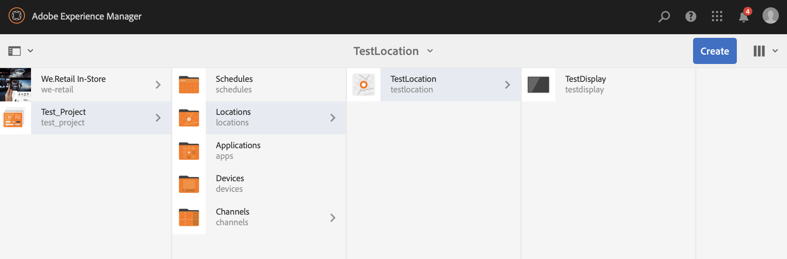
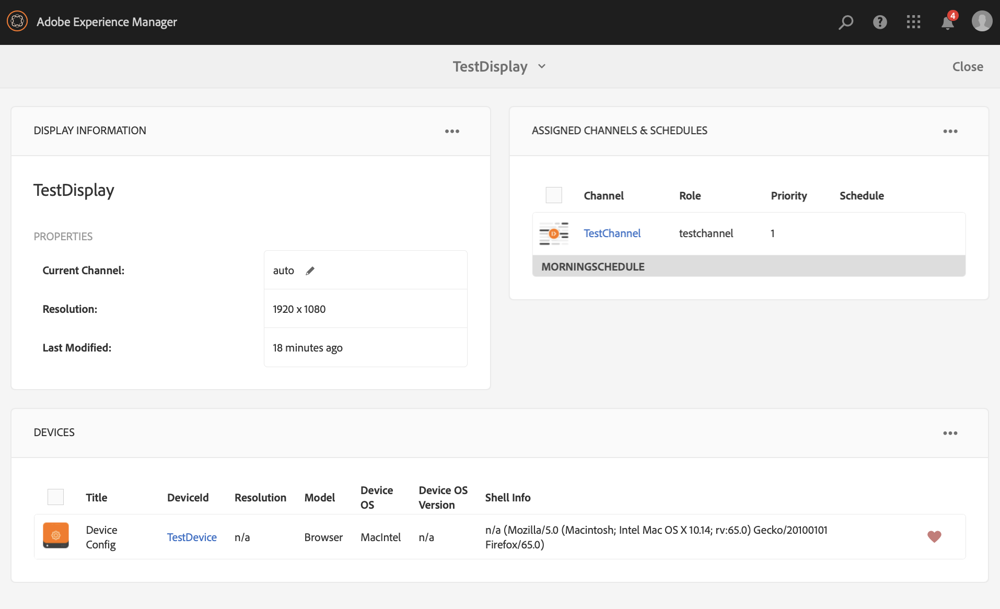

# Guía de inicio rápido{#kickstart-guide}

Esta sección es un punto de partida para las pantallas de AEM y muestra cómo lograr acciones básicas. Le guiará a través de la configuración de una experiencia de señalización digital básica con contenido/recursos y la publicación en un reproductor de Pantallas. Para obtener una comprensión detallada de todos los componentes para el desarrollo de Pantallas, consulte los recursos al final de la página.

## Creación de una experiencia de señalización digital en 5 minutos {#creating-a-digital-signage-experience-in-minutes}

Los pasos siguientes le permiten crear un proyecto de muestra para Pantallas y publicar contenido en el reproductor de Pantallas.

1. Para descargar **AEM Screens Player**, haga clic [aquí](https://download.macromedia.com/screens/).

   AEM Screens también está disponible en **Google Play**.

   Para obtener más información sobre la implementación de Chrome OS Player, consulte [Chrome Management Console](implementing-chrome-os-player.md) .

   Consulte [Instalación y configuración de pantallas](configuring-screens-introduction.md) para obtener más detalles.

   >[!NOTE]
   >
   >**Configuración de OSGI**
   >
   >Debe habilitar el referente vacío para permitir que el dispositivo publique datos en el servidor. Por ejemplo, si la propiedad referrer vacía está deshabilitada, el dispositivo no puede publicar una captura de pantalla de vuelta. Actualmente, algunas de estas funciones solo están disponibles si el filtro de referencia de Sling de Apache está habilitado Permitir vacío en la configuración OSGI. El tablero puede mostrar una advertencia de que la configuración de seguridad puede impedir que algunas de estas funciones funcionen.
   >
   >Siga los pasos a continuación para habilitar el filtro ***Apache Sling Referrer Allow Empty***:
   >
   >1. Vaya a Configuración [de la consola web de](http://localhost:4502/system/console/configMgr/org.apache.sling.security.impl.ReferrerFilter)Adobe Experience Manager.
   >1. Marque la opción **allow.empty** .
   >1. Haga clic en **Guardar**.
   >    
   >Para obtener más información sobre los pasos anteriores, consulte la sección ***Requisitos*** previos de [Configuración e implementación de pantallas](configuring-screens-introduction.md)de AEM.

1. **Crear un nuevo proyecto**

   1. Seleccione el vínculo de Adobe Experience Manager (superior izquierda) y, a continuación, **Screens**. Alternatively, you can go directly to: [http://localhost:4502/screens.html/content/screens](http://localhost:4502/screens.html/content/screens).
   1. Haga clic en **Crear** para crear un nuevo proyecto de Pantallas (consulte la figura siguiente).
   1. Select **Screens** from the **Create Screens Project** wizard and click **Next**.
   1. Enter the title as **Test_Project** and click **Create**.
   

   Una vez creado el proyecto, vuelve a la consola Proyecto de Pantallas. Puede seleccionar el proyecto. En un proyecto, hay cinco tipos de carpetas, a saber, **Programas**, **Ubicaciones**, **Aplicaciones**, **Dispositivos** y **Canales**, como se muestra en la figura siguiente.

   >[!NOTE]
   >
   >Las programaciones solo están disponibles si ha instalado AEM 6.3 Sites Feature Pack 1. Para obtener acceso a este Feature Pack, debe ponerse en contacto con la Asistencia de Adobe y solicitar acceso. Cuando disponga de los permisos necesarios, puede descargarlo desde Uso compartido de paquetes.

   

   Consulte [Creación y gestión de proyectos](creating-a-screens-project.md) de pantallas para obtener más información.

1. **Creación de un nuevo canal**

   Una vez que haya implementado el proyecto, debe crear un nuevo canal donde administrar el contenido.

   Siga los pasos a continuación para crear un nuevo canal para su proyecto:

   1. Navigate to the **Test_Project** you created and select the **Channels** folder.
   1. Click **Create** from the action bar (see the figure below). Se abrirá un asistente.
   1. Choose the **Sequence Channel** and click **Next**.
   1. Enter the **Name** and **Title** as **TestChannel** and click **Create**.
   

   Se crea *TestChannel* y se agrega a la carpeta de canales, como se muestra en la figura siguiente.

   

   Consulte Administración [de canales](managing-channels.md) para obtener más información sobre cómo crear y administrar canales.

1. **Adición de contenido a un canal**

   Una vez que haya colocado el canal, deberá añadir contenido al canal que mostrará el reproductor de AEM Screens.

   Siga los pasos a continuación para agregar contenido al canal (*TestChannel*) de su proyecto:

   1. Navigate to the *Test_Project* you created and select the **Channels** folder.
   1. Click **Edit** from the action bar (see the figure below). The editor for the *TestChannel* opens.
   1. Haga clic en el icono que alterna el panel lateral del lado izquierdo de la barra de acciones para abrir los recursos y componentes.
   1. Arrastre los componentes que quiera añadir y colóquelos en el canal.
   

   En este ejemplo, el editor muestra una imagen agregada al canal.

   

1. **Crear una nueva ubicación**

   Una vez que haya colocado el canal, deberá crear la ubicación.

   ***Las ubicaciones*** compartimentan las distintas experiencias de señalización digital y contienen las configuraciones de las pantallas según dónde estén las distintas pantallas.

   Siga los pasos a continuación para crear una nueva ubicación para el proyecto:

   1. Navigate to the *Test_Project* you created and select the **Locations** folder.
   1. Haga clic en **Crear** junto al icono del signo más en la barra de acciones (consulte la figura siguiente). Se abrirá un asistente.
   1. Select **Location** from the wizard and click **Next**.
   1. Enter the **Name** and **Title** for your location (enter the title as *TestLocation*) and click **Create**.
   

   Se crea *TestLocation* y se agrega a la carpeta **Locations** .

   

1. **Creación de una nueva visualización para *TestLocation ***

   Una vez que haya creado una ubicación, deberá crear una nueva pantalla para la ubicación.

   ***Las pantallas*** representan la experiencia digital que se ejecuta en una o varias pantallas.

   1. Vaya a la ubicación en la que desea crear la visualización (*Test_* Project —> **Ubicaciones** —> *TestLocation)* como se muestra en la figura de arriba y seleccione *TestLocation*.
   1. Haga clic en** Crear **desde la barra de acciones.
   1. Select **Display** from the **Create** wizard and click **Next**.
   1. Enter **Title** for your display location (enter the title as *TestDisplay*).
   1. Haga clic en **Crear**.
   Se agrega una nueva pantalla *TestDisplay* a su ubicación *TestLocation*, como se muestra en la figura siguiente.

   

1. **Adición de una programación**

   La opción *Programas*, en AEM Screens, permite organizar los canales en grupos reutilizables de modo que no sea necesario repetir la asignación de forma individual para cada pantalla en la que desee mostrar el contenido.

   >[!NOTE]
   >
   >Esta funcionalidad de Pantallas solo está disponible si ha instalado AEM 6.3 Sites Feature Pack 1 o superior. Para obtener acceso a este Feature Pack, debe ponerse en contacto con la Asistencia de Adobe y solicitar acceso. Cuando disponga de los permisos necesarios, puede descargarlo desde Uso compartido de paquetes.

   1. Vaya a la carpeta **Programaciones** desde Test_Project —> **Programaciones**.
   1. Haga clic en** Crear **desde la barra de acciones. Se abrirá un asistente.
   1. Seleccione **Programar** en la página del asistente **Crear** .
   1. Introduzca el **Título** como *Programa* matinal en la página de propiedades.
   1. Haga clic en **Crear** y la programación se agregará a la carpeta **Programaciones** , como se muestra en la figura siguiente.
   

   Además, seleccione la programación (*MañanaProgramación*) y haga clic en **Tablero** en la barra de acciones para ver el tablero de programaciones. Puede ver o cambiar las propiedades de la programación, asignar canales y ver las pantallas asignadas mediante el tablero.

   

   Consulte [Crear y administrar programaciones](managing-schedules.md) para obtener información detallada sobre las programaciones.

1. **Asignación de un canal**

   1. Navigate to the display from *Test_Project* --> **Locations** --> *TestLocation* --> *TestDisplay*.
   1. Select *TestDisplay* and tap/click **Assign Channel **from the action bar, *Or*,
   1. Click **Dashboard** and select **+Assign Channel** at the top right from **ASSIGNED CHANNELS &amp; SCHEDULES** panel, as shown in the figure below. **Se abre el cuadro de diálogo Asignación** de canal.
   1. Select **Reference Channel** by **path**.
   1. Seleccione la Ruta **del** canal (*Test_Project* —> *Canales* —> *TestChannel* ) en el **canal**. La función **de** canal se rellenará automáticamente con el nombre del canal.
   1. Select the **Priority** for this channel as *1*.
   1. Choose the **Supported Events** as **Initial Load** and **Idle Screen**.
   1. Introduzca **Programar** y seleccione las fechas **activas desde** y **activas hasta**. *(Solo debe rellenar estos campos si desea que el canal se muestre durante un intervalo de tiempo determinado).*
   1. Haga clic en **Guardar**.
   El canal se asigna y se agrega al panel.

   

   Para obtener más información sobre el cuadro de diálogo Asignación de **canal** y las propiedades asociadas a él, consulte Asignación [de canal.](channel-assignment.md)

1. **Adición de programación a un canal**

   1. Navigate to the display from *Test_Project* --> **Locations** --> *TestLocation* --> *TestDisplay*.
   1. Click **Dashboard** and select **+Assign Schedule** at the top right from **ASSIGNED CHANNELS &amp; SCHEDULES** panel, as shown in the figure above. **Se abre el cuadro de diálogo Programar asignación** .
   1. Elija la ruta en la que ha creado la programación (aquí, *Test_Project* —> **Programaciones** —> *Programación* matutina).
   1. Haga clic en **Guardar** para agregar la programación al canal.
   

1. **Registro de un dispositivo**

   Debe registrar el dispositivo mediante el panel de AEM.

   >[!NOTE]
   >
   >Puede abrir el reproductor de pantallas con la aplicación AEM Screens que ha descargado o con el navegador web.

   Para ver el dispositivo pendiente:

   1. Abra una nueva ventana del navegador.
   1. Go to Screens player using the [web browser](http://localhost:4502/content/mobileapps/cq-screens-player/firmware.html) or launch the AEM Screens app. Cuando abra el dispositivo, verá el estado de este como no registrado.
   1. From the AEM dashboard, navigate to *Test_Project* --> **Devices**
   1. Click **Device Manager** from the action bar.
   1. Haga clic en Registro **del** dispositivo y verá los dispositivos pendientes, como se muestra en la figura siguiente.
   >[!NOTE]
   >
   >Si utiliza AEM Screens Player como extensión de ChromeOS, consulte la consulta en la página ***Cómo instalar el reproductor ChromeOS como complemento*** Chrome Browser en las preguntas más frecuentes sobre pantallas de [AEM](aem-screens-faqs.md) .

   

   Select the device you want to register and click **Register Device**.

   

   Tendrá que validar el código con la verificación de código del explorador web o el reproductor AEM Screens.

   Click **Validate** to navigate to **Device Registration** screen.

   

   Enter **Title** and click **Register** and the device will be registered.

   Haga clic en **Finalizar** para completar el paso de registro del dispositivo.

   

   Al hacer clic en **Finalizar** , volverá a la página del dispositivo que muestra los dispositivos no asignados y asignados.

   

   >[!NOTE]
   >
   >El dispositivo que ha agregado se muestra como **No asignado** en Estado **asignado** .

1. **Asignación del dispositivo para mostrar**

   Una vez que haya registrado el dispositivo, deberá asignarlo a una pantalla.

   Siga los pasos a continuación para asignar un dispositivo:

   1. Seleccione el dispositivo que desee asignar.
   1. Click **Assign Device** from the action bar.
   1. Select the display path for your channel as */content/screens/Test_Project/***Locations***/TestLocation/TestDisplay.*
   1. Click **Assign**.
   1. Click **Finish** to complete the process, and now the device is assigned.
   

   Se abre el tablero de visualización y verá toda la información relacionada con los canales y programaciones asignados, junto con los detalles de configuración del dispositivo.

   

### Viewing the content in Screens Player {#viewing-the-content-in-screens-player}

Una vez agregadas las configuraciones anteriores, el reproductor debería mostrar automáticamente el canal predeterminado para la visualización en el dispositivo, por ejemplo una imagen (en este escenario, un canal de secuencia y el contenido está visible en el Reproductor de pantallas para el explorador Web).

Consulte [AEM Screens Player](working-with-screens-player.md)para obtener información más detallada sobre el reproductor de AEM Screens.

### Additional Resources {#additional-resources}

Para obtener información detallada sobre todos los módulos para pantallas, consulte los recursos siguientes:

1. [Instalar y configurar pantallas](configuring-screens-introduction.md)
1. [Crear y gestionar proyecto de pantallas](creating-a-screens-project.md)
1. [Asignar dispositivos](managing-devices.md)
1. [Crear y administrar canales](managing-channels.md)
1. [Crear y administrar ubicaciones](managing-locations.md)
1. [Crear y administrar pantallas](managing-displays.md)
1. [Asignar canales](channel-assignment.md)
1. [Administrar dispositivos](managing-devices.md)
1. [Crear y administrar programaciones](managing-schedules.md)
1. [Reproductor de AEM Screens](working-with-screens-player.md)
1. [Resolución de problemas del centro de control de dispositivos](monitoring-screens.md)

